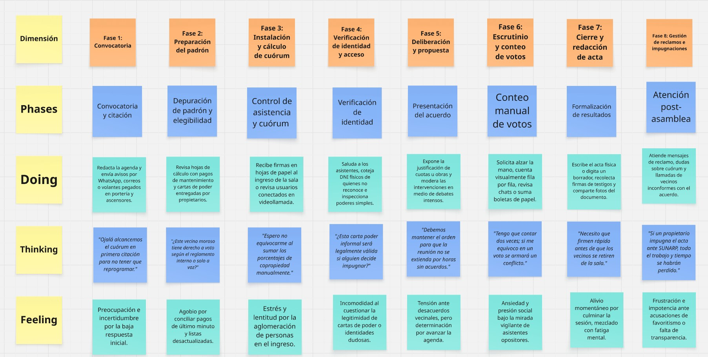
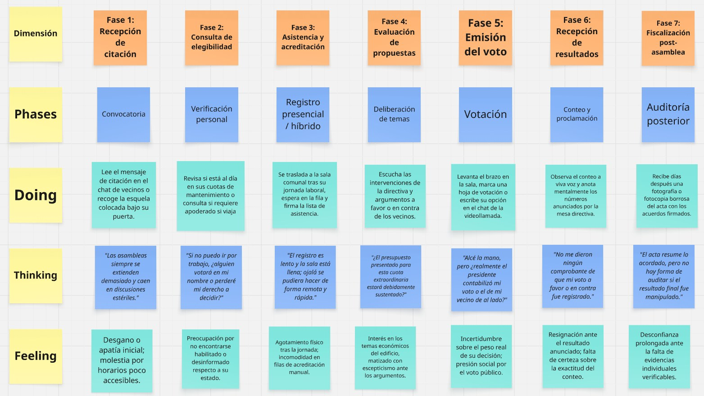
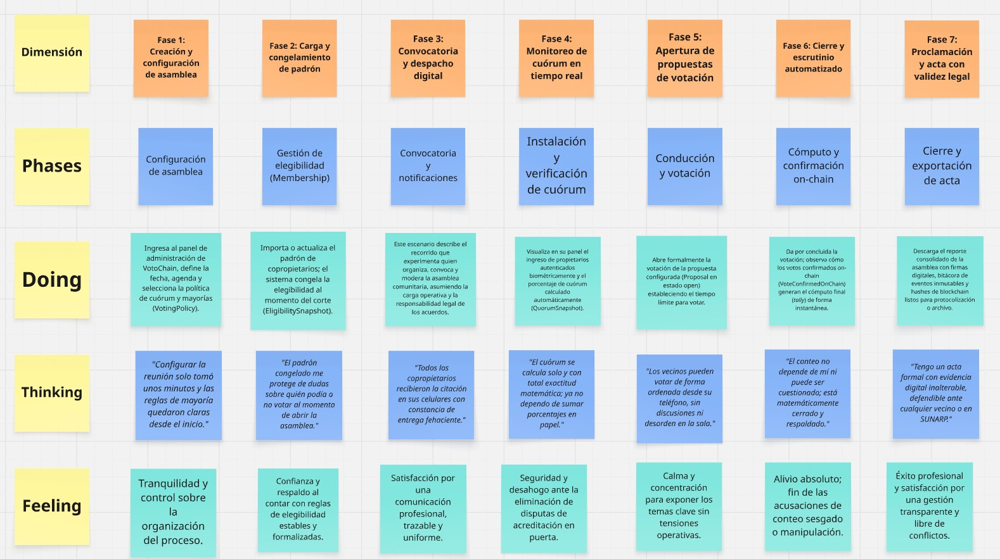
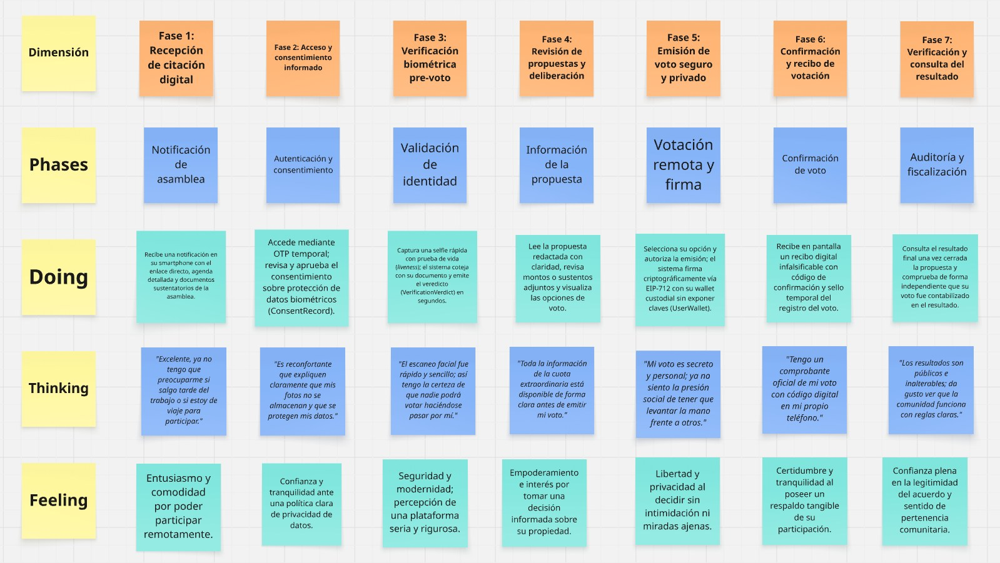

  

  <strong>UNIVERSIDAD PERUANA DE CIENCIAS APLICADAS</strong>

  <strong>Ingeniería de Software</strong>  
  <strong> CURSO: 1ASI0728 – ARQUITECTURAS DE SOFTWARE EMERGENTES </strong>  
  <strong> NRC: 8056 </strong>    
  <strong>PROFESOR(A): Valdivia Verde, Enrique Alejandro</strong>   <strong>
  INFORME DE TRABAJO FINAL </strong>  
  <strong> CICLO: 20260-20
  </strong>
   
   
  <strong> STARTUP: Morocoders  </strong>  
  <strong>
  PRODUCTO: VotoChain 
  </strong>

 

<strong>Relación de integrantes:</strong>

<table align="center">
  <thead>
    <tr>
      <th>Integrante</th>
      <th>Código</th>
    </tr>
  </thead>
  <tbody>
    <tr>
      <td>Aliaga Aguirre, Ethan Matias</td>
      <td>U202318323</td>
    </tr>
    <tr>
      <td>Bueno Perales, Mathias Eduardo</td>
      <td>U202313433</td>
    </tr>
    <tr>
      <td>Paredes Santos, Fabrizio Alberto</td>
      <td>U202310914</td>
    </tr>
        <tr>
      <td>Rios Pacheco, Héctor Javier</td>
      <td>U20231c540</td>
    </tr>
    <tr>
      <td>Rodriguez Macedo, Sebastian</td>
      <td>U202310199</td>
    </tr>
  </tbody>
</table>

  

  <strong>Setiembre, 2026</strong>  
  <strong>URL del proyecto:</strong>
  <a href="https://github.com/Morocoders-Arq-9056">
    https://github.com/Morocoders-Arq-9056
  </a>

## Registro de Versiones del Informe

| Versión | Fecha      | Autor                                              | Descripción de modificación                                                                                                                                                                |
| ------- | ---------- | -------------------------------------------------- | -------------------------------------------------------------------------------------------------------------------------------------------------------------------------- |
| 0.1     | 12/09/2026 | Morocoders                | Elaboración del Capítulo I y estructura general del informe.                                                                                          |
| 0.2     | 12/09/2026 | Morocoders                | Desarrollo del Capítulo II: análisis competitivo, diseño de entrevistas, Needfinding y Ubiquitous Language.                                            |
| Vacio    | Vacio | Vacio                  | Vacio                                            |
| Vacio     | Vacio | Vacio                    | Vacio                                                           |

## Project Report Collaboration Insights

| URL del repositorio del reporte |
| :-----------------------------------: |
| [https://github.com/Morocoders-Arq-9056/votochain-project-document](https://github.com/Morocoders-Arq-9056/votochain-project-document) |

## Contenido

### Tabla de contenidos

- [Capítulo I: Introducción](#capítulo-i-introducción)
  - [1.1. Startup Profile](#11-startup-profile)
    - [1.1.1. Descripción de la Startup](#111-descripción-de-la-startup)
    - [1.1.2. Perfiles de integrantes del equipo](#112-perfiles-de-integrantes-del-equipo)
  - [1.2. Solution Profile](#12-solution-profile)
    - [1.2.1 Antecedentes y problemática](#121-antecedentes-y-problemática)
    - [1.2.2 Lean UX Process.](#122-lean-ux-process)
      - [1.2.2.1. Lean UX Problem Statements.](#1221-lean-ux-problem-statements)
      - [1.2.2.2. Lean UX Assumptions.](#1222-lean-ux-assumptions)
      - [1.2.2.3. Lean UX Hypothesis Statements.](#1223-lean-ux-hypothesis-statements)
      - [1.2.2.4. Lean UX Canvas.](#1224-lean-ux-canvas)
  - [1.3. Segmentos objetivo.](#13-segmentos-objetivo)

- [Capítulo II: Requirements Elicitation & Analysis](#capítulo-ii-requirements-elicitation--analysis)
  - [2.1. Competidores.](#21-competidores)
    - [2.1.1. Análisis competitivo.](#211-análisis-competitivo)
    - [2.1.2. Estrategias y tácticas frente a competidores.](#212-estrategias-y-tácticas-frente-a-competidores)
  - [2.2. Entrevistas.](#22-entrevistas)
    - [2.2.1. Diseño de entrevistas.](#221-diseño-de-entrevistas)
    - [2.2.2. Registro de entrevistas.](#222-registro-de-entrevistas)
    - [2.2.3. Análisis de entrevistas.](#223-análisis-de-entrevistas)
  - [2.3. Needfinding.](#23-needfinding)
    - [2.3.1. User Personas.](#231-user-personas)
    - [2.3.2. User Task Matrix.](#232-user-task-matrix)
    - [2.3.3. Empathy Mapping.](#233-empathy-mapping)
    - [2.3.4. As-is Scenario Mapping.](#234-as-is-scenario-mapping)
  - [2.4. Ubiquitous Language.](#24-ubiquitous-language)

- [Capítulo III: Requirements Specification](#capítulo-iii-requirements-specification)
  - [3.1. To-Be Scenario Mapping.](#31-to-be-scenario-mapping)
  - [3.2. User Stories.](#32-user-stories)
  - [3.3. Impact Mapping.](#33-impact-mapping)
  - [3.4. Product Backlog.](#34-product-backlog)

- [Capítulo IV: Strategic-Level Software Design.](#capítulo-iv-strategic-level-software-design)
  - [4.1. Strategic-Level Attribute-Driven Design.](#41-strategic-level-attribute-driven-design)
    - [4.1.1. Design Purpose.](#411-design-purpose)
    - [4.1.2. Attribute-Driven Design Inputs.](#412-attribute-driven-design-inputs)
      - [4.1.2.1. Primary Functionality (Primary User Stories).](#4121-primary-functionality-primary-user-stories)
      - [4.1.2.2. Quality attribute Scenarios.](#4122-quality-attribute-scenarios)
      - [4.1.2.3. Constraints.](#4123-constraints)
    - [4.1.3. Architectural Drivers Backlog.](#413-architectural-drivers-backlog)
    - [4.1.4. Architectural Design Decisions.](#414-architectural-design-decisions)
    - [4.1.5. Quality Attribute Scenario Refinements.](#415-quality-attribute-scenario-refinements)
  - [4.2. Strategic-Level Domain-Driven Design.](#42-strategic-level-domain-driven-design)
    - [4.2.1. EventStorming.](#421-eventstorming)
    - [4.2.2. Candidate Context Discovery.](#422-candidate-context-discovery)
    - [4.2.3. Domain Message Flows Modeling.](#423-domain-message-flows-modeling)
    - [4.2.4. Bounded Context Canvases.](#424-bounded-context-canvases)
    - [4.2.5. Context Mapping.](#425-context-mapping)
  - [4.3. Software Architecture.](#43-software-architecture)
    - [4.3.1. Software Architecture System Landscape Diagram.](#431-software-architecture-system-landscape-diagram)
    - [4.3.2. Software Architecture Context Level Diagrams.](#432-software-architecture-context-level-diagrams)
    - [4.3.3. Software Architecture Container Level Diagrams.](#433-software-architecture-container-level-diagrams)
    - [4.3.4. Software Architecture Deployment Diagrams.](#434-software-architecture-deployment-diagrams)

- [Capítulo V: Tactical-Level Software Design.](#capítulo-v-tactical-level-software-design)
  - [5.X. Bounded Context: &lt;Bounded Context Name&gt;](#5x-bounded-context-bounded-context-name)
    - [5.X.1. Domain Layer.](#5x1-domain-layer)
    - [5.X.2. Interface Layer.](#5x2-interface-layer)
    - [5.X.3. Application Layer.](#5x3-application-layer)
    - [5.X.4. Infrastructure Layer.](#5x4-infrastructure-layer)
    - [5.X.5. Bounded Context Software Architecture Component Level Diagrams.](#5x5-bounded-context-software-architecture-component-level-diagrams)
    - [5.X.6. Bounded Context Software Architecture Code Level Diagrams.](#5x6-bounded-context-software-architecture-code-level-diagrams)
      - [5.X.6.1. Bounded Context Domain Layer Class Diagrams.](#5x61-bounded-context-domain-layer-class-diagrams)
      - [5.X.6.2. Bounded Context Database Design Diagram.](#5x62-bounded-context-database-design-diagram)

- [Capítulo VI: Solution UX Design](#capítulo-vi-solution-ux-design)
  - [6.1. Style Guidelines.](#61-style-guidelines)
    - [6.1.1. General Style Guidelines.](#611-general-style-guidelines)
    - [6.1.2. Web, Mobile & Devices Style Guidelines.](#612-web-mobile--devices-style-guidelines)
  - [6.2. Information Architecture.](#62-information-architecture)
    - [6.2.1. Labeling Systems.](#621-labeling-systems)
    - [6.2.2. Searching Systems.](#622-searching-systems)
    - [6.2.3. SEO Tags and Meta Tags.](#623-seo-tags-and-meta-tags)
    - [6.2.4. Navigation Systems.](#624-navigation-systems)
  - [6.3. Landing Page UI Design.](#63-landing-page-ui-design)
    - [6.3.1. Landing Page Wireframe.](#631-landing-page-wireframe)
    - [6.3.2. Landing Page Mock-up.](#632-landing-page-mock-up)
  - [6.4. Applications UX/UI Design.](#64-applications-uxui-design)
    - [6.4.1. Applications Wireframes.](#641-applications-wireframes)
    - [6.4.2. Applications Wireflow Diagrams.](#642-applications-wireflow-diagrams)
    - [6.4.3. Applications Mock-ups.](#643-applications-mock-ups)
    - [6.4.4. Applications User Flow Diagrams.](#644-applications-user-flow-diagrams)
  - [6.5. Applications Prototyping.](#65-applications-prototyping)

- [Capítulo VII: Product Implementation, Validation & Deployment](#capítulo-vii-product-implementation-validation--deployment)
  - [7.1. Software Configuration Management.](#71-software-configuration-management)
    - [7.1.1. Software Development Environment Configuration.](#711-software-development-environment-configuration)
    - [7.1.2. Source Code Management.](#712-source-code-management)
    - [7.1.3. Source Code Style Guide & Conventions.](#713-source-code-style-guide--conventions)
    - [7.1.4. Software Deployment Configuration.](#714-software-deployment-configuration)
  - [7.2. Solution Implementation.](#72-solution-implementation)
    - [7.2.X. Sprint n](#72x-sprint-n)
      - [7.2.X.1. Sprint Planning n.](#72x1-sprint-planning-n)
      - [7.2.X.2. Sprint Backlog n.](#72x2-sprint-backlog-n)
      - [7.2.X.3. Development Evidence for Sprint Review.](#72x3-development-evidence-for-sprint-review)
      - [7.2.X.4. Testing Suite Evidence for Sprint Review.](#72x4-testing-suite-evidence-for-sprint-review)
      - [7.2.X.5. Execution Evidence for Sprint Review.](#72x5-execution-evidence-for-sprint-review)
      - [7.2.X.6. Services Documentation Evidence for Sprint Review.](#72x6-services-documentation-evidence-for-sprint-review)
      - [7.2.X.7. Software Deployment Evidence for Sprint Review.](#72x7-software-deployment-evidence-for-sprint-review)
      - [7.2.X.8. Team Collaboration Insights during Sprint.](#72x8-team-collaboration-insights-during-sprint)
  - [7.3. Validation Interviews.](#73-validation-interviews)
    - [7.3.1. Diseño de Entrevistas.](#731-diseño-de-entrevistas)
    - [7.3.2. Registro de Entrevistas.](#732-registro-de-entrevistas)
    - [7.3.3. Evaluaciones según heurísticas.](#733-evaluaciones-según-heurísticas)
  - [7.4. Video About-the-Product.](#74-video-about-the-product)

- [Referencias](#referencias)

 

# **Student Outcome**

En Ingeniería de Software, un Student Outcome representa las capacidades, conocimientos y actitudes que un estudiante debe demostrar al graduarse, relacionadas con el diseño, desarrollo y gestión de sistemas de software de calidad. Para el presente informe se toma como referencia el **ABET 3: capacidad de comunicarse efectivamente con un rango de audiencias**, de acuerdo con la rúbrica del curso.  

### Criterios específicos

- 3.c1. Comunica oralmente con efectividad a diferentes rangos de audiencia.

- 3.c2. Comunica por escrito con efectividad a diferentes rangos de audiencia.

 

# Capítulo I: Introducción

## 1.1. Startup Profile

### 1.1.1. Descripción de la Startup

Morocoders es una startup peruana de transformación digital dedicada a construir herramientas de **gobernanza comunitaria verificable** para organizaciones que toman decisiones colectivas mediante votación en asamblea, principalmente juntas de propietarios de edificios multifamiliares y cooperativas de vivienda, pero cuyo modelo es extensible a otras formas de asociación (juntas vecinales, asociaciones civiles, colegios profesionales).

El producto insignia de la startup es **VotoChain**, una plataforma que combina verificación biométrica de identidad (reconocimiento facial con prueba de vida) con registro de votos en una red blockchain pública (Polygon), de modo que cada acuerdo de asamblea quede respaldado por un voto firmado individualmente y verificable de forma independiente por cualquier interesado, sin depender de actas físicas ni de la palabra de la directiva.

La propuesta de valor de la startup se resume en tres pilares:

- **Identidad verificada:** cada votante confirma su identidad mediante comparación facial contra su documento de identidad y una prueba de vida (liveness), evitando suplantación y voto múltiple.
- **Verificabilidad pública:** cada voto se firma individualmente (EIP-712) con una wallet derivada exclusivamente para ese usuario y se registra on-chain, de modo que el resultado de la asamblea puede auditarse por cualquier propietario sin depender de la directiva.
- **Accesibilidad:** el propietario vota desde su propio smartphone, sin necesidad de entender blockchain ni de custodiar claves privadas (modelo de wallet custodio, "Modelo B").

El modelo de negocio es de tipo **SaaS B2B2C**: la startup cobra una suscripción o tarifa por asamblea a administradoras de edificios y a juntas directivas (cliente pagador), mientras que el propietario final (usuario votante) accede sin costo directo.

### 1.1.2. Perfiles de integrantes del equipo

> Completar con los datos reales de cada integrante (nombre y apellidos, código de estudiante, carrera, foto, y un párrafo de resumen de conocimientos técnicos/habilidades que aporta al equipo), siguiendo la estructura pedida en el enunciado.

| Foto | Nombres y Apellidos | Código | Carrera | Resumen de habilidades |
|---|---|---|---|---|
| `[foto]` | `[Nombre Apellido 1]` | `[código]` | `[carrera]` | `[breve resumen de conocimientos técnicos/habilidades]` |
|  | Héctor Javier Ríos Pacheco | u20231c540 | Ingeniería de Software | Cuento con formación en desarrollo de software, incluyendo estructuras de datos, algoritmos y arquitecturas orientadas a servicios. Trabajo con lenguajes como Java, TypeScript, JavaScript, HTML5 y CSS3, y utilizo herramientas y frameworks como Angular, Spring Boot, Git/GitHub, Swagger y bases de datos relacionales. Soy responsable, me gusta involucrarme activamente en los proyectos, aportar ideas útiles |
|  | Sebastián Rodriguez Macedo | u202310199 | Ingeniería de Software | Cuento con formación en desarrollo de software y conocimientos en arquitectura de sistemas, APIs REST, microservicios y bases de datos relacionales. Trabajo principalmente con Spring Boot, Angular, TypeScript y SQL Server, utilizando tecnologías relacionadas con integración y procesamiento de datos como procesos ETL. Me gusta involucrarme activamente en los proyectos, aportar ideas y proponer mejoras técnicas |
| `[foto]` | `[Nombre Apellido 4]` | `[código]` | `[carrera]` | `[breve resumen de conocimientos técnicos/habilidades]` |

---

## 1.2. Solution Profile

### 1.2.1. Antecedentes y problemática

**Antecedentes.** En Lima Metropolitana, la mayor parte de los edificios multifamiliares no cuenta con una junta de propietarios legalmente constituida e inscrita: se estima que alrededor del **95% de los edificios** no tiene su junta inscrita en Registros Públicos, en buena medida por el costo y la complejidad del trámite. Como consecuencia, cerca del **70% de los edificios multifamiliares** reporta conflictos de convivencia entre vecinos por falta de claridad en normas, deberes y derechos, y la morosidad llega a ser cercana al **40%** en los edificios donde la junta funciona de manera informal (Estudio Estrada, 2022; Alternativa SAC, 2020; Bienes Raíces, 2019). Incluso cuando la junta sí está constituida, el proceso de votación en asamblea (elección de directiva, aprobación de presupuesto y reglamento interno, autorización de obras, etc.) sigue apoyándose en mecanismos manuales: listas de asistencia en papel, actas físicas y conteo de votos a mano vigilado por la propia directiva.

**Problemática (5W + 2H).**

| Pregunta | Respuesta |
|---|---|
| **Who** (¿A quién afecta?) | Directivas y administradores de juntas de propietarios y cooperativas de vivienda; propietarios/socios que participan (o deberían participar) en las asambleas. |
| **What** (¿Cuál es el problema?) | No existe un mecanismo confiable, verificable y accesible para votar en asambleas: la identidad del votante no se valida de forma robusta, el conteo depende de la buena fe de quien lo realiza, y no queda una evidencia auditable e inmutable del resultado. |
| **Where** (¿Dónde ocurre?) | En asambleas presenciales y, cada vez más, virtuales/híbridas de juntas de propietarios y cooperativas en Lima Metropolitana. |
| **When** (¿Cuándo ocurre?) | En cada proceso de votación de acuerdos de asamblea, típicamente entre 1 y 4 veces al año (asambleas ordinarias y extraordinarias). |
| **Why** (¿Por qué ocurre?) | Los mecanismos actuales fueron diseñados para un contexto presencial y en papel; no incorporan verificación de identidad digital ni un registro criptográficamente verificable, lo que abre la puerta a suplantación, voto múltiple, y desconfianza sobre el conteo. |
| **How** (¿Cómo se propone resolverlo?) | Mediante una plataforma (VotoChain) que verifica biométricamente al votante antes de habilitarlo a votar, y que registra cada voto firmado individualmente en una blockchain pública, verificable con `ecrecover()` por cualquier interesado. |
| **How much** (¿Cuál es la magnitud/costo?) | El costo indirecto se refleja en impugnaciones de acuerdos, procesos de conciliación extrajudicial o judicial, morosidad asociada a la desconfianza en la gestión, y baja participación de propietarios que no logran asistir presencialmente y hoy no tienen una alternativa remota confiable para votar. |

Esta problemática constituye la base sobre la cual se desarrolla la solución de software descrita en este documento, y motiva directamente las decisiones de arquitectura ya tomadas por el equipo — en particular, la verificación biométrica pre-voto (OCR de DNI + liveness + comparación facial) y el modelo de wallet individual por usuario (Modelo B), que garantiza que cada voto pueda verificarse on-chain como perteneciente a una persona específica, y no a una única wallet que firme "por todos".

### 1.2.2. Lean UX Process

#### 1.2.2.1. Lean UX Problem Statements

**Domain:** gobernanza comunitaria y votación digital verificable para organizaciones basadas en membresía (juntas de propietarios, cooperativas).

**Customer segments:** (a) directivas y administradores de juntas de propietarios/cooperativas; (b) propietarios/socios que participan en asambleas.

**Pain points:**
- Dificultad para verificar el cuórum y la identidad de quienes asisten y votan.
- Riesgo de suplantación o voto duplicado en asambleas numerosas.
- Actas y resultados que pueden impugnarse por falta de evidencia verificable.
- Propietarios que no pueden asistir presencialmente quedan fuera de la decisión.

**Gap:** no existe hoy una solución accesible para juntas de propietarios (no expertas en tecnología) que combine identidad verificada con un registro de votos públicamente auditable, sin exigirles administrar wallets ni claves privadas.

**Vision / strategy:** convertirse en el estándar de facto para votaciones verificables en organizaciones de membresía en Lima, comenzando por edificios multifamiliares medianos, y expandirse luego a cooperativas y asociaciones civiles.

**Initial segment:** juntas de propietarios de edificios multifamiliares de tamaño medio (aproximadamente 50 a 200 unidades) en Lima Metropolitana, gestionados por una administradora de edificios o por una directiva activa.

**Enunciado (Problem Statement):**

> Las juntas de propietarios y cooperativas de vivienda en Lima Metropolitana actualmente realizan sus votaciones de asamblea mediante actas físicas, listas de asistencia en papel y verificación de identidad manual a cargo de la propia directiva. Esto genera dificultad para comprobar el cuórum real, riesgo de suplantación de propietarios, impugnaciones de acuerdos por falta de evidencia verificable, y exclusión de propietarios que no pueden asistir presencialmente. Creemos que, si ofrecemos una plataforma de votación digital con verificación biométrica de identidad y registro de votos en una blockchain pública y verificable, lograremos incrementar la participación de los propietarios y reducir las impugnaciones de acuerdos de asamblea, dentro de los primeros meses de adopción por parte de una comunidad piloto.

#### 1.2.2.2. Lean UX Assumptions

- Los propietarios cuentan con un smartphone con cámara y conexión a internet suficiente para realizar la verificación biométrica.
- Los propietarios están dispuestos a compartir una foto de su documento de identidad y una selfie para verificar su identidad, siempre que se les explique el uso y no se almacenen las imágenes.
- Las directivas y administradoras de edificios están dispuestas a delegar (o co-gestionar) el proceso de votación a una plataforma externa a cambio de mayor transparencia y trazabilidad.
- El costo de los servicios de verificación biométrica de terceros (AWS Rekognition, Google Document AI) es asumible dentro de un modelo de suscripción o tarifa por asamblea.
- No existe una norma o reglamento interno que impida explícitamente el uso de un mecanismo de votación electrónico verificable en blockchain.
- Una directiva o propietario sin conocimientos técnicos de blockchain puede confiar en el sistema si se le explica en términos simples ("tu voto queda firmado y cualquiera puede comprobar que se contó correctamente"), sin necesidad de entender wallets ni claves privadas.
- La latencia y el costo de gas en una red como Polygon (relayer pagando el gas) son lo suficientemente bajos como para no afectar la experiencia de votación en tiempo real durante una asamblea.

#### 1.2.2.3. Lean UX Hypothesis Statements

**H1 — Confianza por verificación de identidad.** Creemos que, al ofrecer verificación biométrica de identidad antes de habilitar el voto, para los propietarios que participan en asambleas de su edificio, lograremos que perciban el resultado de la votación como más confiable frente al método anterior (lista de asistencia en papel). Lo sabremos porque, en la encuesta post-asamblea con la comunidad piloto, al menos el 80% de los propietarios encuestados calificará el proceso como "más confiable" o "mucho más confiable" que el método anterior.

**H2 — Reducción de impugnaciones por verificabilidad on-chain.** Creemos que, al registrar cada voto firmado individualmente en una blockchain pública y verificable, para las directivas de juntas de propietarios, lograremos reducir el número de impugnaciones o cuestionamientos sobre los resultados de asamblea. Lo sabremos porque, en la comunidad piloto, el número de impugnaciones o reclamos formales sobre un acuerdo se reducirá en al menos 50% respecto al histórico de asambleas previas gestionadas de forma manual.

**H3 — Aumento de participación por voto remoto.** Creemos que, al permitir votar remotamente desde un smartphone tras superar la verificación biométrica, para los propietarios que no pueden asistir presencialmente a la asamblea, lograremos aumentar la tasa de participación (cuórum efectivo). Lo sabremos porque la tasa de cuórum alcanzado en la comunidad piloto aumentará de un promedio histórico cercano al 45% a más de 65% en la primera asamblea realizada con VotoChain.

**H4 — Adopción por parte de directivas no técnicas.** Creemos que, al ocultar la complejidad de blockchain detrás de un flujo de "selfie + confirmación de voto" (modelo de wallet custodio), para directivas y administradores sin conocimientos técnicos, lograremos que adopten la plataforma sin capacitación extensa. Lo sabremos porque al menos el 70% de los administradores piloto completará la configuración de una asamblea sin soporte técnico adicional del equipo.

#### 1.2.2.4. Lean UX Canvas

| # | Elemento | Contenido |
|---|---|---|
| 1 | **Business Problem** | Las juntas de propietarios y cooperativas carecen de un mecanismo de votación confiable, verificable y accesible; esto genera desconfianza, impugnaciones y baja participación, y limita la disposición a pagar por soluciones de gestión digital para su comunidad. |
| 2 | **Business Outcomes** | Adopción de VotoChain por comunidades piloto en Lima; ingresos recurrentes por suscripción/tarifa por asamblea; reducción medible de impugnaciones y aumento de cuórum en las comunidades que usan la plataforma. |
| 3 | **Users** | (a) Directivas / administradores de juntas de propietarios y cooperativas; (b) propietarios / socios votantes. |
| 4 | **User Outcomes & Benefits** | Directivas: menos impugnaciones, menos trabajo manual de conteo y verificación, evidencia defendible ante conflictos. Propietarios: pueden votar de forma remota, confían en que su voto se contó correctamente, no necesitan entender blockchain. |
| 5 | **Solutions** | Verificación biométrica pre-voto (OCR de DNI + liveness + comparación facial); wallet individual derivada por usuario (Modelo B, HD/BIP-32); firma EIP-712 del voto server-side; envío de la transacción vía wallet relayer; verificación on-chain con `ecrecover()`. |
| 6 | **Hypotheses** | Ver H1–H4 en la sección 1.2.2.3. |
| 7 | **Lo más importante que aprender primero** | Si las directivas de juntas de propietarios están realmente dispuestas a delegar el control de la votación a una plataforma externa, y si los propietarios aceptan el paso de verificación biométrica sin fricción significativa. |
| 8 | **Mínimo esfuerzo para aprender lo siguiente más importante** | Entrevistas de Needfinding con directivas/administradores y propietarios de 2–3 edificios, seguidas de un prototipo navegable (sin blockchain real) que simule el flujo de selfie + confirmación de voto, para validar percepción de confianza y fricción de uso. |

---

## 1.3. Segmentos objetivo

### Segmento 1 — Directivas y administradores de juntas de propietarios / cooperativas

Este segmento agrupa a las personas que gestionan la comunidad y convocan/organizan las asambleas: presidentes y miembros de la directiva de la junta de propietarios, así como administradoras de edificios contratadas por la junta. Son quienes deciden adoptar (o no) una herramienta como VotoChain para sus asambleas.

- **Características demográficas:** adultos entre 30 y 65 años, en su mayoría propietarios de una unidad en el edificio o profesionales contratados como administradores externos; residen o gestionan comunidades en distritos de Lima Metropolitana con alta concentración de edificios multifamiliares (p. ej. Santiago de Surco, San Borja, Miraflores, San Isidro, Jesús María, Lince).
- **Contexto y magnitud:** el sector inmobiliario limeño construyó más de 128,000 departamentos entre 2010 y 2015, lo que —a un promedio estimado de 35 departamentos por edificio— representa un flujo cercano a 700 nuevas juntas de propietarios por año que eventualmente deben constituirse y empezar a votar acuerdos. Sin embargo, se estima que alrededor del 95% de los edificios en Lima Metropolitana no tiene su junta de propietarios formalmente inscrita, lo que constituye tanto una barrera (menor formalidad, menor disposición a pagar) como una oportunidad (mercado de comunidades que buscan formalizarse y necesitan herramientas de gestión confiables).
- **Necesidades clave:** reducir conflictos e impugnaciones derivados de procesos de votación poco transparentes; simplificar la organización de asambleas (convocatoria, verificación de cuórum, conteo); contar con evidencia defendible ante SUNARP, municipalidades o procesos de conciliación.

### Segmento 2 — Propietarios / socios votantes

Este segmento agrupa a los propietarios de unidades inmobiliarias (o socios, en el caso de cooperativas) que tienen derecho a voto en la asamblea, pero que no necesariamente participan activamente en la gestión de la comunidad.

- **Características demográficas:** adultos entre 25 y 70 años, propietarios de un departamento en un edificio multifamiliar o socios de una cooperativa de vivienda en Lima Metropolitana; nivel de alfabetización digital heterogéneo (desde jóvenes profesionales muy familiarizados con apps hasta propietarios de mayor edad con menor experiencia tecnológica), lo que exige que el flujo de verificación biométrica y voto sea extremadamente simple.
- **Contexto y magnitud:** en cerca del 70% de los edificios multifamiliares de Lima se reportan conflictos entre vecinos asociados a falta de claridad sobre normas y deberes, y la morosidad llega a cerca del 40% en comunidades con juntas informales — ambos síntomas de una gobernanza percibida como poco transparente, que VotoChain busca atender desde el proceso de votación mismo.
- **Necesidades clave:** poder votar sin necesariamente asistir presencialmente a la asamblea; confiar en que su voto se registró y contó correctamente; no exponerse a que alguien vote en su nombre (suplantación); no tener que entender ni gestionar tecnología blockchain o wallets.

# **Capítulo II: Requirements Elicitation & Analysis**

Este capítulo documenta la elicitación y el análisis inicial de requisitos para VotoChain. Su propósito es conectar la problemática formulada en el Capítulo I con los artefactos de especificación del Capítulo III y con las decisiones arquitectónicas posteriores. Por ello, se combinan tres fuentes de evidencia: el análisis competitivo del mercado de votación digital, el diseño de investigación con usuarios y los modelos de dominio ya documentados por el equipo en `backend/votochain-api-backend/docs`. La redacción se mantiene en un plano académico y técnico: cuando un dato proviene de una fuente documental se cita; cuando un punto corresponde a una hipótesis o a evidencia pendiente, se declara como tal.

## **2.1. Competidores**

El análisis competitivo se enfoca en plataformas de votación electrónica y gobernanza digital que resuelven partes del problema de VotoChain: gestión de elecciones, autenticación de votantes, auditoría del proceso, emisión remota de votos y trazabilidad del resultado. La comparación no busca afirmar superioridad absoluta, sino identificar espacios de diferenciación razonables para una solución dirigida a juntas de propietarios y cooperativas de vivienda en el contexto peruano.

Para evitar sesgos, se comparan competidores con fortalezas distintas: servicios comerciales de votación en línea, herramientas de participación ciudadana y soluciones con énfasis en seguridad electoral. VotoChain se analiza como una alternativa especializada en gobernanza comunitaria con verificación biométrica previa al voto y registro verificable en blockchain, decisión que se deriva del modelo de dominio del backend, especialmente de los bounded contexts `Voting & Verifiable Ledger`, `Biometric Identity Verification`, `Cryptographic Wallet Custody`, `Membership` y `Consent & Compliance`.

### **2.1.1. Análisis competitivo.**

| Criterio | VotoChain | POLYAS | Simply Voting | ElectionBuddy | Decidim / Loomio |
|---|---|---|---|---|---|
| Enfoque principal | Votación verificable para juntas de propietarios, cooperativas y organizaciones de membresía. | Elecciones y votaciones en línea con énfasis en cumplimiento, seguridad y secreto del voto. | Elecciones en línea administradas, con control de votante único, cifrado y registro de actividad. | Elecciones organizacionales con auditoría, observabilidad y soporte para múltiples métodos de votación. | Participación, deliberación y toma de decisiones colaborativas en comunidades y organizaciones. |
| Segmento más cercano | Comunidades residenciales y organizaciones que necesitan acuerdos auditables sin exigir conocimientos de blockchain. | Instituciones, asociaciones, universidades y entidades con procesos electorales formales. | Asociaciones, sindicatos, colegios y organizaciones que requieren votación en línea operativa. | Organizaciones que necesitan administrar elecciones remotas con escrutinio y trazabilidad procedimental. | Comunidades, municipios, colectivos o equipos que priorizan deliberación y participación continua. |
| Identidad del votante | Verificación biométrica pre-voto mediante liveness y comparación facial; canal técnico separado de IAM y de Membership. | Autenticación mediante credenciales, enlaces seguros u otros mecanismos configurables; su documentación enfatiza separación entre identidad y papeleta. | Autenticación de electores y rechazo de acceso cuando el votante ya emitió su voto. | Autenticación y controles de auditoría orientados a observabilidad del proceso. | Usualmente basada en cuenta de usuario o pertenencia a una instancia; no especializada en biometría electoral. |
| Evidencia del voto | Voto firmado individualmente y enviado a blockchain; la confirmación on-chain se modela como hecho distinto del intento de voto. | Ofrece verificación independiente de resultados y mecanismos de secreto del voto, según su documentación pública. | Registra actividad administrativa y de votantes con marcas de tiempo e IP en un log inmutable, según su documentación de seguridad. | Presenta auditoría de elecciones y observabilidad independiente como característica de valor. | Transparencia de deliberación y decisiones, pero no necesariamente prueba criptográfica individual de cada voto. |
| Diferenciador frente a VotoChain | No aplica. | Madurez, orientación institucional y certificaciones/controles formales. | Simplicidad operativa, cifrado y control de un voto por elector. | Facilidad de configuración, auditoría y soporte para distintos métodos electorales. | Participación abierta, discusión y gobernanza colaborativa más amplia que una votación puntual. |
| Brecha que aprovecha VotoChain | Especialización local en asambleas de propietarios; integración explícita de elegibilidad, biometría, consentimiento y verificabilidad pública. | Puede resultar más generalista y menos adaptada a reglas de juntas de propietarios peruanas. | No se identifica, desde la documentación revisada, una propuesta centrada en biometría pre-voto y blockchain pública para comunidades residenciales. | Su valor está en la administración electoral y auditoría procedimental; VotoChain se diferencia por prueba criptográfica on-chain y wallet por usuario. | No resuelve por sí sola el problema de identidad robusta ni de evidencia on-chain de voto. |

**Lectura técnica del mercado.** POLYAS comunica seguridad, protección de datos, autenticación configurable y verificación de resultados como atributos centrales de su plataforma (POLYAS, s. f.-a, s. f.-b). Simply Voting enfatiza el control de un voto por elector, validación de papeletas, cifrado en tránsito/reposo y registro de actividad (Simply Voting, s. f.). ElectionBuddy destaca auditoría electoral, observabilidad independiente y protección del anonimato del votante (ElectionBuddy, s. f.). Estas fortalezas muestran que el mercado ya reconoce como relevantes la autenticación, la integridad del conteo y la auditoría. La oportunidad de VotoChain no consiste en negar esas capacidades, sino en trasladarlas a un dominio más específico: comunidades residenciales que requieren elegibilidad por membresía, gestión de cuórum, consentimiento de datos biométricos y una evidencia verificable por terceros sin convertir al usuario final en custodio de claves.

Desde DDD, la comparación permite delimitar el core domain: VotoChain no compite por ser una herramienta genérica de formularios electorales, sino por transformar una intención de voto de un miembro elegible y físicamente verificado en un hecho registrable y auditable. Por ello, el bounded context `Voting & Verifiable Ledger` se conserva como núcleo del dominio, mientras que biometría, wallet, relay, membership, consent y notificaciones operan como capacidades de soporte o genéricas según su aporte diferencial.

### **2.1.2. Estrategias y tácticas frente a competidores.**

| Frente competitivo | Estrategia | Tácticas de producto y arquitectura | Riesgo o trade-off |
|---|---|---|---|
| Especialización por dominio | Evitar competir como plataforma electoral genérica y concentrarse en juntas de propietarios/cooperativas. | Modelar `Community`, `Membership`, `Roster`, `VotingPolicy`, `QuorumSnapshot` y `EligibilitySnapshot` como lenguaje central del negocio. | Reduce amplitud de mercado inicial, pero aumenta ajuste a problemas reales del segmento objetivo. |
| Confianza verificable | Convertir la auditoría del voto en una capacidad de producto, no solo en un registro administrativo interno. | Usar firma EIP-712 por wallet individual y registrar confirmación on-chain; distinguir `VoteCast` como intención y `VoteConfirmedOnChain` como hecho. | La blockchain agrega complejidad técnica, latencia y costo de gas; el usuario final no debe cargar con esa complejidad. |
| Identidad robusta sin fricción criptográfica | Validar presencia física e identidad antes de autorizar el voto, sin exigir que el propietario administre claves privadas. | Orquestar OCR, liveness y comparación facial; usar wallet custodial derivada por usuario bajo el Modelo B. | La biometría exige consentimiento explícito, minimización de datos y una experiencia clara para evitar desconfianza. |
| Cumplimiento y privacidad | Tratar datos personales y biométricos como una preocupación de dominio, no como un apéndice legal tardío. | Separar `Consent & Compliance`; coordinar erasure requests sin que este contexto borre datos ajenos; evitar que imágenes crudas crucen límites de contexto. | El flujo de consentimiento puede añadir pasos antes del voto; debe diseñarse con claridad UX. |
| Evolución tecnológica controlada | Mantener proveedores reemplazables donde la capacidad no sea diferencial. | Encapsular OCR/biometría, notificaciones y ledger access detrás de puertos y anti-corruption layers. | La abstracción temprana cuesta diseño adicional, pero reduce dependencia de proveedores. |
| Adopción por usuarios no técnicos | Comunicar el valor como confianza y evidencia, no como blockchain. | UX centrada en tareas: registrarse, validar identidad, votar, revisar recibo, consultar resultado. | Un exceso de terminología técnica puede disminuir la adopción en directivas y propietarios. |

Las tácticas propuestas se alinean con el enfoque de diseño dirigido por atributos: las decisiones no se justifican por novedad tecnológica, sino por escenarios de calidad previsibles. La verificabilidad favorece auditabilidad; la separación entre wallet de usuario y wallet relayer favorece seguridad y no repudio técnico; la separación entre `Membership` y `Voting` evita que cambios de padrón reescriban decisiones congeladas; y la existencia de `Consent & Compliance` responde a privacidad y responsabilidad profesional.

## **2.2. Entrevistas**

El trabajo de entrevistas se plantea como investigación cualitativa semiestructurada. Su objetivo no es obtener una muestra estadística, sino comprender tareas, temores, restricciones y vocabulario de los segmentos definidos en el Capítulo I. De acuerdo con Lean UX, las entrevistas deben ayudar a reducir incertidumbre sobre las hipótesis de mayor riesgo antes de invertir en diseño detallado e implementación (Gothelf & Seiden, 2021).

**Estado de evidencia:** en el repositorio revisado no se encontraron transcripciones, enlaces a videos ni matrices de entrevistas ejecutadas. Por rigor académico, esta sección presenta el diseño completo y el formato de registro requerido, pero no reporta resultados empíricos como si ya hubieran sido levantados.

### **2.2.1. Diseño de entrevistas.**

**Objetivo general.** Comprender cómo directivas, administradores y propietarios gestionan actualmente las votaciones de asamblea, qué fuentes de desconfianza perciben, qué condiciones exigirían para adoptar un sistema digital y qué nivel de aceptación tendría una verificación biométrica previa al voto.

**Segmentos a entrevistar.**

| Segmento | Perfil buscado | Razón de inclusión | Cantidad mínima sugerida |
|---|---|---|---|
| Directivas / administradores | Presidentes de junta, tesoreros, administradores de edificios o responsables de convocar asambleas. | Son compradores o decisores de adopción; conocen impugnaciones, cuórum, morosidad y costos operativos. | 3 a 5 entrevistas. |
| Propietarios / socios votantes | Personas con derecho a voto en edificios o cooperativas, con participación frecuente o esporádica. | Son usuarios finales; permiten evaluar fricción, confianza, privacidad y accesibilidad. | 5 a 8 entrevistas. |

**Criterios de reclutamiento.**

| Criterio | Directivas / administradores | Propietarios / socios |
|---|---|---|
| Experiencia mínima | Haber participado en la organización de al menos una asamblea. | Haber sido convocado a una asamblea de junta o cooperativa. |
| Contexto | Edificio multifamiliar o cooperativa de vivienda en Lima Metropolitana. | Comunidad con decisiones colectivas periódicas. |
| Diversidad requerida | Comunidades pequeñas y medianas; administración formal e informal. | Diferentes edades y niveles de familiaridad digital. |
| Exclusión | Personas sin experiencia alguna en procesos de votación comunitaria. | Usuarios sin derecho real o potencial de voto en el tipo de comunidad objetivo. |

**Guía de entrevista para directivas y administradores.**

| Bloque | Preguntas |
|---|---|
| Contexto de la comunidad | ¿Cómo se convocan las asambleas? ¿Cuántos propietarios suelen participar? ¿Qué acuerdos se votan con mayor frecuencia? |
| Proceso actual | ¿Cómo verifican asistencia, identidad, representación y derecho a voto? ¿Cómo se calcula el cuórum? ¿Cómo se documenta el resultado? |
| Dolores y riesgos | ¿Qué problemas han tenido con impugnaciones, desacuerdos o sospechas sobre el conteo? ¿Qué parte del proceso consume más tiempo o genera más conflicto? |
| Adopción tecnológica | ¿Han usado formularios, videollamadas, hojas compartidas u otras herramientas para votar? ¿Qué funcionó y qué no? |
| Confianza y auditoría | ¿Qué evidencia considerarían suficiente para defender un resultado ante propietarios ausentes o disconformes? |
| Privacidad y biometría | ¿Cómo comunicarían a los propietarios el uso de selfie, liveness y tratamiento de datos personales? ¿Qué objeciones anticipan? |
| Disposición de pago | ¿Qué modelo sería más razonable: suscripción mensual, pago por asamblea o pago por número de unidades? |

**Guía de entrevista para propietarios / socios votantes.**

| Bloque | Preguntas |
|---|---|
| Participación | ¿Con qué frecuencia asiste o vota en asambleas? ¿Qué le impide participar cuando no lo hace? |
| Confianza | ¿Qué tan confiable percibe el conteo actual? ¿Qué necesitaría ver para confiar más en el resultado? |
| Identidad | ¿Le preocupa que otra persona vote por usted o que se contabilicen votos sin autorización? ¿Ha visto casos similares? |
| Experiencia digital | ¿Qué tan cómodo se siente usando aplicaciones con cámara, validación de identidad o códigos temporales? |
| Biometría | ¿Aceptaría usar selfie y prueba de vida si se explica que las imágenes no se almacenan? ¿Qué información necesitaría antes de aceptar? |
| Evidencia del voto | ¿Preferiría recibir un comprobante del voto? ¿Qué debería mostrar sin revelar indebidamente información sensible? |
| Accesibilidad | ¿Qué dificultades prevé para adultos mayores, mala conectividad, cámaras de baja calidad o usuarios con poca experiencia digital? |

**Hipótesis que la entrevista debe contrastar.**

| Hipótesis del Capítulo I | Señal cualitativa esperada | Riesgo si se refuta |
|---|---|---|
| La verificación biométrica aumenta la confianza en la identidad del votante. | Los entrevistados consideran insuficiente la verificación manual actual y aceptan mecanismos más robustos si comprenden el tratamiento de datos. | La biometría podría percibirse como invasiva y bloquear adopción. |
| La evidencia verificable reduce controversias sobre el conteo. | Directivas y propietarios valoran trazabilidad, recibos y auditoría externa. | La blockchain podría no aportar valor percibido frente a un acta digital simple. |
| El voto remoto incrementa participación. | Propietarios mencionan horario, distancia o viaje como barreras frecuentes. | La propuesta debería priorizar gestión presencial/híbrida antes que voto remoto. |
| La complejidad técnica debe ocultarse. | Usuarios describen el proceso deseado en términos simples: identificarse, votar y recibir confirmación. | Una interfaz con conceptos de wallet, gas o transacciones deterioraría adopción. |

### **2.2.2. Registro de entrevistas.**

> Completar esta sección con entrevistas ejecutadas y verificables. No registrar hallazgos, citas ni conclusiones si no existe evidencia asociada.

| Código | Fecha | Segmento | Entrevistado | Rol / relación con el problema | Modalidad | Evidencia | Estado |
|---|---|---|---|---|---|---|---|
| ENT-01 | 18/09/2026 | Directivas | Daniel Huatuco Franco |Directivo y apoyo ocasional en actividades relacionadas con la gestión de la comunidad | Videollamada | https://youtu.be/fv2x8oQX6y8 | Completada |
| ENT-02 | 18/09/2026  | Socios votantes | Carlos Gabriel Mendoza | Socio votante | Videollamada | https://youtu.be/wbSdlUxhcmM | Completada |
| ENT-03 | 18/09/2026  | Socios votantes | Leonardo Prieto Mantari | Socio votante |Videollamada | https://youtu.be/JR1lHGZW5GY | Completada |
| ENT-04 | 18/09/2026 | Directivas  | Fabrizio Díaz | Directiva | Videollamada | https://youtu.be/eGaMt-ZOPhg | Completada |
| ENT-05 | 18/09/2026 | Directivas  | Miguel Salas | Directiva | Videollamada | https://youtu.be/8EnQxSFYI-0 | Completada |
| ENT-06 | 19/09/2026 | Socios Votantes  | Cristina Sihuas | Socio Votante | Videollamada | https://youtu.be/w0LUlDo1PUk | Completada |

**Formato de ficha individual para cada entrevista.**

**Ficha individual - ENT-01**

| Campo | Contenido esperado |
|---|---|
| Código de entrevista | **ENT-01** |
| Datos del participante | Daniel Huatuco Franco.  Segmento relacionado con directivas y administración de comunidades. Tiene cercanía con el proceso debido a que un familiar participa en la gestión y ha tenido contacto con actividades relacionadas con las asambleas. |
| Consentimiento | El participante autorizó la realización y grabación de la entrevista con fines académicos. |
| Contexto narrado | El participante describió, desde su experiencia cercana a la administración, aspectos relacionados con la organización de asambleas, participación de propietarios, conteo de votos y utilización de herramientas digitales. |
| Citas relevantes | La percepción general expresada durante la entrevista fue favorable hacia la digitalización de las votaciones y hacia mecanismos que permitan demostrar posteriormente que el proceso se realizó correctamente. |
| Hallazgos | Se identificó aceptación hacia una solución que facilite la administración de las votaciones, reduzca el trabajo manual y permita disponer de evidencia del resultado. La confianza y la facilidad de uso fueron consideradas aspectos importantes para su adopción.|
| Implicancia para requisitos | El sistema debe proporcionar mecanismos de registro y consulta de resultados, identificación de participantes y evidencia verificable del proceso de votación, manteniendo una interacción sencilla para administradores y propietarios. |

**Ficha individual - ENT-02**

| Campo | Contenido esperado |
|---|---|
| Código de entrevista | **ENT-02** |
| Datos del participante | Carlos Gabriel Mendoza. Propietario / socio votante. |
| Consentimiento | El participante autorizó la realización y grabación de la entrevista con fines académicos. |
| Contexto narrado | El participante respondió preguntas relacionadas con su participación en asambleas, confianza en el proceso de votación, uso de aplicaciones digitales, verificación de identidad y posibilidad de recibir evidencia del voto. |
| Citas relevantes | El participante mostró una percepción favorable hacia la propuesta, aunque señaló la necesidad de considerar una alternativa cuando una persona mayor tenga dificultades con el uso del celular o disponga de una cámara de baja calidad. |
| Hallazgos | Existe aceptación del voto digital y de la validación de identidad, pero la dependencia exclusiva de un smartphone con cámara puede convertirse en una barrera para ciertos propietarios.|
| Implicancia para requisitos | Debe contemplarse un mecanismo alternativo o asistido de verificación para usuarios que no puedan completar correctamente el proceso biométrico mediante su dispositivo. También debe priorizarse una interfaz sencilla y accesible. |

**Ficha individual - ENT-03**

| Campo | Contenido esperado |
|---|---|
| Código de entrevista | **ENT-03** |
| Datos del participante | Leonardo Prieto Mantari. Propietario / socio votante. |
| Consentimiento | El participante autorizó la realización y grabación de la entrevista con fines académicos. |
| Contexto narrado | El participante evaluó aspectos relacionados con participación, confianza en los resultados, identificación del votante, uso de aplicaciones con cámara y accesibilidad para diferentes tipos de usuarios. |
| Citas relevantes | El participante consideró favorable la propuesta, pero también manifestó que debería existir una alternativa para personas mayores o para quienes dispongan de dispositivos cuya cámara no permita realizar adecuadamente la validación. |
| Hallazgos | La propuesta genera una percepción positiva de seguridad y trazabilidad, pero se identificó nuevamente una posible barrera relacionada con la accesibilidad tecnológica y la calidad del dispositivo utilizado.|
| Implicancia para requisitos | El sistema debe considerar accesibilidad digital y mecanismos de contingencia cuando la verificación biométrica no pueda realizarse correctamente por limitaciones del dispositivo o del usuario. |

**Ficha individual - ENT-04**

| Campo | Contenido esperado |
|---|---|
| Código de entrevista | **ENT-04** |
| Datos del participante | Fabrizio Díaz Enriquez. Segmento relacionado con directivas y administración de comunidades. |
| Consentimiento | El participante autorizó la realización y grabación de la entrevista con fines académicos. |
| Contexto narrado | El participante describió cómo convoca asambleas mediante correo y carta física, y cómo calcula el cuórum sumando coeficientes en Excel. Relató que enfrenta conflictos por actas impugnadas y cartas poder de dudosa procedencia. Además, mencionó que el uso de Zoom y Formularios de Google durante la pandemia no ofreció validez legal ni certeza sobre la identidad de los votantes. |
| Citas relevantes | El participante indicó que necesita "un reporte consolidado con marca de tiempo, desglose de coeficientes por unidad y firmas digitales que pueda anexar directamente al libro de actas para presentarlo ante notaría o SUNARP". |
| Hallazgos | Existe una necesidad imperativa de otorgar validez legal estricta al proceso y garantizar que los votantes sean los verdaderos titulares para evitar asambleas caóticas. Se anticipan objeciones sobre el uso de datos biométricos, especialmente por parte de los propietarios de mayor edad |
| Implicancia para requisitos | El sistema debe generar reportes automáticos con firmas digitales, desgloses de coeficientes y marcas de tiempo que tengan validez para entidades legales (SUNARP o notarías). Además, la plataforma debe facilitar la comunicación sobre la privacidad de datos mediante circulares formales |

**Ficha individual - ENT-05**

| Campo | Contenido esperado |
|---|---|
| Código de entrevista | **ENT-05** |
| Datos del participante | Miguel Salas Guillen. Segmento relacionado con directivas y administración de comunidades. |
| Consentimiento | El participante autorizó la realización y grabación de la entrevista con fines académicos. |
| Contexto narrado | El participante organiza asambleas presenciales donde verifica la asistencia con firmas en papel y cuenta los votos a mano alzada. Señaló que esto genera discusiones y paraliza proyectos. También relató un intento fallido de votar mediante encuestas de WhatsApp, el cual no funcionó debido a votos dobles y borrado de mensajes. |
| Citas relevantes | Considera como evidencia suficiente "un documento resumen firmado digitalmente o con un código de verificación que pueda imprimir y pegar en la vitrina del ascensor". |
| Hallazgos | Los procesos manuales y las adaptaciones informales generan desconfianza y conflictos vecinales por sospechas de mal conteo. Existe un temor latente a las estafas digitales entre los propietarios. |
| Implicancia para requisitos | La aplicación debe garantizar la inmutabilidad de los votos, impidiendo borrados o votaciones múltiples por departamento. El sistema debe emitir un resumen verificable públicamente. Se recomienda integrar flujos educativos (como videos cortos explicativos) para mitigar la desconfianza inicial. |

**Ficha individual - ENT-06**

| Campo | Contenido esperado |
|---|---|
| Código de entrevista | **ENT-06** |
| Datos del participante | Cristina Sihuas Diaz. Propietario / socio votante. |
| Consentimiento | La participante autorizó la realización y grabación de la entrevista con fines académicos. |
| Contexto narrado | La participante indicó que asiste con poca frecuencia debido a incompatibilidad de horarios y a que las asambleas son largas y desordenadas. Desconfía fuertemente del conteo a mano alzada y teme que se utilicen votos sin autorización o que representantes no acreditados tomen decisiones. |
| Citas relevantes | Manifestó que aceptaría el uso de prueba de vida "siempre que al inicio me aparezca un aviso claro de protección de datos confirmando que la imagen no se almacenará ni compartirá con terceros". |
| Hallazgos | Existe familiaridad y disposición favorable hacia el uso de tecnologías biométricas en usuarios más jóvenes, pero exigen transparencia absoluta sobre el manejo de privacidad. Se ratifica la preocupación por las barreras tecnológicas que podrían enfrentar los adultos mayores. |
| Implicancia para requisitos | La interfaz debe mostrar un aviso de privacidad claro y explícito inmediatamente antes de utilizar la cámara. El sistema debe emitir un comprobante digital (en la app o por correo) confirmando fecha, hora y mociones, resguardando el secreto del voto. El flujo debe ser lo suficientemente intuitivo y contemplar asistencia para usuarios con dispositivos limitados o poca destreza digital. |

**Criterio ético de registro.** La información obtenida durante las entrevistas será utilizada únicamente con fines académicos. Los datos personales que no sean necesarios para sustentar los hallazgos deberán evitarse o anonimizarse en la documentación pública del proyecto. Del mismo modo, la solución deberá minimizar el tratamiento de información biométrica y mantener claramente separado el consentimiento del usuario de los demás datos gestionados por el sistema.

### **2.2.3. Análisis de entrevistas.**

| Tema de análisis | Hallazgo identificado | Evidencia / cita breve | Segmento relacionado | Implicancia para requisitos |
|---|---|---|---|---|
| Confianza en la votación digital | Existe un fuerte rechazo a los métodos informales actuales (a mano alzada, encuestas de WhatsApp) por generar desconfianza, disputas e imprecisión en el cuórum. Se busca un sistema inalterable con validez legal. | Los entrevistados reportan conflictos vecinales y asambleas caóticas por conteos dudosos. Se necesita un reporte consolidado para presentar ante SUNARP o notarías. | Ambos segmentos | RF: Generar reportes consolidados automáticos que incluyan marca de tiempo, desglose de coeficientes por unidad y firmas digitales. |
| Verificación de identidad | La validación biométrica es bien recibida por usuarios habituados a la tecnología, pero el temor a las estafas o al mal uso de los datos personales es una barrera inicial importante. | Una propietaria afirmó que necesita ver un aviso claro de protección de datos garantizando que no se almacenan imágenes. Los administradores prevén desconfianza inicial | Ambos segmentos | RNF – Privacidad y Usabilidad: Mostrar un aviso legal claro y explícito antes de la verificación biométrica. Incorporar educación al usuario (ej. videos cortos explicativos). |
| Evidencia del voto | Disponer de evidencia física o digital comprobable es vital para prevenir impugnaciones posteriores y otorgar tranquilidad al votante | Se valoró positivamente recibir un comprobante digital confidencial (por app o correo). También se solicitó un "documento resumen" para publicar en áreas comunes. | Ambos segmentos | RF: Emitir un comprobante digital de votación para el propietario y generar un documento resumen inmutable para que la administración lo exhiba. |

**Síntesis del análisis:** Las entrevistas muestran una aceptación general favorable hacia la propuesta, destacando que los métodos tradicionales y las adaptaciones informales (como Zoom o WhatsApp) generan desconfianza, conflictos vecinales y carecen de validez estricta. Los participantes respaldan firmemente las hipótesis relacionadas con la necesidad de un conteo inalterable y la disponibilidad de evidencia sobre el resultado. Para la administración, es crucial que el sistema emita reportes con desglose de coeficientes y marcas de tiempo que sirvan ante entidades legales como SUNARP.  

 Por otro lado, se identificaron dos consideraciones críticas para el diseño. En primer lugar, la privacidad: participantes como Cristina Sihuas y Fabricio Diaz enfatizan que la adopción de la biometría (selfie/prueba de vida) dependerá de que existan avisos de protección de datos sumamente claros para mitigar el temor a estafas. En segundo lugar, se ratifica la barrera de accesibilidad identificada en entrevistas anteriores: el uso de cámaras y flujos digitales puede excluir a los adultos mayores o a personas con dispositivos de baja calidad. Por ello, la solución debe incorporar interfaces muy intuitivas, mecanismos de asistencia o alternativas de validación, y apoyarse en material educativo sencillo para garantizar que ningún propietario pierda su derecho a voto. 

## **2.3. Needfinding**

El Needfinding traduce la información del problema y de la investigación propuesta en necesidades observables de los usuarios. En esta versión, los artefactos son **personas y escenarios preliminares**, construidos a partir de los segmentos del Capítulo I y de los documentos de dominio. Deben actualizarse cuando existan entrevistas reales registradas en la sección 2.2.2.

### **2.3.1. User Personas.**

#### User Persona 1: Directiva o administradora de comunidad

  

#### User Persona 2: Propietario votante

  

### **2.3.2. User Task Matrix.**

| Tarea | Directiva / administradora | Propietario votante | Frecuencia | Criticidad |
|---|---:|---:|---|---|
| Registrar o activar una comunidad | Primario | No participa | Baja | Alta |
| Definir política de votación y cuórum | Primario | Consulta resultado | Media | Alta |
| Registrar o actualizar membresías | Primario | Secundario | Media | Alta |
| Confirmar elegibilidad antes de votar | Consulta resultado | Primario | Alta en periodo electoral | Alta |
| Otorgar consentimiento de datos | Supervisa comunicación | Primario | Media | Alta |
| Ejecutar enrollment biométrico | Facilita soporte | Primario | Una vez por usuario | Alta |
| Verificarse antes de votar | No participa directamente | Primario | Cada voto | Alta |
| Emitir voto | No participa directamente salvo que también sea votante | Primario | Cada propuesta | Alta |
| Revisar resultado y evidencia | Primario | Secundario | Cada cierre | Alta |
| Enviar notificaciones | Configura o solicita | Recibe | Media | Media |
| Solicitar supresión o revocación | No participa | Primario | Baja | Alta |
| Resolver reclamo de votación | Primario | Secundario | Eventual | Alta |

La matriz evidencia dos tensiones que deben trasladarse a requisitos. Primero, la directiva necesita control operativo sin poder alterar hechos congelados. Segundo, el propietario necesita una experiencia simple, aunque por debajo existan biometría, firma criptográfica y relay blockchain.

### **2.3.3. Empathy Mapping.**

El **Empathy Mapping** es una herramienta de síntesis visual que permite profundizar en la comprensión emocional y cognitiva de los usuarios, conectando sus comportamientos observables con sus motivaciones internas, frustraciones y aspiraciones.

---

#### **Empathy Map 1: Directiva / administradora de comunidad (User Persona 1: Patricia Salas)**

Representa a quien gestiona la copropiedad, convoca las asambleas y asume la responsabilidad operativa y legal de garantizar cuórum y validez en los acuerdos.

  

---

#### **Empathy Map 2: Propietario / socio votante (User Persona 2: Miguel Herrera)**

Representa al copropietario o socio que desea participar en las decisiones de su comunidad y proteger el valor de su inmueble, pero enfrenta limitaciones de tiempo y barreras de confianza en el proceso tradicional.

  

---

### **2.3.4. As-is Scenario Mapping.**

El **As-is Scenario Mapping** permite modelar la experiencia de los usuarios en su estado actual, identificando las secuencias de acciones que llevan a cabo, sus pensamientos, emociones y los puntos de fricción durante el proceso tradicional de votación y toma de decisiones en asambleas de juntas de propietarios y cooperativas de vivienda.

A continuación, se presentan los As-Is Scenario Mappings desarrollados de manera independiente para cada uno de los dos segmentos objetivo del proyecto:

---

#### **As-Is Scenario Mapping 1: Directiva / administradora de comunidad (User Persona 1: Patricia Salas)**

Este escenario describe el recorrido que experimenta quien organiza, convoca y modera la asamblea comunitaria, asumiendo la carga operativa y la responsabilidad legal de los acuerdos.

  

---

#### **As-Is Scenario Mapping 2: Propietario / socio votante (User Persona 2: Miguel Herrera)**

Este escenario modela la experiencia del copropietario o socio que busca ejercer su derecho cívico y patrimonial, enfrentando barreras de tiempo, acceso y falta de trazabilidad.

  

## **2.4. Ubiquitous Language.**

El Ubiquitous Language se define siguiendo el enfoque de Domain-Driven Design: el vocabulario debe ser compartido entre equipo técnico y expertos del dominio, pero cada término mantiene significado dentro de su bounded context (Evans, 2003). En VotoChain no se adopta un glosario global indiferenciado, porque palabras como "verificación", "rol", "voto" o "revocación" cambian de significado según el contexto. Esta separación protege la coherencia del diseño estratégico que se desarrollará en el Capítulo IV.

| Término | Bounded Context | Definición operativa en VotoChain |
|---|---|---|
| `Community` | Community Management | Organización que toma decisiones colectivas; posee configuración, datos generales y política de votación, pero no embebe la lista completa de miembros. |
| `CommunityAdmin` | Community Management | Persona autorizada a administrar una comunidad específica; no equivale a rol global de sistema ni a rol comunitario del miembro. |
| `VotingPolicy` | Community Management | Regla vigente de participación y mayoría; Voting la copia al abrir una propuesta. |
| `QuorumSnapshot` | Voting & Verifiable Ledger | Copia congelada de la regla de cuórum usada por una propuesta; no cambia aunque la comunidad modifique su política después. |
| `Membership` | Membership | Relación entre una persona y una comunidad; contiene estado propio como active, delinquent, suspended o terminated. |
| `Roster` | Membership | Respuesta sobre miembros elegibles de una comunidad; no debe tratarse como lista embebida dentro de Community. |
| `EligibilitySnapshot` | Membership / Voting | Juicio congelado de elegibilidad en un instante; Voting lo usa para autorizar voto sin reescribirlo luego. |
| `User` | IAM | Identidad técnica de una persona para acceso al sistema; no contiene membresía, comunidad ni identidad física. |
| `Session` | IAM | Estado autenticado de un usuario; se separa de la prueba biométrica y de la posesión de canal OTP. |
| `VerificationChallenge` | Verification (OTP) | Prueba temporal de posesión de canal para login, verificación de email o recuperación de contraseña. |
| `BiometricProfile` | Biometric Identity Verification | Referencia biométrica duradera de una persona; no almacena imágenes crudas. |
| `VerificationAttempt` | Biometric Identity Verification | Intento de liveness y comparación facial que vive pocos minutos y produce un veredicto. |
| `VerificationVerdict` | Biometric Identity Verification | Resultado binario de identidad física: verified o not verified, con razón y ventana de frescura. |
| `DocumentExamination` | Document OCR & Face Match Provider | Examen temporal de documento y rostro; produce match, no_match o unreadable. |
| `VoteAuthorization` | Voting & Verifiable Ledger | Permiso breve y de un solo uso para firmar un voto sobre una propuesta específica. |
| `Vote` | Voting & Verifiable Ledger | Decisión de una persona sobre una propuesta; el voto emitido es intención hasta que existe confirmación on-chain. |
| `Verifiable Vote` | Voting & Verifiable Ledger | Voto cuya autoría técnica puede comprobarse sin depender únicamente del operador de la plataforma. |
| `UserWallet` | Cryptographic Wallet Custody | Capacidad de firma de una persona; se deriva por posición y no conserva clave privada persistida. |
| `SignedContentRef` | Wallet / Relay | Referencia a contenido ya firmado; cruza límites sin exponer secretos ni reescribir el voto. |
| `DeliveryOrder` | Blockchain Relay & Transaction Delivery | Orden para transportar contenido firmado hacia la red blockchain; no decide ni firma el contenido del voto. |
| `ConsentRecord` | Consent & Compliance | Registro de consentimiento por persona, alcance y versión de política. |
| `DataSubjectRequest` | Consent & Compliance | Solicitud de ejercicio de derechos del titular, como supresión; se coordina con los contextos dueños de datos. |
| `NotificationDispatch` | Notifications | Intención de entrega de una notificación por plantilla, dirección, motivo e idempotency key. |

**Reglas de traducción entre contextos.**

| Regla | Aplicación en VotoChain |
|---|---|
| La identidad cruza por referencia. | Los contextos comparten `personId`, `communityId` o referencias equivalentes, pero no copian modelos internos completos. |
| Las reglas vivas no cruzan; cruzan copias congeladas. | `VotingPolicy` se transforma en `QuorumSnapshot`; elegibilidad viva se transforma en `EligibilitySnapshot`. |
| Los veredictos cruzan; los mecanismos permanecen dentro. | Voting consume un resultado biométrico vigente, no imágenes, scores ni detalles de liveness. |
| Los secretos no cruzan límites. | Códigos OTP, claves privadas, semilla maestra e imágenes crudas no deben circular entre bounded contexts. |
| El estado es local. | Suspender un usuario en IAM no reescribe automáticamente una membresía; revocar consentimiento no borra datos directamente fuera de su contexto dueño. |
| La entrega de notificaciones es mínima. | Notifications recibe plantilla, dirección, motivo e idempotency key; no recibe reglas de negocio del solicitante. |

**Conflictos de lenguaje que deben evitarse.**

| Palabra ambigua | Riesgo | Uso correcto |
|---|---|---|
| Verificación | Confundir OTP con biometría. | Usar `channel verification` para OTP y `identity verification` para biometría. |
| Rol | Mezclar permisos globales, administración comunitaria y rol de miembro. | Diferenciar `System Role`, `CommunityAdmin` y `CommunityRole`. |
| Voto | Contar un intento off-chain como resultado definitivo. | Distinguir `VoteCast` de `VoteConfirmedOnChain`; solo la confirmación cuenta para tally. |
| Revocación | Suponer que Consent borra datos ajenos. | Consent coordina; cada bounded context dueño ejecuta su propia revocación o eliminación. |
| Wallet | Confundir firma del usuario con pago de gas. | `UserWallet` firma; `Relayer Wallet` transporta y paga. |

Este lenguaje ubicuo será la base para las user stories del Capítulo III, los drivers de arquitectura del Capítulo IV y el diseño táctico por capas del Capítulo V. Mantenerlo estable reduce ambigüedades entre negocio, UX e implementación, y permite que cada decisión técnica sea trazable a una necesidad del dominio.

# **Capítulo III: Requirements Specification**

## **3.1. To-Be Scenario Mapping.**

El **To-Be Scenario Mapping** proyecta el estado futuro deseado tras la adopción de **VotoChain**, modelando la transformación del recorrido de los usuarios al incorporar verificación biométrica de identidad, elegibilidad formalizada y registro de votos inmutable en blockchain. Este mapeo permite validar que las soluciones técnicas planteadas en la arquitectura resuelvan de forma efectiva las fricciones y riesgos identificados en el estado actual (*As-Is*).

A continuación, se presentan los To-Be Scenario Mappings elaborados para cada uno de los segmentos objetivo:

---

#### **To-Be Scenario Mapping 1: Directiva / administradora de comunidad (User Persona 1: Patricia Salas)**

Este escenario modela la experiencia de la directiva al gestionar una asamblea respaldada por VotoChain, pasando de una sobrecarga operativa manual y vulnerable a un rol de supervisión ágil, transparente y legalmente blindado.

  

---

#### **To-Be Scenario Mapping 2: Propietario / socio votante (User Persona 2: Miguel Herrera)**

Este escenario describe el recorrido del copropietario que ejerce su voto mediante VotoChain, superando las barreras de horario y distancia con una experiencia segura, privada y transparente.

  

## **3.2. User Stories.**

Las siguientes épicas, User Stories y Technical Stories convierten las necesidades de los dos segmentos objetivo en requisitos verificables. La especificación toma como fuente el lenguaje ubicuo, el Context Mapping y los contratos de aplicación documentados en `votochain-api-backend`. Por ello, distingue la identidad técnica (`User`), la pertenencia a una comunidad (`Membership`) y la administración de una comunidad (`CommunityAdmin`); también separa la verificación de canal mediante OTP de la verificación biométrica de identidad. En el flujo principal, un `VoteCast` representa la intención de voto y solo un `VoteConfirmedOnChain` participa en el conteo.

Se emplean los roles **visitante**, **directiva o administradora de comunidad**, **propietario o socio votante**, **administrador de cumplimiento** y **Developer**. Los criterios de aceptación están redactados en presente, en tercera persona y con la estructura Given-When-Then (Dado-Cuando-Entonces). Las épicas agrupan capacidades; sus filas expresan la condición global de cierre, mientras que las filas US y TS detallan comportamientos comprobables.

| Epic / User Story ID | Título | Descripción | Criterios de Aceptación | Relacionado con (Epic ID) |
|---|---|---|---|---|
| EP-01 | Descubrimiento y captación desde la Landing Page | Como visitante, quiere conocer la propuesta de VotoChain y contactar al equipo, para determinar si la solución responde a las necesidades de su comunidad. | **Dado** que el visitante accede al sitio público, **cuando** recorre su contenido, **entonces** encuentra la propuesta de valor, los segmentos atendidos y un medio de contacto. **Dado** que las historias US-01 a US-03 cumplen sus criterios, **cuando** se revisa la épica, **entonces** esta se considera completada. | — |
| US-01 | Conocer la propuesta de valor | Como visitante, quiere comprender qué problema resuelve VotoChain, para evaluar rápidamente su utilidad. | **Dado** que el visitante consulta la Landing Page, **cuando** revisa la presentación del producto, **entonces** identifica que VotoChain ofrece votación remota con identidad verificada y evidencia auditable. **Dado** que el visitante no conoce blockchain, **cuando** revisa la propuesta, **entonces** comprende el beneficio sin tener que interpretar wallets, gas ni contratos inteligentes. | EP-01 |
| US-02 | Explorar funcionamiento, confianza y privacidad | Como visitante de una junta de propietarios o cooperativa, quiere conocer cómo funciona la solución y cómo protege los datos, para decidir si continúa evaluándola. | **Dado** que el visitante revisa la información del producto, **cuando** consulta su funcionamiento, **entonces** reconoce las etapas de registro, verificación, votación y comprobación del resultado. **Dado** que el visitante consulta las condiciones de confianza, **cuando** revisa la información de privacidad, **entonces** se le informa que las imágenes se procesan de forma transitoria y que el tratamiento biométrico requiere consentimiento. | EP-01 |
| US-03 | Solicitar información o demostración | Como visitante interesado, quiere enviar una solicitud de contacto, para conversar con el equipo sobre una posible adopción. | **Dado** que el visitante proporciona datos de contacto válidos y acepta el tratamiento correspondiente, **cuando** envía la solicitud, **entonces** el sistema la registra y confirma su recepción. **Dado** que faltan datos obligatorios o no existe consentimiento para el contacto, **cuando** intenta enviar la solicitud, **entonces** el sistema la rechaza e informa el motivo sin registrar una solicitud incompleta. | EP-01 |
| EP-02 | Identidad técnica y acceso | Como usuario de VotoChain, quiere disponer de una identidad técnica y una sesión controlada, para acceder a las capacidades autorizadas del sistema. | **Dado** que las historias US-04 a US-07 cumplen sus criterios, **cuando** se revisan registro, verificación de canal y sesión, **entonces** la identidad técnica opera sin incorporar datos de membresía, comunidad o identidad física. | — |
| US-04 | Registrar una cuenta | Como propietario, socio o administrador, quiere registrar una cuenta con su dirección de contacto, para identificarse ante VotoChain. | **Dado** que la persona y la dirección de contacto no tienen una cuenta vigente, **cuando** solicita el registro con datos válidos, **entonces** el sistema crea un usuario en estado registrado y solicita la verificación del correo. **Dado** que la persona o la dirección ya está vinculada a una cuenta vigente, **cuando** intenta registrarse otra vez, **entonces** el sistema rechaza la operación sin crear un duplicado. | EP-02 |
| US-05 | Verificar el correo mediante OTP | Como usuario registrado, quiere confirmar que controla su correo mediante un código temporal, para activar los flujos que requieren un canal verificado. | **Dado** que el usuario solicita un desafío para un propósito permitido, **cuando** existe consentimiento de contacto, **entonces** el sistema genera un desafío temporal de un solo uso y solicita su entrega por correo. **Dado** que el usuario presenta el código correcto dentro de la vigencia y de los intentos permitidos, **cuando** el sistema lo evalúa, **entonces** confirma el desafío sin conservar el código legible. **Dado** que el código es incorrecto, está vencido o ya fue consumido, **cuando** el usuario lo presenta, **entonces** el sistema lo rechaza y no verifica el correo. | EP-02 |
| US-06 | Iniciar y cerrar sesión | Como usuario con acceso vigente, quiere iniciar y cerrar sesión, para usar VotoChain de manera controlada. | **Dado** que el usuario presenta una prueba válida y su acceso no está suspendido, **cuando** solicita iniciar sesión, **entonces** el sistema abre una única sesión y reemplaza de forma controlada cualquier sesión anterior. **Dado** que la prueba no es válida o el acceso está suspendido, **cuando** solicita iniciar sesión, **entonces** el sistema rechaza la solicitud sin abrir una sesión. **Dado** que existe una sesión abierta, **cuando** el usuario solicita cerrarla, **entonces** el sistema la cierra y registra el motivo. | EP-02 |
| US-07 | Recuperar credenciales y actualizar correo | Como usuario, quiere recuperar su acceso o cambiar su correo de forma comprobable, para mantener vigente su identidad técnica. | **Dado** que el usuario supera el desafío OTP de recuperación, **cuando** establece un nuevo secreto válido, **entonces** el sistema actualiza el secreto e invalida la sesión abierta. **Dado** que el usuario cambia su correo por una dirección disponible, **cuando** el sistema registra el cambio, **entonces** la nueva dirección queda pendiente de verificación. **Dado** que la prueba requerida no es válida, **cuando** intenta cambiar sus credenciales, **entonces** el sistema conserva los datos anteriores. | EP-02 |
| EP-03 | Administración de comunidades | Como directiva o administradora, quiere configurar y gobernar una comunidad, para preparar procesos de votación válidos para sus miembros. | **Dado** que las historias US-08 a US-11 cumplen sus criterios, **cuando** se revisa la comunidad, **entonces** sus datos, administradores, política y estado pueden gestionarse sin contener el padrón de miembros. | — |
| US-08 | Registrar y activar una comunidad | Como directiva o administradora, quiere registrar y activar una comunidad, para gestionar sus procesos de decisión en VotoChain. | **Dado** que la directiva proporciona nombre, domicilio y contacto válidos, **cuando** registra la comunidad, **entonces** el sistema crea una comunidad en estado registrado. **Dado** que la comunidad cuenta con al menos un administrador y una política de votación definida, **cuando** se solicita su activación, **entonces** el sistema la deja activa para admitir membresías y nuevas propuestas. **Dado** que falta una de esas condiciones, **cuando** se solicita la activación, **entonces** el sistema la rechaza e informa la condición incumplida. | EP-03 |
| US-09 | Mantener datos y administradores de la comunidad | Como directiva o administradora, quiere actualizar la información y las personas administradoras de su comunidad, para conservar una gestión vigente. | **Dado** que la comunidad no está archivada y la persona solicitante está autorizada, **cuando** actualiza datos válidos, **entonces** el sistema conserva la nueva configuración y su trazabilidad. **Dado** que se designa una persona existente como administradora, **cuando** la designación es válida, **entonces** el sistema registra su administración solo para esa comunidad. **Dado** que se intenta retirar al último administrador requerido, **cuando** se procesa la solicitud, **entonces** el sistema la rechaza para no dejar la comunidad sin administración. | EP-03 |
| US-10 | Definir la política de votación | Como directiva o administradora, quiere definir el umbral de cuórum y la regla de mayoría, para que las propuestas se evalúen bajo reglas conocidas. | **Dado** que la persona solicitante administra la comunidad, **cuando** define una política con umbral, base y regla de mayoría válidos, **entonces** el sistema la establece como política vigente y conserva la anterior en el historial. **Dado** que una propuesta ya está abierta, **cuando** cambia la política de la comunidad, **entonces** la propuesta conserva la copia de la política con la que fue abierta. | EP-03 |
| US-11 | Suspender, reactivar o archivar una comunidad | Como directiva o administradora, quiere controlar el estado operativo de una comunidad, para impedir nuevos procesos cuando la comunidad no debe operar. | **Dado** que una comunidad activa se suspende con un motivo, **cuando** se consulta su estado, **entonces** el sistema impide nuevas membresías y nuevas propuestas sin reescribir hechos anteriores. **Dado** que la causa de suspensión se resuelve, **cuando** una persona autorizada solicita la reactivación, **entonces** el sistema permite nuevamente los nuevos procesos. **Dado** que una comunidad se archiva, **cuando** se intenta reactivarla, **entonces** el sistema rechaza la operación porque el estado es terminal. | EP-03 |
| EP-04 | Padrón, membresía y elegibilidad | Como directiva o administradora, quiere mantener el vínculo entre personas y comunidad, para determinar quién participa en cada votación. | **Dado** que las historias US-12 a US-15 cumplen sus criterios, **cuando** se consulta el padrón, **entonces** cada membresía conserva su estado y la elegibilidad puede congelarse para una autorización de voto. | — |
| US-12 | Registrar y activar una membresía | Como propietario o socio, quiere solicitar su vinculación con una comunidad, para ejercer sus derechos cuando la directiva la confirme. | **Dado** que la persona existe, la comunidad admite miembros y no existe una membresía vigente para el mismo par persona-comunidad, **cuando** se registra la solicitud, **entonces** el sistema crea una membresía solicitada. **Dado** que la directiva valida la pertenencia, **cuando** activa la membresía, **entonces** la persona pasa a formar parte del padrón activo. **Dado** que alguna precondición no se cumple, **cuando** se procesa la solicitud, **entonces** el sistema la rechaza sin duplicar la relación. | EP-04 |
| US-13 | Asignar unidad y rol comunitario | Como directiva o administradora, quiere asociar una unidad y un rol comunitario a una membresía, para representar correctamente la participación del miembro. | **Dado** que la membresía existe y no está terminada, **cuando** se asigna una unidad válida, **entonces** el sistema la vincula a esa membresía. **Dado** que se asigna un rol comunitario válido, **cuando** se procesa la solicitud, **entonces** el sistema registra el rol sin convertirlo en rol global ni en permiso de administración de la comunidad. | EP-04 |
| US-14 | Mantener el estado de una membresía | Como directiva o administradora, quiere registrar morosidad, suspensión, regularización o término de una membresía, para que el padrón refleje la situación vigente. | **Dado** que los libros de la comunidad confirman una deuda, **cuando** se marca la membresía como morosa, **entonces** el sistema registra el estado y su motivo. **Dado** que la obligación se regulariza o la causa de suspensión termina, **cuando** una persona autorizada solicita restablecer la membresía, **entonces** el sistema la devuelve al estado permitido por las reglas. **Dado** que una membresía está terminada, **cuando** se intenta modificarla, **entonces** el sistema rechaza la operación porque el estado es terminal. | EP-04 |
| US-15 | Consultar padrón y determinar elegibilidad | Como directiva o administradora, quiere consultar el padrón y como propietario quiere conocer su elegibilidad, para participar solo cuando corresponde. | **Dado** que se consulta el padrón de una comunidad, **cuando** el sistema obtiene las membresías vigentes, **entonces** devuelve únicamente las que cumplen el estado activo definido para el padrón. **Dado** que Voting solicita juzgar a una persona para una propuesta, **cuando** Membership evalúa su estado vigente, **entonces** entrega un `EligibilitySnapshot` inmutable con el resultado. **Dado** que la membresía cambia después del juicio, **cuando** se consulta la autorización ya otorgada, **entonces** el sistema no reescribe la elegibilidad congelada. | EP-04 |
| EP-05 | Consentimiento y derechos sobre datos | Como titular de datos, quiere controlar el uso y la eliminación coordinada de sus datos personales, para ejercer sus derechos de privacidad. | **Dado** que las historias US-16 a US-18 cumplen sus criterios, **cuando** se revisan los alcances de consentimiento y las solicitudes del titular, **entonces** el sistema puede demostrar su estado y trazabilidad por cada contexto propietario. | — |
| US-16 | Otorgar y revocar consentimiento por alcance | Como propietario o socio, quiere aceptar o retirar consentimientos específicos, para controlar el procesamiento biométrico y las comunicaciones. | **Dado** que la persona revisa un alcance y una versión de política, **cuando** otorga su consentimiento, **entonces** el sistema registra el alcance, la versión y la fecha sin asumir un consentimiento general. **Dado** que existe un consentimiento vigente, **cuando** la persona lo revoca, **entonces** el sistema impide nuevos tratamientos bajo ese alcance desde ese momento sin alterar hechos históricos. **Dado** que un contexto consulta si puede procesar o contactar, **cuando** no existe consentimiento vigente, **entonces** recibe una respuesta negativa comprobable. | EP-05 |
| US-17 | Solicitar y seguir la supresión de datos | Como titular de datos, quiere solicitar la supresión y seguir su estado, para comprobar que cada responsable atiende la petición. | **Dado** que la persona existente presenta una solicitud de supresión, **cuando** el sistema la valida, **entonces** registra la solicitud y la deja pendiente de confirmación administrativa. **Dado** que la solicitud está confirmada, **cuando** se coordina con los contextos propietarios, **entonces** el sistema registra cuáles confirmaron la revocación y cuáles siguen pendientes. **Dado** que todos los propietarios confirman su actuación, **cuando** se evalúa la solicitud, **entonces** el sistema la marca completa sin afirmar que los hechos inmutables de blockchain fueron borrados. | EP-05 |
| US-18 | Administrar políticas de retención | Como administrador de cumplimiento, quiere definir políticas de retención por categoría, para aplicar plazos trazables sin modificar reglas históricas. | **Dado** que se define una política válida para una categoría, **cuando** se publica, **entonces** el sistema la establece como vigente y conserva la versión sustituida. **Dado** que se consulta una categoría, **cuando** existen varias versiones, **entonces** el sistema devuelve los términos vigentes y permite auditar los términos anteriores. | EP-05 |
| EP-06 | Vinculación y verificación biométrica | Como propietario o socio votante, quiere demostrar su identidad antes de votar, para evitar suplantaciones sin conservar imágenes crudas. | **Dado** que las historias US-19 a US-21 cumplen sus criterios, **cuando** se revisa el proceso, **entonces** existe una referencia biométrica vigente y cada autorización consume un veredicto fresco de identidad. | — |
| US-19 | Examinar documento y rostro para el enrollment | Como propietario o socio, quiere validar su documento y rostro, para crear una referencia biométrica vinculada a su identidad. | **Dado** que la persona pertenece al menos a una comunidad y permite el tratamiento biométrico, **cuando** solicita el examen con evidencia válida, **entonces** el sistema extrae los datos, compara los rostros y produce un único veredicto `MATCH`, `NO_MATCH` o `UNREADABLE`. **Dado** que el examen concluye o vence, **cuando** el sistema registra el veredicto, **entonces** elimina las imágenes y artefactos temporales. **Dado** que el resultado es `NO_MATCH`, `UNREADABLE` o está vencido, **cuando** la persona solicita un nuevo examen, **entonces** el sistema abre uno nuevo enlazado al anterior sin modificar su historial. | EP-06 |
| US-20 | Crear la referencia biométrica | Como propietario o socio, quiere completar su enrollment biométrico, para poder verificarse antes de cada voto. | **Dado** que existe consentimiento vigente y un `MATCH` válido no consumido, **cuando** la persona solicita el enrollment, **entonces** el sistema crea una única referencia biométrica sin almacenar el documento ni las selfies crudas. **Dado** que el `MATCH` ya fue consumido, venció o no pertenece a la persona, **cuando** se solicita el enrollment, **entonces** el sistema lo rechaza sin crear otra referencia. | EP-06 |
| US-21 | Verificar presencia e identidad antes del voto | Como propietario o socio elegible, quiere superar liveness y comparación facial, para obtener una autorización de voto de corta duración. | **Dado** que existe una referencia biométrica y consentimiento vigentes, **cuando** la persona inicia la verificación, **entonces** el sistema evalúa primero liveness y solo después realiza la comparación facial. **Dado** que ambas comprobaciones resultan satisfactorias, **cuando** concluye el intento, **entonces** el sistema produce un veredicto `VERIFIED` con una ventana de frescura. **Dado** que liveness falla, el rostro no coincide o el veredicto vence, **cuando** Voting consulta el estado, **entonces** el sistema niega la condición de identidad verificada. | EP-06 |
| EP-07 | Votación verificable | Como miembro elegible, quiere emitir un voto y comprobar su registro, mientras la directiva obtiene resultados calculados con reglas congeladas. | **Dado** que las historias US-22 a US-28 cumplen sus criterios, **cuando** una propuesta termina, **entonces** el resultado usa exclusivamente votos confirmados on-chain y conserva evidencia auditable. | — |
| US-22 | Preparar una propuesta | Como directiva o administradora, quiere redactar una propuesta con opciones válidas, para someter una decisión de la comunidad a votación. | **Dado** que la persona administra la comunidad, **cuando** crea una propuesta con alternativas válidas, **entonces** el sistema la registra en borrador sin aceptar votos. **Dado** que la propuesta contiene opciones inválidas o duplicadas, **cuando** se solicita su creación, **entonces** el sistema la rechaza e informa las reglas incumplidas. | EP-07 |
| US-23 | Abrir y consultar propuestas | Como directiva o administradora, quiere abrir una propuesta y como miembro quiere consultar las propuestas disponibles, para participar bajo reglas conocidas. | **Dado** que la comunidad está activa y tiene una política vigente, **cuando** se abre una propuesta en borrador, **entonces** el sistema congela la política como `QuorumSnapshot` y deja la propuesta abierta. **Dado** que un miembro consulta las propuestas de su comunidad, **cuando** filtra por estado, **entonces** el sistema devuelve las propuestas correspondientes sin exponer datos de otras comunidades. **Dado** que la comunidad no admite nuevas propuestas, **cuando** se intenta abrir una, **entonces** el sistema rechaza la operación. | EP-07 |
| US-24 | Obtener autorización de voto | Como propietario o socio, quiere solicitar autorización para una propuesta, para votar solo si cumple identidad y elegibilidad. | **Dado** que la propuesta está abierta, la persona es elegible y posee un veredicto biométrico fresco, **cuando** solicita autorización, **entonces** el sistema concede una autorización breve, específica y de un solo uso. **Dado** que alguna condición no se cumple, **cuando** solicita autorización, **entonces** el sistema la deniega con una razón verificable sin crear capacidad de firma. **Dado** que la autorización vence o fue consumida, **cuando** se intenta usar, **entonces** el sistema rechaza el intento como inválido o replay. | EP-07 |
| US-25 | Emitir un voto sin gestionar una wallet | Como propietario o socio autorizado, quiere elegir una opción y emitir su voto, para participar sin administrar claves ni pagar gas. | **Dado** que la autorización está vigente y la opción pertenece a la propuesta, **cuando** la persona emite el voto, **entonces** el sistema construye el contenido, solicita su firma individual y consume la autorización atómicamente. **Dado** que la firma se obtiene, **cuando** se registra el voto fuera de cadena, **entonces** el sistema lo marca como intención pendiente de entrega y no lo suma todavía al resultado. **Dado** que falla la firma o el consumo de la autorización, **cuando** se procesa la operación, **entonces** el sistema no crea un voto parcialmente válido. | EP-07 |
| US-26 | Consultar el comprobante del voto | Como propietario o socio votante, quiere consultar el recorrido de su voto, para saber si fue emitido, enviado, confirmado o falló. | **Dado** que la persona emitió un voto, **cuando** consulta su comprobante para la propuesta, **entonces** el sistema informa el estado desde la emisión hasta la confirmación o el fallo sin revelar secretos criptográficos. **Dado** que la transacción se confirma en blockchain, **cuando** se actualiza el comprobante, **entonces** este incluye la referencia verificable de la transacción. **Dado** que no existe un voto de esa persona para la propuesta, **cuando** solicita el comprobante, **entonces** el sistema no atribuye un voto inexistente. | EP-07 |
| US-27 | Cerrar y contabilizar una propuesta | Como directiva o administradora, quiere cerrar la votación y obtener el resultado, para documentar el acuerdo de la asamblea. | **Dado** que la propuesta está abierta y se alcanza su condición de cierre, **cuando** una persona autorizada o el proceso programado la cierra, **entonces** el sistema deja de aceptar nuevas autorizaciones y votos. **Dado** que la propuesta está cerrada, **cuando** se realiza el conteo, **entonces** el sistema contabiliza solo votos confirmados on-chain, calcula participación y evalúa el cuórum congelado. **Dado** que existen votos pendientes o fallidos, **cuando** se calcula el resultado, **entonces** el sistema no los presenta como votos confirmados. | EP-07 |
| US-28 | Auditar resultados y evidencia | Como propietario, socio o directiva, quiere revisar el resultado y su evidencia verificable, para comprobar el conteo sin depender únicamente del operador. | **Dado** que una propuesta fue contabilizada, **cuando** una persona consulta su resultado, **entonces** el sistema presenta conteos por opción, participación, veredicto de cuórum y referencias de confirmación. **Dado** que se verifica una firma y su transacción, **cuando** los datos corresponden a la propuesta y al firmante esperado, **entonces** la evidencia confirma la autoría técnica y la inclusión del voto. **Dado** que la evidencia no coincide o la transacción no está confirmada, **cuando** se verifica, **entonces** el sistema no la contabiliza como voto válido. | EP-07 |
| EP-08 | Custodia criptográfica y entrega blockchain | Como Developer, quiere separar la firma individual del pago y envío de transacciones, para conservar la autoría del voto sin exponer claves al usuario. | **Dado** que las Technical Stories TS-01 y TS-02 cumplen sus criterios, **cuando** se revisa el flujo de firma y entrega, **entonces** la wallet del usuario firma y el relayer paga y envía sin compartir responsabilidades. | — |
| TS-01 | Proveer wallet y firmar contenido de forma efímera | Como Developer, quiero exponer capacidades de provisión y firma para una wallet individual, para firmar votos sin persistir claves privadas reconstruidas. | **Dado** que llega una solicitud válida de provisión para una persona existente, **cuando** el servicio la procesa, **entonces** crea una capacidad de firma con una posición de derivación única y devuelve su referencia pública. **Dado** que Voting solicita firmar un único contenido con una wallet habilitada, **cuando** el servicio procesa la solicitud, **entonces** reconstruye la clave, firma el contenido y olvida la clave dentro de la misma operación. **Dado** que la wallet está suspendida, retirada o ya está abierta para otro contenido, **cuando** recibe la solicitud, **entonces** responde con rechazo y no produce una firma. | EP-08 |
| TS-02 | Entregar votos firmados a blockchain | Como Developer, quiero aceptar contenido ya firmado y publicar su estado de entrega, para que Voting distinga intención, fallo y confirmación on-chain. | **Dado** que la API recibe contenido firmado y una referencia de pagador válidos, **cuando** acepta la orden, **entonces** responde con una referencia de entrega y la coloca en el orden secuencial del pagador. **Dado** que la red confirma la transacción, **cuando** el servicio observa el resultado, **entonces** publica una confirmación idempotente que Voting puede contabilizar. **Dado** que el envío falla, **cuando** se agota el único reintento permitido, **entonces** el servicio marca la orden abandonada con su razón sin duplicar el efecto en blockchain. | EP-08 |
| EP-09 | Comunicaciones transaccionales | Como usuario, quiere recibir avisos pertinentes y no duplicados, para conocer eventos importantes de acceso, membresía y votación. | **Dado** que TS-03 cumple sus criterios, **cuando** un contexto solicita una notificación, **entonces** su entrega respeta el consentimiento y la idempotencia. | — |
| TS-03 | Entregar notificaciones por correo | Como Developer, quiero ofrecer un servicio de notificaciones por plantillas e idempotency key, para que los bounded contexts informen eventos sin incorporar lógica de negocio ajena. | **Dado** que un contexto envía plantilla, dirección, motivo e idempotency key válidos y existe permiso de contacto, **cuando** la API acepta la solicitud, **entonces** responde con un identificador de despacho y registra el intento. **Dado** que se repite la misma idempotency key, **cuando** la API recibe la solicitud, **entonces** no genera una segunda entrega y devuelve el estado conocido. **Dado** que no existe permiso de contacto o el proveedor falla, **cuando** se procesa la solicitud, **entonces** el servicio registra el rechazo o fallo con su motivo y lo expone mediante consulta. | EP-09 |
| EP-10 | Contratos RESTful y trazabilidad técnica | Como Developer, quiere consumir contratos RESTful consistentes para los casos de uso de VotoChain, para integrar clientes sin acoplarlos a los modelos internos. | **Dado** que TS-04 cumple sus criterios, **cuando** un cliente integra los servicios, **entonces** dispone de contratos validados, errores uniformes e identificadores para seguimiento. | — |
| TS-04 | Publicar APIs RESTful consistentes | Como Developer, quiero disponer de endpoints versionados para comandos y consultas de cada bounded context, para integrar la experiencia web y los servicios internos mediante contratos estables. | **Dado** que una solicitud contiene un recurso y datos válidos, **cuando** la API ejecuta un comando síncrono, **entonces** responde con el recurso o referencia creada y un código HTTP acorde con el resultado. **Dado** que una operación es asíncrona, **cuando** la API la acepta, **entonces** responde con un identificador consultable y permite obtener su estado sin repetir el efecto. **Dado** que la solicitud es inválida, no está autenticada, no está autorizada, no encuentra el recurso o viola una regla de negocio, **cuando** el filtro global construye la respuesta, **entonces** devuelve un error uniforme, seguro y trazable con el código HTTP correspondiente. **Dado** que se reintenta una solicitud idempotente con la misma clave, **cuando** la API ya procesó el efecto, **entonces** devuelve el resultado conocido sin duplicarlo. | EP-10 |

## **3.3. Impact Mapping.**

## **3.4. Product Backlog.**

El Product Backlog prioriza valor de negocio y aprendizaje del producto. Por esa razón comienza con la comunicación de la propuesta de valor y con el recorrido mínimo que permite a una comunidad organizar una votación verificable; no antepone automáticamente autenticación o seguridad a las capacidades que validan la necesidad del mercado. Las historias de la Landing Page se consideran desde el primer sprint. Los Story Points emplean la escala Fibonacci permitida **1, 2, 3, 5 y 8** y expresan complejidad relativa, incertidumbre e integración, no duración.

| Orden | User Story Id | Título | Descripción | Story Points (1 / 2 / 3 / 5 / 8) |
|---:|---|---|---|---:|
| 1 | US-01 | Conocer la propuesta de valor | Comunicar con claridad la votación remota, la identidad verificada y la evidencia auditable. | 2 |
| 2 | US-03 | Solicitar información o demostración | Captar el interés de comunidades piloto mediante una solicitud consentida y confirmada. | 3 |
| 3 | US-08 | Registrar y activar una comunidad | Crear la entidad cliente y dejarla lista para admitir miembros y propuestas. | 5 |
| 4 | US-12 | Registrar y activar una membresía | Incorporar propietarios o socios al padrón de una comunidad. | 5 |
| 5 | US-10 | Definir la política de votación | Establecer cuórum y mayoría antes de abrir propuestas. | 5 |
| 6 | US-22 | Preparar una propuesta | Crear el asunto y las alternativas que serán sometidos a votación. | 3 |
| 7 | US-23 | Abrir y consultar propuestas | Congelar la política aplicable y publicar las propuestas disponibles para la comunidad. | 5 |
| 8 | US-16 | Otorgar y revocar consentimiento por alcance | Habilitar tratamientos específicos y permitir su retiro con trazabilidad. | 5 |
| 9 | US-19 | Examinar documento y rostro para el enrollment | Validar pertenencia, documento y coincidencia facial sin conservar evidencia cruda. | 8 |
| 10 | US-20 | Crear la referencia biométrica | Establecer una referencia facial reutilizable a partir de un `MATCH` válido y único. | 8 |
| 11 | TS-01 | Proveer wallet y firmar contenido de forma efímera | Crear una capacidad de firma individual y reconstruir la clave solo durante cada firma. | 8 |
| 12 | US-21 | Verificar presencia e identidad antes del voto | Ejecutar liveness y comparación facial para producir un veredicto fresco. | 8 |
| 13 | US-24 | Obtener autorización de voto | Combinar propuesta abierta, elegibilidad congelada e identidad verificada en un permiso breve. | 5 |
| 14 | US-25 | Emitir un voto sin gestionar una wallet | Consumir la autorización, firmar la elección y registrar la intención de voto. | 8 |
| 15 | TS-02 | Entregar votos firmados a blockchain | Enviar el contenido firmado mediante el relayer y comunicar confirmación, fallo o abandono. | 8 |
| 16 | US-26 | Consultar el comprobante del voto | Mostrar el recorrido del voto hasta su confirmación on-chain o su fallo. | 5 |
| 17 | US-27 | Cerrar y contabilizar una propuesta | Cerrar la recepción y calcular el resultado solo con votos confirmados. | 5 |
| 18 | US-28 | Auditar resultados y evidencia | Permitir comprobar conteos, cuórum, firmas y referencias blockchain. | 5 |
| 19 | US-02 | Explorar funcionamiento, confianza y privacidad | Explicar el flujo completo, la protección de datos y el valor para cada segmento. | 3 |
| 20 | US-04 | Registrar una cuenta | Crear la identidad técnica desde una persona y un correo disponibles. | 3 |
| 21 | US-05 | Verificar el correo mediante OTP | Confirmar la posesión del canal mediante desafíos temporales de un solo uso. | 5 |
| 22 | US-06 | Iniciar y cerrar sesión | Gestionar una única sesión abierta y respetar el estado de acceso. | 5 |
| 23 | US-09 | Mantener datos y administradores de la comunidad | Actualizar la configuración y las personas encargadas de administrar la comunidad. | 5 |
| 24 | US-13 | Asignar unidad y rol comunitario | Representar la unidad y la función de cada miembro sin mezclar tipos de rol. | 3 |
| 25 | US-15 | Consultar padrón y determinar elegibilidad | Consultar miembros activos y congelar el juicio usado por Voting. | 5 |
| 26 | TS-03 | Entregar notificaciones por correo | Procesar avisos mediante plantillas, consentimiento e idempotencia. | 5 |
| 27 | TS-04 | Publicar APIs RESTful consistentes | Exponer comandos, consultas, operaciones asíncronas y errores con contratos uniformes. | 8 |
| 28 | US-07 | Recuperar credenciales y actualizar correo | Recuperar acceso y mantener actualizado el canal verificado. | 5 |
| 29 | US-14 | Mantener el estado de una membresía | Reflejar morosidad, suspensión, regularización o término sin reescribir juicios congelados. | 5 |
| 30 | US-11 | Suspender, reactivar o archivar una comunidad | Controlar si la comunidad admite nuevos procesos y conservar el historial previo. | 3 |
| 31 | US-17 | Solicitar y seguir la supresión de datos | Coordinar la respuesta de cada contexto propietario hasta completar la solicitud. | 8 |
| 32 | US-18 | Administrar políticas de retención | Versionar reglas de conservación por categoría de datos. | 5 |

- **URL pública:** `[Pendiente de incorporar el enlace público del Product Backlog]`
- **Captura:** `[Pendiente de incorporar la captura del Product Backlog publicado]`

# **Capítulo IV: Strategic-Level Software Design.**

## **4.1. Strategic-Level Attribute-Driven Design.**

El diseño arquitectónico de VotoChain se desarrolla mediante **Attribute-Driven Design (ADD)**, un proceso iterativo que transforma requisitos funcionales prioritarios, requisitos de atributos de calidad y restricciones de diseño en una arquitectura justificable. El enfoque se aplica de manera complementaria con Domain-Driven Design (DDD): ADD orienta la descomposición y la elección de conceptos arquitectónicos, mientras que DDD aporta los límites semánticos, responsabilidades y relaciones entre los bounded contexts.

La aplicación de ADD en este proyecto sigue el siguiente ciclo:

| Paso ADD | Aplicación en VotoChain |
|---|---|
| 1. Confirmar que existe información suficiente | Se toman como entrada la problemática, segmentos, hipótesis Lean UX, lenguaje ubicuo, User Stories, Product Backlog y modelos del backend. |
| 2. Elegir el elemento que se descompondrá | Se parte del sistema completo y se continúa con el Core Domain y los contextos que participan en el recorrido de una votación. |
| 3. Identificar drivers arquitectónicos candidatos | Se seleccionan funcionalidades primarias, escenarios de atributos de calidad y restricciones con impacto estructural. |
| 4. Elegir conceptos de diseño | Se evalúan conceptos como límites por bounded context, puertos y adaptadores, mensajería por eventos, procesamiento asíncrono e integración con proveedores externos. |
| 5. Instanciar elementos y asignar responsabilidades | Los conceptos elegidos se concretan en módulos, agregados, servicios de aplicación, adaptadores, repositorios, workers y recursos REST. |
| 6. Definir interfaces | La colaboración se expresa mediante comandos, consultas, eventos de dominio, respuestas de estado e identificadores, evitando compartir modelos internos o secretos. |
| 7. Verificar y refinar | Se contrastan los elementos con los drivers, invariantes y casos alternos; las brechas regresan como requisitos o decisiones pendientes. |
| 8. Repetir cuando sea necesario | El ciclo continúa sobre cada elemento que requiera mayor descomposición hasta obtener responsabilidades e interfaces suficientemente precisas. |

### **4.1.1. Design Purpose.**

El propósito del proceso de diseño es definir una arquitectura que permita a juntas de propietarios y cooperativas realizar votaciones remotas con identidad comprobada, reglas estables y resultados auditables, reduciendo el trabajo manual, el riesgo de suplantación y las controversias sobre el conteo. La arquitectura debe sostener el modelo SaaS B2B2C: la directiva o administradora adopta y configura el servicio, mientras el propietario o socio vota sin administrar wallets, claves privadas ni costos de gas.

El diseño busca responder de forma trazable a la problemática y a los resultados esperados por los stakeholders:

| Problema o necesidad | Stakeholder principal | Propósito arquitectónico | Resultado esperado |
|---|---|---|---|
| La identidad y el derecho a voto se comprueban manualmente. | Propietario o socio votante; directiva | Separar identidad técnica, pertenencia, consentimiento y verificación biométrica, y combinarlos únicamente al conceder una autorización de voto breve y de un solo uso. | Menor riesgo de suplantación, voto duplicado o participación de una persona no elegible. |
| Las reglas de cuórum y el padrón pueden cambiar durante el proceso. | Directiva o administradora; miembro de la comunidad | Congelar la política y la elegibilidad como snapshots al abrir la propuesta y al autorizar el voto, sin reescribir decisiones históricas. | Resultados reproducibles y defendibles bajo las reglas vigentes en el instante correspondiente. |
| El conteo depende de la confianza en quien administra la asamblea. | Propietario, directiva y auditor interesado | Distinguir la intención off-chain de la confirmación on-chain, conservar evidencia de firma individual y contabilizar únicamente hechos confirmados. | Cada resultado puede auditarse sin depender exclusivamente del operador de la plataforma. |
| La complejidad de blockchain y biometría puede impedir la adopción. | Propietario o socio votante | Encapsular OCR, liveness, firma y entrega blockchain detrás de servicios y contratos de negocio comprensibles. | El usuario completa el flujo desde un smartphone sin gestionar claves, gas ni detalles del ledger. |
| Los datos biométricos y los secretos criptográficos elevan el riesgo operativo y legal. | Titular de datos; responsable de cumplimiento; Morocoders | Minimizar datos, procesar evidencia cruda de forma transitoria, separar capacidad de firma y capacidad de pago, y coordinar consentimiento y supresión con cada contexto propietario. | Tratamiento trazable de datos personales y reducción de la exposición de imágenes, códigos y claves. |
| La solución debe crecer sin perder coherencia del dominio. | Equipo de desarrollo y operación | Mantener límites explícitos entre contextos, integración por referencias, veredictos y eventos, y dependencias externas detrás de puertos. | Evolución incremental, pruebas aisladas y sustitución de proveedores sin trasladar sus modelos al Core Domain. |

En consecuencia, el resultado del ADD no se limita a un diagrama de componentes. Debe producir una cadena de decisiones verificable que conecte las necesidades de negocio con responsabilidades, interfaces e invariantes. En particular, la arquitectura debe preservar que un voto emitido es solo una intención hasta su confirmación en blockchain; que la wallet individual firma pero no paga; que el relayer paga y transporta pero no decide ni firma el contenido; y que imágenes crudas, códigos OTP y material criptográfico no cruzan innecesariamente los límites del contexto que los procesa.

### **4.1.2. Attribute-Driven Design Inputs.**

Los inputs de ADD se organizan en las tres categorías señaladas por el método. La **funcionalidad primaria** determina qué recorridos y responsabilidades debe soportar la arquitectura; los **escenarios de atributos de calidad** expresan cómo debe comportarse la solución ante estímulos medibles; y las **restricciones** delimitan las alternativas válidas por decisiones tecnológicas, regulatorias o de negocio. Las tres categorías se utilizan de manera conjunta: una funcionalidad no se considera arquitectónicamente resuelta si incumple un escenario de calidad o una restricción aplicable.

| Tipo de input | Fuentes en VotoChain | Uso dentro de ADD |
|---|---|---|
| Funcionalidad primaria | Problem Statement, To-Be Scenario Mapping, User Stories, Product Backlog y catálogos de casos de uso del backend. | Seleccionar los recorridos que fuerzan responsabilidades, estados, integraciones y límites entre contextos. |
| Atributos de calidad | Hipótesis de confianza y adopción, riesgos del flujo biométrico/blockchain y necesidades de operación y auditoría. | Formular escenarios comprobables que posteriormente permitan evaluar las decisiones arquitectónicas. |
| Restricciones | Modelo B de wallet custodio, red blockchain pública, legislación de datos personales, stack NestJS/TypeScript y dependencias externas documentadas. | Descartar alternativas incompatibles y hacer explícitas las condiciones dentro de las cuales se diseña la solución. |

Los documentos del backend contienen preguntas todavía abiertas —por ejemplo, profundidad de confirmación, regla de revoto, frescura del padrón, tratamiento de entregas en curso durante una supresión y límites de reintento—. Estas preguntas se mantienen como riesgos para las iteraciones posteriores de ADD; no se convierten silenciosamente en decisiones definitivas en esta sección.

#### **4.1.2.1. Primary Functionality (Primary User Stories).**

La funcionalidad primaria se selecciona por **impacto arquitectónico**, no únicamente por orden comercial en el Product Backlog. Una historia se considera primaria cuando atraviesa varios bounded contexts, introduce una integración externa, protege un invariante crítico, requiere procesamiento asíncrono o condiciona la forma en que se almacenan, firman y auditan los datos. Por ello, las historias de Landing Page y captación siguen siendo relevantes para el producto y para el primer sprint, pero no dirigen la descomposición del backend con la misma intensidad que el recorrido de una votación verificable.

Las historias seleccionadas cubren el recorrido arquitectónico principal: Community Management proporciona la política; Membership congela la elegibilidad; Consent & Compliance habilita el tratamiento; Document OCR y Biometric Identity Verification producen veredictos sin exponer la evidencia; Voting abre la propuesta, autoriza, registra y contabiliza; Wallet firma; Relay entrega; y la capa REST publica contratos estables para los clientes. Los criterios se conservan respecto de la especificación de la sección 3.2 para mantener trazabilidad.

| Epic / User Story ID | Título | Descripción | Criterios de Aceptación | Relacionado con (Epic ID) |
|---|---|---|---|---|
| US-10 | Definir la política de votación | Como directiva o administradora, quiere definir el umbral de cuórum y la regla de mayoría, para que las propuestas se evalúen bajo reglas conocidas. | **Dado** que la persona solicitante administra la comunidad, **cuando** define una política con umbral, base y regla de mayoría válidos, **entonces** el sistema la establece como política vigente y conserva la anterior en el historial. **Dado** que una propuesta ya está abierta, **cuando** cambia la política de la comunidad, **entonces** la propuesta conserva la copia de la política con la que fue abierta. | EP-03 |
| US-15 | Consultar padrón y determinar elegibilidad | Como directiva o administradora, quiere consultar el padrón y como propietario quiere conocer su elegibilidad, para participar solo cuando corresponde. | **Dado** que se consulta el padrón de una comunidad, **cuando** el sistema obtiene las membresías vigentes, **entonces** devuelve únicamente las que cumplen el estado activo definido para el padrón. **Dado** que Voting solicita juzgar a una persona para una propuesta, **cuando** Membership evalúa su estado vigente, **entonces** entrega un `EligibilitySnapshot` inmutable con el resultado. **Dado** que la membresía cambia después del juicio, **cuando** se consulta la autorización ya otorgada, **entonces** el sistema no reescribe la elegibilidad congelada. | EP-04 |
| US-16 | Otorgar y revocar consentimiento por alcance | Como propietario o socio, quiere aceptar o retirar consentimientos específicos, para controlar el procesamiento biométrico y las comunicaciones. | **Dado** que la persona revisa un alcance y una versión de política, **cuando** otorga su consentimiento, **entonces** el sistema registra el alcance, la versión y la fecha sin asumir un consentimiento general. **Dado** que existe un consentimiento vigente, **cuando** la persona lo revoca, **entonces** el sistema impide nuevos tratamientos bajo ese alcance desde ese momento sin alterar hechos históricos. **Dado** que un contexto consulta si puede procesar o contactar, **cuando** no existe consentimiento vigente, **entonces** recibe una respuesta negativa comprobable. | EP-05 |
| US-19 | Examinar documento y rostro para el enrollment | Como propietario o socio, quiere validar su documento y rostro, para crear una referencia biométrica vinculada a su identidad. | **Dado** que la persona pertenece al menos a una comunidad y permite el tratamiento biométrico, **cuando** solicita el examen con evidencia válida, **entonces** el sistema extrae los datos, compara los rostros y produce un único veredicto `MATCH`, `NO_MATCH` o `UNREADABLE`. **Dado** que el examen concluye o vence, **cuando** el sistema registra el veredicto, **entonces** elimina las imágenes y artefactos temporales. **Dado** que el resultado es `NO_MATCH`, `UNREADABLE` o está vencido, **cuando** la persona solicita un nuevo examen, **entonces** el sistema abre uno nuevo enlazado al anterior sin modificar su historial. | EP-06 |
| US-20 | Crear la referencia biométrica | Como propietario o socio, quiere completar su enrollment biométrico, para poder verificarse antes de cada voto. | **Dado** que existe consentimiento vigente y un `MATCH` válido no consumido, **cuando** la persona solicita el enrollment, **entonces** el sistema crea una única referencia biométrica sin almacenar el documento ni las selfies crudas. **Dado** que el `MATCH` ya fue consumido, venció o no pertenece a la persona, **cuando** se solicita el enrollment, **entonces** el sistema lo rechaza sin crear otra referencia. | EP-06 |
| US-21 | Verificar presencia e identidad antes del voto | Como propietario o socio elegible, quiere superar liveness y comparación facial, para obtener una autorización de voto de corta duración. | **Dado** que existe una referencia biométrica y consentimiento vigentes, **cuando** la persona inicia la verificación, **entonces** el sistema evalúa primero liveness y solo después realiza la comparación facial. **Dado** que ambas comprobaciones resultan satisfactorias, **cuando** concluye el intento, **entonces** el sistema produce un veredicto `VERIFIED` con una ventana de frescura. **Dado** que liveness falla, el rostro no coincide o el veredicto vence, **cuando** Voting consulta el estado, **entonces** el sistema niega la condición de identidad verificada. | EP-06 |
| US-23 | Abrir y consultar propuestas | Como directiva o administradora, quiere abrir una propuesta y como miembro quiere consultar las propuestas disponibles, para participar bajo reglas conocidas. | **Dado** que la comunidad está activa y tiene una política vigente, **cuando** se abre una propuesta en borrador, **entonces** el sistema congela la política como `QuorumSnapshot` y deja la propuesta abierta. **Dado** que un miembro consulta las propuestas de su comunidad, **cuando** filtra por estado, **entonces** el sistema devuelve las propuestas correspondientes sin exponer datos de otras comunidades. **Dado** que la comunidad no admite nuevas propuestas, **cuando** se intenta abrir una, **entonces** el sistema rechaza la operación. | EP-07 |
| US-24 | Obtener autorización de voto | Como propietario o socio, quiere solicitar autorización para una propuesta, para votar solo si cumple identidad y elegibilidad. | **Dado** que la propuesta está abierta, la persona es elegible y posee un veredicto biométrico fresco, **cuando** solicita autorización, **entonces** el sistema concede una autorización breve, específica y de un solo uso. **Dado** que alguna condición no se cumple, **cuando** solicita autorización, **entonces** el sistema la deniega con una razón verificable sin crear capacidad de firma. **Dado** que la autorización vence o fue consumida, **cuando** se intenta usar, **entonces** el sistema rechaza el intento como inválido o replay. | EP-07 |
| US-25 | Emitir un voto sin gestionar una wallet | Como propietario o socio autorizado, quiere elegir una opción y emitir su voto, para participar sin administrar claves ni pagar gas. | **Dado** que la autorización está vigente y la opción pertenece a la propuesta, **cuando** la persona emite el voto, **entonces** el sistema construye el contenido, solicita su firma individual y consume la autorización atómicamente. **Dado** que la firma se obtiene, **cuando** se registra el voto fuera de cadena, **entonces** el sistema lo marca como intención pendiente de entrega y no lo suma todavía al resultado. **Dado** que falla la firma o el consumo de la autorización, **cuando** se procesa la operación, **entonces** el sistema no crea un voto parcialmente válido. | EP-07 |
| US-27 | Cerrar y contabilizar una propuesta | Como directiva o administradora, quiere cerrar la votación y obtener el resultado, para documentar el acuerdo de la asamblea. | **Dado** que la propuesta está abierta y se alcanza su condición de cierre, **cuando** una persona autorizada o el proceso programado la cierra, **entonces** el sistema deja de aceptar nuevas autorizaciones y votos. **Dado** que la propuesta está cerrada, **cuando** se realiza el conteo, **entonces** el sistema contabiliza solo votos confirmados on-chain, calcula participación y evalúa el cuórum congelado. **Dado** que existen votos pendientes o fallidos, **cuando** se calcula el resultado, **entonces** el sistema no los presenta como votos confirmados. | EP-07 |
| US-28 | Auditar resultados y evidencia | Como propietario, socio o directiva, quiere revisar el resultado y su evidencia verificable, para comprobar el conteo sin depender únicamente del operador. | **Dado** que una propuesta fue contabilizada, **cuando** una persona consulta su resultado, **entonces** el sistema presenta conteos por opción, participación, veredicto de cuórum y referencias de confirmación. **Dado** que se verifica una firma y su transacción, **cuando** los datos corresponden a la propuesta y al firmante esperado, **entonces** la evidencia confirma la autoría técnica y la inclusión del voto. **Dado** que la evidencia no coincide o la transacción no está confirmada, **cuando** se verifica, **entonces** el sistema no la contabiliza como voto válido. | EP-07 |
| TS-01 | Proveer wallet y firmar contenido de forma efímera | Como Developer, quiero exponer capacidades de provisión y firma para una wallet individual, para firmar votos sin persistir claves privadas reconstruidas. | **Dado** que llega una solicitud válida de provisión para una persona existente, **cuando** el servicio la procesa, **entonces** crea una capacidad de firma con una posición de derivación única y devuelve su referencia pública. **Dado** que Voting solicita firmar un único contenido con una wallet habilitada, **cuando** el servicio procesa la solicitud, **entonces** reconstruye la clave, firma el contenido y olvida la clave dentro de la misma operación. **Dado** que la wallet está suspendida, retirada o ya está abierta para otro contenido, **cuando** recibe la solicitud, **entonces** responde con rechazo y no produce una firma. | EP-08 |
| TS-02 | Entregar votos firmados a blockchain | Como Developer, quiero aceptar contenido ya firmado y publicar su estado de entrega, para que Voting distinga intención, fallo y confirmación on-chain. | **Dado** que la API recibe contenido firmado y una referencia de pagador válidos, **cuando** acepta la orden, **entonces** responde con una referencia de entrega y la coloca en el orden secuencial del pagador. **Dado** que la red confirma la transacción, **cuando** el servicio observa el resultado, **entonces** publica una confirmación idempotente que Voting puede contabilizar. **Dado** que el envío falla, **cuando** se agota el único reintento permitido, **entonces** el servicio marca la orden abandonada con su razón sin duplicar el efecto en blockchain. | EP-08 |
| TS-04 | Publicar APIs RESTful consistentes | Como Developer, quiero disponer de endpoints versionados para comandos y consultas de cada bounded context, para integrar la experiencia web y los servicios internos mediante contratos estables. | **Dado** que una solicitud contiene un recurso y datos válidos, **cuando** la API ejecuta un comando síncrono, **entonces** responde con el recurso o referencia creada y un código HTTP acorde con el resultado. **Dado** que una operación es asíncrona, **cuando** la API la acepta, **entonces** responde con un identificador consultable y permite obtener su estado sin repetir el efecto. **Dado** que la solicitud es inválida, no está autenticada, no está autorizada, no encuentra el recurso o viola una regla de negocio, **cuando** el filtro global construye la respuesta, **entonces** devuelve un error uniforme, seguro y trazable con el código HTTP correspondiente. **Dado** que se reintenta una solicitud idempotente con la misma clave, **cuando** la API ya procesó el efecto, **entonces** devuelve el resultado conocido sin duplicarlo. | EP-10 |

#### **4.1.2.2. Quality attribute Scenarios.**

#### **4.1.2.3. Constraints.**

### **4.1.3. Architectural Drivers Backlog.**

### **4.1.4. Architectural Design Decisions.**

### **4.1.5. Quality Attribute Scenario Refinements.**

## **4.2. Strategic-Level Domain-Driven Design.**

### **4.2.1. EventStorming.**

### **4.2.2. Candidate Context Discovery.**

### **4.2.3. Domain Message Flows Modeling.**

### **4.2.4. Bounded Context Canvases.**

### **4.2.5. Context Mapping.**

## **4.3. Software Architecture.**

### **4.3.1. Software Architecture System Landscape Diagram.**

### **4.3.2. Software Architecture Context Level Diagrams.**

### **4.3.3. Software Architecture Container Level Diagrams.**

### **4.3.4. Software Architecture Deployment Diagrams.**

# **Capítulo V: Tactical-Level Software Design.**

## **5.X. Bounded Context: <Bounded Context Name>**

### **5.X.1. Domain Layer.**

### **5.X.2. Interface Layer.**

### **5.X.3. Application Layer.**

### **5.X.4. Infrastructure Layer.**

### **5.X.5. Bounded Context Software Architecture Component Level Diagrams.**

### **5.X.6. Bounded Context Software Architecture Code Level Diagrams.**

#### **5.X.6.1. Bounded Context Domain Layer Class Diagrams.**

#### **5.X.6.2. Bounded Context Database Design Diagram.**

# **Capítulo VI: Solution UX Design**

## **6.1. Style Guidelines.**

### **6.1.1. General Style Guidelines.**

### **6.1.2. Web, Mobile & Devices Style Guidelines.**

## **6.2. Information Architecture.**

### **6.2.1. Labeling Systems.**

### **6.2.2. Searching Systems.**

### **6.2.3. SEO Tags and Meta Tags.**

### **6.2.4. Navigation Systems.**

## **6.3. Landing Page UI Design.**

### **6.3.1. Landing Page Wireframe.**

### **6.3.2. Landing Page Mock-up.**

## **6.4. Applications UX/UI Design.**

### **6.4.1. Applications Wireframes.**

### **6.4.2. Applications Wireflow Diagrams.**

### **6.4.3. Applications Mock-ups.**

### **6.4.4. Applications User Flow Diagrams.**

### **6.5. Applications Prototyping.**

# **Capítulo VII: Product Implementation, Validation & Deployment**

## **7.1. Software Configuration Management.**

### **7.1.1. Software Development Environment Configuration.**

### **7.1.2. Source Code Management.**

### **7.1.3. Source Code Style Guide & Conventions.**

### **7.1.4. Software Deployment Configuration.**

## **7.2. Solution Implementation.**

### **7.2.X. Sprint n**

#### **7.2.X.1. Sprint Planning n.**

#### **7.2.X.2. Sprint Backlog n.**

#### **7.2.X.3. Development Evidence for Sprint Review.**

#### **7.2.X.4. Testing Suite Evidence for Sprint Review.**

#### **7.2.X.5. Execution Evidence for Sprint Review.**

#### **7.2.X.6. Services Documentation Evidence for Sprint Review.**

#### **7.2.X.7. Software Deployment Evidence for Sprint Review.**

#### **7.2.X.8. Team Collaboration Insights during Sprint.**

## **7.3. Validation Interviews.**

### **7.3.1. Diseño de Entrevistas.**

### **7.3.2. Registro de Entrevistas.**

### **7.3.3. Evaluaciones según heurísticas.**

## **7.4. Video About-the-Product.**

# **Referencias**

| Referencia | Uso en el informe |
|---|---|
| Brown, S. (2022). *The C4 model for visualising software architecture*. https://c4model.com/ | Base conceptual para la continuidad posterior con diagramas C4. |
| Clements, P., Kazman, R., & Klein, M. (2010). *Evaluating software architectures: Methods and case studies*. Addison-Wesley. | Base conceptual para relacionar decisiones arquitectónicas con atributos de calidad. |
| ElectionBuddy. (s. f.). *Election audit*. https://electionbuddy.com/features/election-audit/ | Análisis competitivo. |
| Evans, E. (2003). *Domain-driven design: Tackling complexity in the heart of software*. Addison-Wesley. | Base conceptual para ubiquitous language y bounded contexts. |
| Gothelf, J., & Seiden, J. (2021). *Lean UX: Designing great products with agile teams* (3rd ed.). O'Reilly Media. | Base conceptual para entrevistas, hipótesis y Needfinding. |
| POLYAS. (s. f.-a). *Secure online voting*. https://www.polyas.com/security | Análisis competitivo. |
| POLYAS. (s. f.-b). *Secure authentication*. https://www.polyas.com/security/secure-authentication | Análisis competitivo. |
| Simply Voting. (s. f.). *Security and reliability*. https://www.simplyvoting.com/security-reliability/ | Análisis competitivo. |

