
<p align="center">
  
</p>

<p align="center">
  <strong>UNIVERSIDAD PERUANA DE CIENCIAS APLICADAS</strong>
</p>

<p align="center">
  <strong>Ingeniería de Software</strong> <br>
  <strong> CURSO: 1ASI0728 – ARQUITECTURAS DE SOFTWARE EMERGENTES </strong> <br>
  <strong> NRC: 8056 </strong> <br>  
  <strong>PROFESOR(A): Valdivia Verde, Enrique Alejandro</strong> <br> <strong>
  INFORME DE TRABAJO FINAL </strong> <br>
  <strong> CICLO: 202620
  </strong>
  <br>
  <br>
  <strong> STARTUP: Morocoders  </strong> <br>
  <strong>
  PRODUCTO: VotoChain 
  </strong>
</p>

<br>

<p align="center"><strong>Relación de integrantes:</strong></p>

<table align="center">
  <thead>
    <tr>
      <th>Integrante</th>
      <th>Código</th>
    </tr>
  </thead>
  <tbody>
    <tr>
      <td>Aliaga Aguirre, Ethan Matias</td>
      <td>U202318323</td>
    </tr>
    <tr>
      <td>Bueno Perales, Mathias Eduardo</td>
      <td>U202313433</td>
    </tr>
    <tr>
      <td>Paredes Santos, Fabrizio Alberto</td>
      <td>U202310914</td>
    </tr>
        <tr>
      <td>Rios Pacheco, Héctor Javier</td>
      <td>U20231C540</td>
    </tr>
    <tr>
      <td>Rodriguez Macedo, Sebastian</td>
      <td>U202310199</td>
    </tr>
  </tbody>
</table>

<br><br>

<p align="center">
  <strong>Septiembre, 2026</strong> <br>
  <strong>URL del proyecto:</strong>
  <a href="https://github.com/Morocoders-Arq-9056">
    https://github.com/Morocoders-Arq-9056
  </a>
</p>


## Registro de Versiones del Informe

| Versión | Fecha | Autor (Apellido, Nombre) | Descripción de modificación |
|---|---|---|---|
| 0.1 | 12/09/2026 | Paredes Santos, Fabrizio Alberto | Elaboración del Capítulo I (Startup/Solution Profile, Lean UX) y estructura general del informe. |
| 0.2 | 12/09/2026 | Bueno Perales, Mathias Eduardo | Diseño de entrevistas, registro ENT-01 a ENT-06 y análisis 2.2.3. |
| 0.3 | 14/09/2026 | Ríos Pacheco, Héctor Javier | Needfinding: User Personas, User Task Matrix As-Is, Empathy/As-is/To-be Scenario Mapping. |
| 0.4 | 14/09/2026 | Ríos Pacheco, Héctor Javier | Capítulo III: User Stories EP-01..EP-10 y Product Backlog con trazabilidad ENT→US. |
| 0.5 | 16/09/2026 | Aliaga Aguirre, Ethan Matias | Capítulo IV ADD (drivers D-01..D-22, QAS) y diagramas C4 Landscape/Context/Container/Deployment. |
| 0.6 | 19/09/2026 | Rodriguez Macedo, Sebastian | Capítulo IV DDD: EventStorming, Candidate Discovery, Message Flows, Context Mapping. |
| 0.7 | 02/10/2026 | Aliaga Aguirre, Ethan Matias | Correcciones forma TB1 + Student Outcome + control versiones GitFlow. |
| 0.8 | 05-06/10/2026 | Ríos Pacheco, Héctor Javier | Capítulo VI UX: Information Architecture, wireframes/mock-ups landing desktop/mobile. |
| 0.9 | 08/10/2026 | Aliaga Aguirre, Ethan Matias | Levantamiento observaciones docente: trazabilidad ENT→US, Task Matrix As-Is, canvas ordenados, storytelling, granularidad  /OCR/Notifications, C4 único + Admin Cumplimiento, Conclusiones/Anexos. |
| 0.10 | 09/10/2026 | Aliaga Aguirre, Ethan Matias | Capítulo V táctico 5.1–5.11 (dominio, REST, aplicación, infraestructura, componentes y código). |
| 0.11 | 09/10/2026 | Aliaga Aguirre, Ethan Matias | Trazabilidad US/Anexo B/Conclusiones, tablas auditables de Personas, 8 referencias nuevas, forma (ciclo, septiembre, código, alts, canvas, og-*, alcance Cap VII) y convención `Event` sin mención al backend. Elimina `foto-mathias copy.png`. Slots pendientes TF para mm:ss/edad/distrito/capturas. |
| 1.0 | 06/10/2026 | Equipo Morocoders (merge PR #8 feat/paredes — precisar autor real) | Capítulo V y Capítulo VI para TP1 (Tactical-Level Design, Guías de Estilo, Arquitectura de Información, Wireframes/Mock-ups Landing) e implementación de Landing Page. |


## Project Report Collaboration Insights

Informe elaborado con GitFlow: ramas `feat/rios`, `feat/aliaga-v1`, `feat/paredes`, `feature/bueno`, `feature/rodriguez` → `develop` → `main`, con conventional commits (`docs(ux):`, `fix issues document`). Verificación: `git log --oneline --all --graph`, `git shortlog -sne --all`, `git log --format="%h|%an|%ad|%s"`.

| URL del repositorio del reporte |
| :-----------------------------------: |
| [https://github.com/Morocoders-Arq-9056/votochain-project-document](https://github.com/Morocoders-Arq-9056/votochain-project-document) |

Evidencia complementaria (GitHub Insights Contributors/Pulse, commits por miembro y PR #5 `feature/bueno`) se anexa para TF, coherente con el Registro de Versiones de arriba.


## Contenido

### Tabla de contenidos

- [Capítulo I: Introducción](#capítulo-i-introducción)
  - [1.1. Startup Profile](#11-startup-profile)
    - [1.1.1. Descripción de la Startup](#111-descripción-de-la-startup)
    - [1.1.2. Perfiles de integrantes del equipo](#112-perfiles-de-integrantes-del-equipo)
  - [1.2. Solution Profile](#12-solution-profile)
    - [1.2.1 Antecedentes y problemática](#121-antecedentes-y-problemática)
    - [1.2.2 Lean UX Process.](#122-lean-ux-process)
      - [1.2.2.1. Lean UX Problem Statements.](#1221-lean-ux-problem-statements)
      - [1.2.2.2. Lean UX Assumptions.](#1222-lean-ux-assumptions)
      - [1.2.2.3. Lean UX Hypothesis Statements.](#1223-lean-ux-hypothesis-statements)
      - [1.2.2.4. Lean UX Canvas.](#1224-lean-ux-canvas)
  - [1.3. Segmentos objetivo.](#13-segmentos-objetivo)

- [Capítulo II: Requirements Elicitation & Analysis](#capítulo-ii-requirements-elicitation--analysis)
  - [2.1. Competidores.](#21-competidores)
    - [2.1.1. Análisis competitivo.](#211-análisis-competitivo)
    - [2.1.2. Estrategias y tácticas frente a competidores.](#212-estrategias-y-tácticas-frente-a-competidores)
  - [2.2. Entrevistas.](#22-entrevistas)
    - [2.2.1. Diseño de entrevistas.](#221-diseño-de-entrevistas)
    - [2.2.2. Registro de entrevistas.](#222-registro-de-entrevistas)
    - [2.2.3. Análisis de entrevistas.](#223-análisis-de-entrevistas)
  - [2.3. Needfinding.](#23-needfinding)
    - [2.3.1. User Personas.](#231-user-personas)
    - [2.3.2. User Task Matrix.](#232-user-task-matrix)
    - [2.3.3. Empathy Mapping.](#233-empathy-mapping)
    - [2.3.4. As-is Scenario Mapping.](#234-as-is-scenario-mapping)
  - [2.4. Ubiquitous Language.](#24-ubiquitous-language)

- [Capítulo III: Requirements Specification](#capítulo-iii-requirements-specification)
  - [3.1. To-Be Scenario Mapping.](#31-to-be-scenario-mapping)
  - [3.2. User Stories.](#32-user-stories)
  - [3.3. Impact Mapping.](#33-impact-mapping)
  - [3.4. Product Backlog.](#34-product-backlog)

- [Capítulo IV: Strategic-Level Software Design.](#capítulo-iv-strategic-level-software-design)
  - [4.1. Strategic-Level Attribute-Driven Design.](#41-strategic-level-attribute-driven-design)
    - [4.1.1. Design Purpose.](#411-design-purpose)
    - [4.1.2. Attribute-Driven Design Inputs.](#412-attribute-driven-design-inputs)
      - [4.1.2.1. Primary Functionality (Primary User Stories).](#4121-primary-functionality-primary-user-stories)
      - [4.1.2.2. Quality attribute Scenarios.](#4122-quality-attribute-scenarios)
      - [4.1.2.3. Constraints.](#4123-constraints)
    - [4.1.3. Architectural Drivers Backlog.](#413-architectural-drivers-backlog)
    - [4.1.4. Architectural Design Decisions.](#414-architectural-design-decisions)
    - [4.1.5. Quality Attribute Scenario Refinements.](#415-quality-attribute-scenario-refinements)
  - [4.2. Strategic-Level Domain-Driven Design.](#42-strategic-level-domain-driven-design)
    - [4.2.1. EventStorming.](#421-eventstorming)
    - [4.2.2. Candidate Context Discovery.](#422-candidate-context-discovery)
    - [4.2.3. Domain Message Flows Modeling.](#423-domain-message-flows-modeling)
    - [4.2.4. Bounded Context Canvases.](#424-bounded-context-canvases)
    - [4.2.5. Context Mapping.](#425-context-mapping)
  - [4.3. Software Architecture.](#43-software-architecture)
    - [4.3.1. Software Architecture System Landscape Diagram.](#431-software-architecture-system-landscape-diagram)
    - [4.3.2. Software Architecture Context Level Diagrams.](#432-software-architecture-context-level-diagrams)
    - [4.3.3. Software Architecture Container Level Diagrams.](#433-software-architecture-container-level-diagrams)
    - [4.3.4. Software Architecture Deployment Diagrams.](#434-software-architecture-deployment-diagrams)

- [Capítulo V: Tactical-Level Software Design.](#capítulo-v-tactical-level-software-design)
  - [5.1. Voting & Verifiable Ledger (Core).](#51-voting--verifiable-ledger-core)
  - [5.2. Cryptographic Wallet Custody.](#52-cryptographic-wallet-custody)
  - [5.3. Biometric Identity Verification.](#53-biometric-identity-verification)
  - [5.4. Blockchain Relay & Transaction Delivery.](#54-blockchain-relay--transaction-delivery)
  - [5.5. IAM.](#55-iam)
  - [5.6. Community Management.](#56-community-management)
  - [5.7. Membership.](#57-membership)
  - [5.8. Consent & Compliance.](#58-consent--compliance)
  - [5.9. Document OCR & Face Match Provider.](#59-document-ocr--face-match-provider)
  - [5.10. Verification (OTP).](#510-verification-otp)
  - [5.11. Notifications.](#511-notifications)

- [Capítulo VI: Solution UX Design](#capítulo-vi-solution-ux-design)
  - [6.1. Style Guidelines.](#61-style-guidelines)
    - [6.1.1. General Style Guidelines.](#611-general-style-guidelines)
    - [6.1.2. Web, Mobile & Devices Style Guidelines.](#612-web-mobile--devices-style-guidelines)
  - [6.2. Information Architecture.](#62-information-architecture)
    - [6.2.1. Organization Systems.](#621-organization-systems)
    - [6.2.2. Labeling Systems.](#622-labeling-systems)
    - [6.2.3. Searching Systems.](#623-searching-systems)
    - [6.2.4. SEO Tags, Meta Tags y ASO Elements.](#624-seo-tags-meta-tags-y-aso-elements)
    - [6.2.5. Navigation Systems.](#625-navigation-systems)
  - [6.3. Landing Page UI Design.](#63-landing-page-ui-design)
    - [6.3.1. Landing Page Wireframe.](#631-landing-page-wireframe)
    - [6.3.2. Landing Page Mock-up.](#632-landing-page-mock-up)
  - [6.4. Applications UX/UI Design.](#64-applications-uxui-design)
    - [6.4.1. Applications Wireframes.](#641-applications-wireframes)
    - [6.4.2. Applications Wireflow Diagrams.](#642-applications-wireflow-diagrams)
    - [6.4.3. Applications Mock-ups.](#643-applications-mock-ups)
    - [6.4.4. Applications User Flow Diagrams.](#644-applications-user-flow-diagrams)
  - [6.5. Applications Prototyping.](#65-applications-prototyping)

- [Capítulo VII: Product Implementation, Validation & Deployment](#capítulo-vii-product-implementation-validation--deployment)
  - [7.1. Software Configuration Management.](#71-software-configuration-management)
    - [7.1.1. Software Development Environment Configuration.](#711-software-development-environment-configuration)
    - [7.1.2. Source Code Management.](#712-source-code-management)
    - [7.1.3. Source Code Style Guide & Conventions.](#713-source-code-style-guide--conventions)
    - [7.1.4. Software Deployment Configuration.](#714-software-deployment-configuration)
  - [7.2. Solution Implementation.](#72-solution-implementation)
    - [7.2.X. Sprint n](#72x-sprint-n)
      - [7.2.X.1. Sprint Planning n.](#72x1-sprint-planning-n)
      - [7.2.X.2. Sprint Backlog n.](#72x2-sprint-backlog-n)
      - [7.2.X.3. Development Evidence for Sprint Review.](#72x3-development-evidence-for-sprint-review)
      - [7.2.X.4. Testing Suite Evidence for Sprint Review.](#72x4-testing-suite-evidence-for-sprint-review)
      - [7.2.X.5. Execution Evidence for Sprint Review.](#72x5-execution-evidence-for-sprint-review)
      - [7.2.X.6. Services Documentation Evidence for Sprint Review.](#72x6-services-documentation-evidence-for-sprint-review)
      - [7.2.X.7. Software Deployment Evidence for Sprint Review.](#72x7-software-deployment-evidence-for-sprint-review)
      - [7.2.X.8. Team Collaboration Insights during Sprint.](#72x8-team-collaboration-insights-during-sprint)
  - [7.3. Validation Interviews.](#73-validation-interviews)
    - [7.3.1. Diseño de Entrevistas.](#731-diseño-de-entrevistas)
    - [7.3.2. Registro de Entrevistas.](#732-registro-de-entrevistas)
    - [7.3.3. Evaluaciones según heurísticas.](#733-evaluaciones-según-heurísticas)
  - [7.4. Video About-the-Product.](#74-video-about-the-product)

- [Referencias](#referencias)


<br>


# **Student Outcome**

En Ingeniería de Software, un Student Outcome representa las capacidades, conocimientos y actitudes que un estudiante debe demostrar al graduarse, relacionadas con el diseño, desarrollo y gestión de sistemas de software de calidad. Para el presente informe se toma como referencia el **ABET 3: capacidad de comunicarse efectivamente con un rango de audiencias**, de acuerdo con la rúbrica del curso. <br>

### Criterios específicos

| Criterio específico | Acciones realizadas | Conclusiones |
|---|---|---|
| Comunica oralmente sus ideas y/o resultados con objetividad a público de diferentes especialidades y niveles jerárquicos, en el marco del desarrollo de un proyecto en ingeniería. | **Ríos Pacheco, Héctor Javier**<br>**TB1**<br>Expuse ante el equipo los hallazgos de User Personas y Empathy Maps.<br>Sustenté la transición del flujo As-is al To-be.<br>Presenté la priorización de las User Stories y el Product Backlog.<br>**TP1**<br>Expuse la Arquitectura de Información y los subsistemas de navegación del sistema.<br>Sustenté el Style Guide y los wireframes de la Landing Page (Desktop y Mobile).<br>Presenté la demostración funcional e interactiva de la Landing Page desplegada.<br><br>**Bueno Perales, Mathias Eduardo**<br>**TB1**<br>Participé en el diseño de las guías de entrevista para ambos segmentos.<br>Coordiné el registro de las entrevistas ENT-01 a ENT-06.<br>Expuse los hallazgos del análisis ante el equipo.<br><br>**Aliaga Aguirre, Ethan Matias**<br>**TB1**<br>Expuse oralmente en el video de sustentación los artefactos que documenté: la estructura de capítulos del informe, los diagramas base y los diagramas C4 de arquitectura (Landscape, Context, Container y Deployment en GCP).<br>Presenté la redacción del Capítulo IV estratégico (ADD y escenarios QAW).<br>Expliqué ante cámara cómo las decisiones arquitectónicas —monolito modular NestJS, wallet custodio Modelo B con signer/payer separados y snapshots congelados— responden a la problemática de las juntas de propietarios.<br>Adapté el nivel técnico del discurso a una audiencia mixta (jurado académico y perfiles no técnicos).<br>**TP1**<br>Expuse el diseño táctico del Capítulo V por bounded contexts y sus componentes principales.<br>Sustenté las decisiones de identidad, verificación biométrica y notificaciones ante el equipo.<br>Presenté los diagramas de arquitectura y el flujo completo del voto verificable en la sustentación.<br>Adapté la explicación técnica para que fuera clara tanto para el jurado como para perfiles no técnicos. **Paredes Santos, Fabrizio Alberto**<br>**TB1**<br>Presenté ante el equipo el perfil de la startup y de la solución, expliqué el proceso Lean UX y sustenté el Impact Mapping, comunicando los principales hallazgos y su relación con los objetivos y necesidades del proyecto.<br>**Rodríguez Macedo, Sebastián**<br>**TB1**<br>Comuniqué de manera clara y objetiva con usuarios de diferentes perfiles, lo que permitió comprender sus necesidades y trasladar sus aportes al diseño funcional y arquitectónico del proyecto. | **TB1**<br>Como grupo, en el TB1 comunicamos oralmente los resultados del proyecto mediante el video de exposición, en el que cada integrante presentó ante cámara los artefactos que documentó: problemática y Lean UX, requisitos y backlog, diseño ADD con sus escenarios de calidad, los 11 bounded contexts con su context mapping y la arquitectura C4 con despliegue en GCP. El reparto por capítulos permitió que cada miembro expusiera con dominio lo que implementó o investigó, adaptando el lenguaje técnico (wallets, snapshots, relayer, EIP-712) a una audiencia mixta de jurado académico y perfiles no técnicos. Concluimos que el equipo comunica oralmente con objetividad ante distintos niveles jerárquicos, quedando como mejora ensayar los tiempos de cada bloque para la sustentación sincrónica del siguiente hito.<br><br>**TP1**<br>En el TP1, el equipo comunicó oralmente el diseño táctico (Capítulo V), el diseño UX y arquitectura de información (Capítulo VI) y la demo de la Landing Page, exponiendo con objetividad y dominio técnico ante perfiles académicos y de negocio. |
| Comunica en forma escrita ideas y/o resultados con objetividad a público de diferentes especialidades y niveles jerárquicos, en el marco del desarrollo de un proyecto en ingeniería. | **Ríos Pacheco, Héctor Javier**<br>**TB1**<br>Documenté formalmente los artefactos de Needfinding (User Personas y Empathy Maps).<br>Elaboré el mapeo de escenarios As-is y To-be.<br>Redacté las User Stories con criterios de aceptación y el Product Backlog.<br>**TP1**<br>Documenté las Guías de Estilo (6.1) y la Arquitectura de Información formal (6.2).<br>Elaboré los wireframes de fidelidad media de la Landing Page en versiones Desktop y Mobile (6.3.1).<br>Desarrollé e implementé el código de la Landing Page responsiva con accesibilidad y SEO.<br><br>**Bueno Perales, Mathias Eduardo**<br>**TB1**<br>Redacté el diseño de entrevistas (guías, criterios de reclutamiento, hipótesis a contrastar).<br>Documenté el registro de las 6 entrevistas con sus fichas individuales.<br>Elaboré el análisis de entrevistas con la tabla de hallazgos y la síntesis.<br><br>**Aliaga Aguirre, Ethan Matias**<br>**TB1**<br>Redacté y organicé la estructura de capítulos y títulos del informe.<br>Incorporé mi perfil y fotografía al Startup Profile (1.1.2).<br>Elaboré los diagramas C4 coherentes con los drivers D-01..D-22 y restricciones C-01..C-07.<br>Redacté la documentación del ADD con sus escenarios de atributos de calidad.<br>Armé la tabla inicial del Student Outcome y apliqué correcciones de control de versiones con conventional commits y GitFlow.<br>Redacté con precisión técnica sin perder claridad.<br>**TP1**<br>Documenté el diseño táctico del Capítulo V con sus capas, componentes y reglas por contexto.<br>Elaboré los diagramas de clases, los endpoints y el modelo de datos de cada bounded context.<br>Organicé la trazabilidad entre historias, decisiones y arquitectura en todo el informe.<br>Apliqué correcciones de forma, estilo y versionado para dejar el documento consistente. **Paredes Santos Fabrizio**<br>**TB1**<br>Comuniqué de manera clara y objetiva los resultados del análisis de la startup, la solución, el proceso Lean UX y el Impact Mapping, facilitando la comprensión y alineación del equipo respecto al enfoque y alcance de la solución.<br>**Rodríguez Macedo, Sebastián**<br>**TB1**<br>Organicé la información obtenida durante la investigación en documentos y modelos claros y estructurados, facilitando la comprensión de las necesidades de los usuarios, las responsabilidades de cada contexto y las relaciones existentes dentro de la arquitectura del sistema. | **TB1**<br>Por escrito, el equipo produjo en el TB1 un informe coherente de punta a punta (Capítulos I–IV) con trazabilidad verificable: la problemática con 5W+2H alimenta las hipótesis Lean UX H1–H4, estas alimentan las épicas e historias de usuario, y estas a su vez los drivers D-01..D-22, las decisiones de diseño y las vistas C4. Cada capítulo combina narrativa accesible con artefactos técnicos rigurosos (tablas de escenarios QA, R1–R16 del context mapping, diagramas mermaid + capturas de Miro/Structurizr), y los commits con conventional commits bajo GitFlow evidencian la autoría de cada aporte. Concluimos que el equipo comunica por escrito con objetividad y rigor ante audiencias de distintas especialidades, quedando como mejora uniformar el tono entre capítulos y completar las evidencias de entrevistas reales antes del siguiente hito.<br><br>**TP1**<br>En el TP1, el equipo documentó formalmente el diseño táctico, la arquitectura de información, los wireframes/mock-ups y la implementación de la Landing Page, manteniendo trazabilidad rigurosa y claridad técnica en todo el informe. |

<br>


# Capítulo I: Introducción

## 1.1. Startup Profile

### 1.1.1. Descripción de la Startup

Morocoders es una startup peruana de transformación digital dedicada a construir herramientas de **gobernanza comunitaria verificable** para organizaciones que toman decisiones colectivas mediante votación en asamblea, principalmente juntas de propietarios de edificios multifamiliares y cooperativas de vivienda, pero cuyo modelo es extensible a otras formas de asociación (juntas vecinales, asociaciones civiles, colegios profesionales).

El producto insignia de la startup es **VotoChain**, una plataforma que combina verificación biométrica de identidad (reconocimiento facial con prueba de vida) con registro de votos en una red blockchain pública, de modo que cada acuerdo de asamblea quede respaldado por un voto firmado individualmente y verificable de forma independiente por cualquier interesado, sin depender de actas físicas ni de la palabra de la directiva.

La propuesta de valor de la startup se resume en tres pilares:

- **Identidad verificada:** cada votante confirma su identidad mediante comparación facial contra su documento de identidad y una prueba de vida (liveness), evitando suplantación y voto múltiple.
- **Verificabilidad pública:** cada voto se firma individualmente con una wallet derivada exclusivamente para ese usuario y se registra en la red, de modo que el resultado de la asamblea puede auditarse por cualquier propietario sin depender de la directiva.
- **Accesibilidad:** el propietario vota desde su propio smartphone, sin necesidad de entender blockchain ni de custodiar claves privadas (modelo de wallet custodio, "Modelo B").

El modelo de negocio es de tipo **SaaS B2B2C**: la startup cobra una suscripción o tarifa por asamblea a administradoras de edificios y a juntas directivas (cliente pagador), mientras que el propietario final (usuario votante) accede sin costo directo.

### 1.1.2. Perfiles de integrantes del equipo

| Foto | Nombres y Apellidos | Código | Carrera | Resumen de habilidades |
|---|---|---|---|---|
|   |  Fabrizio Alberto Paredes Santos | U202310914 | Ingenieria de Software | Formado en Ingeniería de Software, cuento con experiencia construyendo soluciones digitales de principio a fin, modelando bases de datos y diseñando APIs REST. Mi stack principal incluye Spring Boot, .NET, Angular y TypeScript, integrando prácticas de testing automatizado, CI/CD y herramientas de IA para optimizar la velocidad y calidad del desarrollo. Me caracterizo por mi proactividad en el trabajo colaborativo, siempre dispuesto a sumar iniciativas y mejoras técnicas.  |
|  | Héctor Javier Ríos Pacheco | U20231c540 | Ingeniería de Software | Cuento con formación en desarrollo de software, incluyendo estructuras de datos, algoritmos y arquitecturas orientadas a servicios. Trabajo con lenguajes como Java, TypeScript, JavaScript, HTML5 y CSS3, y utilizo herramientas y frameworks como Angular, Spring Boot, Git/GitHub, Swagger y bases de datos relacionales. Soy responsable, me gusta involucrarme activamente en los proyectos, aportar ideas útiles |
|  | Sebastián Rodriguez Macedo | U202310199 | Ingeniería de Software | Cuento con formación en desarrollo de software y conocimientos en arquitectura de sistemas, APIs REST, microservicios y bases de datos relacionales. Trabajo principalmente con Spring Boot, Angular, TypeScript y SQL Server, utilizando tecnologías relacionadas con integración y procesamiento de datos como procesos ETL. Me gusta involucrarme activamente en los proyectos, aportar ideas y proponer mejoras técnicas |
|  | Bueno Perales Mathias Eduardo | U202313433 | Ingenieria de Software | Soy Mathias Eduardo Bueno Perales, estudiante de Ingeniería de Software de la Universidad Peruana de Ciencias Aplicadas, cursando actualmente el 8tavo ciclo. Soy una persona que busca siempre trabajar en equipo y busco tener nuestros proyectos listos de forma puntual. Cuento con habilidades de trabajo en equipo, mucho compromiso, responsabilidad y empatia. Cuento con conocimientos de desarrollo web y de base de datos en Java |
|   | Ethan Matias Aliaga Aguirre | U202318323 | Ingenieria de Software | Soy Ethan Matias Aliaga Aguirre, estudiante de 7mo ciclo de Ingeniería de Software en la UPC, sede San Miguel. Me caracterizo por mi compromiso, responsabilidad, habilidad para trabajar en equipo y comunicación. Mis conocimientos incluyen arquitectura de software y desarrollo de APIs. Además, tengo experiencia en el uso de herramientas como Photoshop, Filmora y Vegas Studio, lo que me permite aportar con soluciones creativas y técnicas en mis proyectos. Estoy comprometido con mi crecimiento personal y profesional, siempre buscando aprender y mejorar en cada oportunidad que se presente.  |

---

## 1.2. Solution Profile

### 1.2.1. Antecedentes y problemática

**Antecedentes.** En Lima Metropolitana, la mayor parte de los edificios multifamiliares no cuenta con una junta de propietarios legalmente constituida e inscrita: se estima que alrededor del **95% de los edificios** no tiene su junta inscrita en Registros Públicos, en buena medida por el costo y la complejidad del trámite. Como consecuencia, cerca del **70% de los edificios multifamiliares** reporta conflictos de convivencia entre vecinos por falta de claridad en normas, deberes y derechos, y la morosidad llega a ser cercana al **40%** en los edificios donde la junta funciona de manera informal (Estudio Estrada, 2022; Alternativa SAC, 2020; Bienes Raíces, 2019). Incluso cuando la junta sí está constituida, el proceso de votación en asamblea (elección de directiva, aprobación de presupuesto y reglamento interno, autorización de obras, etc.) sigue apoyándose en mecanismos manuales: listas de asistencia en papel, actas físicas y conteo de votos a mano vigilado por la propia directiva.

**Problemática (5W + 2H).**

| Pregunta | Respuesta |
|---|---|
| **Who** (¿A quién afecta?) | Directivas y administradores de juntas de propietarios y cooperativas de vivienda; propietarios/socios que participan (o deberían participar) en las asambleas. |
| **What** (¿Cuál es el problema?) | No existe un mecanismo confiable, verificable y accesible para votar en asambleas: la identidad del votante no se valida de forma robusta, el conteo depende de la buena fe de quien lo realiza, y no queda una evidencia auditable e inmutable del resultado. |
| **Where** (¿Dónde ocurre?) | En asambleas presenciales y, cada vez más, virtuales/híbridas de juntas de propietarios y cooperativas en Lima Metropolitana. |
| **When** (¿Cuándo ocurre?) | En cada proceso de votación de acuerdos de asamblea, típicamente entre 1 y 4 veces al año (asambleas ordinarias y extraordinarias). |
| **Why** (¿Por qué ocurre?) | Los mecanismos actuales fueron diseñados para un contexto presencial y en papel; no incorporan verificación de identidad digital ni un registro criptográficamente verificable, lo que abre la puerta a suplantación, voto múltiple, y desconfianza sobre el conteo. |
| **How** (¿Cómo se propone resolverlo?) | Mediante una plataforma (VotoChain) que verifica biométricamente al votante antes de habilitarlo a votar, y que registra cada voto firmado individualmente en una blockchain pública, verificable por cualquier interesado. |
| **How much** (¿Cuál es la magnitud/costo?) | El costo indirecto se refleja en impugnaciones de acuerdos, procesos de conciliación extrajudicial o judicial, morosidad asociada a la desconfianza en la gestión, y baja participación de propietarios que no logran asistir presencialmente y hoy no tienen una alternativa remota confiable para votar. |

Esta problemática constituye la base sobre la cual se explorará la solución de software descrita en este documento. Las alternativas de verificación de identidad, elegibilidad y evidencia verificable se contrastarán con entrevistas (Capítulo II) y se especificarán como historias (Capítulo III); las decisiones de verificación biométrica pre-voto, wallet por usuario y registro on-chain se justificarán recién en el Capítulo IV a partir del EventStorming y el Candidate Context Discovery.

### 1.2.2. Lean UX Process

#### 1.2.2.1. Lean UX Problem Statements

**Domain:** gobernanza comunitaria y votación digital verificable para organizaciones basadas en membresía (juntas de propietarios, cooperativas).

**Customer segments:** (a) directivas y administradores de juntas de propietarios/cooperativas; (b) propietarios/socios que participan en asambleas.

**Pain points:**
- Dificultad para verificar el cuórum y la identidad de quienes asisten y votan.
- Riesgo de suplantación o voto duplicado en asambleas numerosas.
- Actas y resultados que pueden impugnarse por falta de evidencia verificable.
- Propietarios que no pueden asistir presencialmente quedan fuera de la decisión.

**Gap:** no existe hoy una solución accesible para juntas de propietarios (no expertas en tecnología) que combine identidad verificada con un registro de votos públicamente auditable, sin exigirles administrar wallets ni claves privadas.

**Vision / strategy:** convertirse en el estándar de facto para votaciones verificables en organizaciones de membresía en Lima, comenzando por edificios multifamiliares medianos, y expandirse luego a cooperativas y asociaciones civiles.

**Initial segment:** juntas de propietarios de edificios multifamiliares de tamaño medio (aproximadamente 50 a 200 unidades) en Lima Metropolitana, gestionados por una administradora de edificios o por una directiva activa.

**Enunciado (Problem Statement):**

> Las juntas de propietarios y cooperativas de vivienda en Lima Metropolitana actualmente realizan sus votaciones de asamblea mediante actas físicas, listas de asistencia en papel y verificación de identidad manual a cargo de la propia directiva. Esto genera dificultad para comprobar el cuórum real, riesgo de suplantación de propietarios, impugnaciones de acuerdos por falta de evidencia verificable, y exclusión de propietarios que no pueden asistir presencialmente. Creemos que, si ofrecemos una plataforma de votación digital con verificación biométrica de identidad y registro de votos en una blockchain pública y verificable, lograremos incrementar la participación de los propietarios y reducir las impugnaciones de acuerdos de asamblea, dentro de los primeros meses de adopción por parte de una comunidad piloto.

#### 1.2.2.2. Lean UX Assumptions

- Los propietarios cuentan con un smartphone con cámara y conexión a internet suficiente para realizar la verificación biométrica.
- Los propietarios están dispuestos a compartir una foto de su documento de identidad y una selfie para verificar su identidad, siempre que se les explique el uso y no se almacenen las imágenes.
- Las directivas y administradoras de edificios están dispuestas a delegar (o co-gestionar) el proceso de votación a una plataforma externa a cambio de mayor transparencia y trazabilidad.
- El costo de los servicios de verificación biométrica de terceros (proveedores externos) es asumible dentro de un modelo de suscripción o tarifa por asamblea.
- No existe una norma o reglamento interno que impida explícitamente el uso de un mecanismo de votación electrónico verificable en blockchain.
- Una directiva o propietario sin conocimientos técnicos de blockchain puede confiar en el sistema si se le explica en términos simples ("tu voto queda firmado y cualquiera puede comprobar que se contó correctamente"), sin necesidad de entender wallets ni claves privadas.
- La latencia y el costo de red en una blockchain pública (relayer pagando el costo) son lo suficientemente bajos como para no afectar la experiencia de votación en tiempo real durante una asamblea.

#### 1.2.2.3. Lean UX Hypothesis Statements

**H1 - Confianza por verificación de identidad.** Creemos que, al ofrecer verificación biométrica de identidad antes de habilitar el voto, para los propietarios que participan en asambleas de su edificio, lograremos que perciban el resultado de la votación como más confiable frente al método anterior (lista de asistencia en papel). Lo sabremos porque, en la encuesta post-asamblea con la comunidad piloto, al menos el 80% de los propietarios encuestados calificará el proceso como "más confiable" o "mucho más confiable" que el método anterior.

**H2 - Reducción de impugnaciones por verificabilidad on-chain.** Creemos que, al registrar cada voto firmado individualmente en una blockchain pública y verificable, para las directivas de juntas de propietarios, lograremos reducir el número de impugnaciones o cuestionamientos sobre los resultados de asamblea. Lo sabremos porque, en la comunidad piloto, el número de impugnaciones o reclamos formales sobre un acuerdo se reducirá en al menos 50% respecto al histórico de asambleas previas gestionadas de forma manual.

**H3 - Aumento de participación por voto remoto.** Creemos que, al permitir votar remotamente desde un smartphone tras superar la verificación biométrica, para los propietarios que no pueden asistir presencialmente a la asamblea, lograremos aumentar la tasa de participación (cuórum efectivo). Lo sabremos porque la tasa de cuórum alcanzado en la comunidad piloto aumentará de un promedio histórico cercano al 45% a más de 65% en la primera asamblea realizada con VotoChain.

**H4 - Adopción por parte de directivas no técnicas.** Creemos que, al ocultar la complejidad de blockchain detrás de un flujo de "selfie + confirmación de voto" (modelo de wallet custodio), para directivas y administradores sin conocimientos técnicos, lograremos que adopten la plataforma sin capacitación extensa. Lo sabremos porque al menos el 70% de los administradores piloto completará la configuración de una asamblea sin soporte técnico adicional del equipo.

#### 1.2.2.4. Lean UX Canvas

<p align="center">
  
</p>

---

## 1.3. Segmentos objetivo

### Segmento 1 - Directivas y administradores de juntas de propietarios / cooperativas

Este segmento agrupa a las personas que gestionan la comunidad y convocan/organizan las asambleas: presidentes y miembros de la directiva de la junta de propietarios, así como administradoras de edificios contratadas por la junta. Son quienes deciden adoptar (o no) una herramienta como VotoChain para sus asambleas.

- **Características demográficas:** adultos entre 30 y 65 años, en su mayoría propietarios de una unidad en el edificio o profesionales contratados como administradores externos; residen o gestionan comunidades en distritos de Lima Metropolitana con alta concentración de edificios multifamiliares (p. ej. Santiago de Surco, San Borja, Miraflores, San Isidro, Jesús María, Lince).
- **Contexto y magnitud:** el sector inmobiliario limeño construyó más de 128,000 departamentos entre 2010 y 2015, lo que -a un promedio estimado de 35 departamentos por edificio- representa un flujo cercano a 700 nuevas juntas de propietarios por año que eventualmente deben constituirse y empezar a votar acuerdos. Sin embargo, se estima que alrededor del 95% de los edificios en Lima Metropolitana no tiene su junta de propietarios formalmente inscrita, lo que constituye tanto una barrera (menor formalidad, menor disposición a pagar) como una oportunidad (mercado de comunidades que buscan formalizarse y necesitan herramientas de gestión confiables).
- **Necesidades clave:** reducir conflictos e impugnaciones derivados de procesos de votación poco transparentes; simplificar la organización de asambleas (convocatoria, verificación de cuórum, conteo); contar con evidencia defendible ante SUNARP, municipalidades o procesos de conciliación.

### Segmento 2 - Propietarios / socios votantes

Este segmento agrupa a los propietarios de unidades inmobiliarias (o socios, en el caso de cooperativas) que tienen derecho a voto en la asamblea, pero que no necesariamente participan activamente en la gestión de la comunidad.

- **Características demográficas:** adultos entre 25 y 70 años, propietarios de un departamento en un edificio multifamiliar o socios de una cooperativa de vivienda en Lima Metropolitana; nivel de alfabetización digital heterogéneo (desde jóvenes profesionales muy familiarizados con apps hasta propietarios de mayor edad con menor experiencia tecnológica), lo que exige que el flujo de verificación biométrica y voto sea extremadamente simple.
- **Contexto y magnitud:** en cerca del 70% de los edificios multifamiliares de Lima se reportan conflictos entre vecinos asociados a falta de claridad sobre normas y deberes, y la morosidad llega a cerca del 40% en comunidades con juntas informales - ambos síntomas de una gobernanza percibida como poco transparente, que VotoChain busca atender desde el proceso de votación mismo.
- **Necesidades clave:** poder votar sin necesariamente asistir presencialmente a la asamblea; confiar en que su voto se registró y contó correctamente; no exponerse a que alguien vote en su nombre (suplantación); no tener que entender ni gestionar tecnología blockchain o wallets.

# **Capítulo II: Requirements Elicitation & Analysis**

Este capítulo documenta la elicitación y el análisis inicial de requisitos para VotoChain. Su propósito es conectar la problemática formulada en el Capítulo I con los artefactos de especificación del Capítulo III y con las decisiones arquitectónicas posteriores. La redacción se mantiene en un plano académico y técnico: cuando un dato proviene de una fuente documental se cita; cuando un punto corresponde a una hipótesis o a evidencia pendiente, se declara como tal.

## **2.1. Competidores**

El análisis competitivo se enfoca en plataformas de votación electrónica y gobernanza digital que resuelven partes del problema de VotoChain: gestión de elecciones, autenticación de votantes, auditoría del proceso, emisión remota de votos y trazabilidad del resultado. La comparación no busca afirmar superioridad absoluta, sino identificar espacios de diferenciación razonables para una solución dirigida a juntas de propietarios y cooperativas de vivienda en el contexto peruano.

Para evitar sesgos, se comparan competidores con fortalezas distintas: servicios comerciales de votación en línea, herramientas de participación ciudadana y soluciones con énfasis en seguridad electoral. VotoChain se analiza como una alternativa especializada en gobernanza comunitaria para juntas de propietarios y cooperativas. La delimitación de su dominio diferencial se realizará en el Capítulo IV a partir del EventStorming, sin presuponer contextos en esta etapa.

### **2.1.1. Análisis competitivo.**

| Criterio | VotoChain | POLYAS | Simply Voting | ElectionBuddy | Decidim / Loomio |
|---|---|---|---|---|---|
| Enfoque principal | Votación verificable para juntas de propietarios, cooperativas y organizaciones de membresía. | Elecciones y votaciones en línea con énfasis en cumplimiento, seguridad y secreto del voto. | Elecciones en línea administradas, con control de votante único, cifrado y registro de actividad. | Elecciones organizacionales con auditoría, observabilidad y soporte para múltiples métodos de votación. | Participación, deliberación y toma de decisiones colaborativas en comunidades y organizaciones. |
| Segmento más cercano | Comunidades residenciales y organizaciones que necesitan acuerdos auditables sin exigir conocimientos de blockchain. | Instituciones, asociaciones, universidades y entidades con procesos electorales formales. | Asociaciones, sindicatos, colegios y organizaciones que requieren votación en línea operativa. | Organizaciones que necesitan administrar elecciones remotas con escrutinio y trazabilidad procedimental. | Comunidades, municipios, colectivos o equipos que priorizan deliberación y participación continua. |
| Identidad del votante | Verificación biométrica pre-voto mediante liveness y comparación facial; canal técnico separado de IAM y de Membership. | Autenticación mediante credenciales, enlaces seguros u otros mecanismos configurables; su documentación enfatiza separación entre identidad y papeleta. | Autenticación de electores y rechazo de acceso cuando el votante ya emitió su voto. | Autenticación y controles de auditoría orientados a observabilidad del proceso. | Usualmente basada en cuenta de usuario o pertenencia a una instancia; no especializada en biometría electoral. |
| Evidencia del voto | Voto firmado individualmente y enviado a blockchain; la confirmación on-chain se modela como hecho distinto del intento de voto. | Ofrece verificación independiente de resultados y mecanismos de secreto del voto, según su documentación pública. | Registra actividad administrativa y de votantes con marcas de tiempo e IP en un log inmutable, según su documentación de seguridad. | Presenta auditoría de elecciones y observabilidad independiente como característica de valor. | Transparencia de deliberación y decisiones, pero no necesariamente prueba criptográfica individual de cada voto. |
| Diferenciador frente a VotoChain | No aplica. | Madurez, orientación institucional y certificaciones/controles formales. | Simplicidad operativa, cifrado y control de un voto por elector. | Facilidad de configuración, auditoría y soporte para distintos métodos electorales. | Participación abierta, discusión y gobernanza colaborativa más amplia que una votación puntual. |
| Brecha que aprovecha VotoChain | Especialización local en asambleas de propietarios; integración explícita de elegibilidad, biometría, consentimiento y verificabilidad pública. | Puede resultar más generalista y menos adaptada a reglas de juntas de propietarios peruanas. | No se identifica, desde la documentación revisada, una propuesta centrada en biometría pre-voto y blockchain pública para comunidades residenciales. | Su valor está en la administración electoral y auditoría procedimental; VotoChain se diferencia por prueba criptográfica on-chain y wallet por usuario. | No resuelve por sí sola el problema de identidad robusta ni de evidencia on-chain de voto. |

**Lectura técnica del mercado.** POLYAS comunica seguridad, protección de datos, autenticación configurable y verificación de resultados como atributos centrales de su plataforma (POLYAS, s. f.-a, s. f.-b). Simply Voting enfatiza el control de un voto por elector, validación de papeletas, cifrado en tránsito/reposo y registro de actividad (Simply Voting, s. f.). ElectionBuddy destaca auditoría electoral, observabilidad independiente y protección del anonimato del votante (ElectionBuddy, s. f.). Estas fortalezas muestran que el mercado ya reconoce como relevantes la autenticación, la integridad del conteo y la auditoría. La oportunidad de VotoChain no consiste en negar esas capacidades, sino en trasladarlas a un dominio más específico: comunidades residenciales que requieren elegibilidad por membresía, gestión de cuórum, consentimiento de datos biométricos y una evidencia verificable por terceros sin convertir al usuario final en custodio de claves.

Desde la perspectiva de mercado, la comparación permite identificar la oportunidad diferencial: VotoChain no compite como herramienta genérica de formularios electorales, sino como solución para comunidades residenciales que requieren elegibilidad por membresía, gestión de cuórum y evidencia comprobable por terceros. La delimitación del core domain y de los contextos de soporte se documentará en el Capítulo IV como resultado del EventStorming.

### **2.1.2. Estrategias y tácticas frente a competidores.**

| Frente competitivo | Estrategia | Tácticas de producto y arquitectura | Riesgo o trade-off |
|---|---|---|---|
| Especialización por dominio | Evitar competir como plataforma electoral genérica y concentrarse en juntas de propietarios/cooperativas. | Modelar `Community`, `Membership`, `Roster`, `VotingPolicy`, `QuorumSnapshot` y `EligibilitySnapshot` como lenguaje central del negocio. | Reduce amplitud de mercado inicial, pero aumenta ajuste a problemas reales del segmento objetivo. |
| Confianza verificable | Convertir la auditoría del voto en una capacidad de producto, no solo en un registro administrativo interno. | Usar firma individual por wallet y registrar confirmación en la red; distinguir `VoteCast` como intención y `VoteConfirmedOnChain` como hecho. | La blockchain agrega complejidad técnica, latencia y costo de gas; el usuario final no debe cargar con esa complejidad. |
| Identidad robusta sin fricción criptográfica | Validar presencia física e identidad antes de autorizar el voto, sin exigir que el propietario administre claves privadas. | Orquestar OCR, liveness y comparación facial; usar wallet custodial derivada por usuario bajo el Modelo B. | La biometría exige consentimiento explícito, minimización de datos y una experiencia clara para evitar desconfianza. |
| Cumplimiento y privacidad | Tratar datos personales y biométricos como una preocupación de dominio, no como un apéndice legal tardío. | Separar `Consent & Compliance`; coordinar erasure requests sin que este contexto borre datos ajenos; evitar que imágenes crudas crucen límites de contexto. | El flujo de consentimiento puede añadir pasos antes del voto; debe diseñarse con claridad UX. |
| Evolución tecnológica controlada | Mantener proveedores reemplazables donde la capacidad no sea diferencial. | Encapsular OCR/biometría, notificaciones y ledger access detrás de puertos y anti-corruption layers. | La abstracción temprana cuesta diseño adicional, pero reduce dependencia de proveedores. |
| Adopción por usuarios no técnicos | Comunicar el valor como confianza y evidencia, no como blockchain. | UX centrada en tareas: registrarse, validar identidad, votar, revisar recibo, consultar resultado. | Un exceso de terminología técnica puede disminuir la adopción en directivas y propietarios. |

Las tácticas propuestas se alinean con el enfoque de diseño dirigido por atributos: las decisiones no se justifican por novedad tecnológica, sino por escenarios de calidad previsibles. La verificabilidad favorece auditabilidad; la separación entre wallet de usuario y wallet relayer favorece seguridad y no repudio técnico; la separación entre `Membership` y `Voting` evita que cambios de padrón reescriban decisiones congeladas; y la existencia de `Consent & Compliance` responde a privacidad y responsabilidad profesional.

## **2.2. Entrevistas**

El trabajo de entrevistas se plantea como investigación cualitativa semiestructurada. Su objetivo no es obtener una muestra estadística, sino comprender tareas, temores, restricciones y vocabulario de los segmentos definidos en el Capítulo I. De acuerdo con Lean UX, las entrevistas deben ayudar a reducir incertidumbre sobre las hipótesis de mayor riesgo antes de invertir en diseño detallado e implementación (Gothelf & Seiden, 2021).

**Evidencia levantada:** se ejecutaron 6 entrevistas semiestructuradas entre el 18 y 19/09/2026 (3 del segmento Directivas/administradores y 3 del segmento Propietarios/socios votantes, ver 2.2.2), con registro en video y fichas individuales. Esta sección presenta el diseño aplicado y los resultados obtenidos, que alimentan el Needfinding (2.3) y las User Stories (Capítulo III).

### **2.2.1. Diseño de entrevistas.**

**Objetivo general.** Comprender cómo directivas, administradores y propietarios gestionan actualmente las votaciones de asamblea, qué fuentes de desconfianza perciben, qué condiciones exigirían para adoptar un sistema digital y qué nivel de aceptación tendría una verificación biométrica previa al voto.

**Segmentos a entrevistar.**

| Segmento | Perfil buscado | Razón de inclusión | Cantidad mínima sugerida |
|---|---|---|---|
| Directivas / administradores | Presidentes de junta, tesoreros, administradores de edificios o responsables de convocar asambleas. | Son compradores o decisores de adopción; conocen impugnaciones, cuórum, morosidad y costos operativos. | 3 a 5 entrevistas. |
| Propietarios / socios votantes | Personas con derecho a voto en edificios o cooperativas, con participación frecuente o esporádica. | Son usuarios finales; permiten evaluar fricción, confianza, privacidad y accesibilidad. | 5 a 8 entrevistas. |

**Criterios de reclutamiento.**

| Criterio | Directivas / administradores | Propietarios / socios |
|---|---|---|
| Experiencia mínima | Haber participado en la organización de al menos una asamblea. | Haber sido convocado a una asamblea de junta o cooperativa. |
| Contexto | Edificio multifamiliar o cooperativa de vivienda en Lima Metropolitana. | Comunidad con decisiones colectivas periódicas. |
| Diversidad requerida | Comunidades pequeñas y medianas; administración formal e informal. | Diferentes edades y niveles de familiaridad digital. |
| Exclusión | Personas sin experiencia alguna en procesos de votación comunitaria. | Usuarios sin derecho real o potencial de voto en el tipo de comunidad objetivo. |

**Guía de entrevista para directivas y administradores.**

| Bloque | Preguntas |
|---|---|
| Contexto de la comunidad | ¿Cómo se convocan las asambleas? ¿Cuántos propietarios suelen participar? ¿Qué acuerdos se votan con mayor frecuencia? |
| Proceso actual | ¿Cómo verifican asistencia, identidad, representación y derecho a voto? ¿Cómo se calcula el cuórum? ¿Cómo se documenta el resultado? |
| Dolores y riesgos | ¿Qué problemas han tenido con impugnaciones, desacuerdos o sospechas sobre el conteo? ¿Qué parte del proceso consume más tiempo o genera más conflicto? |
| Adopción tecnológica | ¿Han usado formularios, videollamadas, hojas compartidas u otras herramientas para votar? ¿Qué funcionó y qué no? |
| Confianza y auditoría | ¿Qué evidencia considerarían suficiente para defender un resultado ante propietarios ausentes o disconformes? |
| Privacidad y biometría | ¿Cómo comunicarían a los propietarios el uso de selfie, liveness y tratamiento de datos personales? ¿Qué objeciones anticipan? |
| Disposición de pago | ¿Qué modelo sería más razonable: suscripción mensual, pago por asamblea o pago por número de unidades? |

**Guía de entrevista para propietarios / socios votantes.**

| Bloque | Preguntas |
|---|---|
| Participación | ¿Con qué frecuencia asiste o vota en asambleas? ¿Qué le impide participar cuando no lo hace? |
| Confianza | ¿Qué tan confiable percibe el conteo actual? ¿Qué necesitaría ver para confiar más en el resultado? |
| Identidad | ¿Le preocupa que otra persona vote por usted o que se contabilicen votos sin autorización? ¿Ha visto casos similares? |
| Experiencia digital | ¿Qué tan cómodo se siente usando aplicaciones con cámara, validación de identidad o códigos temporales? |
| Biometría | ¿Aceptaría usar selfie y prueba de vida si se explica que las imágenes no se almacenan? ¿Qué información necesitaría antes de aceptar? |
| Evidencia del voto | ¿Preferiría recibir un comprobante del voto? ¿Qué debería mostrar sin revelar indebidamente información sensible? |
| Accesibilidad | ¿Qué dificultades prevé para adultos mayores, mala conectividad, cámaras de baja calidad o usuarios con poca experiencia digital? |

**Hipótesis que la entrevista debe contrastar.**

| Hipótesis del Capítulo I | Señal cualitativa esperada | Riesgo si se refuta |
|---|---|---|
| La verificación biométrica aumenta la confianza en la identidad del votante. | Los entrevistados consideran insuficiente la verificación manual actual y aceptan mecanismos más robustos si comprenden el tratamiento de datos. | La biometría podría percibirse como invasiva y bloquear adopción. |
| La evidencia verificable reduce controversias sobre el conteo. | Directivas y propietarios valoran trazabilidad, recibos y auditoría externa. | La blockchain podría no aportar valor percibido frente a un acta digital simple. |
| El voto remoto incrementa participación. | Propietarios mencionan horario, distancia o viaje como barreras frecuentes. | La propuesta debería priorizar gestión presencial/híbrida antes que voto remoto. |
| La complejidad técnica debe ocultarse. | Usuarios describen el proceso deseado en términos simples: identificarse, votar y recibir confirmación. | Una interfaz con conceptos de wallet, gas o transacciones deterioraría adopción. |

### **2.2.2. Registro de entrevistas.**

> Formato exigido por enunciado: nombres y apellidos, edad, distrito, captura, URL, timing de inicio y duración. Campos con evidencia de video en consolidación TF; ver Anexo.

| Código | Fecha | Segmento | Nombres y Apellidos | Edad | Distrito | Rol / relación con el problema | Modalidad | URL | Inicio | Duración | Captura | Estado |
|---|---|---|---|---|---|---|---|---|---|---|---|---|
| ENT-01 | 18/09/2026 | Directivas / administradores* | Daniel Huatuco Franco | Pendiente TF | Lima (detalle en consolidación TF) | Administrador — participó como administrador en 3 ocasiones, convocó asamblea. Aporta perspectiva operativa: convocatoria, asistencia, cuórum y evidencia del resultado. | Videollamada | https://youtu.be/fv2x8oQX6y8 | Pendiente TF | Pendiente TF | `assets/ENT-01-captura.png` | Completada |
| ENT-02 | 18/09/2026 | Propietarios / socios votantes | Carlos Gabriel Mendoza  | Pendiente TF | Lima (detalle en consolidación TF) | Socio votante | Videollamada | https://youtu.be/wbSdlUxhcmM | Pendiente TF | Pendiente TF | `assets/ENT-02-captura.png` Pendiente TF | Completada |
| ENT-03 | 18/09/2026 | Propietarios / socios votantes | Leonardo Prieto Mantari | Pendiente TF | Lima (detalle en consolidación TF) | Socio votante | Videollamada | https://youtu.be/JR1lHGZW5GY | Pendiente TF | Pendiente TF | `assets/ENT-03-captura.png` Pendiente TF | Completada |
| ENT-04 | 18/09/2026 | Directivas / administradores | Fabrizio Díaz Enriquez | Pendiente TF | Lima (detalle en consolidación TF) | Directiva – convoca por correo/carta, calcula cuórum en Excel, gestiona actas para SUNARP/notaría | Videollamada | https://youtu.be/eGaMt-ZOPhg | Pendiente TF | Pendiente TF | `assets/ENT-04-captura.png` Pendiente TF | Completada |
| ENT-05 | 18/09/2026 | Directivas / administradores | Miguel Salas Guillen | Pendiente TF | Lima (detalle en consolidación TF) | Directiva/administrador – verifica asistencia con firmas, cuenta a mano alzada | Videollamada | https://youtu.be/8EnQxSFYI-0 | Pendiente TF | Pendiente TF | `assets/ENT-05-captura.png` Pendiente TF | Completada |
| ENT-06 | 19/09/2026 | Propietarios / socios votantes | Cristina Sihuas Diaz | Pendiente TF | Lima (detalle en consolidación TF) | Socio votante | Videollamada | https://youtu.be/w0LUlDo1PUk | Pendiente TF | Pendiente TF | `assets/ENT-06-captura.png` Pendiente TF | Completada |

\* ENT-01: Directivas / administradores — participó como administrador en 3 ocasiones y convocó asamblea (ver cita con mm:ss en ficha). Cuota resultante: 3 directivas (ENT-01/04/05) y 3 propietarios (ENT-02/03/06).


**Formato de ficha individual para cada entrevista.**

**Ficha individual - ENT-01 (Directivas / administradores)**

| Campo | Contenido |
|---|---|
| Código de entrevista | **ENT-01** |
| Datos del participante | Daniel Huatuco Franco. Administrador — participó como administrador en 3 ocasiones y convocó asamblea. Edad: Pendiente TF. Distrito: Lima (detalle en consolidación TF). |
| Consentimiento | El participante autorizó la realización y grabación de la entrevista con fines académicos. |
| Contexto narrado | El participante describió, desde su experiencia como administrador (3 ocasiones), cómo convoca asambleas, organiza la asistencia y enfrenta el conteo de votos y la evidencia del resultado. |
| Citas relevantes | "Participé como administrador en 3 ocasiones y convoqué la asamblea" Pendiente TF. Percepción favorable a digitalizar la votación con evidencia verificable del proceso. |
| Hallazgos | Aceptación de una solución que reduzca trabajo manual de convocatoria/asistencia/conteo y entregue evidencia defendible. Confianza y facilidad de uso como criterios de adopción.|
| Implicancia para requisitos | El sistema debe apoyar convocatoria, registro de asistencia, cálculo de cuórum y reporte con evidencia verificable, con interacción sencilla para directivas y propietarios. |

**Ficha individual - ENT-02**

| Campo | Contenido |
|---|---|
| Código de entrevista | **ENT-02** |
| Datos del participante | Carlos Gabriel Mendoza. Propietario / socio votante. |
| Consentimiento | El participante autorizó la realización y grabación de la entrevista con fines académicos. |
| Contexto narrado | El participante respondió preguntas relacionadas con su participación en asambleas, confianza en el proceso de votación, uso de aplicaciones digitales, verificación de identidad y posibilidad de recibir evidencia del voto. |
| Citas relevantes | El participante mostró una percepción favorable hacia la propuesta, aunque señaló la necesidad de considerar una alternativa cuando una persona mayor tenga dificultades con el uso del celular o disponga de una cámara de baja calidad. |
| Hallazgos | Existe aceptación del voto digital y de la validación de identidad, pero la dependencia exclusiva de un smartphone con cámara puede convertirse en una barrera para ciertos propietarios.|
| Implicancia para requisitos | Debe contemplarse un mecanismo alternativo o asistido de verificación para usuarios que no puedan completar correctamente el proceso biométrico mediante su dispositivo. También debe priorizarse una interfaz sencilla y accesible. |

**Ficha individual - ENT-03**

| Campo | Contenido |
|---|---|
| Código de entrevista | **ENT-03** |
| Datos del participante | Leonardo Prieto Mantari. Propietario / socio votante. |
| Consentimiento | El participante autorizó la realización y grabación de la entrevista con fines académicos. |
| Contexto narrado | El participante evaluó aspectos relacionados con participación, confianza en los resultados, identificación del votante, uso de aplicaciones con cámara y accesibilidad para diferentes tipos de usuarios. |
| Citas relevantes | El participante consideró favorable la propuesta, pero también manifestó que debería existir una alternativa para personas mayores o para quienes dispongan de dispositivos cuya cámara no permita realizar adecuadamente la validación. |
| Hallazgos | La propuesta genera una percepción positiva de seguridad y trazabilidad, pero se identificó nuevamente una posible barrera relacionada con la accesibilidad tecnológica y la calidad del dispositivo utilizado.|
| Implicancia para requisitos | El sistema debe considerar accesibilidad digital y mecanismos de contingencia cuando la verificación biométrica no pueda realizarse correctamente por limitaciones del dispositivo o del usuario. |

**Ficha individual - ENT-04**

| Campo | Contenido |
|---|---|
| Código de entrevista | **ENT-04** |
| Datos del participante | Fabrizio Díaz Enriquez. Segmento relacionado con directivas y administración de comunidades. |
| Consentimiento | El participante autorizó la realización y grabación de la entrevista con fines académicos. |
| Contexto narrado | El participante describió cómo convoca asambleas mediante correo y carta física, y cómo calcula el cuórum sumando coeficientes en Excel. Relató que enfrenta conflictos por actas impugnadas y cartas poder de dudosa procedencia. Además, mencionó que el uso de Zoom y Formularios de Google durante la pandemia no ofreció validez legal ni certeza sobre la identidad de los votantes. |
| Citas relevantes | El participante indicó que necesita "un reporte consolidado con marca de tiempo, desglose de coeficientes por unidad y firmas digitales que pueda anexar directamente al libro de actas para presentarlo ante notaría o SUNARP". |
| Hallazgos | Existe una necesidad imperativa de otorgar validez legal estricta al proceso y garantizar que los votantes sean los verdaderos titulares para evitar asambleas caóticas. Se anticipan objeciones sobre el uso de datos biométricos, especialmente por parte de los propietarios de mayor edad |
| Implicancia para requisitos | El sistema debe generar reportes automáticos con firmas digitales, desgloses de coeficientes y marcas de tiempo que tengan validez para entidades legales (SUNARP o notarías). Además, la plataforma debe facilitar la comunicación sobre la privacidad de datos mediante circulares formales |

**Ficha individual - ENT-05**

| Campo | Contenido |
|---|---|
| Código de entrevista | **ENT-05** |
| Datos del participante | Miguel Salas Guillen. Segmento relacionado con directivas y administración de comunidades. |
| Consentimiento | El participante autorizó la realización y grabación de la entrevista con fines académicos. |
| Contexto narrado | El participante organiza asambleas presenciales donde verifica la asistencia con firmas en papel y cuenta los votos a mano alzada. Señaló que esto genera discusiones y paraliza proyectos. También relató un intento fallido de votar mediante encuestas de WhatsApp, el cual no funcionó debido a votos dobles y borrado de mensajes. |
| Citas relevantes | Considera como evidencia suficiente "un documento resumen firmado digitalmente o con un código de verificación que pueda imprimir y pegar en la vitrina del ascensor". |
| Hallazgos | Los procesos manuales y las adaptaciones informales generan desconfianza y conflictos vecinales por sospechas de mal conteo. Existe un temor latente a las estafas digitales entre los propietarios. |
| Implicancia para requisitos | La aplicación debe garantizar la inmutabilidad de los votos, impidiendo borrados o votaciones múltiples por departamento. El sistema debe emitir un resumen verificable públicamente. Se recomienda integrar flujos educativos (como videos cortos explicativos) para mitigar la desconfianza inicial. |

**Ficha individual - ENT-06**

| Campo | Contenido |
|---|---|
| Código de entrevista | **ENT-06** |
| Datos del participante | Cristina Sihuas Diaz. Propietario / socio votante. |
| Consentimiento | La participante autorizó la realización y grabación de la entrevista con fines académicos. |
| Contexto narrado | La participante indicó que asiste con poca frecuencia debido a incompatibilidad de horarios y a que las asambleas son largas y desordenadas. Desconfía fuertemente del conteo a mano alzada y teme que se utilicen votos sin autorización o que representantes no acreditados tomen decisiones. |
| Citas relevantes | Manifestó que aceptaría el uso de prueba de vida "siempre que al inicio me aparezca un aviso claro de protección de datos confirmando que la imagen no se almacenará ni compartirá con terceros". |
| Hallazgos | Existe familiaridad y disposición favorable hacia el uso de tecnologías biométricas en usuarios más jóvenes, pero exigen transparencia absoluta sobre el manejo de privacidad. Se ratifica la preocupación por las barreras tecnológicas que podrían enfrentar los adultos mayores. |
| Implicancia para requisitos | La interfaz debe mostrar un aviso de privacidad claro y explícito inmediatamente antes de utilizar la cámara. El sistema debe emitir un comprobante digital (en la app o por correo) confirmando fecha, hora y mociones, resguardando el secreto del voto. El flujo debe ser lo suficientemente intuitivo y contemplar asistencia para usuarios con dispositivos limitados o poca destreza digital. |

**Criterio ético de registro.** La información obtenida durante las entrevistas será utilizada únicamente con fines académicos. Los datos personales que no sean necesarios para sustentar los hallazgos deberán evitarse o anonimizarse en la documentación pública del proyecto. Del mismo modo, la solución deberá minimizar el tratamiento de información biométrica y mantener claramente separado el consentimiento del usuario de los demás datos gestionados por el sistema.

### **2.2.3. Análisis de entrevistas.**


| Tema de análisis | Hallazgo identificado | Evidencia / cita breve | Segmento relacionado | Implicancia para requisitos |
|---|---|---|---|---|
| Confianza en la votación digital | Existe un fuerte rechazo a los métodos informales actuales (a mano alzada, encuestas de WhatsApp) por generar desconfianza, disputas e imprecisión en el cuórum. Se busca un sistema inalterable con validez legal. | Los entrevistados reportan conflictos vecinales y asambleas caóticas por conteos dudosos. Se necesita un reporte consolidado para presentar ante SUNARP o notarías. | Ambos segmentos | RF: Generar reportes consolidados automáticos que incluyan marca de tiempo, desglose de coeficientes por unidad y firmas digitales. |
| Verificación de identidad | La validación biométrica es bien recibida por usuarios habituados a la tecnología, pero el temor a las estafas o al mal uso de los datos personales es una barrera inicial importante. | Una propietaria afirmó que necesita ver un aviso claro de protección de datos garantizando que no se almacenan imágenes. Los administradores prevén desconfianza inicial | Ambos segmentos | RNF – Privacidad y Usabilidad: Mostrar un aviso legal claro y explícito antes de la verificación biométrica. Incorporar educación al usuario (ej. videos cortos explicativos). |
| Evidencia del voto | Disponer de evidencia física o digital comprobable es vital para prevenir impugnaciones posteriores y otorgar tranquilidad al votante | Se valoró positivamente recibir un comprobante digital confidencial (por app o correo). También se solicitó un "documento resumen" para publicar en áreas comunes. | Ambos segmentos | RF: Emitir un comprobante digital de votación para el propietario y generar un documento resumen inmutable para que la administración lo exhiba. |

**Síntesis del análisis:** Las entrevistas muestran una aceptación general favorable hacia la propuesta, destacando que los métodos tradicionales y las adaptaciones informales (como Zoom o WhatsApp) generan desconfianza, conflictos vecinales y carecen de validez estricta. Los participantes respaldan firmemente las hipótesis relacionadas con la necesidad de un conteo inalterable y la disponibilidad de evidencia sobre el resultado. Para la administración, es crucial que el sistema emita reportes con desglose de coeficientes y marcas de tiempo que sirvan ante entidades legales como SUNARP.  

 Por otro lado, se identificaron dos consideraciones críticas para el diseño. En primer lugar, la privacidad: participantes como Cristina Sihuas y Fabricio Diaz enfatizan que la adopción de la biometría (selfie/prueba de vida) dependerá de que existan avisos de protección de datos sumamente claros para mitigar el temor a estafas. En segundo lugar, se ratifica la barrera de accesibilidad identificada en entrevistas anteriores: el uso de cámaras y flujos digitales puede excluir a los adultos mayores o a personas con dispositivos de baja calidad. Por ello, la solución debe incorporar interfaces muy intuitivas, mecanismos de asistencia o alternativas de validación, y apoyarse en material educativo sencillo para garantizar que ningún propietario pierda su derecho a voto. 

## **2.3. Needfinding**

El Needfinding traduce la evidencia de las 6 entrevistas (2.2.2-2.2.3) en necesidades observables. Las User Personas Patricia Salas (Directiva/administradora, síntesis de ENT-01, ENT-04 y ENT-05) y Miguel Herrera (Propietario votante, síntesis de ENT-02, ENT-03 y ENT-06) y los escenarios As-is se construyen a partir de tareas actuales observadas: convocar, firmar asistencia, calcular cuórum en Excel, contar a mano alzada, redactar acta y presentar ante SUNARP.

### **2.3.1. User Personas.**

#### User Persona 1: Directiva o administradora de comunidad

<p align="center">
  
</p>

Tabla 2.3.1a – Resumen auditable Patricia Salas (síntesis ENT-01/04/05).
| Campo | Contenido |
|---|---|
| Rol | Directiva/administradora: convoca, calcula cuórum en Excel, cuenta votos, redacta acta para SUNARP/notaría |
| Metas | Cero impugnaciones, reporte defendible con marca de tiempo y coeficientes |
| Dolores | Firmas en papel, Excel 45 min con errores, cartas poder dudosas, Zoom/Forms sin validez |
| Cita | "Reporte consolidado con marca de tiempo y coeficientes para SUNARP" (ENT-04) |
| Origina | US-08..US-15, US-23, US-27, US-28 |

#### User Persona 2: Propietario votante

<p align="center">
  
</p>

Tabla 2.3.1b – Resumen auditable Miguel Herrera (síntesis ENT-02/03/06).
| Campo | Contenido |
|---|---|
| Rol | Propietario votante: asiste/vota, desconfía del conteo a mano alzada |
| Metas | Voto contado, comprobante digital, aviso claro de privacidad |
| Dolores | Horario, asambleas largas, cámaras bajas, temor a estafas/suplantación |
| Cita | "Aviso claro de que la imagen no se almacenará ni compartirá" (ENT-06) |
| Origina | US-16/US-17, US-19..US-21, US-24..US-26 |

### **2.3.2. User Task Matrix (As-Is – tareas actuales, no funciones del software).**

Tabla 2.3.2 – User Task Matrix As-Is. Fuente: ENT-01 a ENT-06 (2.2.2-2.2.3).

| Tarea actual | Patricia Salas – Directiva / administradora (Frecuencia / Importancia) | Miguel Herrera – Propietario votante (Frecuencia / Importancia) | Dolor observado | ENT origen |
|---|---|---|---|---|
| Convocar la asamblea (avisos en vitrina, WhatsApp, correo/carta) | Cada asamblea (1-4/año) / Alta | Recibe convocatoria / Media | Mensajes dispersos, baja asistencia | ENT-01, ENT-04, ENT-05 |
| Verificar asistencia con firmas en papel | Cada asamblea / Alta | Firma al ingresar / Media | Filas, suplantación, cartas poder dudosas | ENT-01, ENT-04, ENT-05 |
| Calcular el cuórum en Excel / a mano (coeficientes) | Cada asamblea / Alta | No aplica / Baja | 45 min, errores, desconfianza | ENT-04 Pendiente TF, ENT-05 |
| Contar votos a mano alzada | Cada votación / Alta | Vota a mano alzada / Alta | Disputas, sospecha de mal conteo, asambleas caóticas | ENT-01, ENT-04, ENT-05, ENT-06 |
| Redactar el acta en Word / libro de actas | Cada asamblea / Alta | Consulta acta / Media | Re-trabajo, impugnaciones por falta de evidencia | ENT-01, ENT-04, ENT-05 |
| Presentarla ante SUNARP / notaría | Por acuerdo inscribible / Alta | No participa / Baja | Trámite costoso, exige reporte con firmas y coeficientes | ENT-04 |
| Validar morosidad para derecho a voto | Cada padrón / Alta | Consulta si está hábil / Media | Padrón desactualizado, discusiones | ENT-05 |

\* Timing en consolidación TF con timestamp real del video.

La matriz evidencia dos tensiones As-Is que deben trasladarse a requisitos. Primero, la directiva carga con trabajo manual (convocatoria, firmas, Excel, conteo) y aun así no logra evidencia defendible ante SUNARP, lo que deriva en RF de reporte consolidado con marca de tiempo y desglose por coeficientes (US-27/US-28 ← ENT-01/ENT-04/ENT-05). Segundo, el propietario desconfía del conteo a mano y teme suplantación, pero enfrenta barreras de horario y accesibilidad digital (adultos mayores, cámara baja), lo que deriva en RF de comprobante + aviso de privacidad y RNF de accesibilidad y flujo asistido (US-16/US-21/US-26 ← ENT-02/ENT-03/ENT-06).

### **2.3.3. Empathy Mapping.**

El **Empathy Mapping** es una herramienta de síntesis visual que permite profundizar en la comprensión emocional y cognitiva de los usuarios, conectando sus comportamientos observables con sus motivaciones internas, frustraciones y aspiraciones.


---

#### **Empathy Map 1: Directiva / administradora de comunidad (User Persona 1: Patricia Salas)**

Representa a quien gestiona la copropiedad, convoca las asambleas y asume la responsabilidad operativa y legal de garantizar cuórum y validez en los acuerdos.

<p align="center">
  
</p>

---

#### **Empathy Map 2: Propietario / socio votante (User Persona 2: Miguel Herrera)**

Representa al copropietario o socio que desea participar en las decisiones de su comunidad y proteger el valor de su inmueble, pero enfrenta limitaciones de tiempo y barreras de confianza en el proceso tradicional.

<p align="center">
  
</p>


---

### **2.3.4. As-is Scenario Mapping.**

El **As-is Scenario Mapping** permite modelar la experiencia de los usuarios en su estado actual, identificando las secuencias de acciones que llevan a cabo, sus pensamientos, emociones y los puntos de fricción durante el proceso tradicional de votación y toma de decisiones en asambleas de juntas de propietarios y cooperativas de vivienda.


A continuación, se presentan los As-Is Scenario Mappings desarrollados de manera independiente para cada uno de los dos segmentos objetivo del proyecto:

---

#### **As-Is Scenario Mapping 1: Directiva / administradora de comunidad (User Persona 1: Patricia Salas)**

Este escenario describe el recorrido que experimenta quien organiza, convoca y modera la asamblea comunitaria, asumiendo la carga operativa y la responsabilidad legal de los acuerdos.

<p align="center">
  
</p>

---

#### **As-Is Scenario Mapping 2: Propietario / socio votante (User Persona 2: Miguel Herrera)**

Este escenario modela la experiencia del copropietario o socio que busca ejercer su derecho cívico y patrimonial, enfrentando barreras de tiempo, acceso y falta de trazabilidad.

<p align="center">
  
</p>


## **2.4. Ubiquitous Language.**

El Ubiquitous Language se define siguiendo el enfoque de Domain-Driven Design: el vocabulario debe ser compartido entre equipo técnico y expertos del dominio, pero cada término mantiene significado dentro de su bounded context (Evans, 2003). En VotoChain no se adopta un glosario global indiferenciado, porque palabras como "verificación", "rol", "voto" o "revocación" cambian de significado según el contexto. Esta separación protege la coherencia del diseño estratégico que se desarrollará en el Capítulo IV.

| Término | Bounded Context | Definición operativa en VotoChain |
|---|---|---|
| `Community` | Community Management | Organización que toma decisiones colectivas; posee configuración, datos generales y política de votación, pero no embebe la lista completa de miembros. |
| `CommunityAdmin` | Community Management | Persona autorizada a administrar una comunidad específica; no equivale a rol global de sistema ni a rol comunitario del miembro. |
| `VotingPolicy` | Community Management | Regla vigente de participación y mayoría; Voting la copia al abrir una propuesta. |
| `QuorumSnapshot` | Voting & Verifiable Ledger | Copia congelada de la regla de cuórum usada por una propuesta; no cambia aunque la comunidad modifique su política después. |
| `Membership` | Membership | Relación entre una persona y una comunidad; contiene estado propio como active, delinquent, suspended o terminated. |
| `Roster` | Membership | Respuesta sobre miembros elegibles de una comunidad; no debe tratarse como lista embebida dentro de Community. |
| `EligibilitySnapshot` | Membership / Voting | Juicio congelado de elegibilidad en un instante; Voting lo usa para autorizar voto sin reescribirlo luego. |
| `User` | IAM | Identidad técnica de una persona para acceso al sistema; no contiene membresía, comunidad ni identidad física. |
| `Session` | IAM | Estado autenticado de un usuario; se separa de la prueba biométrica y de la posesión de canal  . |
| `VerificationChallenge` | Verification (OTP) | Prueba temporal de posesión de canal para login, verificación de email o recuperación de contraseña. |
| `BiometricProfile` | Biometric Identity Verification | Referencia biométrica duradera de una persona; no almacena imágenes crudas. |
| `VerificationAttempt` | Biometric Identity Verification | Intento de liveness y comparación facial que vive pocos minutos y produce un veredicto. |
| `VerificationVerdict` | Biometric Identity Verification | Resultado binario de identidad física: verified o not verified, con razón y ventana de frescura. |
| `DocumentExamination` | Document OCR & Face Match Provider | Examen temporal de documento y rostro; produce match, no_match o unreadable. |
| `VoteAuthorization` | Voting & Verifiable Ledger | Permiso breve y de un solo uso para firmar un voto sobre una propuesta específica. |
| `Vote` | Voting & Verifiable Ledger | Decisión de una persona sobre una propuesta; el voto emitido es intención hasta que existe confirmación on-chain. |
| `Verifiable Vote` | Voting & Verifiable Ledger | Voto cuya autoría técnica puede comprobarse sin depender únicamente del operador de la plataforma. |
| `UserWallet` | Cryptographic Wallet Custody | Capacidad de firma de una persona; se deriva por posición y no conserva clave privada persistida. |
| `SignedContentRef` | Wallet / Relay | Referencia a contenido ya firmado; cruza límites sin exponer secretos ni reescribir el voto. |
| `DeliveryOrder` | Blockchain Relay & Transaction Delivery | Orden para transportar contenido firmado hacia la red blockchain; no decide ni firma el contenido del voto. |
| `ConsentRecord` | Consent & Compliance | Registro de consentimiento por persona, alcance y versión de política. |
| `DataSubjectRequest` | Consent & Compliance | Solicitud de ejercicio de derechos del titular, como supresión; se coordina con los contextos dueños de datos. |
| `NotificationDispatch` | Notifications | Intención de entrega de una notificación por plantilla, dirección, motivo e idempotency key. |

**Reglas de traducción entre contextos.**

| Regla | Aplicación en VotoChain |
|---|---|
| La identidad cruza por referencia. | Los contextos comparten `personId`, `communityId` o referencias equivalentes, pero no copian modelos internos completos. |
| Las reglas vivas no cruzan; cruzan copias congeladas. | `VotingPolicy` se transforma en `QuorumSnapshot`; elegibilidad viva se transforma en `EligibilitySnapshot`. |
| Los veredictos cruzan; los mecanismos permanecen dentro. | Voting consume un resultado biométrico vigente, no imágenes, scores ni detalles de liveness. |
| Los secretos no cruzan límites. | Códigos  , claves privadas, semilla maestra e imágenes crudas no deben circular entre bounded contexts. |
| El estado es local. | Suspender un usuario en IAM no reescribe automáticamente una membresía; revocar consentimiento no borra datos directamente fuera de su contexto dueño. |
| La entrega de notificaciones es mínima. | Notifications recibe plantilla, dirección, motivo e idempotency key; no recibe reglas de negocio del solicitante. |

**Conflictos de lenguaje que deben evitarse.**

| Palabra ambigua | Riesgo | Uso correcto |
|---|---|---|
| Verificación | Confundir   con biometría. | Usar `channel verification` para   y `identity verification` para biometría. |
| Rol | Mezclar permisos globales, administración comunitaria y rol de miembro. | Diferenciar `System Role`, `CommunityAdmin` y `CommunityRole`. |
| Voto | Contar un intento off-chain como resultado definitivo. | Distinguir `VoteCast` de `VoteConfirmedOnChain`; solo la confirmación cuenta para tally. |
| Revocación | Suponer que Consent borra datos ajenos. | Consent coordina; cada bounded context dueño ejecuta su propia revocación o eliminación. |
| Wallet | Confundir firma del usuario con pago de gas. | `UserWallet` firma; `Relayer Wallet` transporta y paga. |

Este lenguaje ubicuo será la base para las user stories del Capítulo III, los drivers de arquitectura del Capítulo IV y el diseño táctico por capas del Capítulo V. Mantenerlo estable reduce ambigüedades entre negocio, UX e implementación, y permite que cada decisión técnica sea trazable a una necesidad del dominio.


# **Capítulo III: Requirements Specification**

## **3.1. To-Be Scenario Mapping.**

El **To-Be Scenario Mapping** proyecta el estado futuro deseado tras la adopción de **VotoChain**, modelando la transformación del recorrido de los usuarios al incorporar verificación biométrica de identidad, elegibilidad formalizada y registro de votos inmutable en blockchain. Este mapeo permite validar que las soluciones técnicas planteadas en la arquitectura resuelvan de forma efectiva las fricciones y riesgos identificados en el estado actual (*As-Is*).


A continuación, se presentan los To-Be Scenario Mappings elaborados para cada uno de los segmentos objetivo:

---

#### **To-Be Scenario Mapping 1: Directiva / administradora de comunidad (User Persona 1: Patricia Salas)**

Este escenario modela la experiencia de la directiva al gestionar una asamblea respaldada por VotoChain, pasando de una sobrecarga operativa manual y vulnerable a un rol de supervisión ágil, transparente y legalmente blindado.

<p align="center">
  
</p>


---

#### **To-Be Scenario Mapping 2: Propietario / socio votante (User Persona 2: Miguel Herrera)**

Este escenario describe el recorrido del copropietario que ejerce su voto mediante VotoChain, superando las barreras de horario y distancia con una experiencia segura, privada y transparente.

<p align="center">
  
</p>


## **3.2. User Stories.**

Las siguientes épicas, User Stories y Technical Stories convierten las necesidades observadas en las entrevistas (ENT-01 a ENT-06) y sintetizadas en el Needfinding en requisitos verificables. Cada historia traza su origen a hallazgos de entrevista; por ejemplo, US-25 Emitir voto nace de ENT-02/ENT-03/ENT-06 (desconfianza del conteo a mano alzada) y de la Persona Miguel Herrera, y US-27 Cerrar y contabilizar nace de ENT-01/ENT-04/ENT-05 (convocatoria y reporte para SUNARP/notaría) y de la Persona Patricia Salas. La especificación distingue la identidad técnica (`User`), la pertenencia (`Membership`) y la administración (`CommunityAdmin`); separa verificación de canal   de verificación biométrica. En el flujo principal, un `VoteCast` representa la intención de voto y solo un `VoteConfirmedOnChain` participa en el conteo.

Se emplean los roles **visitante**, **directiva o administradora de comunidad**, **propietario o socio votante**, **administrador de cumplimiento** y **Developer**. Los criterios de aceptación están redactados en presente, en tercera persona y con la estructura Given-When-Then (Dado-Cuando-Entonces). Las épicas agrupan capacidades; sus filas expresan la condición global de cierre, mientras que las filas US y TS detallan comportamientos comprobables.

Tabla 3.2-Origen — trazabilidad ENT → Persona → épicas (detalle por US en Anexo B).
| Épicas | Origen |
|---|---|
| EP-01 (US-01..03) | Visitante + H1..H4 |
| EP-02 (US-04..07) | ENT-02/03/06 → Miguel + ENT-01/04/05 → Patricia (acceso) |
| EP-03/EP-04 (US-08..15) | ENT-01/04/05 → Patricia (comunidad/padrón/SUNARP) |
| EP-05 (US-16..18) | ENT-02/03/06 → Miguel + ENT-01/04/05 → Patricia (consentimiento) |
| EP-06 (US-19..21) | ENT-02/03/06 → Miguel (biometría/accesibilidad) |
| EP-07 (US-22..28) | US-22/23/27/28 ← ENT-01/04/05 → Patricia; US-24/25/26 ← ENT-02/03/06 → Miguel |
| EP-08..EP-10 (TS-01..04) | Derivadas técnicas de EP-06/07/09 |

| Epic / User Story ID | Título | Descripción | Criterios de Aceptación | Relacionado con (Epic ID) |
|---|---|---|---|---|
| EP-01 | Descubrimiento y captación desde la Landing Page | Como visitante, quiere conocer la propuesta de VotoChain y contactar al equipo, para determinar si la solución responde a las necesidades de su comunidad. | **Dado** que el visitante accede al sitio público, **cuando** recorre su contenido, **entonces** encuentra la propuesta de valor, los segmentos atendidos y un medio de contacto.<br>**Dado** que las historias US-01 a US-03 cumplen sus criterios, **cuando** se revisa la épica, **entonces** esta se considera completada. | - |
| US-01 | Conocer la propuesta de valor | Como visitante, quiere comprender qué problema resuelve VotoChain, para evaluar rápidamente su utilidad. | **Dado** que el visitante consulta la Landing Page, **cuando** revisa la presentación del producto, **entonces** identifica que VotoChain ofrece votación remota con identidad verificada y evidencia auditable.<br>**Dado** que el visitante no conoce blockchain, **cuando** revisa la propuesta, **entonces** comprende el beneficio sin tener que interpretar wallets, gas ni contratos inteligentes. | EP-01 |
| US-02 | Explorar funcionamiento, confianza y privacidad | Como visitante de una junta de propietarios o cooperativa, quiere conocer cómo funciona la solución y cómo protege los datos, para decidir si continúa evaluándola. | **Dado** que el visitante revisa la información del producto, **cuando** consulta su funcionamiento, **entonces** reconoce las etapas de registro, verificación, votación y comprobación del resultado.<br>**Dado** que el visitante consulta las condiciones de confianza, **cuando** revisa la información de privacidad, **entonces** se le informa que las imágenes se procesan de forma transitoria y que el tratamiento biométrico requiere consentimiento. | EP-01 |
| US-03 | Solicitar información o demostración | Como visitante interesado, quiere enviar una solicitud de contacto, para conversar con el equipo sobre una posible adopción. | **Dado** que el visitante proporciona datos de contacto válidos y acepta el tratamiento correspondiente, **cuando** envía la solicitud, **entonces** el sistema la registra y confirma su recepción.<br>**Dado** que faltan datos obligatorios o no existe consentimiento para el contacto, **cuando** intenta enviar la solicitud, **entonces** el sistema la rechaza e informa el motivo sin registrar una solicitud incompleta. | EP-01 |
| EP-02 | Identidad técnica y acceso | Como usuario de VotoChain, quiere disponer de una identidad técnica y una sesión controlada, para acceder a las capacidades autorizadas del sistema. | **Dado** que las historias US-04 a US-07 cumplen sus criterios, **cuando** se revisan registro, verificación de canal y sesión, **entonces** la identidad técnica opera sin incorporar datos de membresía, comunidad o identidad física. | - |
| US-04 | Registrar una cuenta | Como propietario, socio o administrador, quiere registrar una cuenta con su dirección de contacto, para identificarse ante VotoChain. | **Dado** que la persona y la dirección de contacto no tienen una cuenta vigente, **cuando** solicita el registro con datos válidos, **entonces** el sistema crea un usuario en estado registrado y solicita la verificación del correo.<br>**Dado** que la persona o la dirección ya está vinculada a una cuenta vigente, **cuando** intenta registrarse otra vez, **entonces** el sistema rechaza la operación sin crear un duplicado. | EP-02 |
| US-05 | Verificar el correo mediante   | Como usuario registrado, quiere confirmar que controla su correo mediante un código temporal, para activar los flujos que requieren un canal verificado. | **Dado** que el usuario solicita un desafío para un propósito permitido, **cuando** existe consentimiento de contacto, **entonces** el sistema genera un desafío temporal de un solo uso y solicita su entrega por correo.<br>**Dado** que el usuario presenta el código correcto dentro de la vigencia y de los intentos permitidos, **cuando** el sistema lo evalúa, **entonces** confirma el desafío sin conservar el código legible.<br>**Dado** que el código es incorrecto, está vencido o ya fue consumido, **cuando** el usuario lo presenta, **entonces** el sistema lo rechaza y no verifica el correo. | EP-02 |
| US-06 | Iniciar y cerrar sesión | Como usuario con acceso vigente, quiere iniciar y cerrar sesión, para usar VotoChain de manera controlada. | **Dado** que el usuario presenta una prueba válida y su acceso no está suspendido, **cuando** solicita iniciar sesión, **entonces** el sistema abre una única sesión y reemplaza de forma controlada cualquier sesión anterior.<br>**Dado** que la prueba no es válida o el acceso está suspendido, **cuando** solicita iniciar sesión, **entonces** el sistema rechaza la solicitud sin abrir una sesión.<br>**Dado** que existe una sesión abierta, **cuando** el usuario solicita cerrarla, **entonces** el sistema la cierra y registra el motivo. | EP-02 |
| US-07 | Recuperar credenciales y actualizar correo | Como usuario, quiere recuperar su acceso o cambiar su correo de forma comprobable, para mantener vigente su identidad técnica. | **Dado** que el usuario supera el desafío de recuperación, **cuando** establece un nuevo secreto válido, **entonces** el sistema actualiza el secreto e invalida la sesión abierta.<br>**Dado** que el usuario cambia su correo por una dirección disponible, **cuando** el sistema registra el cambio, **entonces** la nueva dirección queda pendiente de verificación.<br>**Dado** que la prueba requerida no es válida, **cuando** intenta cambiar sus credenciales, **entonces** el sistema conserva los datos anteriores. | EP-02 |
| EP-03 | Administración de comunidades | Como directiva o administradora, quiere configurar y gobernar una comunidad, para preparar procesos de votación válidos para sus miembros. | **Dado** que las historias US-08 a US-11 cumplen sus criterios, **cuando** se revisa la comunidad, **entonces** sus datos, administradores, política y estado pueden gestionarse sin contener el padrón de miembros. | - |
| US-08 | Registrar y activar una comunidad | Como directiva o administradora, quiere registrar y activar una comunidad, para gestionar sus procesos de decisión en VotoChain. | **Dado** que la directiva proporciona nombre, domicilio y contacto válidos, **cuando** registra la comunidad, **entonces** el sistema crea una comunidad en estado registrado.<br>**Dado** que la comunidad cuenta con al menos un administrador y una política de votación definida, **cuando** se solicita su activación, **entonces** el sistema la deja activa para admitir membresías y nuevas propuestas.<br>**Dado** que falta una de esas condiciones, **cuando** se solicita la activación, **entonces** el sistema la rechaza e informa la condición incumplida. | EP-03 |
| US-09 | Mantener datos y administradores de la comunidad | Como directiva o administradora, quiere actualizar la información y las personas administradoras de su comunidad, para conservar una gestión vigente. | **Dado** que la comunidad no está archivada y la persona solicitante está autorizada, **cuando** actualiza datos válidos, **entonces** el sistema conserva la nueva configuración y su trazabilidad.<br>**Dado** que se designa una persona existente como administradora, **cuando** la designación es válida, **entonces** el sistema registra su administración solo para esa comunidad.<br>**Dado** que se intenta retirar al último administrador requerido, **cuando** se procesa la solicitud, **entonces** el sistema la rechaza para no dejar la comunidad sin administración. | EP-03 |
| US-10 | Definir la política de votación | Como directiva o administradora, quiere definir el umbral de cuórum y la regla de mayoría, para que las propuestas se evalúen bajo reglas conocidas. | **Dado** que la persona solicitante administra la comunidad, **cuando** define una política con umbral, base y regla de mayoría válidos, **entonces** el sistema la establece como política vigente y conserva la anterior en el historial.<br>**Dado** que una propuesta ya está abierta, **cuando** cambia la política de la comunidad, **entonces** la propuesta conserva la copia de la política con la que fue abierta. | EP-03 |
| US-11 | Suspender, reactivar o archivar una comunidad | Como directiva o administradora, quiere controlar el estado operativo de una comunidad, para impedir nuevos procesos cuando la comunidad no debe operar. | **Dado** que una comunidad activa se suspende con un motivo, **cuando** se consulta su estado, **entonces** el sistema impide nuevas membresías y nuevas propuestas sin reescribir hechos anteriores.<br>**Dado** que la causa de suspensión se resuelve, **cuando** una persona autorizada solicita la reactivación, **entonces** el sistema permite nuevamente los nuevos procesos.<br>**Dado** que una comunidad se archiva, **cuando** se intenta reactivarla, **entonces** el sistema rechaza la operación porque el estado es terminal. | EP-03 |
| EP-04 | Padrón, membresía y elegibilidad | Como directiva o administradora, quiere mantener el vínculo entre personas y comunidad, para determinar quién participa en cada votación. | **Dado** que las historias US-12 a US-15 cumplen sus criterios, **cuando** se consulta el padrón, **entonces** cada membresía conserva su estado y la elegibilidad puede congelarse para una autorización de voto. | - |
| US-12 | Registrar y activar una membresía | Como propietario o socio, quiere solicitar su vinculación con una comunidad, para ejercer sus derechos cuando la directiva la confirme. | **Dado** que la persona existe, la comunidad admite miembros y no existe una membresía vigente para el mismo par persona-comunidad, **cuando** se registra la solicitud, **entonces** el sistema crea una membresía solicitada.<br>**Dado** que la directiva valida la pertenencia, **cuando** activa la membresía, **entonces** la persona pasa a formar parte del padrón activo.<br>**Dado** que alguna precondición no se cumple, **cuando** se procesa la solicitud, **entonces** el sistema la rechaza sin duplicar la relación. | EP-04 |
| US-13 | Asignar unidad y rol comunitario | Como directiva o administradora, quiere asociar una unidad y un rol comunitario a una membresía, para representar correctamente la participación del miembro. | **Dado** que la membresía existe y no está terminada, **cuando** se asigna una unidad válida, **entonces** el sistema la vincula a esa membresía.<br>**Dado** que se asigna un rol comunitario válido, **cuando** se procesa la solicitud, **entonces** el sistema registra el rol sin convertirlo en rol global ni en permiso de administración de la comunidad. | EP-04 |
| US-14 | Mantener el estado de una membresía | Como directiva o administradora, quiere registrar morosidad, suspensión, regularización o término de una membresía, para que el padrón refleje la situación vigente. | **Dado** que los libros de la comunidad confirman una deuda, **cuando** se marca la membresía como morosa, **entonces** el sistema registra el estado y su motivo.<br>**Dado** que la obligación se regulariza o la causa de suspensión termina, **cuando** una persona autorizada solicita restablecer la membresía, **entonces** el sistema la devuelve al estado permitido por las reglas.<br>**Dado** que una membresía está terminada, **cuando** se intenta modificarla, **entonces** el sistema rechaza la operación porque el estado es terminal. | EP-04 |
| US-15 | Consultar padrón y determinar elegibilidad | Como directiva o administradora, quiere consultar el padrón y como propietario quiere conocer su elegibilidad, para participar solo cuando corresponde. | **Dado** que se consulta el padrón de una comunidad, **cuando** el sistema obtiene las membresías vigentes, **entonces** devuelve únicamente las que cumplen el estado activo definido para el padrón.<br>**Dado** que Voting solicita juzgar a una persona para una propuesta, **cuando** Membership evalúa su estado vigente, **entonces** entrega un `EligibilitySnapshot` inmutable con el resultado.<br>**Dado** que la membresía cambia después del juicio, **cuando** se consulta la autorización ya otorgada, **entonces** el sistema no reescribe la elegibilidad congelada. | EP-04 |
| EP-05 | Consentimiento y derechos sobre datos | Como titular de datos, quiere controlar el uso y la eliminación coordinada de sus datos personales, para ejercer sus derechos de privacidad. | **Dado** que las historias US-16 a US-18 cumplen sus criterios, **cuando** se revisan los alcances de consentimiento y las solicitudes del titular, **entonces** el sistema puede demostrar su estado y trazabilidad por cada contexto propietario. | - |
| US-16 | Otorgar y revocar consentimiento por alcance | Como propietario o socio, quiere aceptar o retirar consentimientos específicos, para controlar el procesamiento biométrico y las comunicaciones. | **Dado** que la persona revisa un alcance y una versión de política, **cuando** otorga su consentimiento, **entonces** el sistema registra el alcance, la versión y la fecha sin asumir un consentimiento general.<br>**Dado** que existe un consentimiento vigente, **cuando** la persona lo revoca, **entonces** el sistema impide nuevos tratamientos bajo ese alcance desde ese momento sin alterar hechos históricos.<br>**Dado** que un contexto consulta si puede procesar o contactar, **cuando** no existe consentimiento vigente, **entonces** recibe una respuesta negativa comprobable. | EP-05 |
| US-17 | Solicitar y seguir la supresión de datos | Como titular de datos, quiere solicitar la supresión y seguir su estado, para comprobar que cada responsable atiende la petición. | **Dado** que la persona existente presenta una solicitud de supresión, **cuando** el sistema la valida, **entonces** registra la solicitud y la deja pendiente de confirmación administrativa.<br>**Dado** que la solicitud está confirmada, **cuando** se coordina con los contextos propietarios, **entonces** el sistema registra cuáles confirmaron la revocación y cuáles siguen pendientes.<br>**Dado** que todos los propietarios confirman su actuación, **cuando** se evalúa la solicitud, **entonces** el sistema la marca completa sin afirmar que los hechos inmutables de blockchain fueron borrados. | EP-05 |
| US-18 | Administrar políticas de retención | Como administrador de cumplimiento, quiere definir políticas de retención por categoría, para aplicar plazos trazables sin modificar reglas históricas. | **Dado** que se define una política válida para una categoría, **cuando** se publica, **entonces** el sistema la establece como vigente y conserva la versión sustituida.<br>**Dado** que se consulta una categoría, **cuando** existen varias versiones, **entonces** el sistema devuelve los términos vigentes y permite auditar los términos anteriores. | EP-05 |
| EP-06 | Vinculación y verificación biométrica | Como propietario o socio votante, quiere demostrar su identidad antes de votar, para evitar suplantaciones sin conservar imágenes crudas. | **Dado** que las historias US-19 a US-21 cumplen sus criterios, **cuando** se revisa el proceso, **entonces** existe una referencia biométrica vigente y cada autorización consume un veredicto fresco de identidad. | - |
| US-19 | Examinar documento y rostro para el enrollment | Como propietario o socio, quiere validar su documento y rostro, para crear una referencia biométrica vinculada a su identidad. | **Dado** que la persona pertenece al menos a una comunidad y permite el tratamiento biométrico, **cuando** solicita el examen con evidencia válida, **entonces** el sistema extrae los datos, compara los rostros y produce un único veredicto `MATCH`, `NO_MATCH` o `UNREADABLE`.<br>**Dado** que el examen concluye o vence, **cuando** el sistema registra el veredicto, **entonces** elimina las imágenes y artefactos temporales.<br>**Dado** que el resultado es `NO_MATCH`, `UNREADABLE` o está vencido, **cuando** la persona solicita un nuevo examen, **entonces** el sistema abre uno nuevo enlazado al anterior sin modificar su historial. | EP-06 |
| US-20 | Crear la referencia biométrica | Como propietario o socio, quiere completar su enrollment biométrico, para poder verificarse antes de cada voto. | **Dado** que existe consentimiento vigente y un `MATCH` válido no consumido, **cuando** la persona solicita el enrollment, **entonces** el sistema crea una única referencia biométrica sin almacenar el documento ni las selfies crudas.<br>**Dado** que el `MATCH` ya fue consumido, venció o no pertenece a la persona, **cuando** se solicita el enrollment, **entonces** el sistema lo rechaza sin crear otra referencia. | EP-06 |
| US-21 | Verificar presencia e identidad antes del voto | Como propietario o socio elegible, quiere superar liveness y comparación facial, para obtener una autorización de voto de corta duración. | **Dado** que existe una referencia biométrica y consentimiento vigentes, **cuando** la persona inicia la verificación, **entonces** el sistema evalúa primero liveness y solo después realiza la comparación facial.<br>**Dado** que ambas comprobaciones resultan satisfactorias, **cuando** concluye el intento, **entonces** el sistema produce un veredicto `VERIFIED` con una ventana de frescura.<br>**Dado** que liveness falla, el rostro no coincide o el veredicto vence, **cuando** Voting consulta el estado, **entonces** el sistema niega la condición de identidad verificada. | EP-06 |
| EP-07 | Votación verificable | Como miembro elegible, quiere emitir un voto y comprobar su registro, mientras la directiva obtiene resultados calculados con reglas congeladas. | **Dado** que las historias US-22 a US-28 cumplen sus criterios, **cuando** una propuesta termina, **entonces** el resultado usa exclusivamente votos confirmados on-chain y conserva evidencia auditable. | - |
| US-22 | Preparar una propuesta | Como directiva o administradora, quiere redactar una propuesta con opciones válidas, para someter una decisión de la comunidad a votación. | **Dado** que la persona administra la comunidad, **cuando** crea una propuesta con alternativas válidas, **entonces** el sistema la registra en borrador sin aceptar votos.<br>**Dado** que la propuesta contiene opciones inválidas o duplicadas, **cuando** se solicita su creación, **entonces** el sistema la rechaza e informa las reglas incumplidas. | EP-07 |
| US-23 | Abrir y consultar propuestas | Como directiva o administradora, quiere abrir una propuesta y como miembro quiere consultar las propuestas disponibles, para participar bajo reglas conocidas. | **Dado** que la comunidad está activa y tiene una política vigente, **cuando** se abre una propuesta en borrador, **entonces** el sistema congela la política como `QuorumSnapshot` y deja la propuesta abierta.<br>**Dado** que un miembro consulta las propuestas de su comunidad, **cuando** filtra por estado, **entonces** el sistema devuelve las propuestas correspondientes sin exponer datos de otras comunidades.<br>**Dado** que la comunidad no admite nuevas propuestas, **cuando** se intenta abrir una, **entonces** el sistema rechaza la operación. | EP-07 |
| US-24 | Obtener autorización de voto | Como propietario o socio, quiere solicitar autorización para una propuesta, para votar solo si cumple identidad y elegibilidad. | **Dado** que la propuesta está abierta, la persona es elegible y posee un veredicto biométrico fresco, **cuando** solicita autorización, **entonces** el sistema concede una autorización breve, específica y de un solo uso.<br>**Dado** que alguna condición no se cumple, **cuando** solicita autorización, **entonces** el sistema la deniega con una razón verificable sin crear capacidad de firma.<br>**Dado** que la autorización vence o fue consumida, **cuando** se intenta usar, **entonces** el sistema rechaza el intento como inválido o replay. | EP-07 |
| US-25 | Emitir un voto sin gestionar una wallet | Como propietario o socio autorizado, quiere elegir una opción y emitir su voto, para participar sin administrar claves ni pagar gas. | **Dado** que la autorización está vigente y la opción pertenece a la propuesta, **cuando** la persona emite el voto, **entonces** el sistema construye el contenido, solicita su firma individual y consume la autorización atómicamente.<br>**Dado** que la firma se obtiene, **cuando** se registra el voto fuera de cadena, **entonces** el sistema lo marca como intención pendiente de entrega y no lo suma todavía al resultado.<br>**Dado** que falla la firma o el consumo de la autorización, **cuando** se procesa la operación, **entonces** el sistema no crea un voto parcialmente válido. | EP-07 |
| US-26 | Consultar el comprobante del voto | Como propietario o socio votante, quiere consultar el recorrido de su voto, para saber si fue emitido, enviado, confirmado o falló. | **Dado** que la persona emitió un voto, **cuando** consulta su comprobante para la propuesta, **entonces** el sistema informa el estado desde la emisión hasta la confirmación o el fallo sin revelar secretos criptográficos.<br>**Dado** que la transacción se confirma en blockchain, **cuando** se actualiza el comprobante, **entonces** este incluye la referencia verificable de la transacción.<br>**Dado** que no existe un voto de esa persona para la propuesta, **cuando** solicita el comprobante, **entonces** el sistema no atribuye un voto inexistente. | EP-07 |
| US-27 | Cerrar y contabilizar una propuesta | Como directiva o administradora, quiere cerrar la votación y obtener el resultado, para documentar el acuerdo de la asamblea. | **Dado** que la propuesta está abierta y se alcanza su condición de cierre, **cuando** una persona autorizada o el proceso programado la cierra, **entonces** el sistema deja de aceptar nuevas autorizaciones y votos.<br>**Dado** que la propuesta está cerrada, **cuando** se realiza el conteo, **entonces** el sistema contabiliza solo votos confirmados on-chain, calcula participación y evalúa el cuórum congelado.<br>**Dado** que existen votos pendientes o fallidos, **cuando** se calcula el resultado, **entonces** el sistema no los presenta como votos confirmados. | EP-07 |
| US-28 | Auditar resultados y evidencia | Como propietario, socio o directiva, quiere revisar el resultado y su evidencia verificable, para comprobar el conteo sin depender únicamente del operador. | **Dado** que una propuesta fue contabilizada, **cuando** una persona consulta su resultado, **entonces** el sistema presenta conteos por opción, participación, veredicto de cuórum y referencias de confirmación.<br>**Dado** que se verifica una firma y su transacción, **cuando** los datos corresponden a la propuesta y al firmante esperado, **entonces** la evidencia confirma la autoría técnica y la inclusión del voto.<br>**Dado** que la evidencia no coincide o la transacción no está confirmada, **cuando** se verifica, **entonces** el sistema no la contabiliza como voto válido. | EP-07 |
| EP-08 | Custodia criptográfica y entrega blockchain | Como Developer, quiere separar la firma individual del pago y envío de transacciones, para conservar la autoría del voto sin exponer claves al usuario. | **Dado** que las Technical Stories TS-01 y TS-02 cumplen sus criterios, **cuando** se revisa el flujo de firma y entrega, **entonces** la wallet del usuario firma y el relayer paga y envía sin compartir responsabilidades. | - |
| TS-01 | Proveer wallet y firmar contenido de forma efímera | Como Developer, quiero exponer capacidades de provisión y firma para una wallet individual, para firmar votos sin persistir claves privadas reconstruidas. | **Dado** que llega una solicitud válida de provisión para una persona existente, **cuando** el servicio la procesa, **entonces** crea una capacidad de firma con una posición de derivación única y devuelve su referencia pública.<br>**Dado** que Voting solicita firmar un único contenido con una wallet habilitada, **cuando** el servicio procesa la solicitud, **entonces** reconstruye la clave, firma el contenido y olvida la clave dentro de la misma operación.<br>**Dado** que la wallet está suspendida, retirada o ya está abierta para otro contenido, **cuando** recibe la solicitud, **entonces** responde con rechazo y no produce una firma. | EP-08 |
| TS-02 | Entregar votos firmados a blockchain | Como Developer, quiero aceptar contenido ya firmado y publicar su estado de entrega, para que Voting distinga intención, fallo y confirmación on-chain. | **Dado** que la API recibe contenido firmado y una referencia de pagador válidos, **cuando** acepta la orden, **entonces** responde con una referencia de entrega y la coloca en el orden secuencial del pagador.<br>**Dado** que la red confirma la transacción, **cuando** el servicio observa el resultado, **entonces** publica una confirmación idempotente que Voting puede contabilizar.<br>**Dado** que el envío falla, **cuando** se agota el único reintento permitido, **entonces** el servicio marca la orden abandonada con su razón sin duplicar el efecto en blockchain. | EP-08 |
| EP-09 | Comunicaciones transaccionales | Como usuario, quiere recibir avisos pertinentes y no duplicados, para conocer eventos importantes de acceso, membresía y votación. | **Dado** que TS-03 cumple sus criterios, **cuando** un contexto solicita una notificación, **entonces** su entrega respeta el consentimiento y la idempotencia. | - |
| TS-03 | Entregar notificaciones por correo | Como Developer, quiero ofrecer un servicio de notificaciones por plantillas e idempotency key, para que los bounded contexts informen eventos sin incorporar lógica de negocio ajena. | **Dado** que un contexto envía plantilla, dirección, motivo e idempotency key válidos y existe permiso de contacto, **cuando** la API acepta la solicitud, **entonces** responde con un identificador de despacho y registra el intento.<br>**Dado** que se repite la misma idempotency key, **cuando** la API recibe la solicitud, **entonces** no genera una segunda entrega y devuelve el estado conocido.<br>**Dado** que no existe permiso de contacto o el proveedor falla, **cuando** se procesa la solicitud, **entonces** el servicio registra el rechazo o fallo con su motivo y lo expone mediante consulta. | EP-09 |
| EP-10 | Contratos RESTful y trazabilidad técnica | Como Developer, quiere consumir contratos RESTful consistentes para los casos de uso de VotoChain, para integrar clientes sin acoplarlos a los modelos internos. | **Dado** que TS-04 cumple sus criterios, **cuando** un cliente integra los servicios, **entonces** dispone de contratos validados, errores uniformes e identificadores para seguimiento. | - |
| TS-04 | Publicar APIs RESTful consistentes | Como Developer, quiero disponer de endpoints versionados para comandos y consultas de cada bounded context, para integrar la experiencia web y los servicios internos mediante contratos estables. | **Dado** que una solicitud contiene un recurso y datos válidos, **cuando** la API ejecuta un comando síncrono, **entonces** responde con el recurso o referencia creada y un código HTTP acorde con el resultado.<br>**Dado** que una operación es asíncrona, **cuando** la API la acepta, **entonces** responde con un identificador consultable y permite obtener su estado sin repetir el efecto.<br>**Dado** que la solicitud es inválida, no está autenticada, no está autorizada, no encuentra el recurso o viola una regla de negocio, **cuando** el filtro global construye la respuesta, **entonces** devuelve un error uniforme, seguro y trazable con el código HTTP correspondiente.<br>**Dado** que se reintenta una solicitud idempotente con la misma clave, **cuando** la API ya procesó el efecto, **entonces** devuelve el resultado conocido sin duplicarlo. | EP-10 |

## **3.3. Impact Mapping.**

El Impact Mapping de VotoChain conecta directamente los objetivos estratégicos de negocio (Business Goals) estructurados bajo la metodología SMART, con los actores clave del sistema, los cambios de comportamiento o impactos buscados (Impacts), los entregables del producto (Deliverables) y las historias de usuario (User Stories) especificadas en el Product Backlog.

<p align="center">
  
</p>

<p align="center">
  
</p>

## **3.4. Product Backlog.**

El Product Backlog prioriza valor de negocio y aprendizaje del producto. Por esa razón comienza con la comunicación de la propuesta de valor y con el recorrido mínimo que permite a una comunidad organizar una votación verificable; no antepone automáticamente autenticación o seguridad a las capacidades que validan la necesidad del mercado. Las historias de la Landing Page se consideran desde el primer sprint. Los Story Points emplean la escala Fibonacci permitida **1, 2, 3, 5 y 8** y expresan complejidad relativa, incertidumbre e integración, no duración.

| Orden | User Story Id | Título | Descripción | Story Points (1 / 2 / 3 / 5 / 8) |
|---:|---|---|---|---:|
| 1 | US-01 | Conocer la propuesta de valor | Comunicar con claridad la votación remota, la identidad verificada y la evidencia auditable. | 2 |
| 2 | US-03 | Solicitar información o demostración | Captar el interés de comunidades piloto mediante una solicitud consentida y confirmada. | 3 |
| 3 | US-08 | Registrar y activar una comunidad | Crear la entidad cliente y dejarla lista para admitir miembros y propuestas. | 5 |
| 4 | US-12 | Registrar y activar una membresía | Incorporar propietarios o socios al padrón de una comunidad. | 5 |
| 5 | US-10 | Definir la política de votación | Establecer cuórum y mayoría antes de abrir propuestas. | 5 |
| 6 | US-22 | Preparar una propuesta | Crear el asunto y las alternativas que serán sometidos a votación. | 3 |
| 7 | US-23 | Abrir y consultar propuestas | Congelar la política aplicable y publicar las propuestas disponibles para la comunidad. | 5 |
| 8 | US-16 | Otorgar y revocar consentimiento por alcance | Habilitar tratamientos específicos y permitir su retiro con trazabilidad. | 5 |
| 9 | US-19 | Examinar documento y rostro para el enrollment | Validar pertenencia, documento y coincidencia facial sin conservar evidencia cruda. | 8 |
| 10 | US-20 | Crear la referencia biométrica | Establecer una referencia facial reutilizable a partir de un `MATCH` válido y único. | 8 |
| 11 | TS-01 | Proveer wallet y firmar contenido de forma efímera | Crear una capacidad de firma individual y reconstruir la clave solo durante cada firma. | 8 |
| 12 | US-21 | Verificar presencia e identidad antes del voto | Ejecutar liveness y comparación facial para producir un veredicto fresco. | 8 |
| 13 | US-24 | Obtener autorización de voto | Combinar propuesta abierta, elegibilidad congelada e identidad verificada en un permiso breve. | 5 |
| 14 | US-25 | Emitir un voto sin gestionar una wallet | Consumir la autorización, firmar la elección y registrar la intención de voto. | 8 |
| 15 | TS-02 | Entregar votos firmados a blockchain | Enviar el contenido firmado mediante el relayer y comunicar confirmación, fallo o abandono. | 8 |
| 16 | US-26 | Consultar el comprobante del voto | Mostrar el recorrido del voto hasta su confirmación on-chain o su fallo. | 5 |
| 17 | US-27 | Cerrar y contabilizar una propuesta | Cerrar la recepción y calcular el resultado solo con votos confirmados. | 5 |
| 18 | US-28 | Auditar resultados y evidencia | Permitir comprobar conteos, cuórum, firmas y referencias blockchain. | 5 |
| 19 | US-02 | Explorar funcionamiento, confianza y privacidad | Explicar el flujo completo, la protección de datos y el valor para cada segmento. | 3 |
| 20 | US-04 | Registrar una cuenta | Crear la identidad técnica desde una persona y un correo disponibles. | 3 |
| 21 | US-05 | Verificar el correo mediante   | Confirmar la posesión del canal mediante desafíos temporales de un solo uso. | 5 |
| 22 | US-06 | Iniciar y cerrar sesión | Gestionar una única sesión abierta y respetar el estado de acceso. | 5 |
| 23 | US-09 | Mantener datos y administradores de la comunidad | Actualizar la configuración y las personas encargadas de administrar la comunidad. | 5 |
| 24 | US-13 | Asignar unidad y rol comunitario | Representar la unidad y la función de cada miembro sin mezclar tipos de rol. | 3 |
| 25 | US-15 | Consultar padrón y determinar elegibilidad | Consultar miembros activos y congelar el juicio usado por Voting. | 5 |
| 26 | TS-03 | Entregar notificaciones por correo | Procesar avisos mediante plantillas, consentimiento e idempotencia. | 5 |
| 27 | TS-04 | Publicar APIs RESTful consistentes | Exponer comandos, consultas, operaciones asíncronas y errores con contratos uniformes. | 8 |
| 28 | US-07 | Recuperar credenciales y actualizar correo | Recuperar acceso y mantener actualizado el canal verificado. | 5 |
| 29 | US-14 | Mantener el estado de una membresía | Reflejar morosidad, suspensión, regularización o término sin reescribir juicios congelados. | 5 |
| 30 | US-11 | Suspender, reactivar o archivar una comunidad | Controlar si la comunidad admite nuevos procesos y conservar el historial previo. | 3 |
| 31 | US-17 | Solicitar y seguir la supresión de datos | Coordinar la respuesta de cada contexto propietario hasta completar la solicitud. | 8 |
| 32 | US-18 | Administrar políticas de retención | Versionar reglas de conservación por categoría de datos. | 5 |


- **URL pública:** `[Pendiente de incorporar el enlace público del Product Backlog]`
- **Captura:** `[Pendiente de incorporar la captura del Product Backlog publicado]`

# **Capítulo IV: Strategic-Level Software Design.**

## **4.1. Strategic-Level Attribute-Driven Design.**

El diseño arquitectónico de VotoChain se desarrolla mediante **Attribute-Driven Design (ADD)**, un proceso iterativo que transforma requisitos funcionales prioritarios, requisitos de atributos de calidad y restricciones de diseño en una arquitectura justificable. El enfoque se aplica de manera complementaria con Domain-Driven Design (DDD): ADD orienta la descomposición y la elección de conceptos arquitectónicos, mientras que DDD aporta los límites semánticos, responsabilidades y relaciones entre los bounded contexts.

La aplicación de ADD en este proyecto sigue el siguiente ciclo:

| Paso ADD | Aplicación en VotoChain |
|---|---|
| 1. Confirmar que existe información suficiente | Se toman como entrada la problemática, segmentos, hipótesis Lean UX, lenguaje ubicuo, User Stories, Product Backlog y modelos del backend. |
| 2. Elegir el elemento que se descompondrá | Se parte del sistema completo y se continúa con el Core Domain y los contextos que participan en el recorrido de una votación. |
| 3. Identificar drivers arquitectónicos candidatos | Se seleccionan funcionalidades primarias, escenarios de atributos de calidad y restricciones con impacto estructural. |
| 4. Elegir conceptos de diseño | Se evalúan conceptos como límites por bounded context, puertos y adaptadores, mensajería por eventos, procesamiento asíncrono e integración con proveedores externos. |
| 5. Instanciar elementos y asignar responsabilidades | Los conceptos elegidos se concretan en módulos, agregados, servicios de aplicación, adaptadores, repositorios, workers y recursos REST. |
| 6. Definir interfaces | La colaboración se expresa mediante comandos, consultas, eventos de dominio, respuestas de estado e identificadores, evitando compartir modelos internos o secretos. |
| 7. Verificar y refinar | Se contrastan los elementos con los drivers, invariantes y casos alternos; las brechas regresan como requisitos o decisiones pendientes. |
| 8. Repetir cuando sea necesario | El ciclo continúa sobre cada elemento que requiera mayor descomposición hasta obtener responsabilidades e interfaces suficientemente precisas. |


### **4.1.1. Design Purpose.**

El propósito del proceso de diseño es definir una arquitectura que permita a juntas de propietarios y cooperativas realizar votaciones remotas con identidad comprobada, reglas estables y resultados auditables, reduciendo el trabajo manual, el riesgo de suplantación y las controversias sobre el conteo. La arquitectura debe sostener el modelo SaaS B2B2C: la directiva o administradora adopta y configura el servicio, mientras el propietario o socio vota sin administrar wallets, claves privadas ni costos de gas.

El diseño busca responder de forma trazable a la problemática y a los resultados esperados por los stakeholders:

| Problema o necesidad | Stakeholder principal | Propósito arquitectónico | Resultado esperado |
|---|---|---|---|
| La identidad y el derecho a voto se comprueban manualmente. | Propietario o socio votante; directiva | Separar identidad técnica, pertenencia, consentimiento y verificación biométrica, y combinarlos únicamente al conceder una autorización de voto breve y de un solo uso. | Menor riesgo de suplantación, voto duplicado o participación de una persona no elegible. |
| Las reglas de cuórum y el padrón pueden cambiar durante el proceso. | Directiva o administradora; miembro de la comunidad | Congelar la política y la elegibilidad como snapshots al abrir la propuesta y al autorizar el voto, sin reescribir decisiones históricas. | Resultados reproducibles y defendibles bajo las reglas vigentes en el instante correspondiente. |
| El conteo depende de la confianza en quien administra la asamblea. | Propietario, directiva y auditor interesado | Distinguir la intención off-chain de la confirmación on-chain, conservar evidencia de firma individual y contabilizar únicamente hechos confirmados. | Cada resultado puede auditarse sin depender exclusivamente del operador de la plataforma. |
| La complejidad de blockchain y biometría puede impedir la adopción. | Propietario o socio votante | Encapsular OCR, liveness, firma y entrega blockchain detrás de servicios y contratos de negocio comprensibles. | El usuario completa el flujo desde un smartphone sin gestionar claves, gas ni detalles del ledger. |
| Los datos biométricos y los secretos criptográficos elevan el riesgo operativo y legal. | Titular de datos; responsable de cumplimiento; Morocoders | Minimizar datos, procesar evidencia cruda de forma transitoria, separar capacidad de firma y capacidad de pago, y coordinar consentimiento y supresión con cada contexto propietario. | Tratamiento trazable de datos personales y reducción de la exposición de imágenes, códigos y claves. |
| La solución debe crecer sin perder coherencia del dominio. | Equipo de desarrollo y operación | Mantener límites explícitos entre contextos, integración por referencias, veredictos y eventos, y dependencias externas detrás de puertos. | Evolución incremental, pruebas aisladas y sustitución de proveedores sin trasladar sus modelos al Core Domain. |

En consecuencia, el resultado del ADD no se limita a un diagrama de componentes. Debe producir una cadena de decisiones verificable que conecte las necesidades de negocio con responsabilidades, interfaces e invariantes. En particular, la arquitectura debe preservar que un voto emitido es solo una intención hasta su confirmación en blockchain; que la wallet individual firma pero no paga; que el relayer paga y transporta pero no decide ni firma el contenido; y que imágenes crudas, códigos   y material criptográfico no cruzan innecesariamente los límites del contexto que los procesa.

### **4.1.2. Attribute-Driven Design Inputs.**

Los inputs de ADD se organizan en las tres categorías señaladas por el método. La **funcionalidad primaria** determina qué recorridos y responsabilidades debe soportar la arquitectura; los **escenarios de atributos de calidad** expresan cómo debe comportarse la solución ante estímulos medibles; y las **restricciones** delimitan las alternativas válidas por decisiones tecnológicas, regulatorias o de negocio. Las tres categorías se utilizan de manera conjunta: una funcionalidad no se considera arquitectónicamente resuelta si incumple un escenario de calidad o una restricción aplicable.

| Tipo de input | Fuentes en VotoChain | Uso dentro de ADD |
|---|---|---|
| Funcionalidad primaria | Problem Statement, To-Be Scenario Mapping, User Stories, Product Backlog y catálogos de casos de uso del backend. | Seleccionar los recorridos que fuerzan responsabilidades, estados, integraciones y límites entre contextos. |
| Atributos de calidad | Hipótesis de confianza y adopción, riesgos del flujo biométrico/blockchain y necesidades de operación y auditoría. | Formular escenarios comprobables que posteriormente permitan evaluar las decisiones arquitectónicas. |
| Restricciones | Modelo B de wallet custodio, red blockchain pública, legislación de datos personales, stack NestJS/TypeScript y dependencias externas documentadas. | Descartar alternativas incompatibles y hacer explícitas las condiciones dentro de las cuales se diseña la solución. |

Los documentos del backend contienen preguntas todavía abiertas —por ejemplo, profundidad de confirmación, regla de revoto, frescura del padrón, tratamiento de entregas en curso durante una supresión y límites de reintento—. Estas preguntas se mantienen como riesgos para las iteraciones posteriores de ADD; no se convierten silenciosamente en decisiones definitivas en esta sección.

#### **4.1.2.1. Primary Functionality (Primary User Stories).**

La funcionalidad primaria se selecciona por **impacto arquitectónico**, no únicamente por orden comercial en el Product Backlog. Una historia se considera primaria cuando atraviesa varios bounded contexts, introduce una integración externa, protege un invariante crítico, requiere procesamiento asíncrono o condiciona la forma en que se almacenan, firman y auditan los datos. Por ello, las historias de Landing Page y captación siguen siendo relevantes para el producto y para el primer sprint, pero no dirigen la descomposición del backend con la misma intensidad que el recorrido de una votación verificable.

Las historias seleccionadas cubren el recorrido arquitectónico principal: Community Management proporciona la política; Membership congela la elegibilidad; Consent & Compliance habilita el tratamiento; Document OCR y Biometric Identity Verification producen veredictos sin exponer la evidencia; Voting abre la propuesta, autoriza, registra y contabiliza; Wallet firma; Relay entrega; y la capa REST publica contratos estables para los clientes. Los criterios se conservan respecto de la especificación de la sección 3.2 para mantener trazabilidad.

| Epic / User Story ID | Título | Descripción | Criterios de Aceptación | Relacionado con (Epic ID) |
|---|---|---|---|---|
| US-10 | Definir la política de votación | Como directiva o administradora, quiere definir el umbral de cuórum y la regla de mayoría, para que las propuestas se evalúen bajo reglas conocidas. | **Dado** que la persona solicitante administra la comunidad, **cuando** define una política con umbral, base y regla de mayoría válidos, **entonces** el sistema la establece como política vigente y conserva la anterior en el historial.<br>**Dado** que una propuesta ya está abierta, **cuando** cambia la política de la comunidad, **entonces** la propuesta conserva la copia de la política con la que fue abierta. | EP-03 |
| US-15 | Consultar padrón y determinar elegibilidad | Como directiva o administradora, quiere consultar el padrón y como propietario quiere conocer su elegibilidad, para participar solo cuando corresponde. | **Dado** que se consulta el padrón de una comunidad, **cuando** el sistema obtiene las membresías vigentes, **entonces** devuelve únicamente las que cumplen el estado activo definido para el padrón.<br>**Dado** que Voting solicita juzgar a una persona para una propuesta, **cuando** Membership evalúa su estado vigente, **entonces** entrega un `EligibilitySnapshot` inmutable con el resultado.<br>**Dado** que la membresía cambia después del juicio, **cuando** se consulta la autorización ya otorgada, **entonces** el sistema no reescribe la elegibilidad congelada. | EP-04 |
| US-16 | Otorgar y revocar consentimiento por alcance | Como propietario o socio, quiere aceptar o retirar consentimientos específicos, para controlar el procesamiento biométrico y las comunicaciones. | **Dado** que la persona revisa un alcance y una versión de política, **cuando** otorga su consentimiento, **entonces** el sistema registra el alcance, la versión y la fecha sin asumir un consentimiento general.<br>**Dado** que existe un consentimiento vigente, **cuando** la persona lo revoca, **entonces** el sistema impide nuevos tratamientos bajo ese alcance desde ese momento sin alterar hechos históricos.<br>**Dado** que un contexto consulta si puede procesar o contactar, **cuando** no existe consentimiento vigente, **entonces** recibe una respuesta negativa comprobable. | EP-05 |
| US-19 | Examinar documento y rostro para el enrollment | Como propietario o socio, quiere validar su documento y rostro, para crear una referencia biométrica vinculada a su identidad. | **Dado** que la persona pertenece al menos a una comunidad y permite el tratamiento biométrico, **cuando** solicita el examen con evidencia válida, **entonces** el sistema extrae los datos, compara los rostros y produce un único veredicto `MATCH`, `NO_MATCH` o `UNREADABLE`.<br>**Dado** que el examen concluye o vence, **cuando** el sistema registra el veredicto, **entonces** elimina las imágenes y artefactos temporales.<br>**Dado** que el resultado es `NO_MATCH`, `UNREADABLE` o está vencido, **cuando** la persona solicita un nuevo examen, **entonces** el sistema abre uno nuevo enlazado al anterior sin modificar su historial. | EP-06 |
| US-20 | Crear la referencia biométrica | Como propietario o socio, quiere completar su enrollment biométrico, para poder verificarse antes de cada voto. | **Dado** que existe consentimiento vigente y un `MATCH` válido no consumido, **cuando** la persona solicita el enrollment, **entonces** el sistema crea una única referencia biométrica sin almacenar el documento ni las selfies crudas.<br>**Dado** que el `MATCH` ya fue consumido, venció o no pertenece a la persona, **cuando** se solicita el enrollment, **entonces** el sistema lo rechaza sin crear otra referencia. | EP-06 |
| US-21 | Verificar presencia e identidad antes del voto | Como propietario o socio elegible, quiere superar liveness y comparación facial, para obtener una autorización de voto de corta duración. | **Dado** que existe una referencia biométrica y consentimiento vigentes, **cuando** la persona inicia la verificación, **entonces** el sistema evalúa primero liveness y solo después realiza la comparación facial.<br>**Dado** que ambas comprobaciones resultan satisfactorias, **cuando** concluye el intento, **entonces** el sistema produce un veredicto `VERIFIED` con una ventana de frescura.<br>**Dado** que liveness falla, el rostro no coincide o el veredicto vence, **cuando** Voting consulta el estado, **entonces** el sistema niega la condición de identidad verificada. | EP-06 |
| US-23 | Abrir y consultar propuestas | Como directiva o administradora, quiere abrir una propuesta y como miembro quiere consultar las propuestas disponibles, para participar bajo reglas conocidas. | **Dado** que la comunidad está activa y tiene una política vigente, **cuando** se abre una propuesta en borrador, **entonces** el sistema congela la política como `QuorumSnapshot` y deja la propuesta abierta.<br>**Dado** que un miembro consulta las propuestas de su comunidad, **cuando** filtra por estado, **entonces** el sistema devuelve las propuestas correspondientes sin exponer datos de otras comunidades.<br>**Dado** que la comunidad no admite nuevas propuestas, **cuando** se intenta abrir una, **entonces** el sistema rechaza la operación. | EP-07 |
| US-24 | Obtener autorización de voto | Como propietario o socio, quiere solicitar autorización para una propuesta, para votar solo si cumple identidad y elegibilidad. | **Dado** que la propuesta está abierta, la persona es elegible y posee un veredicto biométrico fresco, **cuando** solicita autorización, **entonces** el sistema concede una autorización breve, específica y de un solo uso.<br>**Dado** que alguna condición no se cumple, **cuando** solicita autorización, **entonces** el sistema la deniega con una razón verificable sin crear capacidad de firma.<br>**Dado** que la autorización vence o fue consumida, **cuando** se intenta usar, **entonces** el sistema rechaza el intento como inválido o replay. | EP-07 |
| US-25 | Emitir un voto sin gestionar una wallet | Como propietario o socio autorizado, quiere elegir una opción y emitir su voto, para participar sin administrar claves ni pagar gas. | **Dado** que la autorización está vigente y la opción pertenece a la propuesta, **cuando** la persona emite el voto, **entonces** el sistema construye el contenido, solicita su firma individual y consume la autorización atómicamente.<br>**Dado** que la firma se obtiene, **cuando** se registra el voto fuera de cadena, **entonces** el sistema lo marca como intención pendiente de entrega y no lo suma todavía al resultado.<br>**Dado** que falla la firma o el consumo de la autorización, **cuando** se procesa la operación, **entonces** el sistema no crea un voto parcialmente válido. | EP-07 |
| US-27 | Cerrar y contabilizar una propuesta | Como directiva o administradora, quiere cerrar la votación y obtener el resultado, para documentar el acuerdo de la asamblea. | **Dado** que la propuesta está abierta y se alcanza su condición de cierre, **cuando** una persona autorizada o el proceso programado la cierra, **entonces** el sistema deja de aceptar nuevas autorizaciones y votos.<br>**Dado** que la propuesta está cerrada, **cuando** se realiza el conteo, **entonces** el sistema contabiliza solo votos confirmados on-chain, calcula participación y evalúa el cuórum congelado.<br>**Dado** que existen votos pendientes o fallidos, **cuando** se calcula el resultado, **entonces** el sistema no los presenta como votos confirmados. | EP-07 |
| US-28 | Auditar resultados y evidencia | Como propietario, socio o directiva, quiere revisar el resultado y su evidencia verificable, para comprobar el conteo sin depender únicamente del operador. | **Dado** que una propuesta fue contabilizada, **cuando** una persona consulta su resultado, **entonces** el sistema presenta conteos por opción, participación, veredicto de cuórum y referencias de confirmación.<br>**Dado** que se verifica una firma y su transacción, **cuando** los datos corresponden a la propuesta y al firmante esperado, **entonces** la evidencia confirma la autoría técnica y la inclusión del voto.<br>**Dado** que la evidencia no coincide o la transacción no está confirmada, **cuando** se verifica, **entonces** el sistema no la contabiliza como voto válido. | EP-07 |
| TS-01 | Proveer wallet y firmar contenido de forma efímera | Como Developer, quiero exponer capacidades de provisión y firma para una wallet individual, para firmar votos sin persistir claves privadas reconstruidas. | **Dado** que llega una solicitud válida de provisión para una persona existente, **cuando** el servicio la procesa, **entonces** crea una capacidad de firma con una posición de derivación única y devuelve su referencia pública.<br>**Dado** que Voting solicita firmar un único contenido con una wallet habilitada, **cuando** el servicio procesa la solicitud, **entonces** reconstruye la clave, firma el contenido y olvida la clave dentro de la misma operación.<br>**Dado** que la wallet está suspendida, retirada o ya está abierta para otro contenido, **cuando** recibe la solicitud, **entonces** responde con rechazo y no produce una firma. | EP-08 |
| TS-02 | Entregar votos firmados a blockchain | Como Developer, quiero aceptar contenido ya firmado y publicar su estado de entrega, para que Voting distinga intención, fallo y confirmación on-chain. | **Dado** que la API recibe contenido firmado y una referencia de pagador válidos, **cuando** acepta la orden, **entonces** responde con una referencia de entrega y la coloca en el orden secuencial del pagador.<br>**Dado** que la red confirma la transacción, **cuando** el servicio observa el resultado, **entonces** publica una confirmación idempotente que Voting puede contabilizar.<br>**Dado** que el envío falla, **cuando** se agota el único reintento permitido, **entonces** el servicio marca la orden abandonada con su razón sin duplicar el efecto en blockchain. | EP-08 |
| TS-04 | Publicar APIs RESTful consistentes | Como Developer, quiero disponer de endpoints versionados para comandos y consultas de cada bounded context, para integrar la experiencia web y los servicios internos mediante contratos estables. | **Dado** que una solicitud contiene un recurso y datos válidos, **cuando** la API ejecuta un comando síncrono, **entonces** responde con el recurso o referencia creada y un código HTTP acorde con el resultado.<br>**Dado** que una operación es asíncrona, **cuando** la API la acepta, **entonces** responde con un identificador consultable y permite obtener su estado sin repetir el efecto.<br>**Dado** que la solicitud es inválida, no está autenticada, no está autorizada, no encuentra el recurso o viola una regla de negocio, **cuando** el filtro global construye la respuesta, **entonces** devuelve un error uniforme, seguro y trazable con el código HTTP correspondiente.<br>**Dado** que se reintenta una solicitud idempotente con la misma clave, **cuando** la API ya procesó el efecto, **entonces** devuelve el resultado conocido sin duplicarlo. | EP-10 |

#### **4.1.2.2. Quality attribute Scenarios.**

rimera versión de escenarios de atributos de calidad con mayor impacto arquitectónico. Sirven de input al diseño, se refinan y priorizan en 4.1.5.

| Atributo | Fuente | Estímulo | Artefacto | Entorno | Respuesta | Medida |
|---|---|---|---|---|---|---|
| Security (autenticación) | Propietario o atacante que suplanta | Solicitud de autorización de voto sin veredicto `VERIFIED` fresco o con `EligibilitySnapshot` negativo | `Voting & Verifiable Ledger` (`VoteAuthorization`) | Propuesta abierta, carga normal de asamblea | Deniega la autorización con razón verificable y no crea capacidad de firma | 100% de intentos sin identidad+elegibilidad vigentes denegados; 0 votos emitidos sin autorización válida |
| Auditability / No-repudio | Propietario, directiva o auditor externo | Consulta de resultado y verificación independiente de un voto | `Voting & Verifiable Ledger` + contrato on-chain (Polygon) | Propuesta cerrada y contabilizada | Presenta conteos, cuórum, firma EIP-712 y hash de tx; `ecrecover()` confirma autoría | 100% de votos contabilizados trazables a `DeliveryConfirmed`; verificación independiente exitosa en ≤5 s |
| Performance (latencia interactiva) | 50–200 propietarios votando concurrentemente | Pico de solicitudes US-24/US-25 durante asamblea híbrida | API Voting + Wallet Custody (firma) | Red nominal, relayer con fondos, proveedores biométricos disponibles | Autoriza y registra intención off-chain de forma síncrona; entrega on-chain asíncrona con comprobante consultable | p95 autorización+registro intención ≤3 s; 0 timeouts UX en pico de 200 votantes / 10 min |
| Availability (degradación controlada) | Proveedor OCR/biometría o red Polygon | Indisponibilidad o congestión durante enrollment, verificación o entrega | `Biometric Identity Verification`, `Document OCR Provider`, `Relay` | Ventana de votación abierta | Reintenta de forma acotada, expone estado (pendiente/fallido/abandonado) y no pierde la intención registrada | ≥99% de intenciones registradas conservan estado consultable; recuperación sin intervención manual en ≤15 min tras restablecerse el proveedor |
| Privacy / Confidentiality | Titular de datos / regulador (Ley 29733) | Tratamiento de DNI, selfies, liveness,   o claves | `Biometric`, `OCR Provider`, `Verification (OTP)`, `Wallet Custody` | Operación normal y solicitudes de supresión | Procesa solo con consentimiento vigente por alcance; no persiste imágenes crudas ni secretos legibles; purga artefactos temporales | 0 imágenes crudas persistidas >ventana temporal definida (p. ej. 15 min); 0 secretos en claro en logs/BD; 100% tratamientos con `may-process-now?=true` |
| Reliability (exactly-once effect) | Propietario (doble clic) o cliente que reintenta | Reenvío de firma, entrega o notificación con misma clave | `Voting`, `Relay (DeliveryOrder)`, `Notifications (NotificationDispatch)` | Fallos transitorios de red | Consume autorización atómicamente; un solo reintento en relay; idempotency key evita duplicados | 0 votos dobles por (propuesta, votante); 0 entregas duplicadas on-chain; 0 notificaciones duplicadas por idempotency key |
| Interoperability / Modifiability (proveedores) | Equipo de plataforma | Sustitución de proveedor OCR/biometría, RPC Polygon o SMTP | Puertos + ACL (`DocumentExamination`, `VerificationAttempt`, `DeliveryOrder`) | Evolución tecnológica, cambio de tarifas | Solo se reemplaza el adapter tras el puerto; el dominio no cambia | Cambio de proveedor con ≤2 semanas-hombre y 0 cambios en agregados `Proposal`/`Vote`/`BiometricProfile` |
| Usability (adopción no-técnica) | Directiva / propietario con alfabetización digital heterogénea | Configurar asamblea y completar selfie+voto sin entender blockchain | Web/Mobile + Landing Page | Comunidad piloto, sin capacitación extensa | Flujo guiado en lenguaje simple con comprobante legible | ≥70% administradores configuran asamblea sin soporte; ≥80% votantes completan verificación+voto al primer intento; H4 verificable |
| Integrity (reglas congeladas) | Directiva que cambia política o padrón | Cambio de `VotingPolicy` o membresía con propuesta abierta | `Voting (QuorumSnapshot / EligibilitySnapshot)` | Propuesta en vuelo | La propuesta conserva su copia congelada; cambios solo afectan futuras propuestas/autorizaciones | 0 propuestas en vuelo mutadas por cambios posteriores; 100% conteos usan snapshot de apertura |
| Scalability (crecimiento) | Múltiples comunidades y propuestas | De 50 a 200 unidades por comunidad y propuestas concurrentes | `Membership (Roster)`, `Voting (Proposal/Vote)` | Carga sostenida multi-comunidad | Roster y tally escalan sin reescribir historia; consultas por comunidad/estado paginadas | Soportar 10 comunidades × 200 miembros con tally de propuesta en ≤10 s; crecimiento lineal de almacenamiento por voto confirmado |

#### **4.1.2.3. Constraints.**

Restricciones no-negociables impuestas por negocio, cumplimiento y stack confirmado. Se expresan como Technical Stories.

| Technical Story ID | Título | Descripción | Criterios de Aceptación | Relacionado con (Epic ID) |
|---|---|---|---|---|
| C-01 | Monolito modular NestJS + PostgreSQL | Como Developer, quiero operar sobre un monolito modular NestJS 12 con PostgreSQL 16 compartido, para entregar el MVP sin infraestructura distribuida. | **Dado** que un bounded context persiste, **cuando** accede a datos, **entonces** usa su propio repositorio/entidades sin acceder a tablas de otro BC salvo referencia por ID. **Dado** que se despliega, **cuando** se publica, **entonces** se despliega un único artefacto versionado con migraciones TypeORM trazables. | EP-10 |
| C-02 | Ledger público Polygon con firma EIP-712 | Como Developer, quiero registrar cada voto firmado individualmente en Polygon y verificarlo con `ecrecover()`, para lograr verificabilidad pública. | **Dado** que un voto firmado válido existe, **cuando** se entrega, **entonces** se publica vía relayer que paga el gas y se conserva el hash de tx. **Dado** que un tercero verifica, **cuando** aplica `ecrecover()` sobre el contenido, **entonces** obtiene la dirección de la `UserWallet` esperada. | EP-08 |
| C-03 | Wallet custodio Modelo B con signer/payer separados | Como Developer, quiero derivar una wallet por usuario (HD/BIP-32) de forma efímera y separar firma de pago, para que el usuario no custodie claves. | **Dado** que se firma, **cuando** se reconstruye la clave, **entonces** se olvida en la misma operación y nunca persiste. **Dado** que se transporta, **cuando** intervienen signer y payer, **entonces** nunca se mezclan: `UserWallet` firma, relayer paga/envía. | EP-08 |
| C-04 | Secretos e imágenes no cruzan ni persisten | Como administrador de cumplimiento, quiero que imágenes crudas,   en claro y claves privadas no crucen BCs ni se almacenen legibles, para cumplir privacidad por diseño. | **Dado** que un examen/ /firma concluye o vence, **cuando** finaliza, **entonces** se purgan artefactos temporales y solo queda el veredicto/hash. **Dado** que se auditan logs/BD, **cuando** se inspeccionan, **entonces** no contienen imágenes, códigos ni claves en claro. | EP-05, EP-06 |
| C-05 | Consentimiento previo y Ley 29733 | Como titular de datos, quiero otorgar/revocar consentimiento por alcance y versión, para controlar el tratamiento biométrico y de contacto. | **Dado** que no hay consentimiento vigente para un alcance, **cuando** un BC consulta `may-process/contact-now`, **entonces** recibe negativo comprobable. **Dado** que se revoca, **cuando** ocurre, **entonces** se bloquean nuevos tratamientos sin reescribir hechos históricos o ledger inmutable. | EP-05 |
| C-06 | APIs REST versionadas uniformes | Como Developer, quiero contratos REST versionados con errores uniformes e idempotencia, para integrar web/móvil sin acoplar modelos internos. | **Dado** que un comando síncrono es válido, **cuando** se ejecuta, **entonces** responde con recurso/referencia y código HTTP acorde. **Dado** que es asíncrono, **cuando** se acepta, **entonces** devuelve ID consultable. **Dado** que se reintenta con la misma clave idempotente, **cuando** ya se procesó, **entonces** devuelve el resultado conocido sin duplicar efecto. | EP-10 |
| C-07 | Integración con terceros tras puertos + email-only | Como Developer, quiero encapsular OCR/biometría, notificaciones y acceso ledger tras puertos/ACL, con notificaciones solo por email, para mantener proveedores reemplazables. | **Dado** que se solicita OCR/liveness/notificación/relay, **cuando** se invoca, **entonces** se hace vía puerto/ACL con mínimos (plantilla+dirección+motivo+idempotency key para notificar; contenido ya firmado para relay). **Dado** que cambia un proveedor, **cuando** se sustituye, **entonces** solo cambia el adapter. | EP-06, EP-08, EP-09 |

### **4.1.3. Architectural Drivers Backlog.**

Resultado del Quality Attribute Workshop iterativo: se priorizaron los drivers por valor para stakeholders (directivas que exigen confianza defendible y propietarios que exigen simplicidad) cruzado con complejidad técnica (criptografía, biometría, snapshots, relay). Primero los de alta importancia y alto impacto.

| Driver ID | Título de Driver | Descripción | Importancia para Stakeholders (High, Medium, Low) | Impacto en Architecture Technical Complexity (High, Medium, Low) |
|---|---|---|---|---|
| D-01 (US-25) | Emitir voto sin gestionar wallet | Firma individual EIP-712 + consumo atómico de autorización; distingue intención off-chain de hecho on-chain. | High | High |
| D-02 (TS-01) | Firma efímera con wallet individual | Derivación HD por posición, reconstruir-firmar-olvidar; sin persistencia de clave. | High | High |
| D-03 (TS-02) | Entrega a la red vía relayer | Orden secuencial por pagador, confirmación idempotente, un reintento y abandono con razón. | High | High |
| D-04 (QA-Security) | Autorización solo con identidad+elegibilidad frescas | `VERIFIED` + `EligibilitySnapshot` + single-use; anti-suplantación y anti-replay. | High | High |
| D-05 (QA-Audit) | Verificabilidad pública del conteo | Solo `CONFIRMED` cuenta; evidencia firma+tx comprobable por terceros. | High | High |
| D-06 (QA-Privacy) | Privacidad biométrica por diseño | Sin imágenes crudas persistidas; consentimiento por alcance; secretos no cruzan. | High | High |
| D-07 (C-02) | Ledger Polygon + EIP-712/`ecrecover()` | Restricción fundacional de verificabilidad pública y costo/latencia de gas. | High | High |
| D-08 (C-03) | Separación signer/payer Modelo B | Restricción que impide mezclar capacidad de firma con capacidad de pago. | High | High |
| D-09 (US-21) | Verificación liveness-first | Liveness antes que comparación; veredicto binario con frescura corta. | High | Medium |
| D-10 (US-24) | Autorización breve single-use | Permiso específico por propuesta, breve y consumible una vez. | High | Medium |
| D-11 (US-27) | Cierre y conteo solo confirmados | Excluye pendientes/fallidos; evalúa cuórum congelado. | High | Medium |
| D-12 (US-28) | Auditoría con recibo y referencias | Comprobante por estados + referencias verificables sin exponer secretos. | High | Medium |
| D-13 (QA-Performance) | Pico de asamblea interactivo | p95 ≤3 s en autorización+intención; entrega async con estado consultable. | High | Medium |
| D-14 (US-19) | Examen documental con purga | Veredicto ternario + eliminación de artefactos; reintento enlazado. | Medium | High |
| D-15 (US-15) | Elegibilidad congelada | `EligibilitySnapshot` inmutable; cambios de padrón no reescriben historia. | Medium | High |
| D-16 (QA-Reliability) | Exactly-once effect | Atomicidad + idempotency keys en voto, relay y notificaciones. | High | Medium |
| D-17 (C-04) | No persistencia de secretos/imágenes | Restricción transversal de confidencialidad y minimización. | High | Medium |
| D-18 (US-23) | Política congelada al abrir | `QuorumSnapshot`; cambios futuros no mutan propuestas en vuelo. | Medium | Medium |
| D-19 (QA-Interop) | Proveedores reemplazables | OCR/biometría/RPC/SMTP tras puertos y ACL. | Medium | Medium |
| D-20 (C-01/C-06/C-07) | Monolito modular + REST + email-only | Restricciones de entrega MVP que acotan despliegue e integraciones. | Medium | Medium |
| D-21 (US-16/C-05) | Consentimiento y supresión coordinada | Gates + coordinación multi-BC sin borrar ledger inmutable. | Medium | Medium |
| D-22 (QA-Usability) | Flujo simple para no-técnicos | Ocultar wallets/gas/tx tras selfie+voto+comprobante. | High | Low |

### **4.1.4. Architectural Design Decisions.**

Se siguió el Quality Attribute Workshop en 3 iteraciones. En cada una se presentaron drivers, se generaron tácticas/patrones candidatos y se decidió con criterios de verificabilidad, simplicidad para no-técnicos y costo de cambio.

**Iteración 1 - Núcleo voto verificable (D-01, D-02, D-03, D-04, D-05).** Tácticas evaluadas: firma por el firmante real (no firma agregada por servidor), separación de responsabilidades firma/transporte, autorización de capacidad de corta duración. Se descartó que una única wallet del operador firme "por todos" porque destruye el no-repudio individual y concentra riesgo. Se descartó microservicios prematuros porque el MVP necesita atomicidad local entre autorización, firma y registro de intención. Decisión: monolito modular con `Voting` orquestando sign → deliver → confirm, `Wallet` solo firma contenido específico y `Relay` solo transporta contenido ya firmado (firma, entrega y pago separados).

**Iteración 2 - Identidad y elegibilidad (D-09, D-10, D-14, D-15, D-18, D-06).** Tácticas: verificación en dos pasos ordenados (liveness primero), instantáneas inmutables, veredictos que cruzan en lugar de mecanismos. Se descartó compartir listas de miembros o políticas vivas entre BCs porque acopla ciclos de vida y permite reescritura histórica. Decisión: `Membership` y `Community` responden por referencia y congelan `EligibilitySnapshot`/`QuorumSnapshot`; `Biometric` solo entrega `VERIFIED` fresco; Voting nunca re-juzga imágenes ni scores (snapshots y veredicto fresco).

**Iteración 3 - Cumplimiento, entrega y experiencia (D-13, D-16, D-19, D-20, D-21, D-22).** Tácticas: gates de consentimiento, idempotencia end-to-end, puertos/ACL para terceros, CQRS con errores uniformes. Se descartó entrega síncrona bloqueante a blockchain en el request de voto (acoplaría latencia de Polygon a la UX) y notificaciones multi-canal (alcance innecesario MVP). Decisión: intención síncrona + confirmación asíncrona consultable; `Notifications` como sink puro email con idempotency key; `Consent` ortogonal que veta y coordina pero no borra datos ajenos (coordina borrado).

#### **Candidate Pattern Evaluation Matrix.**

| Driver ID | Título de Driver | Pattern 1 – Pro | Pattern 1 – Con | Pattern 2 – Pro | Pattern 2 – Con | Pattern 3 – Pro | Pattern 3 – Con |
|---|---|---|---|---|---|---|---|
| D-01 | Emitir voto sin wallet | **Orchestrated Sign-Deliver-Confirm (Voting orquesta):** Pro: distingue intención vs hecho, trazabilidad total. | Con: Voting concentra lógica de coordinación. | **Server-aggregated signing:** Pro: más simple, una sola clave. | Con: destruye autoría individual, no verificable con `ecrecover()` por votante. | **Sync on-chain en request:** Pro: respuesta definitiva inmediata. | Con: acopla UX a latencia/gas de Polygon, frágil en pico. |
| D-02/D-08 | Firma efímera Modelo B | **Transient Key Reconstruction (HD/BIP-32):** Pro: sin custodia UX, sin clave persistida. | Con: requiere custodia segura de semilla maestra y HSM/KMS. | **Self-custody (usuario guarda clave):** Pro: máxima descentralización. | Con: inadoptable por no-técnicos, pérdida de claves = pérdida de voto. | **Custodia persistente en BD cifrada:** Pro: implementación trivial. | Con: superficie de robo masiva, viola minimización. |
| D-03 | Relay a Polygon | **Relayer / Gas Station + Sequential Nonce per payer:** Pro: usuario no paga gas, orden total por pagador. | Con: operador paga gas, necesita fondeo y control de costos. | **Envío directo desde cliente:** Pro: sin operador intermedio. | Con: expone claves/gas al móvil, fricción total. | **Reintentos ilimitados:** Pro: mayor tasa de confirmación. | Con: riesgo de duplicar efecto y agotar fondos; se acota a 1 reintento. |
| D-04/D-10 | Autorización single-use | **Capability Token (short-lived, single-use, por propuesta):** Pro: anti-replay, mínimo privilegio. | Con: requiere reloj/frescura y consumo atómico. | **Sesión larga reutilizable:** Pro: menos fricción. | Con: permite doble voto y replay. | **ACL síncrona sin token:** Pro: menos estado. | Con: race conditions entre check y firma. |
| D-05/D-11/D-12 | Conteo auditable | **Intent vs Fact (`VoteCast` vs `VoteConfirmedOnChain`):** Pro: conteo solo con hechos, auditable. | Con: UX debe explicar estados intermedios. | **Contar intención off-chain:** Pro: resultado instantáneo. | Con: impugnable, no verificable públicamente. | **Tally on-chain agregada:** Pro: cómputo descentralizado. | Con: costo/gas y complejidad innecesaria para 50–200 votos. |
| D-06/D-17 | Privacidad biométrica | **Verdicts-cross, mechanisms-stay + purge:** Pro: minimización, solo cruza `MATCH/VERIFIED`. | Con: depuración más difícil sin artefactos. | **Persistir imágenes para auditoría:** Pro: re-procesable. | Con: viola Ley 29733 y genera pasivo de filtración. | **Consentimiento general único:** Pro: menos clics. | Con: no permite revocar por alcance, inválido para biometría. |
| D-15/D-18 | Snapshots congelados | **Frozen Copies (`Eligibility/QuorumSnapshot`):** Pro: inmutabilidad histórica, evaluable. | Con: duplica datos y requiere versionado. | **Referencia viva a política/padrón:** Pro: siempre actualizado. | Con: reescribe historia, conteos no reproducibles. | **Shared Kernel de reglas:** Pro: reutilización. | Con: acopla ciclos de vida que deben ser independientes. |
| D-16 | Exactly-once effect | **Idempotency Key + atomic consume + at-most-once relay:** Pro: sin dobles efectos. | Con: requiere claves y estados bien diseñados. | **Reintento sin idempotencia:** Pro: simple. | Con: duplicados on-chain y notificaciones dobles. | **2PC distribuido:** Pro: atomicidad estricta. | Con: sobreingeniería para MVP monolítico. |
| D-19 | Proveedores reemplazables | **Ports & Adapters + ACL/OHS:** Pro: sustitución con solo adapter. | Con: diseño inicial más verboso. | **SDK directo en dominio:** Pro: rápido al inicio. | Con: dominio acoplado a AWS/Google/RPC. | **Shared library de proveedores:** Pro: reutilización. | Con: fuga de reglas entre BCs. |
| D-09/D-14 | Biometría ordenada | **Liveness-first orchestration:** Pro: evita comparar rostros de fotos/videos. | Con: un paso más en UX. | **Comparación directa sin liveness:** Pro: más rápido. | Con: suplantable con foto. | **Enrollment sin documento:** Pro: menor fricción. | Con: sin anclaje a identidad civil,队伍 repudiable. |

### **4.1.5. Quality Attribute Scenario Refinements.**

Al finalizar el QAW se priorizan 6 escenarios refinados. Ordenados por riesgo para el negocio (impugnaciones y suplantación primero) y por irreversibilidad técnica (privacidad y relay).

### Scenario Refinement for Scenario 1 — Voto solo con identidad y elegibilidad vigentes (Security)

| | |
|---|---|
| **Scenario(s):** | Un propietario intenta obtener autorización y emitir voto sin veredicto biométrico fresco o sin elegibilidad activa; el sistema debe impedirlo sin crear capacidad de firma. Escenario inicial QA-Security. |
| **Business Goals:** | H1 (confianza por verificación biométrica: ≥80% percibe más confiable); reducir impugnaciones por suplantación (H2). |
| **Relevant Quality Attributes:** | Security (authentication, anti-replay), Integrity. |
| **Stimulus:** | Solicitud de `VoteAuthorization` y posterior `VoteCast` con autorización ausente, vencida, consumida o con elegibilidad negativa. |
| **Scenario Components – Stimulus Source:** | Propietario/socio votante (legítimo con sesión expirada o atacante con credenciales robadas pero sin biometría). |
| **Scenario Components – Environment:** | Propuesta abierta, carga normal o pico de asamblea; reloj sincronizado para ventanas de frescura. |
| **Scenario Components – Artifact (if Known):** | `Voting & Verifiable Ledger` (`VoteAuthorization`, `Vote`), `Biometric Identity Verification` (veredicto), `Membership` (snapshot). |
| **Scenario Components – Response:** | Denegar con razón verificable (`identity-stale`, `ineligible`, `authorization-replayed`); no invocar a `Wallet`; registrar intento para auditoría sin filtrar datos sensibles. |
| **Scenario Components – Response Measure:** | 100% denegados sin `VERIFIED` fresco + elegible; 0 firmas producidas sin autorización válida; p95 respuesta denegatoria ≤1 s. |
| **Questions:** | ¿Duración exacta de ventana de frescura biométrica? ¿Delincuencia excluye de inmediato o desde próxima autorización (O2)? |
| **Issues:** | Definir catálogo cerrado de razones de denegación y su exposición segura en API/UX. |

### Scenario Refinement for Scenario 2 — Resultado públicamente verificable (Auditability / No-repudio)

| | |
|---|---|
| **Scenario(s):** | Directiva cierra propuesta; cualquier propietario o auditor verifica conteo, firmas y transacciones sin confiar en el operador. Escenario inicial QA-Audit. |
| **Business Goals:** | H2 (reducir impugnaciones ≥50% vs histórico); Business Outcome: evidencia defendible ante conciliación. |
| **Relevant Quality Attributes:** | Auditability, Integrity, Transparency. |
| **Stimulus:** | Cierre de propuesta y consulta de resultado/evidencia; verificación `ecrecover()` + inclusión on-chain. |
| **Scenario Components – Stimulus Source:** | Directiva, propietario votante, auditor externo. |
| **Scenario Components – Environment:** | Propuesta cerrada y contabilizada; nodo/RPC Polygon disponible para lectura. |
| **Scenario Components – Artifact (if Known):** | `Voting (Proposal/Vote)`, contrato Polygon, `DeliveryOrder` confirmada, comprobante (`US-26`). |
| **Scenario Components – Response:** | Contabilizar solo `VoteConfirmedOnChain`; presentar conteos por opción, participación, veredicto de cuórum y refs (firma, tx hash, bloque); verificación confirma autoría e inclusión o la rechaza explícitamente. |
| **Scenario Components – Response Measure:** | 100% votos contados con `DeliveryConfirmed`; verificación independiente exitosa ≤5 s; 0 pendientes/fallidos presentados como confirmados. |
| **Questions:** | ¿Profundidad de confirmaciones antes de `CONFIRMED`? ¿Quién puede cerrar (O3)? ¿Forma de secreto de papeleta? |
| **Issues:** | Exponer prueba sin revelar secretos; documentar que ledger es inmutable ante supresión (tensión con C-05). |

### Scenario Refinement for Scenario 3 — Privacidad biométrica y de secretos (Privacy / Confidentiality)

| | |
|---|---|
| **Scenario(s):** | Enrollment, verificación pre-voto y firma operan sin persistir imágenes crudas,   en claro ni claves; todo tratamiento exige consentimiento por alcance. Escenario inicial QA-Privacy. |
| **Business Goals:** | H1/H4 (aceptación de biometría sin fricción de desconfianza); cumplimiento Ley 29733; learn-first del Lean UX Canvas. |
| **Relevant Quality Attributes:** | Confidentiality, Privacy, Compliance. |
| **Stimulus:** | Captura de DNI/selfie/liveness, generación de  , reconstrucción de clave para firma. |
| **Scenario Components – Stimulus Source:** | Propietario votante; administrador de cumplimiento define retención. |
| **Scenario Components – Environment:** | Operación normal y solicitudes `DataSubjectRequest` (supresión/revocación). |
| **Scenario Components – Artifact (if Known):** | `DocumentExamination`, `VerificationAttempt`/`BiometricProfile`, `VerificationChallenge`, `UserWallet`. |
| **Scenario Components – Response:** | Validar `may-process/contact-now`; producir solo veredictos/hashes/firmas; purgar imágenes/códigos/claves al concluir o vencer; coordinar supresión sin borrar hechos on-chain. |
| **Scenario Components – Response Measure:** | 0 imágenes crudas persistidas más allá de ventana temporal (p. ej. ≤15 min); 0 secretos en claro en BD/logs; 100% tratamientos con consentimiento vigente. |
| **Questions:** | ¿Ventana exacta de purga y re-enrollment tras revocación (O7)? ¿Tratamiento de votos/firmas en vuelo ante borrado (O5)? |
| **Issues:** | Comunicar en UX simple que "las imágenes no se almacenan" y gestionar objeciones de privacidad anticipadas en entrevistas. |

### Scenario Refinement for Scenario 4 — Pico de asamblea con entrega asíncrona (Performance + Availability)

| | |
|---|---|
| **Scenario(s):** | 50–200 propietarios autorizan y votan en ~10 min; la intención se registra sincrónicamente y la confirmación on-chain llega asíncrona con estado consultable. Escenarios iniciales QA-Performance/Availability. |
| **Business Goals:** | H3 (cuórum de ~45% a >65%); latencia/gas Polygon no deben degradar voto en tiempo real (assumption Cap. I). |
| **Relevant Quality Attributes:** | Performance, Availability, Usability. |
| **Stimulus:** | Ráfaga de US-24/US-25 concurrentes; posible degradación de proveedor biométrico o congestión Polygon. |
| **Scenario Components – Stimulus Source:** | Propietarios votantes remotos y presenciales en asamblea híbrida. |
| **Scenario Components – Environment:** | Propuesta abierta, relayer fondeado, proveedores nominalmente disponibles; picos de red eventuales. |
| **Scenario Components – Artifact (if Known):** | API Voting, `Wallet Custody`, `Relay (DeliveryOrder)`, comprobante de voto. |
| **Scenario Components – Response:** | Autorizar + registrar intención p95 rápido; encolar orden de entrega secuencial por pagador; exponer estados (emitido/enviado/confirmado/fallido/abandonado) con un reintento acotado. |
| **Scenario Components – Response Measure:** | p95 autorización+intención ≤3 s; 0 pérdidas de intención; tally de 200 votos confirmados consultable ≤10 s tras cierre; recuperación ≤15 min tras caída de proveedor. |
| **Questions:** | ¿Estrategia ante agotamiento de fondos del relayer (O4)? ¿Límites de rate-limit por votante/dispositivo? |
| **Issues:** | Dimensionar gas y nonce secuencial del payer; diseñar UX de "voto en camino" para no-técnicos. |

### Scenario Refinement for Scenario 5 — Sin doble voto ni doble entrega (Reliability)

| | |
|---|---|
| **Scenario(s):** | Doble clic, reintento de cliente o redelivery provocan segundos intentos de firma, entrega o notificación. Escenario inicial QA-Reliability. |
| **Business Goals:** | H2 (cero controversias por duplicados); integridad del cuórum. |
| **Relevant Quality Attributes:** | Reliability (exactly-once effect), Consistency. |
| **Stimulus:** | Reenvío con misma autorización o misma idempotency key. |
| **Scenario Components – Stimulus Source:** | Cliente web/móvil, reintentos de red, worker de relay. |
| **Scenario Components – Environment:** | Fallos transitorios; autorización ya consumida o entrega ya aceptada. |
| **Scenario Components – Artifact (if Known):** | `VoteAuthorization` (single-use), `Vote`, `DeliveryOrder`, `NotificationDispatch`. |
| **Scenario Components – Response:** | Consumo atómico autorización→voto; relay at-most-once (1 reintento, luego abandono razonado); notificaciones deduplicadas por key devolviendo estado conocido. |
| **Scenario Components – Response Measure:** | 0 votos dobles por (propuesta, votante); 0 tx duplicadas on-chain; 0 notificaciones duplicadas por key. |
| **Questions:** | ¿Se permite re-voto (sobrescribir) o un voto confirmado es inmutable (O1)? |
| **Issues:** | Definir por defecto "un voto confirmado por (propuesta, votante)" hasta resolver O1; probar concurrencia con optimistic locking. |

### Scenario Refinement for Scenario 6 — Reglas congeladas y proveedores reemplazables (Integrity + Modifiability)

| | |
|---|---|
| **Scenario(s):** | La directiva cambia `VotingPolicy` o el padrón con propuesta abierta; el equipo sustituye proveedor OCR/biometría/RPC sin tocar el dominio. Escenarios iniciales QA-Integrity/Interop. |
| **Business Goals:** | Sostenibilidad SaaS B2B2C (tarifa por asamblea sin re-trabajo); evolución tecnológica controlada (estrategia Cap. II). |
| **Relevant Quality Attributes:** | Integrity, Modifiability, Portability. |
| **Stimulus:** | Actualización de política/membresía; cambio de SDK/contrato de proveedor externo. |
| **Scenario Components – Stimulus Source:** | Directiva/administradora; equipo de plataforma. |
| **Scenario Components – Environment:** | Propuestas en vuelo + evolución de dependencias externas. |
| **Scenario Components – Artifact (if Known):** | `QuorumSnapshot`, `EligibilitySnapshot`, puertos/ACL (`DocumentExamination`, `VerificationAttempt`, `DeliveryOrder`). |
| **Scenario Components – Response:** | Congelar copias al abrir/autorizar; cambios solo afectan futuro; sustituir únicamente el adapter tras el puerto. |
| **Scenario Components – Response Measure:** | 0 propuestas en vuelo mutadas; sustitución de proveedor ≤2 semanas-hombre con 0 cambios en `Proposal`/`Vote`/`BiometricProfile`. |
| **Questions:** | ¿Frescura del roster: live por autorización o rollo periódico (O6)? ¿Catálogo de plantillas y reintentos de notificación (O9)? |
| **Issues:** | Versionar `RetentionPolicy` y snapshots; mantener `PersonId`/`SignedContentRef` como único Shared Kernel y no promover snapshots a kernel. |

## **4.2. Strategic-Level Domain-Driven Design.**

El objetivo del DDD estratégico es descomponer el dominio de gobernanza comunitaria verificable en subconjuntos con límites naturales (Bounded Contexts), explicitar qué cruza cada límite y qué nunca lo cruza. Al inicio no se presupone ningún número de contextos: los contextos de la Tabla siguiente son el *resultado* de aplicar `look-for-pivotal-events` + `start-with-value` sobre el Big Picture de EventStorming (4.2.1-4.2.2), donde se protegen intención verificable y hecho auditable de la complejidad de identidad, criptografía, delivery y cumplimiento.

| # | Bounded Context | Tipo | Agregado(s) |
|---|---|---|---|
| 1 | Voting & Verifiable Ledger | **Core** | `Proposal`, `VoteAuthorization`, `Vote` |
| 2 | Cryptographic Wallet Custody | Supporting | `UserWallet` |
| 3 | Biometric Identity Verification | Supporting | `BiometricProfile`, `VerificationAttempt` |
| 4 | Blockchain Relay & Transaction Delivery | Supporting | `DeliveryOrder` |
| 5 | IAM | Supporting | `User` |
| 6 | Community Management | Supporting | `Community` |
| 7 | Membership | Supporting | `Membership` |
| 8 | Consent & Compliance | Supporting | `ConsentRecord`, `DataSubjectRequest`, `RetentionPolicy` |
| 9 | Document OCR & Face Match Provider | Generic | `DocumentExamination` |
| 10 | Verification (OTP) | Generic | `VerificationChallenge` |
| 11 | Notifications | Generic | `NotificationDispatch` |


### **4.2.1. EventStorming.**

Se organizaron sesiones de 1–2 horas por contexto (Core primero, luego pares Membership+Community, Wallet+Relay, Biometric+OCR, IAM+ +Notifications+Consent).

<p align="center">
  
</p>

> Captura: tablero Miro del Big Picture consolidado.

Eventos pivote detectados (señales de frontera): `Proposal Opened`, `VoteAuthorization Granted`, `Vote Signed`, `VoteConfirmedOnChain`, `Proposal Closed`. Marcan dónde cambia la fuente de verdad (off-chain intent → on-chain fact) y dónde deben congelarse copias.

### **4.2.2. Candidate Context Discovery.**

Sesión de 2h sobre el EventStorming. 

Técnicas aplicadas:
* **`look-for-pivotal-events` (principal):** los 5 eventos pivote del Big Picture revelaron cambios de fuente de verdad y de ritmo de cambio → fronteras.
* **`start-with-value`:** se aisló primero el flujo que más valor diferencial aporta (intención verificada → hecho on-chain auditable) como Core; todo lo que no transforma intención en hecho salió del Core.
* **`start-with-simple`:** el timeline se cortó en steps secuenciales (setup → enrollment → autorización → firma → delivery → cierre) y cada step con distinto ritmo/invariantes se volvió candidato.

| Evento pivote | Corte aplicado | Candidato resultante | Justificación |
|---|---|---|---|
| `Proposal Opened` (congela `QuorumSnapshot`) | Setup vs votación | Community Management ≠ Voting | La política vive y evoluciona en Community; Voting solo congela una copia. Ritmos distintos. |
| `Eligibility Snapshot Frozen` | Padrón vs autorización | Membership ≠ Voting | El roster cambia por disciplina/morosidad; la autorización necesita un juicio congelado e inmutable. |
| `IdentityVerified` (fresco) | Persona física vs permiso | Biometric ≠ Voting | Liveness+comparación tienen ciclo de minutos y revocación propia; Voting solo consume `verified-now`. |
| `Vote Signed` | Firmar vs transportar | Wallet Custody ≠ Relay | Capacidad de firma (por persona) vs capacidad de pago/envío (por pagador). Nunca mezclar (signer/payer separados). |
| `VoteConfirmedOnChain` | Intent vs fact | Voting (off-chain) + ledger observado | Solo `DeliveryConfirmed` cuenta; reintentos y reorganizaciones no deben contaminar el tally. |
| `MATCH` (single-use) | Evidencia documental vs referencia viva | OCR Provider ≠ Biometric | El examen nace y muere en minutos; la referencia biométrica perdura. El veredicto cruza una vez. |
| `ChallengeConfirmed` | Canal vs identidad | Verification (OTP) ≠ IAM ≠ Biometric | Probar posesión de canal ≠ probar persona física ≠ identidad técnica. Tres ritmos, tres vocabularios. |
| `may-process/contact-now?` | Juicio vs ejecución | Consent ≠ todos | El opt-in y la coordinación de erasure son ortogonales; cada dueño borra lo suyo. |
| Delivery intent | Decidir vs entregar | Todos ≠ Notifications | Notificar es sink genérico email-only con idempotencia; sin reglas de negocio ajenas. |
| `UserSignedIn` / sesión única | Acceso técnico vs pertenencia | IAM ≠ Membership/Community | Suspender acceso técnico nunca reescribe membresía ni comunidad (sin reescribir membresía). |

Decisión: 11 candidatos promovidos a Bounded Contexts (se excluyó Legacy/RPA por decisión explícita del equipo). El mapa de subdominios de referencia quedó como hipótesis superada donde discrepaba (ver D1–D7 en 4.2.5).

<p align="center">
  
</p>
Fig. 4.2.2 – Candidate Context Discovery trazado sobre el Big Picture (Miro). Los cortes por candidato (1-11) se muestran abajo con sus PNG individuales.

**1. Voting & Verifiable Ledger**

<p align="center">
  
</p>


- **Límite:** Agregados `Proposal`, `VoteAuthorization` y `Vote` por referencia; posee la intención verificable y el hecho on-chain, excluye firma, delivery, padrón y biometría.
- **Eventos clave:** `ProposalOpened`, `VoteAuthorizationGranted`, `VoteCast`, `VoteConfirmedOnChain`, `ProposalTallied`.
- **Justificación:** Separa intent (`VoteCast`) de fact (`VoteConfirmedOnChain`) y evita la contención transaccional de un `Proposal` gigante con votos embebidos.


**2. Cryptographic Wallet Custody**

<p align="center">
  
</p>

- **Límite:** Agregado `UserWallet`; custodia la capacidad de firma por persona con reconstrucción efímera, excluye pago y envío.
- **Eventos clave:** `WalletProvisioned`, `KeyReconstructed`, `KeyForgotten`, `WalletSuspended`, `WalletRetired`.
- **Justificación:** Nada guardado puede firmar por sí solo y signer/payer nunca se mezclan (signer/payer separados), por eso se separa de Relay.

**3. Biometric Identity Verification**

<p align="center">
  
</p>

- **Límite:** Agregados `BiometricProfile` y `VerificationAttempt`; prueba persona viva contra referencia duradera, excluye examen documental y posesión de canal.
- **Eventos clave:** `BiometricEnrolled`, `LivenessPassed`, `IdentityVerified`, `VerificationAttemptExpired`, `BiometricProfileRevoked`.
- **Justificación:** Liveness primero y veredicto binario fresco que Voting consume como `verified-now` (veredicto fresco); ritmo de minutos distinto al voto.

**4. Blockchain Relay & Transaction Delivery**

<p align="center">
  
</p>

- **Límite:** Agregado `DeliveryOrder`; transporta solo contenido ya firmado al ledger, excluye firma y conteo.
- **Eventos clave:** `AcceptedForDelivery`, `OrderedForSending`, `SendingRecorded`, `DeliveryConfirmed`, `DeliveryFailed`, `DeliveryAbandoned`.
- **Justificación:** Orden secuencial por pagador con confirmación terminal y un reintento acotado; solo `DeliveryConfirmed` cuenta para el tally (solo confirmado cuenta).

**5. IAM**

<p align="center">
  
</p>

- **Límite:** Agregado `User` (1 por persona); identidad técnica, sesión única y roles de sistema, excluye membresía, comunidad e identidad física.
- **Eventos clave:** `UserSignedUp`, `UserSignedIn`, `UserSignedOut`, `EmailVerified`, `AccessSuspended`, `AccessRestored`.
- **Justificación:** Suspender acceso técnico nunca reescribe membresía ni comunidad (sin reescribir membresía); la ejecución de pruebas vive fuera y el juicio dentro.

**6. Community Management**

<p align="center">
  
</p>

- **Límite:** Agregado `Community`; standing, datos, `VotingPolicy` y administradores, excluye el padrón de miembros.
- **Eventos clave:** `CommunityRegistered`, `CommunityActivated`, `VotingPolicyDefined`, `CommunitySuspended`, `CommunityArchived`.
- **Justificación:** La política evoluciona en Community y Voting solo congela una copia al abrir (snapshot de quórum); ritmos de cambio distintos.

**7. Membership**

<p align="center">
  
</p>

- **Límite:** Agregado `Membership` (un par persona-comunidad); standing, unidad y rol comunitario, excluye configuración de comunidad y voto.
- **Eventos clave:** `MembershipActivated`, `MemberMarkedDelinquent`, `MembershipSuspended`, `MembershipTerminated`, `EligibilityJudged`.
- **Justificación:** Solo `ACTIVE` integra el roster y la elegibilidad se congela al autorizar (elegibilidad congelada); cambios posteriores no reescriben juicios.

**8. Consent & Compliance**

<p align="center">
  
</p>

- **Límite:** Agregados `ConsentRecord`, `DataSubjectRequest` y `RetentionPolicy`; opt-in por alcance y coordinación de erasure (Ley 29733), excluye datos ajenos.
- **Eventos clave:** `ConsentGranted`, `ConsentRevoked`, `ErasureRequested`, `ErasureConfirmed`, `ErasureCompleted`.
- **Justificación:** Contexto ortogonal que veta (`may-process/contact-now?`) y coordina, pero completa solo cuando cada dueño confirma su borrado (coordina borrado).

**9. Document OCR & Face Match Provider**

<p align="center">
  
</p>

- **Límite:** Agregado `DocumentExamination` efímero; examen documental con veredicto único, excluye referencia viva y prueba de presencia.
- **Eventos clave:** `ExaminationRequested`, `DocumentExtracted`, `FacesCompared`, `ExaminationConcluded (MATCH / NO_MATCH / UNREADABLE)`.
- **Justificación:** El examen nace y muere en minutos mientras la referencia biométrica perdura; el `MATCH` cruza una sola vez hacia Biometric (veredicto single-use).

**10. Verification (OTP)**

<p align="center">
  
</p>

- **Límite:** Agregado `VerificationChallenge` por (persona, propósito); prueba posesión de canal, excluye identidad física y autorización de voto.
- **Eventos clave:** `ChallengeRequested`, `ChallengeConfirmed`, `ChallengeAttemptFailed`, `ChallengeInvalidated`, `ChallengeExpired`.
- **Justificación:** Propósitos cerrados en 3 y código que nunca cruza legible; solo el hecho `ChallengeConfirmed` llega a IAM (solo hecho confirmado cruza).

**11. Notifications**

<p align="center">
  
</p>

- **Límite:** Agregado `NotificationDispatch`; sink de entrega email-only por intent, excluye reglas de negocio ajenas.
- **Eventos clave:** `DeliveryRequested`, `DeliveryRefused`, `DeliveryConfirmed`, `DeliveryFailed`, `DeliveryRetried`.
- **Justificación:** Todos dependen de él y él de nadie; la misma idempotency key nunca entrega dos veces y el reintento es un intento nuevo (idempotente).

### **4.2.3. Domain Message Flows Modeling (Domain Storytelling).**

Técnica: **Domain Storytelling** – por cada caso de negocio se modela quién (actor), qué hace (acción en lenguaje ubicuo), con qué objeto de trabajo y qué BC responde, en secuencia numerada 1→n. El modelado se expresa con bloques `mermaid sequenceDiagram` legibles en Markdown. Tres historias cubren el flujo crítico US-19→US-28 + TS-01/TS-02.

#### Historia 1 — Enrollment y verificación pre-voto (US-16, US-19, US-20, US-21)

Propietario demuestra identidad una vez (enrollment) y luego prueba presencia antes de cada voto. Consentimiento como guarda transversal.

| Paso | Actor → Acción (lenguaje ubicuo) | Objeto | BC que responde | Evento resultante |
|---|---|---|---|---|
| 1 | Propietario → otorga consentimiento biométrico | `ConsentRecord` | Consent & Compliance | `ConsentGranted` (US-16) |
| 2 | Propietario → solicita examen (pertenece ≥1 comunidad) | `DocumentExamination` | Membership → OCR Provider | Precondición `belongs?` (pertenencia previa), US-19 |
| 3 | OCR → extrae + compara | Veredicto | OCR Provider | `MATCH/NO_MATCH/UNREADABLE` single-use (veredicto single-use) |
| 4 | Biometric → crea referencia | `BiometricProfile` sin imágenes crudas | Biometric | `BiometricEnrolled` (US-20) → `ProvisionWallet` (TS-01) |
| 5 | Antes de cada voto: Propietario → prueba presencia | `VerificationAttempt` | Biometric | `VERIFIED` fresco (US-21) |

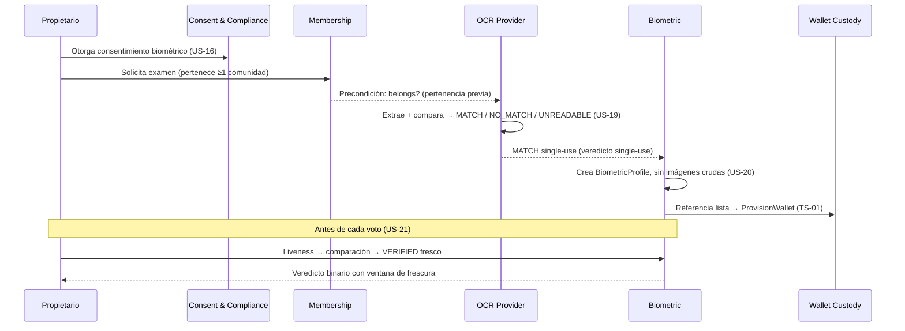
```mermaid
sequenceDiagram
    participant P as Propietario
    participant C as Consent & Compliance
    participant M as Membership
    participant O as OCR Provider
    participant B as Biometric
    participant W as Wallet Custody
    P->>C: Otorga consentimiento biométrico (US-16)
    P->>M: Solicita examen (pertenece ≥1 comunidad)
    M-->>O: Precondición: belongs? (pertenencia previa)
    O->>O: Extrae + compara → MATCH / NO_MATCH / UNREADABLE (US-19)
    O-->>B: MATCH single-use (veredicto single-use)
    B->>B: Crea BiometricProfile, sin imágenes crudas (US-20)
    B->>W: Referencia lista → ProvisionWallet (TS-01)
    Note over P,B: Antes de cada voto (US-21)
    P->>B: Liveness → comparación → VERIFIED fresco
    B-->>P: Veredicto binario con ventana de frescura
```

Fig. H1 – Enrollment en Domain Storytelling (ver diagrama superior).

#### Historia 2 — Voto verificable sin gestionar wallet (US-23, US-24, US-25, TS-01, TS-02, US-26)

Miembro elegible y verificado obtiene permiso breve, firma individualmente y sigue su comprobante.

| Paso | Actor → Acción | Objeto | BC que responde | Evento |
|---|---|---|---|---|
| 1 | Directiva → abre propuesta | `QuorumSnapshot` | Community → Voting | `ProposalOpened` (US-23, snapshot de quórum) |
| 2 | Propietario → solicita autorización | `VoteAuthorization` | Voting → Membership/Biometric | `EligibilitySnapshot` (elegibilidad congelada) + `verified-now` (veredicto fresco) → US-24 |
| 3 | Propietario → emite voto | `Vote` (intención) | Voting → Wallet | Firma individual efímera (firma individual) → US-25 |
| 4 | Voting → entrega solo-firmado | `DeliveryOrder` | Relay | `DeliveryConfirmed/Failed` (solo confirmado cuenta) |
| 5 | Voting → avisa comprobante | `NotificationDispatch` | Notifications | Aviso idempotente (US-26) |

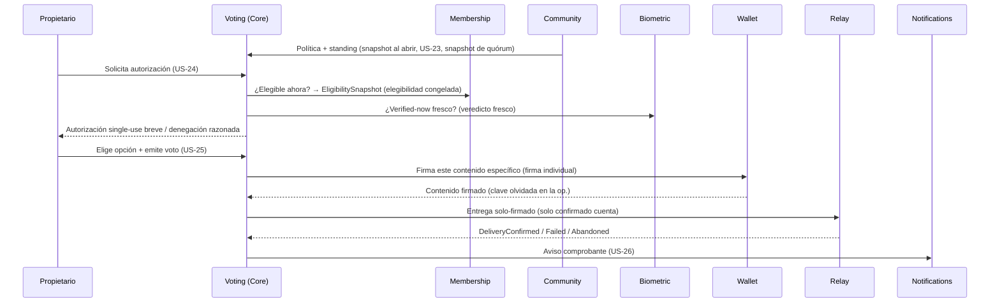
```mermaid
sequenceDiagram
    participant P as Propietario
    participant V as Voting (Core)
    participant Mb as Membership
    participant Cm as Community
    participant B as Biometric
    participant W as Wallet
    participant R as Relay
    participant N as Notifications
    Cm->>V: Política + standing (snapshot al abrir, US-23, snapshot de quórum)
    P->>V: Solicita autorización (US-24)
    V->>Mb: ¿Elegible ahora? → EligibilitySnapshot (elegibilidad congelada)
    V->>B: ¿Verified-now fresco? (veredicto fresco)
    V-->>P: Autorización single-use breve / denegación razonada
    P->>V: Elige opción + emite voto (US-25)
    V->>W: Firma este contenido específico (firma individual)
    W-->>V: Contenido firmado (clave olvidada en la op.)
    V->>R: Entrega solo-firmado (solo confirmado cuenta)
    R-->>V: DeliveryConfirmed / Failed / Abandoned
    V->>N: Aviso comprobante (US-26)
```

Fig. H2 – Voto verificable en Domain Storytelling (ver diagrama superior).

#### Historia 3 — Cierre, conteo y auditoría (US-27, US-28) + supresión coordinada (US-17)

Directiva cierra; cualquiera audita sin confiar en el operador. En paralelo, el titular puede pedir supresión sin que el ledger inmutable se reescriba.

| Paso | Actor → Acción | Objeto | BC que responde | Evento |
|---|---|---|---|---|
| 1 | Directiva → cierra propuesta | `Proposal` | Voting | Tally solo `CONFIRMED` + `QuorumSnapshot` (US-27) |
| 2 | Auditor/Propietario → consulta resultado | Evidencia | Voting | Conteos, cuórum, firma EIP-712 + tx hash `ecrecover()` (US-28) |
| 3 | Titular → solicita supresión | `DataSubjectRequest` | Consent coordina con dueños | `ErasureRequested/Confirmed/Complete` sin reescribir ledger (US-17) |

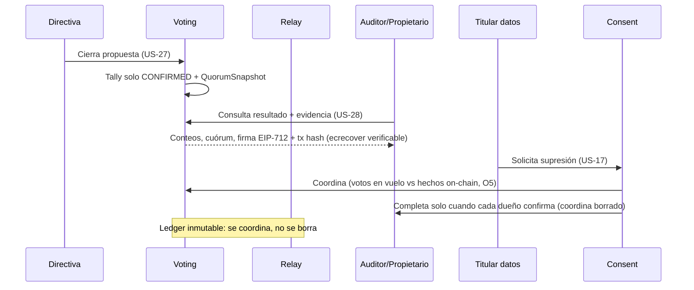
```mermaid
sequenceDiagram
    participant D as Directiva
    participant V as Voting
    participant R as Relay
    participant A as Auditor/Propietario
    participant T as Titular datos
    participant C as Consent
    D->>V: Cierra propuesta (US-27)
    V->>V: Tally solo CONFIRMED + QuorumSnapshot
    A->>V: Consulta resultado + evidencia (US-28)
    V-->>A: Conteos, cuórum, firma EIP-712 + tx hash (ecrecover verificable)
    T->>C: Solicita supresión (US-17)
    C->>V: Coordina (votos en vuelo vs hechos on-chain, O5)
    C->>A: Completa solo cuando cada dueño confirma (coordina borrado)
    Note over V,R: Ledger inmutable: se coordina, no se borra
```

Fig. H3 – Cierre y auditoría en Domain Storytelling (ver diagrama superior).

---

### **4.2.4. Bounded Context Canvases (por orden de importancia).**

Proceso iterativo por BC: 1) Context Overview Definition, 2) Business Rules Distillation & Ubiquitous Language Capture, 3) Capability Analysis, 4) Capability Layering, 5) Dependencies Capture, 6) Design Critique. Clasificación: Core / Supporting / Generic. Resultado: 1 Core, 7 Supporting, 3 Generic (ver justificación de granularidad en 4.2.5 alternativa f).

> Nota: archivos `assets/Bounded Context Canvases-*.jpg` insertados abajo en orden de importancia (BC-01 Voting Core primero). Nomenclatura objetivo: `assets/bc-canvas-01-voting.jpg` … `assets/bc-canvas-11-notifications.jpg`.

#### BC-01 — Voting & Verifiable Ledger (Core)
| Aspecto | Contenido |
|---|---|
| Agregados | `Proposal`, `VoteAuthorization`, `Vote` (+ `QuorumSnapshot`, `EligibilitySnapshot` congelados) |
| Reglas clave | Solo `VoteConfirmedOnChain` cuenta; `VoteCast` es intención. Tally con cuórum congelado. |
| Lenguaje | `ProposalOpened`, `VoteAuthorizationGranted`, `VoteCast`, `VoteConfirmedOnChain`, `ProposalTallied` |

<p align="center"></p>
Fig. 4.2.4-01 – Canvas Voting & Verifiable Ledger (Core). Fuente: elaboración propia en Miro.

#### BC-02 — Membership (Supporting)
Agregado `Membership` (par persona-comunidad), `EligibilitySnapshot`. Solo `ACTIVE` integra roster.

<p align="center"></p>

#### BC-03 — Community Management (Supporting)
Agregado `Community`, `VotingPolicy`. La política evoluciona aquí; Voting solo congela copia.

<p align="center"></p>

#### BC-04 — Biometric Identity Verification (Supporting)
Agregados `BiometricProfile`, `VerificationAttempt`. Veredicto binario fresco `verified-now`, sin imágenes crudas.

<p align="center"></p>

#### BC-05 — Cryptographic Wallet Custody (Supporting)
Agregado `UserWallet`. Firma por persona, reconstrucción efímera, signer/payer separados.

<p align="center"></p>

#### BC-06 — Blockchain Relay & Transaction Delivery (Supporting)
Agregado `DeliveryOrder`. Solo contenido firmado, orden secuencial por pagador, solo `DeliveryConfirmed` cuenta.

<p align="center"></p>

#### BC-07 — Consent & Compliance (Supporting, ortogonal)
Agregados `ConsentRecord`, `DataSubjectRequest`, `RetentionPolicy` (Ley 29733). Veta y coordina, no borra datos ajenos.

<p align="center"></p>

#### BC-08 — IAM (Supporting)
Agregado `User`. Identidad técnica y sesión única. Suspender acceso no reescribe membresía.

<p align="center"></p>

#### BC-09 — Verification   (Generic)
Agregado `VerificationChallenge`. Prueba posesión de canal, propósitos cerrados, código nunca cruza legible.

<p align="center"></p>

#### BC-10 — Document OCR & Face Match Provider (Generic)
Agregado `DocumentExamination` efímero. Veredicto `MATCH/NO_MATCH/UNREADABLE` single-use hacia Biometric.

<p align="center"></p>

#### BC-11 — Notifications (Generic)
Agregado `NotificationDispatch`. Sink email-only con idempotency key. Ver justificación en 4.2.5 (f).

<p align="center"></p>

### **4.2.5. Context Mapping.**

Proceso: se revisó la información de storming y canvases y se probaron alternativas con las preguntas guía.
Se descartaron:
- (a) fusionar Wallet+Relay (destruye separación signer/payer, viola C-03);
- (b) lista de miembros embebida en Community (acopla ritmos, reescribe historia);
- (c) `Proposal` gigante con votos embebidos (contención transaccional);
- (d)   para autorización de voto (mezcla canal con identidad);
- (e) preferencias de notificación locales (duplica Consent).
- (f) degradar Verification (OTP), Document OCR y Notifications a adaptadores/puertos dentro de IAM / Biometric / Infraestructura — evaluada a pedido de revisión docente. Pro: 8 BC en vez de 11, menos OHS. Con: mezcla ritmos y vocabularios distintos, pierde reemplazabilidad C-07 y debilita la verificación single-use, el hecho confirmado y la idempotencia. Conclusión: se mantienen como BC (ver justificación abajo).

Se confirma el mapa de 11 bounded contexts (1 Core, 7 Supporting, 3 Generic).

#### Justificación de granularidad: por qué  , OCR y Notifications son BC y no adaptadores

| Candidato a degradar | Si fuera adaptador | Por qué se mantiene como BC en VotoChain |
|---|---|---|
| Verification (OTP) dentro de IAM | Mezcla probar posesión de canal (`ChallengeRequested/Confirmed`, minutos, intentos acotados) con identidad técnica y sesión única (`User/Session`, horas). Violaría la frontera de verificación: el código legible podría cruzar. | Ritmo, vocabulario y secretos distintos.   es reemplazable (proveedor de correo/OTP) tras puerto C-07. ENT-02/ENT-03 exigen alternativa asistida sin contaminar sesión. |
| Document OCR dentro de Biometric | Mezcla examen efímero con purga (`DocumentExamination`, nace/muere en minutos, 3 veredictos + 5 razones) con referencia duradera (`BiometricProfile`). Contaminaría referencia viva con artefactos temporales e imágenes. | Ciclo de vida y Ley 29733 exigen frontera de verificación: solo `MATCH` single-use cruza, nada tipo-imagen. Proveedor biométrico externo reemplazable C-07. |
| Notifications como librería | Pierde idempotencia explícita e `idempotency key` y el veto de Consent (permiso y borrado coordinado: `may-process/contact-now?`). Cada BC reimplementaría reintentos. | Sink puro genérico email-only: todos dependen de él, él de nadie. Garantiza exactly-once y trazabilidad de avisos (US-26, comprobantes, DSAR). |

Conclusión: mantener 11 BC por separación de ritmos, vocabularios, secretos y reemplazabilidad. La alternativa 8+3 adaptadores queda documentada como opción simplificada si el costo de 3 OHS extra supera el beneficio.

<p align="center">
  
</p>

#### Catálogo de relaciones (Upstream → Downstream)

| # | Upstream → Downstream | Patrón | Regla de traducción (qué cruza / qué no) |
|---|---|---|---|
| R1 | Community → Voting | OHS + ACL (lado Voting) | `VotingPolicy/QuorumConfig` cruza una vez por apertura y congela como `QuorumSnapshot`. Cambios posteriores solo futuras propuestas. |
| R2 | Membership → Voting | OHS + ACL (lado Voting) | `¿Elegible ahora?` cruza como `EligibilitySnapshot` congelado al otorgar. Solo `ACTIVE` integra roster. |
| R3 | Biometric → Voting | Customer/Supplier (Voting cliente) | Solo `verified` fresco autoriza, dentro de su ventana. Voting nunca re-juzga liveness/comparación. |
| R4 | Voting → Wallet | Customer/Supplier (Voting cliente) | Un contenido específico cruza; reconstrucción transitoria y olvidada. Nada que pueda firmar por sí solo cruza. |
| R5 | Voting → Relay | Customer/Supplier (Voting cliente) + OHS (Relay) | Contenido ya firmado cruza; Relay nunca firma ni reescribe. Solo `DeliveryConfirmed` cuenta (`VoteCast` es intención). |
| R6 | Wallet ⋮ Relay | Separate Ways | Sin integración directa. Firma y pago se encuentran solo en el flujo de Voting, nunca mezclados (C-03). |
| R7 | OCR → Biometric | Customer/Supplier (Biometric cliente) | Veredicto cruza una vez, single-use, siembra la referencia. Set cerrado de 3 + 5 razones. Nada tipo-imagen cruza. |
| R8 | Membership → OCR | Conformist (OCR acata, Membership juzga) | Pertenencia respondida fuera; OCR rechaza con `NoEligibleMembership` si no pertenece a nada. |
| R9 | Verification → IAM | OHS (Verification) + ACL (lado IAM) | Solo el hecho `ChallengeConfirmed` cruza vía facade con primitivas; el código nunca cruza. |
| R10 | Verification → Notifications | Customer/Supplier (Verification cliente) | Instrucción de entrega (plantilla+dirección+motivo). Verification nunca entrega. |
| R11 | Cualquiera → Notifications | OHS (Notifications) | Solo plantilla+dirección+motivo+idempotency key. Misma key nunca entrega dos veces. |
| R12 | Consent ↔ cada dueño | Partnership + Published Language (`ErasureRequested`/`RevocationConfirmed`/`ErasureComplete`) | Gates y coordinación cruzan. Completa solo cuando cada dueño confirma lo suyo. Consent nunca toca datos ajenos. |
| R13 | IAM ⋮ Membership/Community/Biometric | Separate Ways (solo referencia identidad) | Solo identidad de persona cruza. Suspender en IAM nunca reescribe membresía/comunidad/biometría. 1 `User` : N `Memberships`. |
| R14 | IAM → Notifications | Customer/Supplier (IAM cliente) | Avisos de persona (bienvenida, seguridad, cambio de dirección, standing) como intents. |
| R15 | Community → Membership | OHS (Community) + ACL (lado Membership) | `acceptsMembers`/`answerStanding` por registro. Membership nunca cachea política. |
| R16 | Membership/Community/Verification/Biometric/OCR → IAM | OHS (IAM) + ACL (consumidor) | `personExists` por caso de uso, antes de la unidad de trabajo. Solo booleano cruza. |

Lo que **nunca cruza**: imágenes crudas, retratos, artefactos de comparación, códigos en claro, secretos de firma, listas de miembros, configuración viva de comunidad (solo copias congeladas), reglas de negocio ajenas.

## **4.3. Software Architecture.**

La arquitectura traduce drivers D-01..D-22 y constraints C-01..C-07 a containers desplegables: frontend **Next.js** (Landing + Web App), API **monolito modular NestJS 12**, **PostgreSQL 16 (Cloud SQL)**, worker relayer, contratos Polygon y proveedores externos (Google Document AI / AWS Rekognition, SMTP).

### **4.3.1. Software Architecture System Landscape Diagram.**

Vista de paisaje: **VotoChain como un solo sistema** dentro de su ecosistema (personas, comunidades, ledger público, proveedores, SUNARP). Los containers internos (Landing, Web App, API, Relayer) no van en Landscape; van en 4.3.3 Container.

<p align="center">
  
</p>

Fig. 4.3.1 – System Landscape (VotoChain como sistema único).

VotoChain es un único sistema. Las personas (directiva, propietario, admin cumplimiento, visitante) interactúan con VotoChain; VotoChain interactúa con sistemas externos (red blockchain pública, proveedores biométricos, correo) y con entidades manuales (SUNARP/notaría). Todo el dominio vive en el monolito modular (11 módulos, uno por BC). El worker relayer es el único que escribe en el ledger (paga gas). OCR/biometría y correo son externos reemplazables tras puertos. La verificación on-chain puede hacerse directo contra la red desde la web para auditoría independiente sin pasar por la API.

### **4.3.2. Software Architecture Context Level Diagrams.**

Un recuadro = “VotoChain Platform” en el centro; alrededor, usuarios y sistemas externos, incluyendo **Admin Cumplimiento** (presente en historias US-18 y en Landscape).

<p align="center">
  
</p>

Fig. 4.3.2 – Context (VotoChain Platform al centro, actores y sistemas externos alrededor).

| Interacción | Dirección | Protocolo / contrato | Driver que satisface |
|---|---|---|---|
| Gestionar comunidad/propuesta, votar, auditar | Directiva / Propietario / Visitante → Platform | HTTPS REST versionado + idempotency keys (C-06) | D-22 usabilidad no-técnica, D-13 pico interactivo |
| Revisar consentimientos, atender DSAR, definir retención, auditar | Admin Cumplimiento → Platform | HTTPS REST versionado (US-17/US-18), vetos `may-process/contact-now?` (coordina borrado) | Privacidad Ley 29733, D-06 |
| Publicar voto / leer confirmación | Platform ↔ Polygon | JSON-RPC, EIP-712 firmado por `UserWallet`, `ecrecover()` público (C-02) | D-03/D-05 verificabilidad, D-16 exactly-once |
| OCR DNI | Platform → Document AI | HTTPS tras puerto `DocumentExamination` (C-07) | D-14 examen con purga, D-19 reemplazable |
| Liveness + comparación | Platform → Rekognition | HTTPS tras puerto `VerificationAttempt` (C-07) | D-09 liveness-first, D-06 privacidad |
| Email | Platform → SMTP | SMTP tras puerto `NotificationDispatch`, email-only (C-07) | D-16 sin duplicados (idempotente) |

El Admin Cumplimiento no vota ni gestiona asambleas; solo veta tratamientos y coordina supresión (coordina borrado), por eso aparece en Context/Landscape pero no en Voting.

### **4.3.3. Software Architecture Container Level Diagrams.**

Descomposición en containers desplegables separadamente (aunque API+Worker compartan repo monolítico versionado, C-01).

<p align="center">
  
</p>

### **4.3.4. Software Architecture Deployment Diagrams.**

Despliegue MVP en **Google Cloud Platform** (región `southamerica-east1` sugerida por latencia Lima–São Paulo). Todo contenerizado (Docker/Artifact Registry), HTTPS perimetral (Cloud Load Balancing + Cloud CDN), secretos en Secret Manager.

<p align="center">
  
</p>


# **Capítulo V: Tactical-Level Software Design.**

Este capítulo detalla el diseño táctico de los 11 bounded contexts: agregados, servicios, repositorios e invariantes (5.X.1), interfaz REST (5.X.2), aplicación (5.X.3), infraestructura (5.X.4), componentes (5.X.5) y código —clases y base de datos— (5.X.6). El diseño distingue intención (`VoteCast`) de hecho (`VoteConfirmedOnChain`): solo lo confirmado cuenta.

| N.º | Contexto | Tipo | Agregados | Trazabilidad |
|---|---|---|---|---|
| 5.1 | Voting & Verifiable Ledger | Core | `Proposal`, `VoteAuthorization`, `Vote` | US-22..US-28, D-01/D-03/D-05 |
| 5.2 | Cryptographic Wallet Custody | Supporting | `UserWallet` | TS-01, C-03 |
| 5.3 | Biometric Identity Verification | Supporting | `BiometricProfile`, `VerificationAttempt` | US-19..US-21, D-09/D-06 |
| 5.4 | Blockchain Relay & Transaction Delivery | Supporting | `DeliveryOrder` | TS-02, D-05/D-16 |
| 5.5 | IAM | Supporting | `User` | US-04..US-07, D-22 |
| 5.6 | Community Management | Supporting | `Community` | US-08..US-11, D-22 |
| 5.7 | Membership | Supporting | `Membership` | US-12..US-15, D-13 |
| 5.8 | Consent & Compliance | Supporting | `ConsentRecord`, `DataSubjectRequest`, `RetentionPolicy` | US-16..US-18, Ley 29733 |
| 5.9 | Document OCR & Face Match Provider | Generic | `DocumentExamination` | US-19, D-14/C-07 |
| 5.10 | Verification (OTP) | Generic | `VerificationChallenge` | US-05/US-07, C-07 |
| 5.11 | Notifications | Generic | `NotificationDispatch` | TS-03/US-26, D-16 |

## **5.1. Voting & Verifiable Ledger (Core).**
Responsabilidad: convertir intención verificable en hecho observado. Solo `CONFIRMED` cuenta. Trazabilidad: US-22..US-28.

### **5.1.1. Domain Layer.**
#### Agregados
| Agregado | Atributos | Operaciones | Regla local |
|---|---|---|---|
| `Proposal` | `id, communityId, standing DRAFT>OPEN>CLOSED>TALLIED, options, quorumSnapshot, tally` | `create, open(quorum), close, tallyVotes, assertOpen, assertChoice` | avance solo hacia adelante, sin reapertura |
| `VoteAuthorization` | `id, proposalId, voterAddress, standing PENDING/CONSUMED/EXPIRED/DENIED, denialReason, expiresAt` | `request, grant, deny, consume, expire` | máx un `PENDING` por pareja; finales terminales |
| `Vote` | `id, proposalId, voterAddress, choice, nonce, signature, txReference, standing SIGNED/QUEUED/SENT/CONFIRMED/FAILED` | `buildMessage, cast, markQueued, markSent, markConfirmed, markFailed` | intención vs hecho; `FAILED` reintenta misma identidad, nunca voto nuevo |
#### Objetos de valor
| VO | Contenido |
|---|---|
| `ProposalId, AuthorizationId, VoteId, CommunityId` | identidades estables, nunca intercambiables |
| `VoterAddress` | normalizada; firmante recuperado debe igualar al declarado |
| `Choice` | debe pertenecer al ballot |
| `BallotOptions` | ≥2 opciones distintas; fijo al abrir |
| `Signature` | EIP-712 sobre propuesta/votante/opción/nonce |
| `VoteNonce` | fresco por autorización; impide reutilización |
| `QuorumSnapshot` | threshold + basis; `verdictFor`; una escritura al abrir |
| `EligibilitySnapshot` | juicio congelado al autorizar |
| `TransactionReference` | txHash + bloque; observada, nunca inventada |
#### Servicios y repositorios
| Elemento | Tipo | Operaciones |
|---|---|---|
| `ProposalCommandService` | comando | `draft, open, close, tally` |
| `VoteAuthorizationCommandService` | comando | `request, grant, deny, expire` |
| `VoteCommandService` | comando | `cast` (atómico consume+emite), `markQueued, markSent, markConfirmed, markFailed` |
| `ProposalQueryService` | consulta | `getById, listByCommunityAndStatus, getTally` |
| `VoteQueryService` | consulta | `getReceipt, getProof` |
| `SignaturePolicy, QuorumPolicy` | puerto | `recover`, `verdict` |
| `ProposalRepository, VoteAuthorizationRepository, VoteRepository` | repo | `findById, save` (listados/tally/recibo/prueba como queries) |
#### Invariantes
* quórum una escritura; solo propuesta abierta acepta; solo `CONFIRMED` suma; propuesta nunca contiene votos; firma ata los 4; segundo `CONFIRMED` = replay; nada cambia tras `CONFIRMED`.
#### Hechos (`Event`)
* `ProposalDraftedEvent`, `ProposalOpenedEvent`, `ProposalClosedEvent`, `ProposalTalliedEvent`, `QuorumReachedEvent`, `QuorumNotReachedEvent`, `VoteAuthorizationRequestedEvent`, `VoteAuthorizationGrantedEvent`, `VoteAuthorizationDeniedEvent`, `VoteAuthorizationConsumedEvent`, `VoteAuthorizationExpiredEvent`, `VoteMessageBuiltEvent`, `VoteCastEvent`, `SignedVoteQueuedEvent`, `TransactionSentEvent`, `VoteConfirmedOnChainEvent`, `TransactionFailedEvent`, `ReplayRejectedEvent`, `LateVoteRejectedEvent`.

### **5.1.2. Interface Layer.**
Controladores delgados + `VotingExceptionFilter` (negocio→HTTP). Idempotencia por header `Idempotency-Key` en emisión.

| Método + ruta | Req | 201/200 | Errores |
|---|---|---|---|
| `POST /proposals` | `communityId, ballot` | `201 + Location /proposals/{id}` | `422 ballot, 404 community` |
| `POST /proposals/{id}/open` | `—` | `200 + QuorumSnapshot` | `409 ya abierta, 422 sin policy` |
| `POST /proposals/{id}/close` | `—` | `200 CLOSED` | `409 estado, 404` |
| `GET /proposals/{id}` | `—` | `200 detalle` | `404` |
| `GET /proposals?community=&status=` | query | `200 lista` | `—` |
| `GET /proposals/{id}/tally` | `—` (solo TALLIED) | `200 conteos+turnout+veredicto` | `409 no tallied, 404` |
| `POST /proposals/{id}/authorizations` | `voterAddress` | `201 PENDING o DENIED con motivo INELIGIBLE/IDENTITY_NOT_VERIFIED/PROPOSAL_NOT_OPEN` | `410 tardía, 404` |
| `POST /authorizations/{id}/votes` | `choice + Idempotency-Key` | `201 recibo SIGNED` | `409 consumida/replay, 410 vencida, 422 choice/firmante` |
| `GET /votes/{id}/proof` | `—` | `200 opción+firma+txRef+firmante` | `404` |
| `GET /proposals/{id}/receipt?voter=` | `—` | `200 recorrido propio` | `404` |

### **5.1.3. Application Layer.**
Crear (`create`→`ProposalDraftedEvent`); Abrir (lee policy vía ACL, `open`→`Opened`); Solicitar auth (`request`+elegibilidad congelada+verified-now→`Granted/Denied`); Emitir (UoW atómica: valida vigencia+abierta+opción, `buildMessage`, pide firma a custodia, verifica firmante, consume auth+emite, publica tras commit→`VoteMessageBuilt/VoteCast/AuthorizationConsumed`, pide aviso); Entregar (ante `VoteCast`: `Queued→Sent` vía Relay); Tratar resultado (`Confirmed` cuenta / `Failed`+aviso); Cerrar (`close`+tally solo CONFIRMED→`Closed/Tallied/QuorumReached|NotReached`); Barrido (`Expired` periódico). Parámetros externos: `VOTE_AUTH_TTL, NETWORK_ID`.

### **5.1.4. Infrastructure Layer.**
Postgres esquema propio: `proposals/authorizations/votes + request_log(idempotencyKey→voteId)`. Unicidad parcial: un PENDING por (propuesta,votante), un CONFIRMED por pareja. VOs como JSONB. ACLs: Comunidad (policy), Padrón (elegibilidad), Presencia (veredicto), Custodia (firma), Relay (entrega), Avisos (recibo). Puertos `SignaturePolicy/QuorumPolicy` con variante operativa/prueba.

### **5.1.5. Component Level Diagrams.**
<p align="center">
  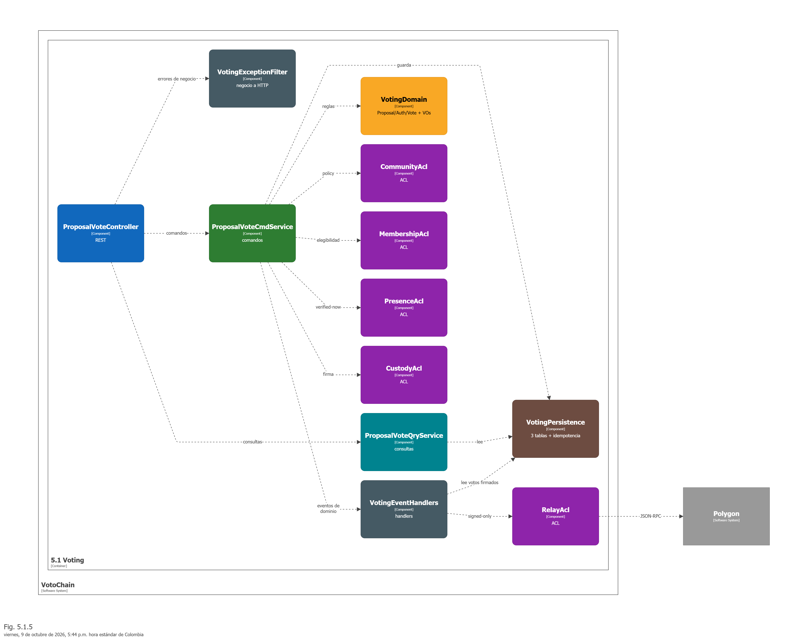
</p>
Fig. 5.1.5 – Voting, componentes.

### **5.1.6. Code Level Diagrams.**
#### **5.1.6.1. Domain Layer Class Diagrams.**
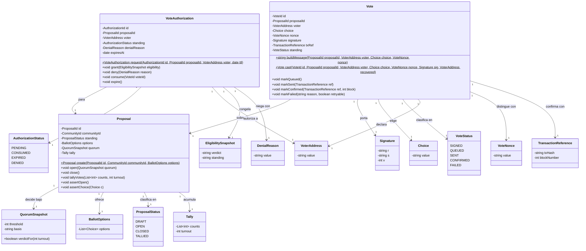
```mermaid
classDiagram
  class Proposal {
    -ProposalId id
    -CommunityId communityId
    -ProposalStatus standing
    -BallotOptions options
    -QuorumSnapshot quorum
    -Tally tally
    +Proposal create(ProposalId id, CommunityId communityId, BallotOptions options)$
    +void open(QuorumSnapshot quorum)
    +void close()
    +void tallyVotes(List~int~ counts, int turnout)
    +void assertOpen()
    +void assertChoice(Choice c)
  }
  class VoteAuthorization {
    -AuthorizationId id
    -ProposalId proposalId
    -VoterAddress voter
    -AuthorizationStatus standing
    -DenialReason denialReason
    -date expiresAt
    +VoteAuthorization request(AuthorizationId id, ProposalId proposalId, VoterAddress voter, date ttl)$
    +void grant(EligibilitySnapshot eligibility)
    +void deny(DenialReason reason)
    +void consume(VoteId voteId)
    +void expire()
  }
  class Vote {
    -VoteId id
    -ProposalId proposalId
    -VoterAddress voter
    -Choice choice
    -VoteNonce nonce
    -Signature signature
    -TransactionReference txRef
    -VoteStatus standing
    +string buildMessage(ProposalId proposalId, VoterAddress voter, Choice choice, VoteNonce nonce)$
    +Vote cast(VoteId id, ProposalId proposalId, VoterAddress voter, Choice choice, VoteNonce nonce, Signature sig, VoterAddress recovered)$
    +void markQueued()
    +void markSent(TransactionReference ref)
    +void markConfirmed(TransactionReference ref, int block)
    +void markFailed(string reason, boolean retryable)
  }
  class QuorumSnapshot {
    -int threshold
    -string basis
    +boolean verdictFor(int turnout)
  }
  class EligibilitySnapshot {
    -string verdict
    -string standing
  }
  class VoterAddress {
    -string value
  }
  class Signature {
    -string r
    -string s
    -int v
  }
  class VoteNonce {
    -string value
  }
  class Choice {
    -string value
  }
  class BallotOptions {
    -List~Choice~ options
  }
  class TransactionReference {
    -string txHash
    -int blockNumber
  }
  class Tally {
    -List~int~ counts
    -int turnout
  }
  class DenialReason {
    -string value
  }
  class ProposalStatus {
    DRAFT
    OPEN
    CLOSED
    TALLIED
  }
  class VoteStatus {
    SIGNED
    QUEUED
    SENT
    CONFIRMED
    FAILED
  }
  class AuthorizationStatus {
    PENDING
    CONSUMED
    EXPIRED
    DENIED
  }
  Proposal "1" --> "1" QuorumSnapshot : decide bajo
  Proposal "1" --> "1" BallotOptions : ofrece
  Proposal "1" --> "1" ProposalStatus : clasifica en
  Proposal "1" --> "1" Tally : acumula
  Vote "1" --> "1" Proposal : sobre
  VoteAuthorization "1" --> "1" Proposal : para
  VoteAuthorization "1" --> "1" AuthorizationStatus : clasifica en
  VoteAuthorization "1" --> "1" VoterAddress : autoriza a
  VoteAuthorization "1" --> "1" EligibilitySnapshot : congela
  VoteAuthorization "1" --> "1" DenialReason : niega con
  Vote "1" --> "1" Signature : porta
  Vote "1" --> "1" Choice : elige
  Vote "1" --> "1" VoteStatus : clasifica en
  Vote "1" --> "1" VoterAddress : declara
  Vote "1" --> "1" VoteNonce : distingue con
  Vote "1" --> "1" TransactionReference : confirma con
```
Fig. 5.1.6.1 – Clases Voting.

#### **5.1.6.2. Database Design Diagram.**
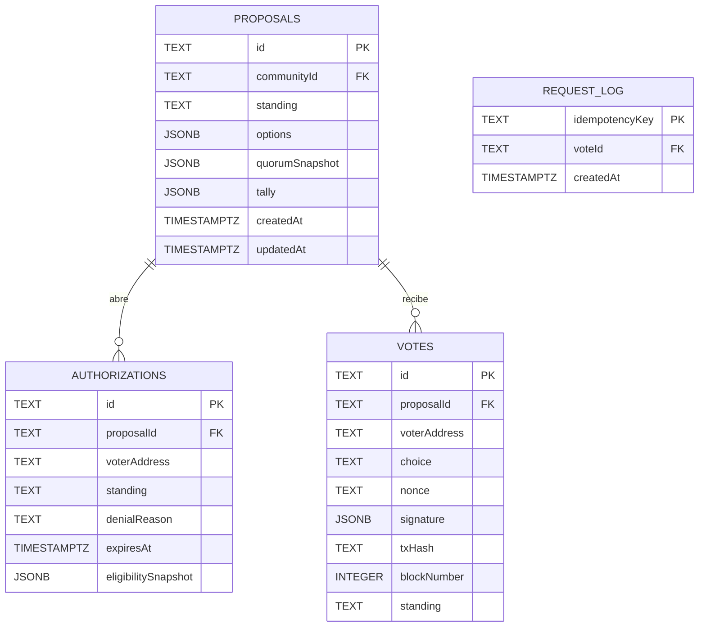
```mermaid
erDiagram
  PROPOSALS ||--o{ AUTHORIZATIONS : abre
  PROPOSALS ||--o{ VOTES : recibe
  PROPOSALS { TEXT id PK TEXT communityId FK TEXT standing JSONB options JSONB quorumSnapshot JSONB tally TIMESTAMPTZ createdAt TIMESTAMPTZ updatedAt }
  AUTHORIZATIONS { TEXT id PK TEXT proposalId FK TEXT voterAddress TEXT standing TEXT denialReason TIMESTAMPTZ expiresAt JSONB eligibilitySnapshot }
  VOTES { TEXT id PK TEXT proposalId FK TEXT voterAddress TEXT choice TEXT nonce JSONB signature TEXT txHash INTEGER blockNumber TEXT standing }
  REQUEST_LOG { TEXT idempotencyKey PK TEXT voteId FK TIMESTAMPTZ createdAt }
```
Nota: unicidad parcial un PENDING y un CONFIRMED por (propuesta,votante); conteo filtra `CONFIRMED`.
Fig. 5.1.6.2 – DB Voting.

## **5.2. Cryptographic Wallet Custody (Supporting).**
Responsabilidad: capacidad de firma por persona, efímera y con olvido. Nunca paga ni entrega. Trazabilidad: TS-01.
### **5.2.1. Domain Layer.**
#### Agregados
| Agregado | Atributos | Operaciones | Regla local |
|---|---|---|---|
| `UserWallet` | `id, personId, position, standing PROVISIONED/SIGNING_OPEN/ROTATED/SUSPENDED/RETIRED, openFor` | `provision, reconstructForSigning, forget, rotate, suspend, retire, answerSigningCapability` | máx una viva por persona; en reposo nada firma; reconstrucción atada a un contenido + olvido atómico; `RETIRED` terminal |
#### Objetos de valor
| VO | Contenido |
|---|---|
| `UserWalletId` | identidad de la capacidad |
| `PersonId` | solo referencia a la persona |
| `DerivationPosition` | posición única |
| `SignedContentRef` | referencia al contenido (propiedad de Voting) |
| `WalletHistory` | historial de administración |
#### Servicios y repositorios
| Elemento | Tipo | Operaciones |
|---|---|---|
| `WalletCommandService` | comando | `provision, rotate, suspend, retire, sign` |
| `WalletQueryService` | consulta | `getCapabilityByPerson, getHistory` |
| `WalletRepository` | repo | `findById, findLiveByPerson, existsPosition, findEventsByWallet, save` |
#### Invariantes
* una viva por persona; reconstrucción siempre seguida de olvido en la misma operación; firmar y pagar nunca se mezclan.
#### Hechos (`Event`)
* `WalletProvisionedEvent`, `KeyReconstructedEvent`, `KeyForgottenEvent`, `WalletRotatedEvent`, `WalletSuspendedEvent`, `WalletRetiredEvent`.
### **5.2.2. Interface Layer.**
| Método + ruta | 2xx | Errores |
|---|---|---|
| `POST /wallets/provision {personId}` | `201 + posición` | `409 existe viva, 404 person` |
| `POST /wallets/{id}/sign {contentRef}` | `200 firma (olvido misma op)` | `409 abierta/suspendida/retirada, 422 contenido` |
| `POST /wallets/{id}/rotate|suspend|retire` | `200` | `409 estado, 404` |
| `GET /wallets?person=, /wallets/{id}/history` | `200` | `404` |
Filtro propio negocio→HTTP.
### **5.2.3. Application Layer.**
Proveer (verifica persona+ausencia viva, reserva posición, crea); Firmar (UoW atómica: verifica habilitada+ningún abierto, reconstruye, firma, olvida, publica ambos); Rotar/Suspender/Retirar; consultas. Parámetro: `POSITION_SPACE`.
### **5.2.4. Infrastructure Layer.**
Tabla `wallets(personId, position UK, standing, openFor transitorio)` + `wallet_history`. Ejecutor firma tras puerto; ACL Avisos. Sin mezcla con pagadora (Relay).
### **5.2.5. Component Level Diagrams.**
<p align="center">
  
</p>
Fig. 5.2.5 – Wallet, componentes.
### **5.2.6. Code Level Diagrams.**
#### **5.2.6.1. Domain Layer Class Diagrams.**
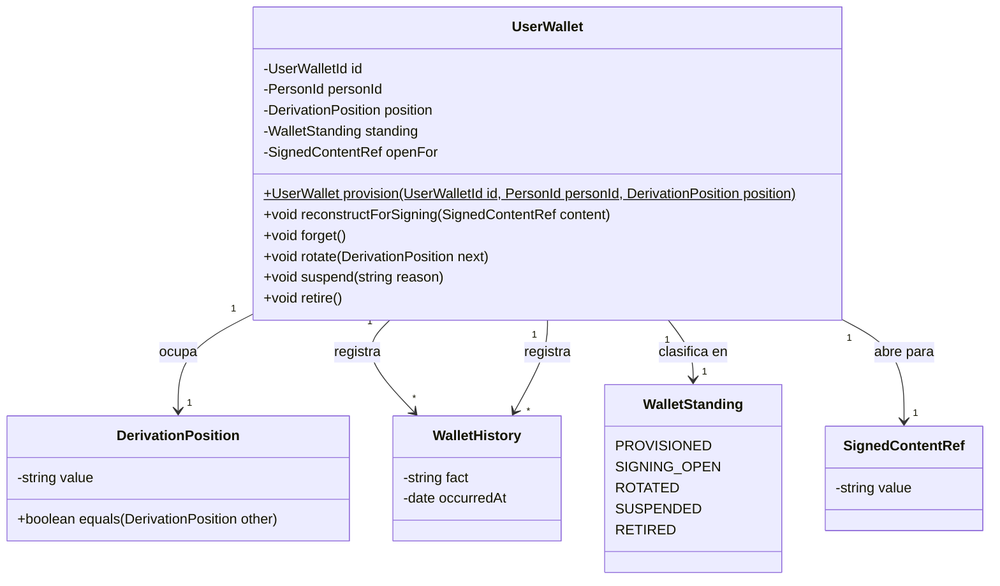
```mermaid
classDiagram
  class UserWallet {
    -UserWalletId id
    -PersonId personId
    -DerivationPosition position
    -WalletStanding standing
    -SignedContentRef openFor
    +UserWallet provision(UserWalletId id, PersonId personId, DerivationPosition position)$
    +void reconstructForSigning(SignedContentRef content)
    +void forget()
    +void rotate(DerivationPosition next)
    +void suspend(string reason)
    +void retire()
  }
  class DerivationPosition {
    -string value
    +boolean equals(DerivationPosition other)
  }
  class WalletHistory {
    -string fact
    -date occurredAt
  }
  class SignedContentRef {
    -string value
  }
  class WalletStanding {
    PROVISIONED
    SIGNING_OPEN
    ROTATED
    SUSPENDED
    RETIRED
  }
  UserWallet "1" --> "1" DerivationPosition : ocupa
  UserWallet "1" --> "*" WalletHistory : registra
  UserWallet "1" --> "1" WalletStanding : clasifica en
  UserWallet "1" --> "1" SignedContentRef : abre para
  UserWallet "1" --> "*" WalletHistory : registra
```
Fig. 5.2.6.1 – Clases Wallet.
#### **5.2.6.2. Database Design Diagram.**
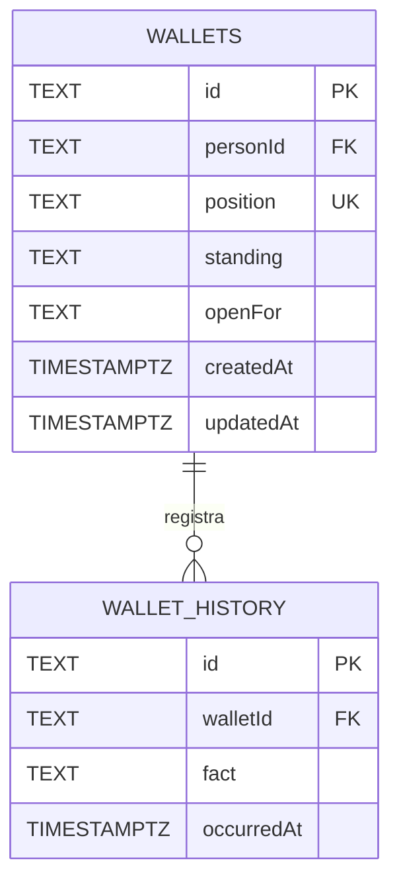
```mermaid
erDiagram
  WALLETS { TEXT id PK TEXT personId FK TEXT position UK TEXT standing TEXT openFor TIMESTAMPTZ createdAt TIMESTAMPTZ updatedAt }
  WALLET_HISTORY { TEXT id PK TEXT walletId FK TEXT fact TIMESTAMPTZ occurredAt }
  WALLETS ||--o{ WALLET_HISTORY : registra
```
Fig. 5.2.6.2 – DB Wallet.

## **5.3. Biometric Identity Verification (Supporting).**
Responsabilidad: presencia primero, luego comparación, veredicto binario fresco. Trazabilidad: US-19..21.
### **5.3.1. Domain Layer.**
#### Agregados
| Agregado | Atributos | Operaciones | Regla local |
|---|---|---|---|
| `BiometricProfile` | `id, personId, standing ENROLLED/REVOKED` | `enroll, revoke, answerReferenceStanding` | una viva por persona; sin imágenes crudas |
| `VerificationAttempt` | `id, personId, profileId, standing CHALLENGE_OPEN/LIVENESS_PASSED/LIVENESS_FAILED/COMPARISON_REQUESTED/VERIFIED/NOT_VERIFIED/EXPIRED, verdict` | `start, completeLiveness, requestComparison, recordVerdict, expire` | sin liveness no hay comparación; un cierre; `VERIFIED` solo fresco |
#### Objetos de valor
| VO | Contenido |
|---|---|
| `VerificationVerdict` | conclusión + motivo + frescura |
| `LivenessOutcome` | `PRESENT` / `ABSENT` |
| `FailureReason` | 5 valores cerrados |
| `FreshnessWindow` | cuánto autoriza un `VERIFIED` |
#### Servicios y repositorios
| Elemento | Tipo | Operaciones |
|---|---|---|
| `BiometricCommandService` | comando | `enroll, start, completeLiveness, requestComparison, recordVerdict, expire, revoke` |
| `BiometricQueryService` | consulta | `answerStanding, getHistory` |
| `ProfileRepository` | repo | `findById, findLiveByPerson, save` |
| `AttemptRepository` | repo | `findById, findOpenByProfile, save` |
#### Invariantes
* una referencia viva por persona; cada intento concluye una sola vez; la revocación cierra abiertos sin reescribir concluidos.
#### Hechos (`Event`)
* `BiometricEnrolledEvent`, `LivenessChallengeStartedEvent`, `LivenessPassedEvent`, `LivenessFailedEvent`, `FaceComparisonRequestedEvent`, `IdentityVerifiedEvent`, `IdentityVerificationFailedEvent`, `VerificationAttemptExpiredEvent`, `BiometricProfileRevokedEvent`.
### **5.3.2. Interface Layer.**
| Método + ruta | 2xx | Errores |
|---|---|---|
| `POST /biometric/profiles {personId+MATCH}` | `201` | `409 existe, 422 MATCH consumido/vencido` |
| `POST /biometric/attempts {personId}` | `201 OPEN` | `409 revocado, 404` |
| `POST /biometric/attempts/{id}/liveness|comparison|verdict` | `200` | `409 orden/expirado, 422 NO_MATCH` |
| `GET /biometric/standing?person=` | `200 verified-now+motivo+frescura` | `—` |
### **5.3.3. Application Layer.**
Inscribir (permiso+MATCH single-use); ciclo intento→veredicto; vencimiento por ventana; revocación cierra abiertos sin reescribir. Manejador erasure→revoca. Parámetros: `FRESHNESS_WINDOW, MATCH_TTL`.
### **5.3.4. Infrastructure Layer.**
`profiles/attempts` (viva única por persona). ACLs Permiso/Examen(MATCH consumible); ejecutores presencia/comparación tras puertos; ACL Avisos.
### **5.3.5. Component Level Diagrams.**
<p align="center">
  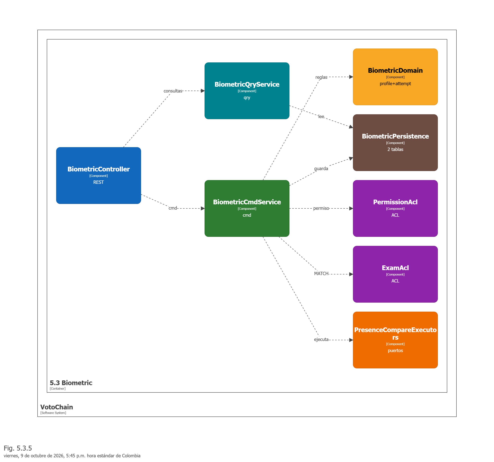
</p>
Fig. 5.3.5 – Biometric, componentes.
### **5.3.6. Code Level Diagrams.**
#### **5.3.6.1. Domain Layer Class Diagrams.**
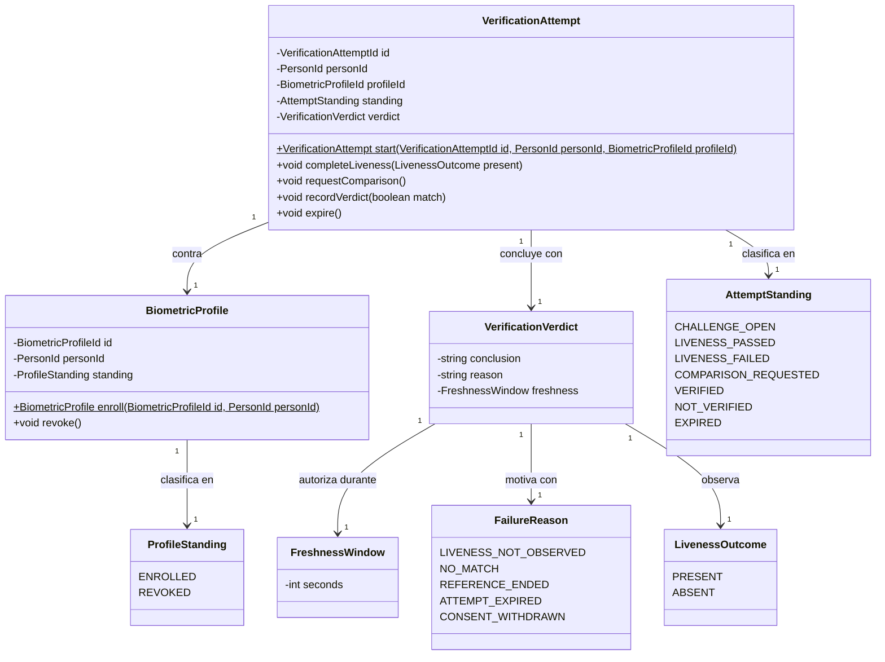
```mermaid
classDiagram
  class BiometricProfile {
    -BiometricProfileId id
    -PersonId personId
    -ProfileStanding standing
    +BiometricProfile enroll(BiometricProfileId id, PersonId personId)$
    +void revoke()
  }
  class VerificationAttempt {
    -VerificationAttemptId id
    -PersonId personId
    -BiometricProfileId profileId
    -AttemptStanding standing
    -VerificationVerdict verdict
    +VerificationAttempt start(VerificationAttemptId id, PersonId personId, BiometricProfileId profileId)$
    +void completeLiveness(LivenessOutcome present)
    +void requestComparison()
    +void recordVerdict(boolean match)
    +void expire()
  }
  class VerificationVerdict {
    -string conclusion
    -string reason
    -FreshnessWindow freshness
  }
  class LivenessOutcome {
    PRESENT
    ABSENT
  }
  class FailureReason {
    LIVENESS_NOT_OBSERVED
    NO_MATCH
    REFERENCE_ENDED
    ATTEMPT_EXPIRED
    CONSENT_WITHDRAWN
  }
  class FreshnessWindow {
    -int seconds
  }
  class ProfileStanding {
    ENROLLED
    REVOKED
  }
  class AttemptStanding {
    CHALLENGE_OPEN
    LIVENESS_PASSED
    LIVENESS_FAILED
    COMPARISON_REQUESTED
    VERIFIED
    NOT_VERIFIED
    EXPIRED
  }
  VerificationAttempt "1" --> "1" BiometricProfile : contra
  BiometricProfile "1" --> "1" ProfileStanding : clasifica en
  VerificationAttempt "1" --> "1" AttemptStanding : clasifica en
  VerificationAttempt "1" --> "1" VerificationVerdict : concluye con
  VerificationVerdict "1" --> "1" FreshnessWindow : autoriza durante
  VerificationVerdict "1" --> "1" FailureReason : motiva con
  VerificationVerdict "1" --> "1" LivenessOutcome : observa
```
Fig. 5.3.6.1 – Clases Biometric.
#### **5.3.6.2. Database Design Diagram.**
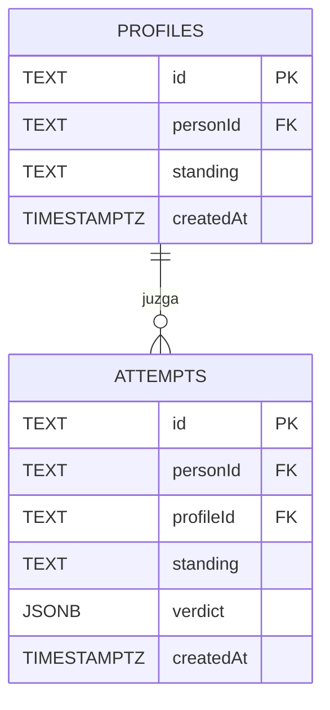
```mermaid
erDiagram
  PROFILES { TEXT id PK TEXT personId FK TEXT standing TIMESTAMPTZ createdAt }
  ATTEMPTS { TEXT id PK TEXT personId FK TEXT profileId FK TEXT standing JSONB verdict TIMESTAMPTZ createdAt }
  PROFILES ||--o{ ATTEMPTS : juzga
```
Fig. 5.3.6.2 – DB Biometric.

## **5.4. Blockchain Relay & Transaction Delivery (Supporting).**
Responsabilidad: llevar firmado a la red e informar. Nunca firma ni cuenta. Trazabilidad: TS-02.
### **5.4.1. Domain Layer.**
#### Agregados
| Agregado | Atributos | Operaciones | Regla local |
|---|---|---|---|
| `DeliveryOrder` | `id, contentRef, payerRef, orderPosition, standing ACCEPTED/ORDERED/SENT/CONFIRMED/FAILED/RETRIED/ABANDONED, attempts[]` | `accept, order, recordSending, recordConfirmation, recordFailure, retry, abandon` | una orden por contenido; máx una abierta; sin adelantamientos por pagador; reintento preserva efecto; `CONFIRMED`/`ABANDONED` terminales |
#### Objetos de valor
| VO | Contenido |
|---|---|
| `DeliveryOrderId` | identidad de la orden |
| `SignedContentRef` | solo referencia al contenido firmado |
| `PayerRef` | capacidad pagadora; nunca la firmante |
| `SendingOrderPosition` | secuencial densa por pagador |
| `SendingCost` | costo de envío; sin cobertura es fallo |
| `SendingAttempt` | posición + resultado + motivo; anexado |
| `FailureReason` | `LEDGER_REJECTED`, `COST_EXHAUSTED`, `RETRY_LIMIT_REACHED`, `ORDER_SUPERSEDED` |
#### Servicios y repositorios
| Elemento | Tipo | Operaciones |
|---|---|---|
| `DeliveryCommandService` | comando | `accept, order, recordSending, recordConfirmation, recordFailure, retry, abandon` |
| `DeliveryQueryService` | consulta | `answerStanding, getHistory` |
| `DeliveryOrderRepository` | repo | `findById, findOpenByContent, findByPayer, nextPositionForPayer, save` |
#### Invariantes
* una abierta por contenido; el reintento preserva efecto único en red dentro de la misma orden.
#### Hechos (`Event`)
* `AcceptedForDeliveryEvent`, `OrderedForSendingEvent`, `SendingRecordedEvent`, `DeliveryConfirmedEvent` (única que cuenta), `DeliveryFailedEvent`, `DeliveryRetriedEvent`, `DeliveryAbandonedEvent`.
### **5.4.2. Interface Layer.**
| Método + ruta | 2xx | Errores |
|---|---|---|
| `POST /deliveries/accept {signedContent,payer}` | `202 + DeliveryRef` | `422 unsigned, 409 abierta` |
| `GET /deliveries?content=|{id}` | `200` | `404` |
| `POST /deliveries/{id}/observations {result}` | `200 confirm/fail idempotente` | `404, 409 terminal` |
### **5.4.3. Application Layer.**
Acepta→ordena (siguiente posición pagador)→envía→confirma/falla→reintenta si cota o abandona. Publica confirmación/fallo. Parámetros: `RETRY_BOUND, NETWORK_ID, COST_POLICY`.
### **5.4.4. Infrastructure Layer.**
`orders + attempts` (abierta única por contenido, secuencia por pagador). Adaptador red envío/observación; ACL Avisos. Costo descubierto = fallo, nunca espera silenciosa.
### **5.4.5. Component Level Diagrams.**
<p align="center">
  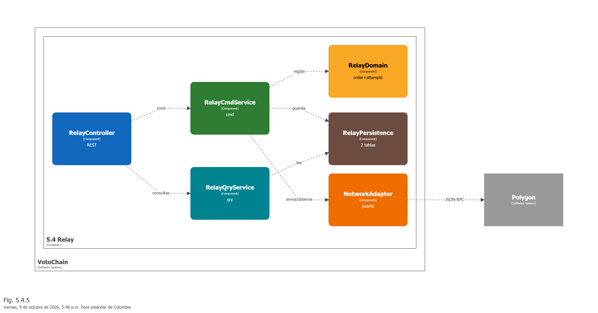
</p>
Fig. 5.4.5 – Relay, componentes.
### **5.4.6. Code Level Diagrams.**
#### **5.4.6.1. Domain Layer Class Diagrams.**
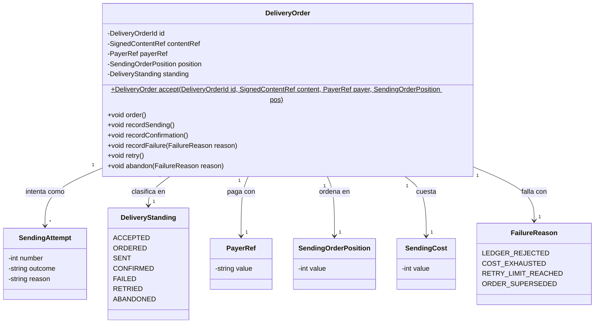
```mermaid
classDiagram
  class DeliveryOrder {
    -DeliveryOrderId id
    -SignedContentRef contentRef
    -PayerRef payerRef
    -SendingOrderPosition position
    -DeliveryStanding standing
    +DeliveryOrder accept(DeliveryOrderId id, SignedContentRef content, PayerRef payer, SendingOrderPosition pos)$
    +void order()
    +void recordSending()
    +void recordConfirmation()
    +void recordFailure(FailureReason reason)
    +void retry()
    +void abandon(FailureReason reason)
  }
  class SendingAttempt {
    -int number
    -string outcome
    -string reason
  }
  class PayerRef {
    -string value
  }
  class SendingOrderPosition {
    -int value
  }
  class SendingCost {
    -int value
  }
  class FailureReason {
    LEDGER_REJECTED
    COST_EXHAUSTED
    RETRY_LIMIT_REACHED
    ORDER_SUPERSEDED
  }
  class DeliveryStanding {
    ACCEPTED
    ORDERED
    SENT
    CONFIRMED
    FAILED
    RETRIED
    ABANDONED
  }
  DeliveryOrder "1" --> "*" SendingAttempt : intenta como
  DeliveryOrder "1" --> "1" DeliveryStanding : clasifica en
  DeliveryOrder "1" --> "1" PayerRef : paga con
  DeliveryOrder "1" --> "1" SendingOrderPosition : ordena en
  DeliveryOrder "1" --> "1" SendingCost : cuesta
  DeliveryOrder "1" --> "1" FailureReason : falla con
```
Fig. 5.4.6.1 – Clases Relay.
#### **5.4.6.2. Database Design Diagram.**
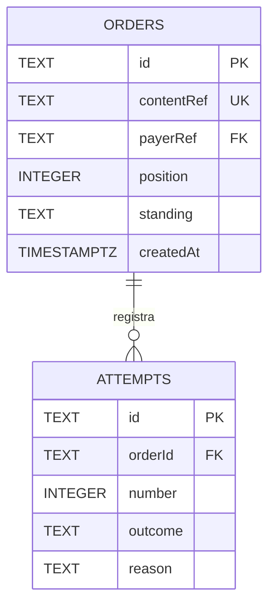
```mermaid
erDiagram
  ORDERS { TEXT id PK TEXT contentRef UK TEXT payerRef FK INTEGER position TEXT standing TIMESTAMPTZ createdAt }
  ATTEMPTS { TEXT id PK TEXT orderId FK INTEGER number TEXT outcome TEXT reason }
  ORDERS ||--o{ ATTEMPTS : registra
```
Fig. 5.4.6.2 – DB Relay.

## **5.5. IAM (Supporting).**
Responsabilidad: identidad técnica 1 por persona, sesión única, roles. Juzga, no ejecuta pruebas. Trazabilidad: US-04..07.
### **5.5.1. Domain Layer.**
#### Agregados
| Agregado | Atributos | Operaciones | Regla local |
|---|---|---|---|
| `User` | `id, personId UK, standing REGISTERED/ACTIVE/SUSPENDED, session CLOSED/OPEN, contactAddress+verified, systemRoles, proofs` | `signUp, signIn, signOut, changeSecret, changeEmail, verifyEmail, linkOutsideIdentity, unlinkOutsideIdentity, grantSystemRole, revokeSystemRole, suspend, restore, answerAccessStanding` | una sesión abierta máx (reemplazo); siempre una prueba y un `ADMIN`; `SUSPENDED` rechaza; nada de membresía/comunidad/biometría |
#### Objetos de valor
| VO | Contenido |
|---|---|
| `ContactAddress` | cambiarla reinicia verificación |
| `SystemRole` | `ADMIN` / `USER` |
| `ProofKind` | `LOCAL` / `OUTSIDE` |
| `OutsideProverRef` | un solo proveedor acordado enlazado |
#### Servicios y repositorios
| Elemento | Tipo | Operaciones |
|---|---|---|
| `UserCommandService` | comando | `signUp, signIn, signOut, changeSecret, changeEmail, verifyEmail, link, unlink, grant, revoke, suspend, restore` |
| `UserQueryService` | consulta | `answerStanding, getHistory, getRoles` |
| `UserRepository` | repo | `findById, findByPersonId, findByEmail, save` |
#### Invariantes
* una identidad por persona; quitar la última prueba o el último responsable se rechaza; dirección verificada o no, nunca incierta.
#### Hechos (`Event`)
* `UserSignedUpEvent`, `UserSignedInEvent`, `UserSignedOutEvent` (motivo `ASKED`/`SUPERSEDED`/`PROOF_CHANGED`/`SUSPENDED`), `SecretChangedEvent`, `EmailChangedEvent`, `EmailVerifiedEvent`, `OutsideIdentityLinkedEvent`, `OutsideIdentityUnlinkedEvent`, `SystemRoleGrantedEvent`, `SystemRoleRevokedEvent`, `AccessSuspendedEvent`, `AccessRestoredEvent`.
### **5.5.2. Interface Layer.**
| Método + ruta | 2xx | Errores |
|---|---|---|
| `POST /users/signup {contact}` | `201` | `409 existe, 422 contacto` |
| `POST /users/signin {proof}` | `200 sesión (reemplaza)` | `401 prueba, 403 suspendido` |
| `POST /users/signout` | `200` | `—` |
| `POST /users/{id}/secret|email|email/verify|outside|roles|suspend|restore` | `200` | `409 última-prueba/último-admin, 404` |
| `GET /users/{id}/standing|history` | `200` | `404` |
### **5.5.3. Application Layer.**
Comandos registro/acceso/secreto/dirección/enlace/roles/suspensión + consultas. Fallos repetidos (observados fuera) suspenden; cambio secreto/suspensión cierra sesión misma transición. Ante `ChallengeConfirmed` marca verificada vía fachada primitivas. Supuesto O8 documentado.
### **5.5.4. Infrastructure Layer.**
`users(personId UK, address UK, session columnas)` + `identity_history`. Puertos prueba/sesión con ejecutores externos; ACL Avisos; `ExistenceFacade(personExists)` primitivas, llamada BEFORE UoW.
### **5.5.5. Component Level Diagrams.**
<p align="center">
  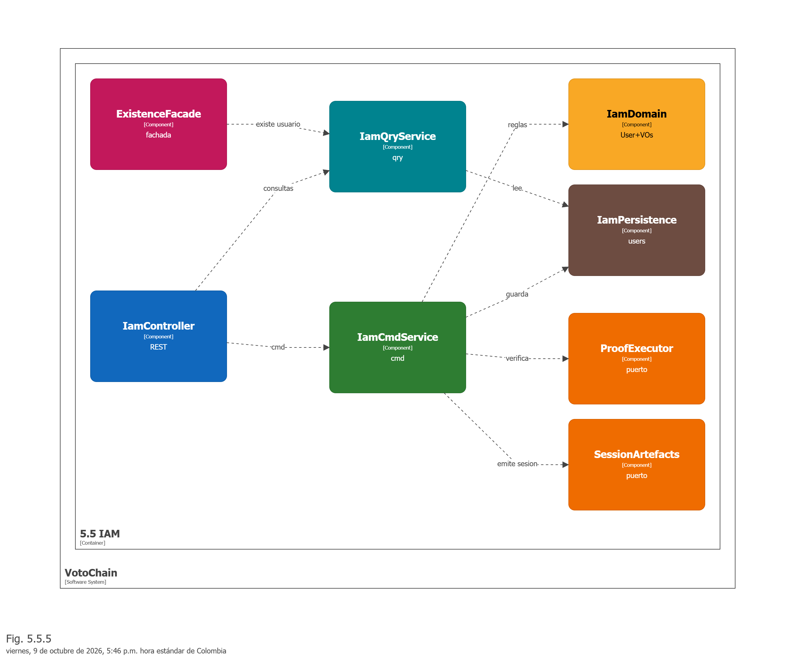
</p>
Fig. 5.5.5 – IAM, componentes.
### **5.5.6. Code Level Diagrams.**
#### **5.5.6.1. Domain Layer Class Diagrams.**
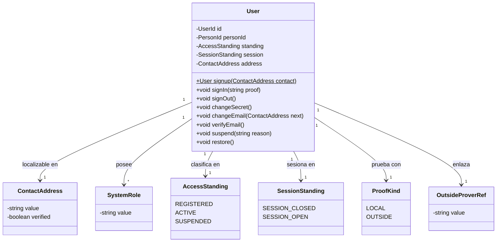
```mermaid
classDiagram
  class User {
    -UserId id
    -PersonId personId
    -AccessStanding standing
    -SessionStanding session
    -ContactAddress address
    +User signup(ContactAddress contact)$
    +void signIn(string proof)
    +void signOut()
    +void changeSecret()
    +void changeEmail(ContactAddress next)
    +void verifyEmail()
    +void suspend(string reason)
    +void restore()
  }
  class ContactAddress {
    -string value
    -boolean verified
  }
  class SystemRole {
    -string value
  }
  class ProofKind {
    LOCAL
    OUTSIDE
  }
  class OutsideProverRef {
    -string value
  }
  class AccessStanding {
    REGISTERED
    ACTIVE
    SUSPENDED
  }
  class SessionStanding {
    SESSION_CLOSED
    SESSION_OPEN
  }
  User "1" --> "1" ContactAddress : localizable en
  User "1" --> "*" SystemRole : posee
  User "1" --> "1" AccessStanding : clasifica en
  User "1" --> "1" SessionStanding : sesiona en
  User "1" --> "1" ProofKind : prueba con
  User "1" --> "1" OutsideProverRef : enlaza
```
Fig. 5.5.6.1 – Clases IAM.
#### **5.5.6.2. Database Design Diagram.**
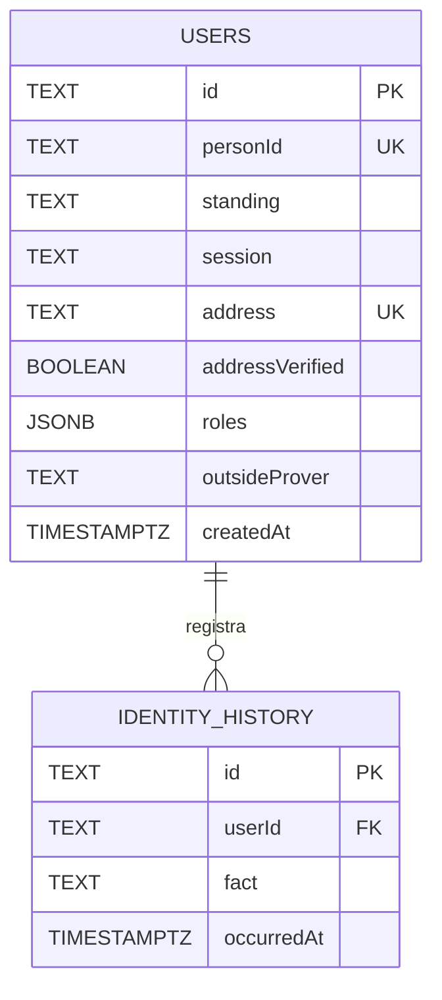
```mermaid
erDiagram
  USERS { TEXT id PK TEXT personId UK TEXT standing TEXT session TEXT address UK BOOLEAN addressVerified JSONB roles TEXT outsideProver TIMESTAMPTZ createdAt }
  IDENTITY_HISTORY { TEXT id PK TEXT userId FK TEXT fact TIMESTAMPTZ occurredAt }
  USERS ||--o{ IDENTITY_HISTORY : registra
```
Fig. 5.5.6.2 – DB IAM.

## **5.6. Community Management (Supporting).**
Responsabilidad: comunidad con configuración, regla y administradores; nunca contiene miembros. Trazabilidad: US-08..11.
### **5.6.1. Domain Layer.**
#### Agregados
| Agregado | Atributos | Operaciones | Regla local |
|---|---|---|---|
| `Community` | `id, standing, settings, votingPolicy, administrators[]` | `register, activate, updateSettings, definePolicy, appointAdmin, removeAdmin, suspend, reactivate, archive, answerStanding, answerPolicy` | `ACTIVE` exige policy + ≥1 admin; `ARCHIVED` terminal |
#### Objetos de valor
| VO | Contenido |
|---|---|
| `CommunitySettings` | nombre, domicilio, contacto |
| `VotingPolicy` | threshold, basis, majority |
| `QuorumConfig` | lo que Voting congela como `QuorumSnapshot` |
| `CommunityAdmin` | persona + momento |
#### Servicios y repositorios
| Elemento | Tipo | Operaciones |
|---|---|---|
| `CommunityCommandService` | comando | `register, activate, updateSettings, definePolicy, appointAdmin, removeAdmin, suspend, reactivate, archive` |
| `CommunityQueryService` | consulta | `answerStanding, answerPolicy` |
| `CommunityRepository` | repo | `findById, findByName, save` |
#### Invariantes
* `ARCHIVED` terminal; versiones de política reemplazan sin editar pasado; copias frozen fuera quedan intactas.
#### Hechos (`Event`)
* `CommunityRegisteredEvent`, `CommunityActivatedEvent`, `CommunitySettingsUpdatedEvent`, `VotingPolicyDefinedEvent`, `CommunityAdminAppointedEvent`, `CommunityAdminRemovedEvent`, `CommunitySuspendedEvent`, `CommunityReactivatedEvent`, `CommunityArchivedEvent`.
### **5.6.2. Interface Layer.**
| Método + ruta | 2xx | Errores |
|---|---|---|
| `POST /communities {settings+admin}` | `201 REGISTERED` | `422 datos, 409 nombre` |
| `POST /communities/{id}/activate` | `200 ACTIVE` | `409 sin-policy/admin, 404` |
| `PUT /communities/{id} {settings}` | `200` | `410 archived, 404` |
| `POST /communities/{id}/policies {threshold/basis}` | `201 nueva vigente` | `422 incoherente, 404` |
| `POST|DELETE /communities/{id}/admins` | `200` | `409 dejar-sin-admin, 404` |
| `POST /communities/{id}/suspend|reactivate|archive` | `200` | `410 terminal, 404` |
| `GET /communities/{id}|policy|standing` | `200` | `404` |
### **5.6.3. Application Layer.**
Comandos verifican standing y guardan; `answerStanding/answerPolicy` coherentes; publica para padrón/votación.
### **5.6.4. Infrastructure Layer.**
`communities + admins + policies(versiones)`. Sin tabla miembros. ACL Avisos. Fachada `situación+política` primitivas.
### **5.6.5. Component Level Diagrams.**
<p align="center">
  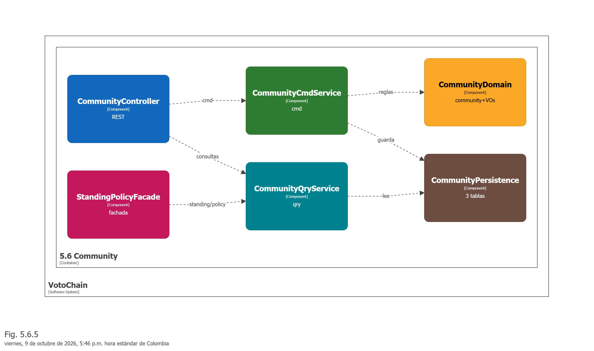
</p>
Fig. 5.6.5 – Community, componentes.
### **5.6.6. Code Level Diagrams.**
#### **5.6.6.1. Domain Layer Class Diagrams.**
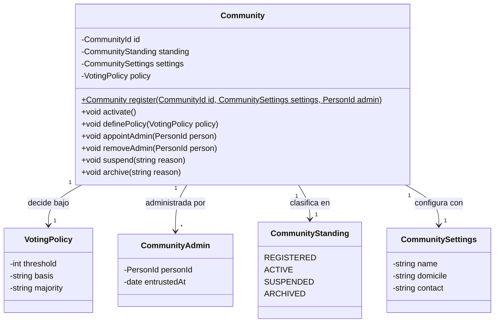
```mermaid
classDiagram
  class Community {
    -CommunityId id
    -CommunityStanding standing
    -CommunitySettings settings
    -VotingPolicy policy
    +Community register(CommunityId id, CommunitySettings settings, PersonId admin)$
    +void activate()
    +void definePolicy(VotingPolicy policy)
    +void appointAdmin(PersonId person)
    +void removeAdmin(PersonId person)
    +void suspend(string reason)
    +void archive(string reason)
  }
  class VotingPolicy {
    -int threshold
    -string basis
    -string majority
  }
  class CommunitySettings {
    -string name
    -string domicile
    -string contact
  }
  class CommunityAdmin {
    -PersonId personId
    -date entrustedAt
  }
  class CommunityStanding {
    REGISTERED
    ACTIVE
    SUSPENDED
    ARCHIVED
  }
  Community "1" --> "1" VotingPolicy : decide bajo
  Community "1" --> "*" CommunityAdmin : administrada por
  Community "1" --> "1" CommunityStanding : clasifica en
  Community "1" --> "1" CommunitySettings : configura con
```
Fig. 5.6.6.1 – Clases Community.
#### **5.6.6.2. Database Design Diagram.**
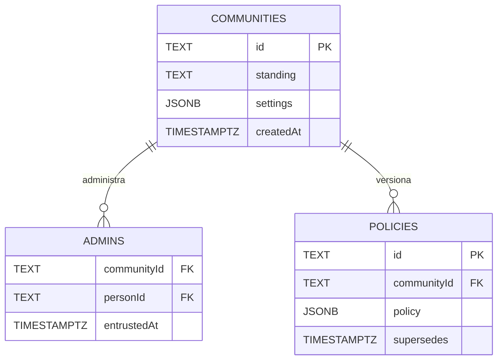
```mermaid
erDiagram
  COMMUNITIES { TEXT id PK TEXT standing JSONB settings TIMESTAMPTZ createdAt }
  ADMINS { TEXT communityId FK TEXT personId FK TIMESTAMPTZ entrustedAt }
  POLICIES { TEXT id PK TEXT communityId FK JSONB policy TIMESTAMPTZ supersedes }
  COMMUNITIES ||--o{ ADMINS : administra
  COMMUNITIES ||--o{ POLICIES : versiona
```
Fig. 5.6.6.2 – DB Community.

## **5.7. Membership (Supporting).**
Responsabilidad: par persona-comunidad con standing; padrón es pregunta, elegibilidad se congela. Trazabilidad: US-12..15.
### **5.7.1. Domain Layer.**
#### Agregados
| Agregado | Atributos | Operaciones | Regla local |
|---|---|---|---|
| `Membership` | `id, personId, communityId, standing REQUESTED/ACTIVE/DELINQUENT/SUSPENDED/TERMINATED terminal, communityRole, unit, lastEligibility` | `register, activate, assignUnit, assignRole, markDelinquent, clearDelinquency, suspend, reinstate, terminate, judgeEligibility` | atada al par, nunca transferible; máx una viva; solo `ACTIVE` integra el padrón; juicio congelado nunca se reescribe |
#### Objetos de valor
| VO | Contenido |
|---|---|
| `Unit` | predio; sigue a la persona por defecto |
| `CommunityRole` | `PRESIDENT`, `BOARD_MEMBER`, `OWNER`; solo con `ACTIVE` |
| `EligibilitySnapshot` | veredicto + motivo congelados al instante |
#### Servicios y repositorios
| Elemento | Tipo | Operaciones |
|---|---|---|
| `MembershipCommandService` | comando | `register, activate, assignUnit, assignRole, markDelinquent, clearDelinquency, suspend, reinstate, terminate` |
| `MembershipQueryService` | consulta | `judgeEligibility, getRoster` |
| `MembershipRepository` | repo | `getById, findLiveByPersonAndCommunity, findActiveByCommunity, findLiveByPerson, save` |
#### Invariantes
* `TERMINATED` terminal; el juicio congelado nunca se reescribe.
#### Hechos (`Event`)
* `MembershipRegisteredEvent`, `MembershipActivatedEvent`, `UnitAssignedEvent`, `CommunityRoleAssignedEvent`, `MemberMarkedDelinquentEvent`, `DelinquencyClearedEvent`, `MembershipSuspendedEvent`, `MembershipReinstatedEvent`, `MembershipTerminatedEvent`, `EligibilityJudgedEvent`.
### **5.7.2. Interface Layer.**
| Método + ruta | 2xx | Errores |
|---|---|---|
| `POST /memberships {person+community}` | `201 REQUESTED` | `409 viva existente, 422 cerrada, 404` |
| `POST /memberships/{id}/activate` | `200 ACTIVE` | `409 estado, 404` |
| `PUT /memberships/{id}/unit|role` | `200` | `410 terminada, 404` |
| `POST /memberships/{id}/delinquency|clear|suspend|reinstate|terminate` | `200` | `409 estado, 404` |
| `POST /memberships/eligibility {person+community}` | `200 snapshot` | `404` |
| `GET /memberships?community=ACTIVE|{id}` | `200` | `404` |
Supuesto O2/O6: morosidad y frescura documentados en app.
### **5.7.3. Application Layer.**
Verifica comunidad receptiva + libros para morosidad; puerta pide standing+policy sin cachear policy. UoW por comando.
### **5.7.4. Infrastructure Layer.**
`memberships` (viva única por par, índices comunidad/persona). ACLs existencia-persona, Comunidad (puerta), Avisos. Fachada `elegibilidad congelable`.
### **5.7.5. Component Level Diagrams.**
<p align="center">
  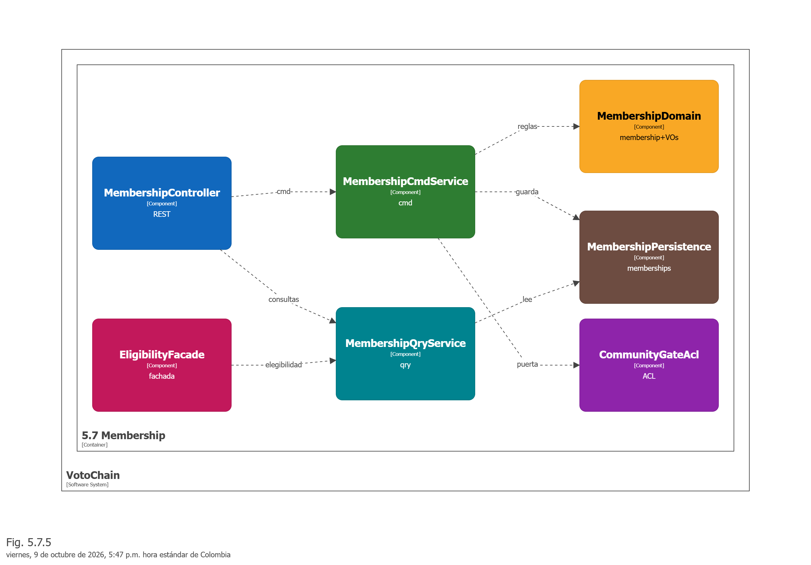
</p>
Fig. 5.7.5 – Membership, componentes.
### **5.7.6. Code Level Diagrams.**
#### **5.7.6.1. Domain Layer Class Diagrams.**
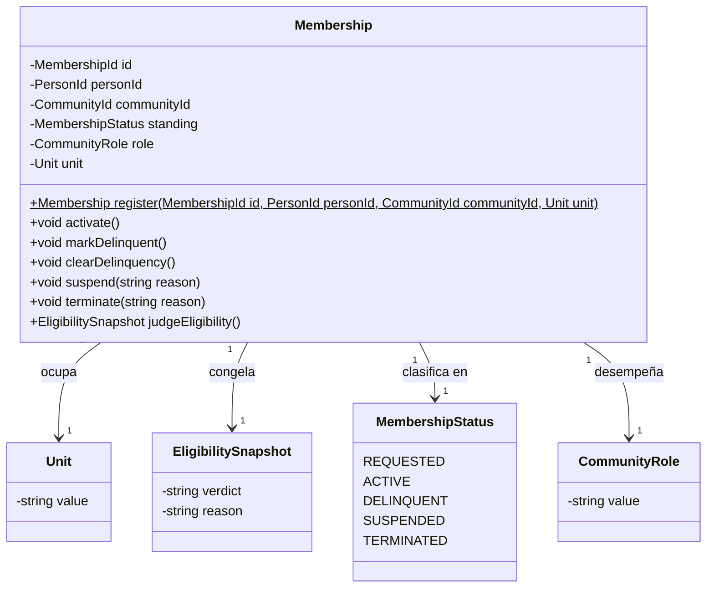
```mermaid
classDiagram
  class Membership {
    -MembershipId id
    -PersonId personId
    -CommunityId communityId
    -MembershipStatus standing
    -CommunityRole role
    -Unit unit
    +Membership register(MembershipId id, PersonId personId, CommunityId communityId, Unit unit)$
    +void activate()
    +void markDelinquent()
    +void clearDelinquency()
    +void suspend(string reason)
    +void terminate(string reason)
    +EligibilitySnapshot judgeEligibility()
  }
  class Unit {
    -string value
  }
  class CommunityRole {
    -string value
  }
  class EligibilitySnapshot {
    -string verdict
    -string reason
  }
  class MembershipStatus {
    REQUESTED
    ACTIVE
    DELINQUENT
    SUSPENDED
    TERMINATED
  }
  Membership "1" --> "1" Unit : ocupa
  Membership "1" --> "1" EligibilitySnapshot : congela
  Membership "1" --> "1" MembershipStatus : clasifica en
  Membership "1" --> "1" CommunityRole : desempeña
```
Fig. 5.7.6.1 – Clases Membership.
#### **5.7.6.2. Database Design Diagram.**
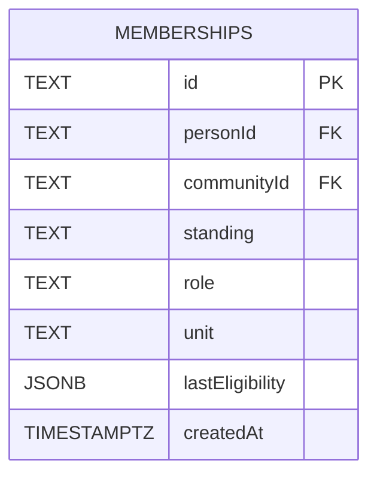
```mermaid
erDiagram
  MEMBERSHIPS { TEXT id PK TEXT personId FK TEXT communityId FK TEXT standing TEXT role TEXT unit JSONB lastEligibility TIMESTAMPTZ createdAt }
```
Fig. 5.7.6.2 – DB Membership.

## **5.8. Consent & Compliance (Supporting).**
Responsabilidad: permisos y coordinación de borrado (Ley 29733); nunca posee datos ajenos. Trazabilidad: US-16..18.
### **5.8.1. Domain Layer.**
`ConsentRecord(id, personId, scope, standing GRANTED/REVOKED, policyVersion): grant/revoke/answerState` (un otorgado por par, revoca detiene sin reescribir); `DataSubjectRequest(id, personId, standing REQUESTED/CONFIRMED/COORDINATED/AWAITING_CONFIRMATIONS/COMPLETED, confirmations): submit/confirm/coordinateRevocation/recordConfirmation/complete` (cierra solo con todas); `RetentionPolicy(id, category, terms): define/answerTerms` (reemplaza). VOs: `ConsentScope(un alcance, nunca general), PolicyVersion, DataCategory, RetentionTerms, RevocationConfirmations`. Hechos: `ConsentGranted/Revoked, RetentionPolicyDefined, ErasureRequested/Confirmed, RevocationCoordinated/Confirmed (por propietario), ErasureCompletedEvent`. Repos: 3 + confirmaciones.
### **5.8.2. Interface Layer.**
| Método + ruta | 2xx | Errores |
|---|---|---|
| `POST /consents {person+scope+version}` | `201` | `409 vivo, 422 alcance` |
| `POST /consents/{id}/revoke` | `200` | `404, 409` |
| `GET /consents?person=&scope=` | `200 otorgado+versión+fecha` | `—` |
| `POST /erasures {person}` | `201 REQUESTED` | `409 abierta, 404` |
| `POST /erasures/{id}/confirm` | `200 COORDINATED` | `404` |
| `GET /erasures/{id}` | `200 + quién confirmó/falta` | `404` |
| `POST /retentions {category+terms}` | `201` | `422` |
Puertas `may-process-now/may-contact-now` para otros BC.
### **5.8.3. Application Layer.**
Otorga/revoca/define con reemplazo; pedido sin duplicar abierto; coordina un hecho por propietario; cierra con todas. Supuesto O5 (in-flight vs ledger inmutable) documentado.
### **5.8.4. Infrastructure Layer.**
`consents(otorgado único por par) + requests(una abierta por persona) + confirmations + policies(vigente por categoría)`. Bus coordinación con lenguaje publicado. ACL Avisos.
### **5.8.5. Component Level Diagrams.**
<p align="center">
  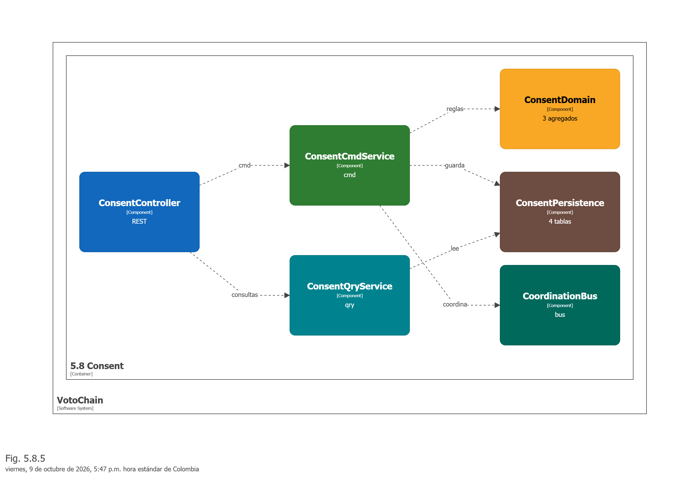
</p>
Fig. 5.8.5 – Consent, componentes.
### **5.8.6. Code Level Diagrams.**
#### **5.8.6.1. Domain Layer Class Diagrams.**
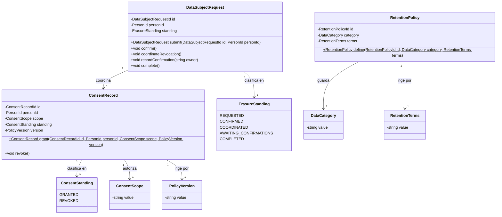
```mermaid
classDiagram
  class ConsentRecord {
    -ConsentRecordId id
    -PersonId personId
    -ConsentScope scope
    -ConsentStanding standing
    -PolicyVersion version
    +ConsentRecord grant(ConsentRecordId id, PersonId personId, ConsentScope scope, PolicyVersion version)$
    +void revoke()
  }
  class DataSubjectRequest {
    -DataSubjectRequestId id
    -PersonId personId
    -ErasureStanding standing
    +DataSubjectRequest submit(DataSubjectRequestId id, PersonId personId)$
    +void confirm()
    +void coordinateRevocation()
    +void recordConfirmation(string owner)
    +void complete()
  }
  class RetentionPolicy {
    -RetentionPolicyId id
    -DataCategory category
    -RetentionTerms terms
    +RetentionPolicy define(RetentionPolicyId id, DataCategory category, RetentionTerms terms)$
  }
  class ConsentScope {
    -string value
  }
  class PolicyVersion {
    -string value
  }
  class DataCategory {
    -string value
  }
  class RetentionTerms {
    -string value
  }
  class ConsentStanding {
    GRANTED
    REVOKED
  }
  class ErasureStanding {
    REQUESTED
    CONFIRMED
    COORDINATED
    AWAITING_CONFIRMATIONS
    COMPLETED
  }
  DataSubjectRequest "1" --> "*" ConsentRecord : coordina
  ConsentRecord "1" --> "1" ConsentStanding : clasifica en
  ConsentRecord "1" --> "1" ConsentScope : autoriza
  ConsentRecord "1" --> "1" PolicyVersion : rige por
  DataSubjectRequest "1" --> "1" ErasureStanding : clasifica en
  RetentionPolicy "1" --> "1" DataCategory : guarda
  RetentionPolicy "1" --> "1" RetentionTerms : rige por
```
Fig. 5.8.6.1 – Clases Consent.
#### **5.8.6.2. Database Design Diagram.**
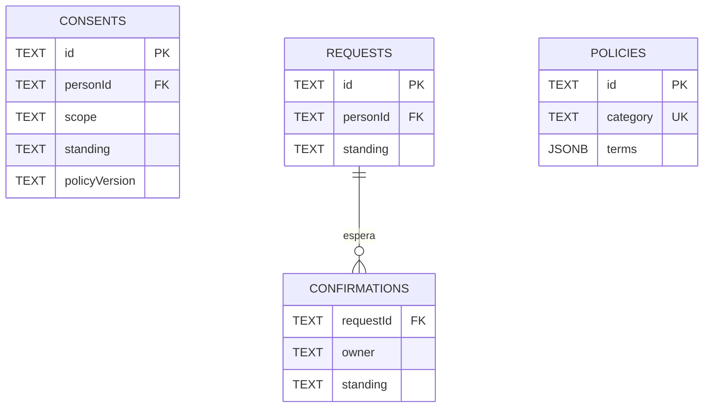
```mermaid
erDiagram
  CONSENTS { TEXT id PK TEXT personId FK TEXT scope TEXT standing TEXT policyVersion }
  REQUESTS { TEXT id PK TEXT personId FK TEXT standing }
  CONFIRMATIONS { TEXT requestId FK TEXT owner TEXT standing }
  POLICIES { TEXT id PK TEXT category UK JSONB terms }
  REQUESTS ||--o{ CONFIRMATIONS : espera
```
Fig. 5.8.6.2 – DB Consent.

## **5.9. Document OCR & Face Match Provider (Generic).**
Responsabilidad: examen único documental (MATCH/NO_MATCH/UNREADABLE), single-use hacia Biometric. Trazabilidad: US-19.
### **5.9.1. Domain Layer.**
`DocumentExamination(id, personId, documentRef, standing OPEN/CONCLUDED/EXPIRED, window): request/recordExtraction/recordComparison/recordVerdict/expire` (un abierto por par, concluido single-use, vencido nunca responde, evidencia muere con examen). VOs: `Verdict(3 cerrados), UnreadableReason(5: borroso/brillo/recortado/vencido/tipo), ValidityWindow`. Hechos: `ExaminationRequested/Refused, DocumentExtracted, FacesCompared, ExaminationConcluded/Expired, ReexaminationRequestedEvent`. Repo: `ExaminationRepository(findOpenByPersonAndDocument/findById/findAllByPersonAndDocument/save)`.
### **5.9.2. Interface Layer.**
| Método + ruta | 2xx | Errores |
|---|---|---|
| `POST /examinations {person+doc}` | `201 OPEN` | `403 NoEligibleMembership, 409 abierto, 403 permiso` |
| `POST /examinations/{id}/extraction|comparison|verdict` | `200` | `410 ventana, 409 concluido, 404` |
| `GET /examinations/standing?person=&doc=` | `200 MATCH utilizable o no` | `—` |
### **5.9.3. Application Layer.**
Pide (pertenencia+permiso+sin abierto), registra vía ejecutores, concluye único, vence, reexamina como nuevo enlazado. Ningún hecho porta imágenes/puntajes. Parámetro: `EXAM_WINDOW`.
### **5.9.4. Infrastructure Layer.**
`examinations(abierto único por par) + history`; sin columnas imagen. Ejecutores lectura/comparación; ACL Avisos.
### **5.9.5. Component Level Diagrams.**
<p align="center">
  
</p>
Fig. 5.9.5 – OCR, componentes.
### **5.9.6. Code Level Diagrams.**
#### **5.9.6.1. Domain Layer Class Diagrams.**
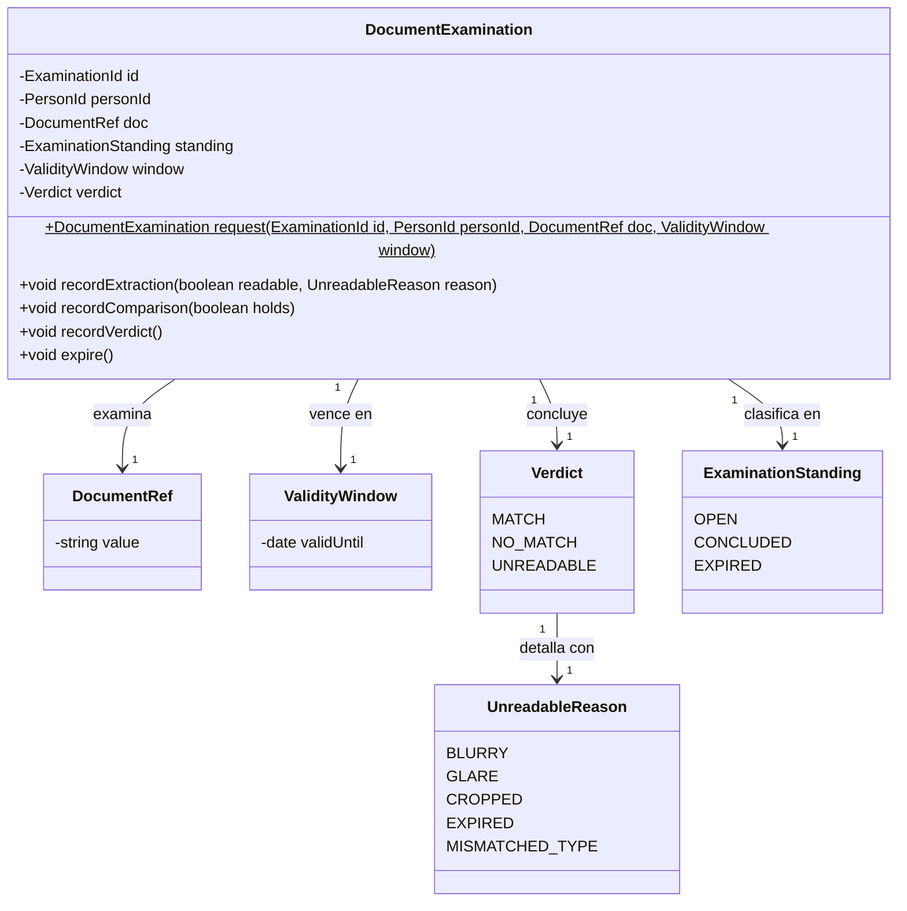
```mermaid
classDiagram
  class DocumentExamination {
    -ExaminationId id
    -PersonId personId
    -DocumentRef doc
    -ExaminationStanding standing
    -ValidityWindow window
    -Verdict verdict
    +DocumentExamination request(ExaminationId id, PersonId personId, DocumentRef doc, ValidityWindow window)$
    +void recordExtraction(boolean readable, UnreadableReason reason)
    +void recordComparison(boolean holds)
    +void recordVerdict()
    +void expire()
  }
  class DocumentRef {
    -string value
  }
  class ValidityWindow {
    -date validUntil
  }
  class Verdict {
    MATCH
    NO_MATCH
    UNREADABLE
  }
  class UnreadableReason {
    BLURRY
    GLARE
    CROPPED
    EXPIRED
    MISMATCHED_TYPE
  }
  class ExaminationStanding {
    OPEN
    CONCLUDED
    EXPIRED
  }
  DocumentExamination "1" --> "1" Verdict : concluye
  DocumentExamination "1" --> "1" ExaminationStanding : clasifica en
  DocumentExamination "1" --> "1" DocumentRef : examina
  DocumentExamination "1" --> "1" ValidityWindow : vence en
  Verdict "1" --> "1" UnreadableReason : detalla con
```
Fig. 5.9.6.1 – Clases OCR.
#### **5.9.6.2. Database Design Diagram.**
```mermaid
erDiagram
  EXAMINATIONS { TEXT id PK TEXT personId FK TEXT documentRef TEXT standing JSONB verdict TIMESTAMPTZ requestedAt TIMESTAMPTZ validUntil }
  EXAMINATION_HISTORY { TEXT id PK TEXT examinationId FK TEXT fact TIMESTAMPTZ occurredAt }
  EXAMINATIONS ||--o{ EXAMINATION_HISTORY : registra
```
Fig. 5.9.6.2 – DB OCR.

## **5.10. Verification (OTP) (Generic).**
Responsabilidad: posesión de canal por (persona,motivo), 3 propósitos cerrados. Trazabilidad: US-05/07.
### **5.10.1. Domain Layer.**
`VerificationChallenge(id, personId, purpose login/email-verification/password-reset cerrado, standing OPEN/CONFIRMED/INVALIDATED/EXPIRED, attempts, window): request/answer/expire` (un abierto por par, segundo reemplaza, confirmado nunca reconfirma, código nunca legible, solo ventana). VOs: `Purpose, AttemptCount(vs máx), ValidityWindow, InvalidationReason(ATTEMPTS_EXHAUSTED/SUPERSEDED)`. Hechos: `ChallengeRequested/Confirmed/AttemptFailed/Invalidated/ExpiredEvent` (ninguno porta código). Repo: `VerificationChallengeRepository(findOpenByPersonAndPurpose/findById/save)`.
### **5.10.2. Interface Layer.**
| Método + ruta | 2xx | Errores |
|---|---|---|
| `POST /challenges {person+purpose}` | `201 OPEN + instrucción envío (invalida anterior)` | `422 purpose, 403 contacto` |
| `POST /challenges/{id}/answers {code}` | `200 CONFIRMED o fallido con restantes` | `409 invalidado, 410 expired, 404` |
| `GET /challenges/standing?person=&purpose=` | `200 utilizable+restantes` | `—` |
### **5.10.3. Application Layer.**
Pide (motivo+permiso, cierra anterior, instruye envío), responde (cuenta, confirma/falla/invalida), vence. Ante `Confirmed` llama fachada IAM primitivas. Parámetros: ` _TTL,  _MAX_ATTEMPTS`.
### **5.10.4. Infrastructure Layer.**
`challenges(abierto único por par) + history(sin secretos)`. Ejecutores generación/comparación/envío; ACL Avisos vía Notifications (plantilla+dirección+motivo+clave).
### **5.10.5. Component Level Diagrams.**
<p align="center">
  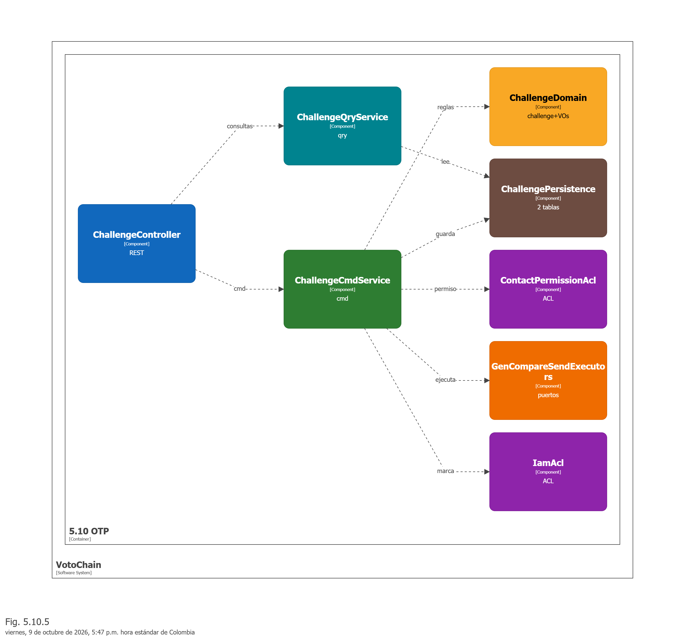
</p>
Fig. 5.10.5 – Verification (OTP), componentes.
### **5.10.6. Code Level Diagrams.**
#### **5.10.6.1. Domain Layer Class Diagrams.**
```mermaid
classDiagram
  class VerificationChallenge {
    -ChallengeId id
    -PersonId personId
    -Purpose purpose
    -ChallengeStanding standing
    -AttemptCount attempts
    -ValidityWindow window
    +VerificationChallenge request(ChallengeId id, PersonId personId, Purpose purpose, ValidityWindow window)$
    +void answer(boolean holds)
    +void expire()
  }
  class Purpose {
    LOGIN
    EMAIL_VERIFICATION
    PASSWORD_RESET
  }
  class AttemptCount {
    -int value
    -int max
  }
  class ValidityWindow {
    -date validUntil
  }
  class ChallengeStanding {
    OPEN
    CONFIRMED
    INVALIDATED
    EXPIRED
  }
  VerificationChallenge "1" --> "1" Purpose : para
  VerificationChallenge "1" --> "1" ChallengeStanding : clasifica en
  VerificationChallenge "1" --> "1" AttemptCount : intenta con
  VerificationChallenge "1" --> "1" ValidityWindow : vence en
```
Fig. 5.10.6.1 – Clases OTP.
#### **5.10.6.2. Database Design Diagram.**
```mermaid
erDiagram
  CHALLENGES { TEXT id PK TEXT personId FK TEXT purpose TEXT standing INTEGER attempts INTEGER maxAttempts TIMESTAMPTZ requestedAt TIMESTAMPTZ validUntil }
  CHALLENGE_HISTORY { TEXT id PK TEXT challengeId FK TEXT fact TIMESTAMPTZ occurredAt }
  CHALLENGES ||--o{ CHALLENGE_HISTORY : registra
```
Fig. 5.10.6.2 – DB OTP.

## **5.11. Notifications (Generic).**
Responsabilidad: intención de entrega email-only, idempotente. Trazabilidad: TS-03/US-26.
### **5.11.1. Domain Layer.**
`NotificationDispatch(id, idempotencyKey(misma nunca 2 veces), address, template resuelta, standing REQUESTED/REFUSED/CONFIRMED/FAILED, history): requestDelivery/confirmDelivered/recordDeliveryFailure/requestRetry` (una dirección+plantilla por despacho, historial solo crece, confirmado no reintenta, rechazado nunca envía). VOs: `DispatchId, IdempotencyKey(solicitante), DeliveryAddress, ResolvedTemplate(clave+marcadores), RefusalReason(DUPLICATE/CONTACT_NOT_ALLOWED), FailureReason`. Hechos: `DeliveryRequested/Refused/Confirmed/Failed/RetriedEvent`. Repo: `NotificationDispatchRepository(findByKey/findById/save)`.
### **5.11.2. Interface Layer.**
| Método + ruta | 2xx | Errores |
|---|---|---|
| `POST /dispatches {template+address+reason+key}` | `202 REQUESTED o rechazo registrado` | `409 DUPLICATE, 422 CONTACT_NOT_ALLOWED/template` |
| `POST /dispatches/{id}/confirm|fail|retry` | `200` | `409 terminal, 404` |
| `GET /dispatches?key=|{id}` | `200 situación+intentos` | `404` |
### **5.11.3. Application Layer.**
Recibe (resuelve plantilla, forma+permiso+clave fresca), instruye ejecutor, confirma/falla, reintenta anexando. API primitivas para todos los BC.
### **5.11.4. Infrastructure Layer.**
`dispatches(clave UK) + history`. Ejecutor correo tras puerto. Sin preferencias/dispositivos.
### **5.11.5. Component Level Diagrams.**
<p align="center">
  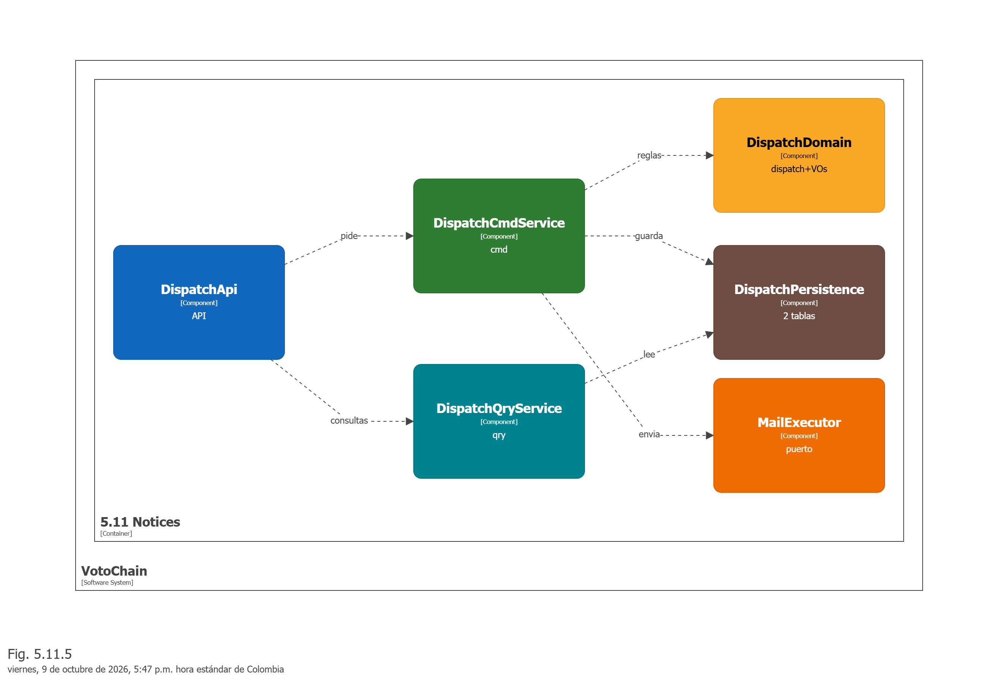
</p>
Fig. 5.11.5 – Notifications, componentes.
### **5.11.6. Code Level Diagrams.**
#### **5.11.6.1. Domain Layer Class Diagrams.**
```mermaid
classDiagram
  class NotificationDispatch {
    -DispatchId id
    -IdempotencyKey key
    -DeliveryAddress address
    -ResolvedTemplate template
    -DispatchStanding standing
    +NotificationDispatch requestDelivery(DispatchId id, IdempotencyKey key, DeliveryAddress address, ResolvedTemplate template)$
    +void confirmDelivered()
    +void recordDeliveryFailure(string reason)
    +void requestRetry()
  }
  class IdempotencyKey {
    -string value
  }
  class DeliveryAddress {
    -string value
  }
  class ResolvedTemplate {
    -string key
    -string body
  }
  class RefusalReason {
    DUPLICATE
    CONTACT_NOT_ALLOWED
  }
  class DispatchStanding {
    REQUESTED
    REFUSED
    CONFIRMED
    FAILED
  }
  NotificationDispatch "1" --> "1" IdempotencyKey : deduplica
  NotificationDispatch "1" --> "1" DispatchStanding : clasifica en
  NotificationDispatch "1" --> "1" DeliveryAddress : envía a
  NotificationDispatch "1" --> "1" ResolvedTemplate : redacta con
  NotificationDispatch "1" --> "1" RefusalReason : rechaza con
```
Fig. 5.11.6.1 – Clases Notifications.
#### **5.11.6.2. Database Design Diagram.**
```mermaid
erDiagram
  DISPATCHES { TEXT id PK TEXT idempotencyKey UK TEXT address JSONB template TEXT standing TIMESTAMPTZ createdAt }
  DISPATCH_HISTORY { TEXT id PK TEXT dispatchId FK TEXT fact TIMESTAMPTZ occurredAt }
  DISPATCHES ||--o{ DISPATCH_HISTORY : registra
```
Fig. 5.11.6.2 – DB Notifications.

# **Capítulo VI: Solution UX Design**

El diseño de experiencia de VotoChain sigue un enfoque de **diseño centrado en el usuario** y toma como referencia a los dos segmentos definidos en los Capítulos I y II: Patricia Salas, directiva o administradora de comunidad, y Miguel Herrera, propietario votante. La experiencia debe hacer comprensibles la verificación de identidad, la elegibilidad, el cuórum y la evidencia auditable, sin trasladar al usuario conceptos operativos como wallets, claves privadas, gas o RPC.

Este capítulo distingue deliberadamente entre lo **implementado** y lo **proyectado**. A la fecha de revisión, el repositorio de software contiene la API modular de identidad, verificación y gestión de comunidades; el frontend descrito en la arquitectura, la votación, la biometría, el ledger y las superficies públicas todavía forman parte del diseño y del roadmap. Por ello, las reglas siguientes son especificaciones objetivo que deberán validarse mediante prototipos, pruebas de usabilidad y auditorías de accesibilidad antes de declararse cumplidas.

---

## **6.1. Style Guidelines.**

Las directrices de estilo conforman la especificación inicial del **VotoChain Design System (VDS)**. Su propósito es centralizar tokens, tipografías, iconografía, componentes, patrones de interacción y criterios editoriales para la Landing Page y la aplicación web responsive prevista en Next.js. Los tokens se mantendrán independientes de una librería concreta; si durante la implementación se adoptan Tailwind CSS, Radix UI u otras herramientas, estas deberán mapearse al VDS y no convertirse por sí mismas en la fuente de verdad.

La meta de accesibilidad es **[WCAG 2.2 nivel AA](https://www.w3.org/TR/WCAG22/)**. “Accesible” no se utilizará como una garantía previa: el cumplimiento se verificará con revisión de contraste, navegación por teclado, lectores de pantalla, zoom al 200 %, reflow a 320 CSS px y pruebas con usuarios. Los assets definitivos —logotipo, íconos, archivos de fuentes y componentes— deberán versionarse junto con el frontend cuando este sea creado.

---

### **6.1.1. General Style Guidelines.**

#### **1. Principios de Diseño de VotoChain**

Las decisiones estéticas y funcionales del sistema de diseño se sustentan en cuatro principios rectores:

1. **Claridad Institucional y Confiabilidad Cívica**: Las interfaces deben transmitir seriedad, orden y formalidad cívica. Los usuarios toman decisiones patrimoniales y normativas que afectan a sus comunidades; por ello, se evitan decoraciones superfluas y gamificación.
2. **Transparencia Técnica sin Fricción**: El flujo principal no exige comprender gas, mempool, claves privadas o RPC. Cuando el ledger sea implementado, esos detalles permanecerán disponibles en una vista de auditoría, mientras la tarea principal utilizará estados y constancias legibles (D-22).
3. **Focalización Operativa y Mínima Carga Cognitiva**: Durante los flujos críticos (enrollment biométrico facial y emisión de voto), la interfaz aísla distracciones: presenta un único objetivo por pantalla, instrucciones paso a paso concisas y confirmaciones explícitas antes de cualquier acción irreversible.
4. **Accesibilidad e Inclusión**: El diseño considera adultos mayores y personas con distintos niveles de alfabetización digital. Se exige contraste suficiente, jerarquía tipográfica legible y áreas de toque amplias.

#### **2. Branding e Identidad Visual Propuesta**

El repositorio todavía no contiene un logotipo de VotoChain ni un manual de marca; por tanto, las reglas siguientes son una dirección de diseño que deberá materializarse y aprobarse antes de usarse como identidad oficial.

* **Isotipo**: El isotipo de VotoChain fusiona geométricamente dos símbolos: la silueta limpia de una **urna electoral moderna con una papeleta ingresando**, intersectada en su base por un **nodo hexagonal interconectado** que representa la inmutabilidad de la cadena de bloques.
* **Logotipo**: Se compone del isotipo acompañado de la palabra tipográfica **VotoChain**, donde "Voto" se presenta en peso semibold y "Chain" en peso medium con el color secundario cian, enfatizando la dualidad entre el acto democrático y la tecnología garante.
* **Área de Aislamiento y Reducción Mínima**: Se propone un margen de protección perimetral equivalente a la altura de la letra "V" del logotipo. El tamaño inicial a validar es de `120px` de ancho para la versión horizontal y `32x32px` para favicon o ícono web.

#### **3. Paleta Cromática (Color Palette)**

La paleta cromática se estructura en tokens semánticos. La implementación deberá alcanzar una relación de contraste mínima de **4.5:1** para texto normal y **3:1** para texto grande y componentes gráficos esenciales, conforme a WCAG 2.2 AA.

| Token de Color | Nombre Semántico | Valor HEX | Valor HSL | Restricción de Uso | Propósito y Aplicación en la Interfaz |
|---|---|---|---|:---:|---|
| `--color-brand-primary` | Azul Marino Institucional | `#1E3A8A` | `hsl(224, 64%, 33%)` | Admite texto blanco. | Color dominante de marca, navegación, acciones primarias y encabezados. |
| `--color-brand-secondary` | Azul Celeste Tecnológico | `#0284C7` | `hsl(199, 89%, 40%)` | No usar con texto blanco pequeño sin validar contraste. | Enlaces, foco, bordes de selección y acentos tecnológicos. |
| `--color-accent-success` | Verde Esmeralda Verificado | `#059669` | `hsl(160, 84%, 39%)` | Usar con texto oscuro o una variante más oscura para texto blanco. | Estados positivos; siempre acompañado por texto o ícono, nunca sólo por color. |
| `--color-accent-warning` | Ámbar de Atención Cívica | `#D97706` | `hsl(38, 92%, 50%)` | Usar con texto oscuro. | Alertas preventivas y estados que requieren atención. |
| `--color-accent-danger` | Rojo Carmesí Alerta | `#DC2626` | `hsl(0, 72%, 51%)` | Validar contraste según tamaño y peso del texto. | Errores, bloqueos y acciones destructivas; siempre acompañado por texto o ícono. |
| `--color-surface-base` | Blanco Nieve / Fondo Claro | `#F8FAFC` | `hsl(210, 40%, 98%)` | Base | Fondo general del lienzo en la aplicación web responsive (escritorio y smartphones) para evitar la fatiga visual del blanco puro (`#FFFFFF`). |
| `--color-surface-card` | Blanco Puro / Superficie | `#FFFFFF` | `hsl(0, 0%, 100%)` | Base | Superficies elevadas: tarjetas de propuestas, modales, menús flotantes y contenedores de opciones de votación. |
| `--color-surface-dark` | Azul Medianoche (Dark Mode) | `#0B1120` | `hsl(222, 47%, 8%)` | Base | Fondo general para la modalidad oscura de alta fidelidad, orientada a votaciones en asambleas nocturnas. |
| `--color-card-dark` | Pizarra Azulada (Dark Mode) | `#1E293B` | `hsl(215, 28%, 17%)` | Base | Superficies elevadas de tarjetas y paneles en modo oscuro. |
| `--color-text-primary` | Gris Carbón Profundo | `#0F172A` | `hsl(222, 47%, 11%)` | Validar sobre cada superficie. | Títulos, cuerpo de texto principal, opciones de votación y etiquetas de formularios. |
| `--color-text-secondary` | Gris Pizarra Medio | `#475569` | `hsl(215, 25%, 35%)` | Validar sobre cada superficie. | Metadatos secundarios, fechas de asamblea, descripciones de opciones y pies de página. |
| `--color-border-subtle` | Gris Borde Neutral | `#E2E8F0` | `hsl(214, 32%, 91%)` | Sólo decorativo; no usar como único límite de un control. | Divisores y bordes no esenciales de superficies. |

Los valores se consideran candidatos y deberán comprobarse sobre cada fondo con una herramienta de contraste. Para texto normal se exige al menos `4.5:1`; para texto grande y componentes gráficos esenciales, `3:1`. Los estados no dependerán exclusivamente del color.

#### **4. Tipografía (Typography System)**

La jerarquía tipográfica propuesta combina fuentes de alta legibilidad. Como los archivos aún no están versionados, el frontend deberá autohospedarlos —si sus licencias lo permiten— y definir fallbacks para evitar saltos de layout o dependencia innecesaria de terceros:

* **Tipografía de Títulos y Display (`Outfit`)**: Fuente geométrica con terminaciones limpias y curvas balanceadas. Se utiliza en titulares de la Landing Page, encabezados de sección y números de cuórum, aportando una presencia contemporánea, cívica y amigable.
* **Tipografía de Texto y Controles UI (`Inter`)**: Familia tipográfica diseñada específicamente para interfaces digitales por Rasmus Andersson. Ofrece excelente definición de caracteres a tamaños reducidos en pantallas de smartphones de gama media/baja, minimizando la ambigüedad en caracteres similares (como `1`, `l` e `I`).
* **Tipografía Monoespaciada de Auditoría (`JetBrains Mono`)**: Empleada de forma focalizada para códigos  , identificadores de transacción blockchain, llaves públicas truncadas y referencias de recibos de votación (`rec-...`), garantizando que cada dígito mantenga un ancho constante para cotejo visual inmediato.

| Nivel Jerárquico | Familia Tipográfica | Tamaño (px / rem) | Line Height | Peso (Weight) | Uso Principal en Interfaz |
|---|---|:---:|:---:|:---:|---|
| **Display (Hero)** | Outfit | `40px` / `2.50rem` | `1.20` | Bold (700) | Titulares principales de la Landing Page y cabeceras de bienvenida. |
| **Heading 1 (H1)** | Outfit | `32px` / `2.00rem` | `1.25` | Bold (700) | Títulos de pantallas principales: "Asamblea General Ordinaria", "Propuestas Activas". |
| **Heading 2 (H2)** | Outfit | `24px` / `1.50rem` | `1.30` | SemiBold (600) | Título de propuestas de votación, nombres de comunidades y tarjetas destacadas. |
| **Heading 3 (H3)** | Outfit | `20px` / `1.25rem` | `1.35` | SemiBold (600) | Subtítulos de módulos, encabezados de modales y resúmenes de cuórum. |
| **Subtitle / Lead** | Inter | `18px` / `1.125rem` | `1.50` | Medium (500) | Introducción a propuestas complejas, subtítulos explicativos de asamblea. |
| **Body Regular** | Inter | `16px` / `1.00rem` | `1.50` | Regular (400) | Párrafos informativos, textos de opciones de votación y reglamentos internos. |
| **Body Bold / Button** | Inter | `16px` / `1.00rem` | `1.25` | SemiBold (600) | Botones de acción principal ("Emitir Voto", "Confirmar"), etiquetas activas. |
| **Caption / Small** | Inter | `14px` / `0.875rem` | `1.40` | Regular (400) | Textos de ayuda en formularios, timestamps de votación, estado de elegibilidad. |
| **Badge / Micro** | Inter | `12px` / `0.75rem` | `1.20` | SemiBold (600) | Badges de estado (`ABIERTA`, `VERIFICADO`, `CONFIRMADO`), chips de departamento. |
| **Code / Audit Hash** | JetBrains Mono | `13px` / `0.8125rem` | `1.40` | Medium (500) | Hashes de bloques Polygon, firmas EIP-712 truncadas, códigos de constancia. |

#### **5. Espaciado, Retícula y Elevación (Spacing & Elevation)**

* **Sistema de Espaciado Modular (8-Point Grid)**: Todo espaciado de margen, padding, gaps y alturas de fila sigue múltiplos de 8px (con un valor medio de 4px para microajustes de badges e íconos):
  * `4px` (`space-1`): Separación entre ícono y texto en botones compactos.
  * `8px` (`space-2`): Padding interno de badges, inputs pequeños y separación de listas densas.
  * `16px` (`space-4`): Padding estándar de tarjetas en smartphones, inputs de formulario y espaciado entre párrafos.
  * `24px` (`space-6`): Padding de tarjetas en escritorio, separación entre bloques de opciones de votación.
  * `32px` (`space-8`): Margen vertical entre secciones secundarias y cabeceras de módulo.
  * `48px` (`space-12`): Separación entre bloques estructurales de contenido en paneles de control.
  * `64px` (`space-16`): Espaciado de sección mayor en la Landing Page.
* **Radios de Borde (`border-radius`)**:
  * `6px` (`rounded-md`): Inputs de formulario, selectores y badges.
  * `10px` (`rounded-lg`): Botones de acción, tarjetas secundarias y bloques de opción.
  * `16px` (`rounded-2xl`): Modales de diálogo, tarjetas contenedoras principales y banners de alerta.
* **Elevación y Sombras (Elevation Tokens)**:
  * `shadow-sm` (`0 1px 2px rgba(0,0,0,0.05)`): Tarjetas en reposo y contenedores de formulario.
  * `shadow-md` (`0 4px 6px -1px rgba(0,0,0,0.1)`): Tarjetas interactivas en estado hover, cabecera sticky de navegación.
  * `shadow-lg` (`0 10px 15px -3px rgba(0,0,0,0.1)`): Modales emergentes de confirmación de voto y drawers de verificación.

#### **6. Tono de Comunicación y Lenguaje Aplicado**

El lenguaje de VotoChain refleja la seriedad y trascendencia de los acuerdos de copropiedad y cooperativas, posicionando a la plataforma como un árbitro tecnológico imparcial y confiable. Siguiendo la metodología de dimensiones de tono de voz, se adoptan las siguientes decisiones:

```mermaid
quadrantChart
    title Matriz de Dimensiones del Tono de Comunicación en VotoChain
    x-axis "Casual / Informal" --> "Formal Institucional"
    y-axis "Divertido / Gamificado" --> "Serio y Confiable"
    quadrant-1 "VotoChain (Serio + Formal Institucional)"
    quadrant-2 "Inadecuado para Asambleas Legales"
    quadrant-3 "Inadecuado (Riesgo de Percepción de Fraude)"
    quadrant-4 "Comercial / B2C Ligero"
    "VotoChain Platform": [0.75, 0.85]
```

1. **Serio, sin resultar intimidante**: Se evitan la gamificación, el confeti y los mensajes festivos en decisiones patrimoniales. El tono debe transmitir sobriedad, precisión y calma.
2. **Formal, pero en lenguaje claro**: Se mantiene un trato institucional y respetuoso sin recurrir a barroquismos notariales. Las preguntas y opciones se redactan de manera directa y sin ambigüedad.
3. **Respetuoso y transparente**: Nunca se presume el consentimiento ni se oculta el propósito de una captura. Se explica qué dato se solicita, para qué se usa y qué puede hacer el titular.
4. **Sereno y verificable**: Las confirmaciones describen el estado real. “Voto recibido” corresponde a la intención aceptada; “Voto confirmado” se reserva para la confirmación on-chain. No se promete éxito antes de que exista el hecho técnico correspondiente.

| Dimensión | Enfoque de VotoChain | Ejemplo Aceptado en Interfaz | Ejemplo Rechazado |
|---|---|---|---|
| **Verificación Biométrica** | Transparente, clínico y guiado | *"Ubique su rostro dentro del marco ovalado y parpadee lentamente. La imagen se procesará de forma transitoria para verificar su presencia y no será almacenada."* | *"¡Hazte un selfie genial para que sepamos quién eres y puedas entrar a la fiesta de la votación!"* |
| **Emisión del Voto** | Seguro, consciente y confirmable | *"Ha seleccionado: 'Aprobación del Presupuesto Anual 2026'. Al confirmar, se consumirá su autorización única y comenzará el registro del voto. ¿Desea continuar?"* | *"¡Listo! Dale clic aquí para mandar tu voto a la nube mágica de blockchain."* |
| **Fallo de Identidad** | Diagnóstico técnico sereno y útil | *"No fue posible verificar la coincidencia facial con el documento presentado. Por favor, asegúrese de contar con buena iluminación y retire lentes o accesorios."* | *"¡Ups! No te reconocimos. Algo salió mal en el escaneo facial. Prueba otra vez."* |
| **Comprobante de Voto** | Precisión formal y estado verificable | *"Voto recibido. Estamos confirmando su registro. Puede consultar el estado con el código de constancia rec-8831."* | *"¡Genial! Tu voto ya está minado en el bloque cripto de Polygon. ¡Eres parte de la web3!"* |

---

### **6.1.2. Web, Mobile & Devices Style Guidelines.**

#### **1. Delimitación de Alcance y Sistema Adaptativo Multidispositivo**

La arquitectura de VotoChain aprobada en el Capítulo IV define exclusivamente una **Landing Page estática** y una **única Aplicación Web responsive desarrollada en Next.js**; no contempla el desarrollo de aplicaciones móviles nativas (Android/iOS) ni su publicación en tiendas de aplicaciones. En concordancia con esta arquitectura, las directrices para dispositivos móviles de esta sección establecen los estándares de **Diseño Web Adaptativo (Responsive Web Design - RWD)** para que los copropietarios y votantes puedan interactuar de manera óptima desde el navegador web de sus smartphones sin instalar software adicional.

La interfaz web atiende dos experiencias ergonómicas principales: gestión administrativa en pantallas amplias de escritorio y emisión de voto/verificación facial desde pantallas táctiles de smartphones.

| Dispositivo Objetivo | Rango de Viewport | Columnas | Márgenes | Gutter | Casos de Uso Predominantes en VotoChain |
|---|:---:|:---:|:---:|:---:|---|
| **Smartphones / Vista Móvil (Compact)** | `320px` – `639px` | 4 | `16px` | `12px` | **Flujo del Votante (Miguel Herrera)**: Navegación web táctil para enrollment biométrico, lectura de propuestas, selección, confirmación y consulta de constancia. |
| **Tablets (Medium)** | `640px` – `1023px` | 8 | `24px` | `16px` | **Mesa de Apoyo en Asamblea Presencial**: Consulta del padrón electoral en recepción, asistencia a miembros en el registro y visualización en tiempo real de resultados preliminares. |
| **Desktop / Laptop (Expanded)** | `1024px` – `1440px+` | 12 | `32px` | `24px` | **Dashboard Administrativo (Patricia Salas)**: Configuración de la comunidad, carga y regularización del padrón de miembros, apertura/cierre de propuestas, monitoreo de cuórum en vivo y exportación de actas oficiales. |

#### **2. Estándares Visuales e Interacción para Pantallas de Escritorio (Portal Administrativo)**

* **Arquitectura de Layout (Sidebar Persistente)**: Panel lateral de navegación con ancho fijo de `260px` en escritorio, colapsable a modo icono (`72px`) para maximizar el área de trabajo de tablas densas. En pantallas de tabletas y móviles, el menú se repliega automáticamente en un cajón flotante (*Drawer accesible*).
* **Tablas de Datos Densas para el Padrón Electoral**:
  * Encabezados fijos (*Sticky Table Header*) con ordenamiento alfanumérico por columna (departamento/lote, apellidos, estado de pago).
  * Fila de resumen de elegibilidad superior que totaliza miembros habilitados para cuórum.
  * Paginación limpia de 10, 25 o 50 registros, con barra de búsqueda global y selector de filtros facetados.
  * En pantallas de menos de `768px`, las tablas se transforman automáticamente en **tarjetas de datos apiladas (Card View)** para evitar el desplazamiento horizontal incómodo.
* **Monitoreo de Cuórum en Vivo**: Indicadores visuales destacados compuestos por:
  * Barra de progreso horizontal con marcador del umbral configurado y congelado (`QuorumSnapshot`).
  * Desglose porcentual y numérico en tiempo real (ej. `68.5% alcanzado / 60.0% requerido`).
  * Gráficos accesibles tipo dona con etiquetas de valor en texto plano para asegurar lectura en navegadores que deshabilitan scripts pesados.
* **Confirmación de Acciones Críticas**: Apertura de propuestas, cierre de convocatoria y publicación de resultados emplean diálogos accesibles con foco contenido, resumen del efecto y confirmación explícita. No se exige una segunda interacción mecánica si no reduce un riesgo concreto.

#### **3. Estándares Visuales e Interacción Responsive para Smartphones (Portal del Votante)**

* **Optimización de la Zona del Pulgar (*Thumb Zone Navigation*)**:
  * Los botones primarios de acción web ("Continuar", "Confirmar Elección", "Emitir Voto") se ubican en una **barra inferior persistente (Sticky Bottom Bar)** de `72px` de altura, anclada en la parte inferior de la ventana del navegador móvil para permitir la operación con una sola mano sin forzar el agarre del teléfono.
* **Áreas Táctiles Mínimas (*Touch Targets*)**:
  * Cualquier elemento interactivo en la vista móvil (botones, selectores de voto, enlaces y controles de cámara) posee una dimensión táctil mínima de **`48x48px`**, con un espaciado perimetral mínimo de `8px` para evitar pulsaciones erróneas involuntarias.
* **Módulo Web de Captura y Liveness Biométrico**:
  * Viewport de cámara web (`navigator.mediaDevices.getUserMedia`) con guía ovalada semitransparente que orienta la colocación del rostro en pantalla completa.
  * Indicador dinámico de iluminación: el borde del óvalo cambia de color (Gris neutral = buscando rostro; Ámbar = poca luz; Verde esmeralda = iluminación adecuada y rostro alineado).
  * Instrucciones directas en la parte inferior: "Mire a la cámara", "Parpadee lentamente", "Procesando prueba de presencia".
  * Animación de escaneo mediante un barrido vertical suave no invasivo que indica actividad sin generar destellos o parpadeos molestos.
* **Componente de Papeleta Digital (*Radio Card Component*)**:
  * En lugar de radio buttons diminutos convencionales, las opciones de voto se presentan en **tarjetas táctiles completas (Radio Cards)** de altura mínima de `56px`.
  * La tarjeta no seleccionada presenta fondo blanco con borde sutil `#E2E8F0`; al ser seleccionada, adopta un borde azul marino de `2px`, un fondo azul tenue (`#EFF6FF`) y un ícono de check visible a la derecha, eliminando cualquier duda sobre la opción marcada antes de presionar el botón de confirmación.
* **Constancia de Voto en Pantalla de Smartphone**:
  * Tarjeta sobria con código de constancia, propuesta, fecha/hora con zona horaria y estado (`Recibido`, `En confirmación`, `Confirmado` o `No confirmado`).
  * El código QR es opcional y sólo enlaza al verificador cuando exista una URL pública estable. La vista pública no expone DNI, correo, identidad del votante ni opción elegida.
  * El hash y el bloque se muestran únicamente tras la confirmación on-chain. La descarga PDF deberá conservar la misma minimización de datos.

#### **4. Accesibilidad e Inclusión (Objetivo WCAG 2.2 AA)**

* **Navegación por Teclado y Foco Visible**: Todos los elementos interactivos deberán ser operables con teclado y mostrar un indicador de foco de al menos `2px`, con contraste suficiente respecto del estado sin foco.
* **Semántica y Atributos ARIA**:
  * Formularios con etiquetas explícitas `<label for="...">` asociadas unívocamente con sus inputs.
  * Las métricas dinámicas de cuórum se implementarán con `aria-live="polite"`, permitiendo que los lectores de pantalla anuncien cambios relevantes sin interrumpir la lectura activa.
  * Estados de error marcados con `aria-invalid="true"` y mensajes vinculados mediante `aria-describedby`.
* **Movimiento y tiempo**: Se respeta `prefers-reduced-motion`; ninguna animación es indispensable para comprender un estado. Los vencimientos muestran tiempo restante y ofrecen reintento claro.
* **Conectividad y permisos**: La denegación de cámara, una conexión inestable o un error del proveedor se explican sin culpar al usuario y ofrecen recuperación. La alternativa de soporte no debe omitir las reglas de identidad y consentimiento.

---

## **6.2. Information Architecture.**

La arquitectura de información (IA) organiza la futura Landing Page y la aplicación web responsive de VotoChain. Su unidad principal es la **comunidad**; dentro de ella se ubican miembros, política de votación, asambleas, propuestas, votos y constancias. Esta jerarquía refleja el lenguaje ubicuo del Capítulo II y evita mezclar conceptos distintos como usuario de IAM, miembro de una comunidad y administrador comunitario.

La IA descrita es objetivo de diseño. En el backend actual sólo existen superficies REST para IAM, desafíos   y gestión de comunidades; los módulos de membresía, votación, biometría, auditoría pública y sus interfaces permanecen planificados. Cada pantalla futura deberá mantener trazabilidad con esos contratos y no inventar estados que contradigan el dominio.

---

### **6.2.1. Organization Systems.**

Los sistemas de organización de VotoChain definen cómo se agrupan, estructuran y jerarquizan los contenidos para permitir una navegación intuitiva y coherente en las diferentes etapas del ciclo de vida del producto.

#### **1. Estructuras de Organización Visual del Contenido**

Para presentar los conjuntos de información se adoptarán tres tipos de organización visual según el objetivo de la tarea:

```mermaid
graph TD
    subgraph "1. Organización Jerárquica"
        A[Dashboard Comunidad] --> B[Asamblea Activa]
        B --> C[Propuesta en Curso]
        C --> D[Métricas de Cuórum]
        C --> E[Opciones de Votación]
    end

    subgraph "2. Organización Secuencial (Paso a Paso)"
        F[1. Consentimiento] --> G[2. Captura DNI]
        G --> H[3. Liveness Facial]
        H --> I[4. Emisión de Voto]
        I --> J[5. Constancia Generada]
    end

    subgraph "3. Organización Matricial"
        K[Padrón Electoral] --- L[Unidad Inmobiliaria]
        K --- M[Estado de Pago]
        K --- N[Estado de Emisión]
    end
```

1. **Organización Jerárquica (Visual Hierarchy)**:
   * **Landing Page**: Estructura de pirámide invertida que guía desde la propuesta de valor hacia funcionamiento, privacidad, evidencia técnica, preguntas frecuentes y contacto. Testimonios, precios o afirmaciones normativas sólo se incorporan cuando estén validados.
   * **Portal Administrativo**: Jerarquía de tres niveles: *Nivel 1: Comunidad* (datos generales, políticas de cuórum); *Nivel 2: Convocatorias y Asambleas* (fechas, agenda, padrón habilitado); *Nivel 3: Propuestas y Votaciones* (alternativas, votos confirmados, cuórum alcanzado, actas oficiales).
2. **Organización Secuencial (Step-by-Step to Accomplish)**:
   * **Proceso de Enrollment Biométrico Inicial**: Flujo estrictamente lineal y guiado de 4 pasos (Paso 1: Consentimiento informado de tratamiento de datos personales → Paso 2: Escaneo de DNI con OCR → Paso 3: Prueba de vida facial con liveness → Paso 4: Referencia biométrica confirmada).
   * **Proceso de Emisión de Voto Remoto**: Flujo lineal de 4 pasos con retroalimentación instantánea (Paso 1: Lectura de propuesta y opciones → Paso 2: Verificación de presencia facial fresca → Paso 3: Selección de alternativa y confirmación → Paso 4: Recepción de constancia digital auditable con transacción en ledger).
3. **Organización Matricial (Faceted / Matrix View)**:
   * **Gestión del Padrón de Miembros**: Una fila representa una membresía y permite filtrar por unidad y estado (`SOLICITADA`, `ACTIVA`, `MOROSA`, `SUSPENDIDA`, `TERMINADA`). La asistencia y el estado de voto se mostrarán en vistas de asamblea, no como atributos permanentes de Membership.
   * **Auditoría de Resultados**: Matriz que cruza *Propuestas* × *Opciones de Voto* × *Cuórum Congelado* × *Bloques Confirmados en Blockchain*, permitiendo a auditores y directivas verificar la consistencia matemática de la asamblea sin depender de reportes opacos.

#### **2. Esquemas de Categorización del Contenido**

Los esquemas clasifican la información en categorías reconocibles para cada segmento de usuario:

| Esquema de Categorización | Criterio de Ordenamiento | Aplicación Concreta en VotoChain | Beneficio para el Usuario |
|---|---|---|---|
| **Cronológico** | Temporal (Pasado, Presente, Futuro) | • **Propuestas de Votación**: Agrupadas en "En curso (Abiertas ahora)", "Programadas (Próximas asambleas)" y "Históricas (Concluidas y contabilizadas)".<br>• **Registro de Eventos de Asamblea**: Línea de tiempo ordenada de apertura, votaciones parciales, recesos y cierre oficial. | Permite al votante priorizar lo que debe votar hoy y a la administradora revisar actas de años previos. |
| **Por Tópicos / Temas** | Materia o Naturaleza del Asunto | • **Propuestas de Asamblea**: Aprobación de Presupuesto Anual, Obras y Mantenimiento de Edificio, Elección de Junta Directiva, Normas de Convivencia y Modificaciones de Estatuto.<br>• **Centro de Ayuda / FAQs**: Preguntas sobre Legalidad de Actas, Privacidad Biométrica, Métodos de Voto y Soporte Técnico. | Facilita a los propietarios informarse sobre temas específicos de su interés patrimonial antes de emitir su voto. |
| **Según Audiencia (Grupos de Usuarios)** | Perfil y Nivel de Privilegios | • **Visitantes (Público general)**: Landing Page con información comercial, cotizador SaaS y solicitud de demostración.<br>• **Propietarios y Socios Votantes (Smartphone / Navegador Web)**: Vista adaptada para pantalla táctil con sus comunidades asociadas, sus propuestas pendientes y sus constancias de voto.<br>• **Directivas y Administradoras (Web Desktop)**: Panel de control con configuración comunitaria, padrón, apertura de asambleas y generación de actas. | Cada tipo de usuario accede directamente a las herramientas que requiere, sin confusión de roles ni interfaces sobrecargadas. |
| **Alfabético** | Orden Lexicográfico A–Z | • **Padrón Electoral de Miembros**: Clasificación por Apellidos y Nombres (`Paterno Materno, Nombres`) de todos los copropietarios y socios.<br>• **Directorio de Comunidades**: Para administradores profesionales que gestionan múltiples condominios. | Permite una localización inmediata de personas durante la mesa de asistencia o validación presencial en la asamblea. |

---

### **6.2.2. Labeling Systems.**

El sistema de rotulado representa datos, acciones y estados con expresiones breves, consistentes y orientadas a la tarea. La brevedad nunca debe eliminar información necesaria para comprender una consecuencia, un consentimiento o un error.

#### **1. Traducción del Lenguaje Técnico a Lenguaje de Interfaz**

En consonancia con D-22 y el Lenguaje Ubicuo de la Sección 2.4, la UI traduce los términos internos sin ocultar la evidencia técnica en las vistas de detalle o auditoría:

| Término Interno | Etiqueta Principal para Usuario | Criterio de Uso |
|---|---|---|
| *Gas fee / pago de red* | **Sin costo de red para usted** | El votante no gestiona ni financia la comisión; el detalle de operación permanece disponible para administración y auditoría. |
| *Wallet / llave privada* | **Firma de voto** | La wallet no se presenta como un producto que el usuario deba administrar; la firma y sus referencias verificables quedan disponibles en auditoría, nunca la clave privada. |
| *Mempool / Transacción pendiente* | **Voto en Proceso de Registro** | Comunica un estado activo comprensible sin inducir ansiedad técnica sobre la propagación de bloques. |
| *Tx Hash (0x8f...)* | **Código de Constancia Digital** *(con hash visible al expandir)* | La mayoría de usuarios no sabe interpretar un hash; un código de constancia (`rec-2026-0412`) resulta verificable y amigable. |
| *KYC / biometric match* | **Verificación de identidad** | Se especifica el paso concreto —documento, prueba de vida o comparación facial— y se explica el tratamiento de datos. |
| *Smart contract* | **Registro verificable** | Las reglas de cuórum pertenecen a la política de votación; el contrato es el mecanismo técnico de registro y no debe confundirse con esa política. |
| *Tenant / organization* | **Comunidad** | Mantiene el vocabulario del dominio para edificios, condominios y cooperativas sin atribuir una definición legal universal. |

#### **2. Catálogo Oficial de Rotulado por Componente de Interfaz**

##### **A. Etiquetas de Navegación**
* **Landing Page**: `Inicio`, `Cómo Funciona`, `Seguridad y Privacidad`, `Planes y Precios`, `Preguntas Frecuentes`, `Solicitar Demo`, `Ingresar`.
* **Portal del Votante (Web Responsive / Smartphone)**: `Mis Votaciones`, `Comunidades`, `Mis Constancias`, `Mi Perfil`.
* **Portal Administrativo (Web Dashboard)**: `Panel General`, `Padrón de Miembros`, `Convocatorias y Asambleas`, `Propuestas`, `Resultados y Actas`, `Configuración de Comunidad`.

##### **B. Etiquetas de Acción (Botones y Call To Action Breves)**
* Acciones Primarias: `Emitir Voto`, `Verificar Identidad`, `Confirmar Selección`, `Abrir Votación`, `Cerrar Votación`, `Descargar Constancia`, `Solicitar Demostración`.
* Acciones Secundarias / Cancelación: `Volver`, `Modificar Elección`, `Guardar Borrador`, `Descargar Acta`, `Copiar Enlace`.
* Acciones Críticas / Destructivas: `Archivar Comunidad`, `Revocar Acceso`, `Suspender Comunidad`, `Eliminar Convocatoria`.

##### **C. Etiquetas de Estado del Sistema (Badges Semánticos)**
* **Estados de Propuesta** —traducción de `DRAFT → OPEN → CLOSED → TALLIED`—:
  * `Borrador`: propuesta en preparación, todavía no recibe votos.
  * `Abierta`: recibe votos con la política de cuórum congelada.
  * `Cerrada`: ya no recibe votos; el cómputo aún puede estar pendiente.
  * `Contabilizada`: resultado calculado únicamente con votos confirmados on-chain.
* **Estados de Voto** —agrupación comprensible de `SIGNED / QUEUED / SENT → CONFIRMED / FAILED`—:
  * `Recibido`: intención firmada aceptada por la plataforma, todavía no contabilizada.
  * `En confirmación`: entrega al ledger en curso.
  * `Confirmado`: registro on-chain confirmado y elegible para el cómputo.
  * `No confirmado`: la entrega falló; debe mostrarse la razón y, cuando corresponda, la acción de reintento o soporte.
* **Estados de Membresía**:
  * `Solicitada` *(Neutral)*: registro pendiente de activación.
  * `Activo` *(Verde)*: Habilitado con voz y voto según padrón.
  * `Moroso` *(Ámbar)*: Estado de membresía que sólo restringe el voto cuando la política configurada así lo determine.
  * `Suspendido` *(Rojo)*: Inhabilitado temporalmente de la asamblea.
  * `Terminada` *(Gris)*: relación de membresía finalizada; estado terminal.

##### **D. Etiquetas de Mensajería y Feedback**
* `Identidad verificada`: tras superar prueba de vida y comparación facial.
* `La verificación venció. Vuelva a verificar su identidad para continuar`: cuando concluye la ventana de frescura configurada.
* `Voto recibido. Confirmación pendiente`: tras aceptar la intención firmada.
* `Voto confirmado y contabilizable`: sólo después de la confirmación on-chain.
* `Cuórum alcanzado (65,4 %)`: cuando la comparación con el `QuorumSnapshot` lo confirme; no se añade “legal” sin una validación jurídica específica.

#### **3. Reglas de Consistencia Editorial**

* Los botones comienzan con verbo y describen el efecto inmediato: `Guardar borrador`, `Abrir votación`, `Confirmar voto`.
* Los estados se expresan como sustantivo o participio y no como acción: `Abierta`, `En confirmación`, `Confirmado`.
* Se utiliza español del Perú, tratamiento de **usted**, formato de fecha `dd/mm/aaaa` y hora acompañada de zona horaria cuando afecte apertura o cierre.
* Los mensajes de error indican qué ocurrió, qué dato se conserva y qué puede hacer la persona. No se exponen códigos internos, trazas ni datos biométricos.
* Icono, color y texto se combinan para comunicar estados; ninguno funciona como único indicador.

---

### **6.2.3. Searching Systems.**

La búsqueda se diseña por contexto, alcance y permiso. El sistema no tendrá un buscador global que mezcle comunidades ni datos personales. Como el backend actual no expone endpoints de búsqueda de miembros, propuestas, actas o constancias, esta sección define el contrato UX objetivo y su prioridad de implementación.

```mermaid
flowchart LR
    A[Persona inicia consulta] --> B{Contexto y autorización}
    B -->|Landing pública| C[Filtrar ayuda]
    B -->|Comunidad autorizada| D[Miembros, propuestas y actas]
    B -->|Portal del votante| E[Mis votaciones y constancias]
    B -->|Verificador público| F[Código o hash exacto]
    D --> G[Resultados limitados a la comunidad]
    F --> H[Estado y evidencia sin datos personales]
```

#### **1. Zonas, Alcance y Prioridad**

| Superficie | Consulta y filtros | Alcance / privacidad | Prioridad |
|---|---|---|---|
| **Landing Page** | Filtro local de preguntas frecuentes por tema: funcionamiento, privacidad, seguridad y soporte. | Sólo contenido público. Las afirmaciones normativas deberán tener fuente y fecha de revisión. | Primera entrega del frontend. |
| **Portal administrativo** | Miembros por nombre, unidad o documento; propuestas por título/estado/fecha; actas por asamblea y periodo. | Requiere sesión, rol comunitario y `communityId`. Los documentos se enmascaran en resultados y logs. | Tras implementar Membership y Voting. |
| **Portal del votante** | Filtro de sus propias votaciones y constancias por comunidad, estado o fecha. | Nunca devuelve datos de otros miembros. | Tras implementar Voting. |
| **Verificador público** | Coincidencia exacta por código de constancia o hash de transacción; no ofrece autocompletado ni listados. | Devuelve estado, fecha, red, bloque y validez técnica sin DNI, correo, dirección de wallet completa ni opción de voto. | Tras implementar Voting, Relay y política de secreto de papeleta. |

El documento de identidad no será el criterio sugerido por defecto. Su uso exige autorización, coincidencia exacta, enmascaramiento y controles contra enumeración. La búsqueda pública nunca podrá descubrir constancias mediante consultas parciales.

#### **2. Comportamiento y Directrices de Interacción en Búsqueda**

* **Ejecución**: filtros locales sobre listas pequeñas; consultas al servidor con `debounce` de referencia de `300 ms`, mínimo de 2 caracteres, cancelación de solicitudes anteriores, paginación y orden estable. El valor deberá ajustarse con medición, no asumirse como requisito de dominio.
* **Normalización**: nombres y títulos ignoran mayúsculas y diacríticos; códigos, hashes y documentos usan coincidencia exacta. No se aplica búsqueda difusa a identificadores sensibles.
* **Feedback accesible**: se muestran los estados `Escriba para buscar`, `Buscando…`, cantidad de resultados, error recuperable y estado vacío. Los cambios se anuncian mediante una región `aria-live="polite"` sin mover el foco.
* **Coincidencias**: el resaltado mantiene contraste suficiente y no sustituye el texto. Los términos ingresados se escapan antes de renderizarse.
* **Estado vacío**: informa el alcance consultado y ofrece `Limpiar filtros`; no confirma si una persona existe fuera de la comunidad autorizada.
* **Seguridad y desempeño**: autorización en servidor, consultas parametrizadas, límites de página, rate limiting y logs sin términos sensibles completos. El frontend nunca será el único control de acceso.

---

### **6.2.4. SEO Tags, Meta Tags y ASO Elements.**

La estrategia SEO se aplica únicamente al contenido público. El portal autenticado y los resultados individualizados de auditoría no deben indexarse. Los valores siguientes son una especificación para el futuro frontend; el dominio público, las imágenes sociales y las rutas deberán validarse antes del despliegue.

#### **1. SEO Tags y Meta Tags para el Sitio Web Estático (Landing Page)**

| Parámetro / Tag | Inicio (`/`) | Seguridad y Privacidad (`/seguridad`) | Planes (`/precios`) | Demostración (`/demo`) |
|---|---|---|---|---|
| `<title>` | VotoChain \| Votación verificable para comunidades | Seguridad y privacidad en VotoChain | Planes de VotoChain para comunidades | Solicite una demostración de VotoChain |
| `meta description` | Conozca la propuesta de VotoChain para gestionar votaciones remotas con verificación de identidad y evidencia auditable en juntas y cooperativas. | Revise el diseño de verificación de identidad, consentimiento, minimización de datos y registro auditable previsto por VotoChain. | Compare los planes disponibles para gestionar votaciones comunitarias. Precios y condiciones sujetos a la oferta publicada. | Solicite una demostración para evaluar el flujo de administración, votación y consulta de constancias de VotoChain. |
| `meta keywords`* | `votación electrónica, junta de propietarios, asamblea virtual, VotoChain` | `privacidad biométrica, verificación de identidad, auditoría de votos` | `software de votación, planes para comunidades` | `demostración VotoChain, votación comunitaria` |
| `meta author` | Morocoders | Morocoders | Morocoders | Morocoders |
| `og:title` | VotoChain: votación verificable para comunidades | Seguridad y privacidad en VotoChain | Planes para comunidades | Solicite una demostración |
| `og:description` | La propuesta de VotoChain para organizar votaciones remotas con identidad verificada y evidencia consultable. | Conozca cómo se proyecta proteger la identidad y distinguir un voto recibido de uno confirmado. | Revise opciones de adopción según las necesidades de su comunidad. | Recorra el flujo propuesto y evalúe su aplicación en su comunidad. |
| `og:image` | `{baseUrl}/assets/og-home.png` [Por generar] | `{baseUrl}/assets/og-security.png` [Por generar] | `{baseUrl}/assets/og-pricing.png` [Por generar] | `{baseUrl}/assets/og-demo.png` [Por generar] |
| `twitter:card` | `summary_large_image` | `summary_large_image` | `summary_large_image` | `summary_large_image` |
| `canonical URL` | `{baseUrl}/` | `{baseUrl}/seguridad` | `{baseUrl}/precios` | `{baseUrl}/demo` |

*`meta keywords` se conserva por completitud de la rúbrica y compatibilidad con otros consumidores; [Google indica que no lo utiliza para indexación ni ranking](https://developers.google.com/search/docs/crawling-indexing/special-tags). Cada página deberá incluir además `charset="utf-8"`, `viewport`, `lang="es-PE"`, `og:type="website"`, `og:url`, `og:locale="es_PE"`, `og:image:alt` y datos estructurados JSON-LD verificables. No se publicarán testimonios, precios, certificaciones ni afirmaciones legales que no cuenten con evidencia vigente.

#### **2. SEO Tags y Directivas para Web Applications (Portal Autenticado y Auditoría)**

* **Zonas privadas (`/app/*`, `/admin/*`)**:
  * Deben requerir autenticación y autorización en servidor, enviar `Cache-Control: private, no-store` cuando contengan datos sensibles y declarar:
    ```html
    <meta name="robots" content="noindex, nofollow, noarchive, nosnippet" />
    ```
  * `noindex` es una directiva para buscadores, no un control de seguridad. Las rutas privadas no se incluirán en sitemap y su contenido no se renderizará para clientes sin sesión.
* **Auditoría (`/auditoria`)**:
  * La página explicativa estática puede indexarse. El resultado de cada código o hash usa una URL no enumerable y `noindex, noarchive, nosnippet` para reducir exposición y duplicación:
    ```html
    <title>Consultar una constancia de VotoChain</title>
    <meta name="description" content="Consulte el estado y la evidencia técnica asociada a una constancia de VotoChain." />
    <meta name="robots" content="noindex, noarchive, nosnippet" />
    ```

#### **3. Delimitación de ASO (App Store Optimization)**

**No aplica al alcance de VotoChain.** La arquitectura tecnológica aprobada en el Capítulo IV y ratificada en el presente capítulo define de forma estricta que la solución se compone exclusivamente de una **Landing Page estática** y una **única Aplicación Web desarrollada en Next.js** (optimizada mediante diseño web adaptativo para computadoras de escritorio, tabletas y smartphones). 

Al no existir en el alcance ninguna aplicación móvil nativa (Android o iOS) ni publicación en tiendas digitales como Google Play Store o Apple App Store, las técnicas de optimización de tiendas de aplicaciones (ASO), tales como fichas de producto, categorías de tienda, keywords de tienda y clasificaciones de edad de app store no forman parte de los entregables del sistema. Todo el posicionamiento y descubrimiento digital de VotoChain se gestiona de manera centralizada a través de las directivas SEO y Meta Tags detalladas en las subsecciones 1 y 2.

---

### **6.2.5. Navigation Systems.**

El sistema de navegación de VotoChain define la arquitectura, estructuras, técnicas y acciones interactivas que guían a los visitantes y usuarios a través de la **Landing Page estática** y la **Aplicación Web** (en su despliegue para computadoras de escritorio y en su adaptación responsive para smartphones), permitiéndoles cumplir sus metas de manera intuitiva, predecible y satisfactoria, garantizando al mismo tiempo la máxima transparencia y validez legal del proceso de sufragio.

Conforme a las directrices de Arquitectura de Información para la Web (Rosenfeld, Morville & Arango) y las pautas internacionales de accesibilidad WCAG 2.1 nivel AA, el sistema articula cinco subsistemas de navegación complementarios, un catálogo sistemático de acciones y técnicas de guía, y la descripción exhaustiva de las distintas maneras en que los usuarios recorrerán el contenido según su perfil y objetivos de interacción.

```mermaid
flowchart TD
    subgraph Landing["1. Recorrido Exploratorio y de Conversión (Landing Page)"]
        LP_H["Sticky Header: Navegación Global & Selector Idioma"] --> LP_Hero["Hero: Propuesta de Valor & CTA Primario"]
        LP_Hero --> LP_How["Cómo Funciona: 3 Pasos Explicativos"]
        LP_How --> LP_Audience["Para su Comunidad: Pestañas de Segmentos"]
        LP_Audience --> LP_Sec["Seguridad, Criptografía & Ley N° 29733"]
        LP_Sec --> LP_Pricing["Planes de Adopción & Estructura de Costos"]
        LP_Pricing --> LP_FAQ["Preguntas Frecuentes (Acordeón Accesible)"]
        LP_FAQ --> LP_Contact["Formulario de Demostración y Contacto"]
        LP_Contact --> LP_Footer["Site Footer: Enlaces Institucionales & Legales"]
    end

    subgraph AdminApp["2. Recorrido Operativo y de Monitoreo (Desktop - Patricia Salas)"]
        A_Nav["Sidebar Persistente (260px)"] --> A_Dash["Panel General de Métricas"]
        A_Nav --> A_Padron["Gestión de Padrón de Residentes"]
        A_Nav --> A_Convoc["Convocatorias & Asambleas"]
        A_Convoc --> A_Bread["Navegación Jerárquica: Breadcrumbs Dinámicos"]
        A_Bread --> A_Tabs["Navegación Local: Pestañas de Asamblea"]
        A_Tabs --> A_Cuorum["Cuórum en Vivo & Participación"]
        A_Tabs --> A_Prop["Gestión de Moción & Votación"]
        A_Tabs --> A_Acta["Resultados Oficiales & Acta Digital"]
    end

    subgraph VoterApp["3. Recorrido Lineal y de Enfoque (Smartphone - Miguel Herrera)"]
        V_Home["Pantalla Mis Votaciones (Sticky Bottom Bar)"] --> V_Card["Selección de Convocatoria Activa"]
        V_Card --> V_Focus["Activación de Modo Enfoque (Distraction-Free)"]
        V_Focus --> V_Step1["Paso 1: Lectura de Propuesta & Sustento"]
        V_Step1 --> V_Step2["Paso 2: Acreditación Biométrica Facial"]
        V_Step2 --> V_Step3["Paso 3: Marcación en Papeleta Táctil"]
        V_Step3 --> V_Step4["Paso 4: Resumen & Confirmación de Dos Pasos"]
        V_Step4 --> V_Step5["Paso 5: Emisión On-Chain & Constancia Digital"]
        V_Step5 --> V_Exit["Retorno Seguro a Mis Votaciones"]
    end

    subgraph Verifier["4. Recorrido Desacoplado de Verificación (Público)"]
        V_Step5 -.->|"Deep Link / QR"| Pub_Verif["Verificador On-Chain (/auditoria?code=...)"]
        Pub_Verif --> Pub_Inspect["Inspección Técnica de Bloque & Timestamp"]
    end
```

---

#### **1. Acciones y Técnicas que Guían a los Usuarios para Cumplir sus Metas**

Para asegurar que los usuarios interactúen de forma satisfactoria y alcancen sus metas sin desorientación ni errores irreversibles, el sistema incorpora técnicas de diseño de interacción basadas en affordances visuales, retroalimentación inmediata, confinamiento de atención y prevención proactiva de fallas:

##### **A. Técnicas de Orientación Visual y Cognitiva (Wayfinding)**
1. **Affordances y Significantes Inequívocos**: Los elementos accionables presentan contrastes cromáticos de al menos `4.5:1` sobre sus fondos, bordes redondeados y microelevaciones mediante sombras (`box-shadow: 0 4px 6px -1px rgba(0,0,0,0.1)`). Los estados `:hover`, `:focus-visible` y `:active` modifican el tono y el contorno del elemento, confirmando inmediatamente la interactividad antes del clic o toque.
2. **Modo Enfoque para Votación (*Focus Mode / Distraction-Free*)**: Durante el acto crítico de votación en smartphones, el sistema oculta por completo la barra inferior de navegación global (*Sticky Bottom Bar*), los botones de soporte secundario y las notificaciones emergentes. La interfaz confina al votante en un túnel cognitivo dedicado exclusivamente a la lectura de la moción, su validación biométrica y su sufragio, eliminando cualquier distracción o toque accidental de salida.
3. **Indicadores de Progreso Escalonado (*Steppers Lineales*)**: En flujos asistidos de múltiples pasos (como el sufragio del residente o el alta de convocatoria por la administradora), una barra superior enumera y titula visualmente cada etapa (`1. Lectura` › `2. Identidad` › `3. Papeleta` › `4. Confirmación` › `5. Constancia`). Los pasos completados se marcan con un check azul cobalto, el paso activo se resalta con fondo luminoso y los pasos futuros permanecen deshabilitados, comunicando con exactitud la distancia hasta la meta.
4. **Señalización Semántica de Ubicación (*Active State Tracking*)**: En todos los subsistemas de menú (cabecera web, barra lateral administrativa y pestañas), el ítem correspondiente a la vista en curso incorpora el atributo HTML `aria-current="page"` (o `aria-current="step"`), acompañado visualmente por un borde indicador de `3px` en color azul primario (`#1D4ED8`) y tipografía en peso semibold (`font-weight: 600`), garantizando que el usuario sepa siempre en qué sección del sistema se encuentra.

##### **B. Técnicas de Control, Seguridad y Prevención de Errores**
1. **Patrón de Confirmación Explícita de Dos Pasos**: Debido a la inmutabilidad de los registros criptográficos en blockchain, emitir un voto no puede ser una acción de un solo clic. El sistema implementa una pantalla intermedia obligatoria de *Revisión y Resumen*, donde se exhibe en tipografía destacada la opción seleccionada, el nombre de la moción y la advertencia legal de irreversibilidad, requiriendo un segundo clic consciente en el botón primario `Confirmar y Emitir Voto`.
2. **Botones de Acción Anclados (*Sticky Action Triggers*)**: En vistas largas (como la lectura de mociones o términos y condiciones), los botones de acción primaria (`Continuar a Verificación`, `Revisar Selección`) se anclan al borde inferior de la pantalla dentro de la zona del pulgar (*Thumb Zone*), evitando que el usuario deba desplazarse repetitivamente arriba y abajo para encontrar el control de avance.
3. **Persistencia Automática de Borradores (*Autosave Drafts*)**: Si la administradora de la asamblea sufre una desconexión o navega accidentalmente a otra sección mientras redacta una propuesta compleja, el estado del formulario se guarda de forma continua en el almacenamiento local (`localStorage`) sincronizado con la sesión, permitiéndole retomar el trabajo sin pérdida de datos.
4. **Microinteracciones y Regiones de Anuncio Accesible (`aria-live`)**: Las operaciones asíncronas (como la transmisión de la transacción a los relays blockchain o la validación facial) despliegan indicadores animados no intrusivos (*spinners* de carga y barras de progreso) y emiten descripciones verbales para lectores de pantalla mediante contenedores con `aria-live="polite"`, mitigando la ansiedad del usuario durante tiempos de espera técnicos.

##### **C. Matriz de Acciones, Técnicas de Guía y Metas de Usuario**

| Perfil de Usuario | Meta del Usuario | Acción del Usuario (Inputs / Gestos) | Técnica de Guía Implementada | Satisfacción e Impacto UX |
|---|---|---|---|---|
| **Visitante de Landing Page** *(Propietario / Directiva)* | Conocer la propuesta de valor y solicitar una demostración comercial. | Scroll vertical continuo, clics en enlaces ancla del encabezado, llenado de formulario. | Sticky Header con navegación suave (`scroll-behavior: smooth`), scroll padding de `76px`, formulario con validación inline y alerta de confirmación con `aria-live`. | Comprensión rápida de beneficios en menos de 90 segundos; conversión sin fricción. |
| **Visitante de Landing Page** *(Comunidad en Evaluación)* | Evaluar costos y esquemas de precios para su comunidad. | Clic en `#planes` en el menú superior o botón `Ver Planes` en el Hero. | Salto asistido al bloque de tarifas, tarjetas destacadas con etiquetas comparativas (`Recomendado`), notas explícitas de costo cero en gas blockchain para votantes. | Claridad presupuestaria inmediata sin costos ocultos ni sorpresas tarifarias. |
| **Administradora** *(Patricia Salas, Desktop)* | Monitorear el cuórum en vivo durante la asamblea ordinaria. | Clic en el módulo `Convocatorias` del Sidebar, selección de asamblea y clic en tab `Cuórum en Vivo`. | Navegación jerárquica con Breadcrumbs, pestañas locales accesibles (WAI-ARIA Tabs), gráfico radial con refresco automático sin recargar la pantalla. | Control operativo total en tiempo real; capacidad de verificar cuórum legal en segundos. |
| **Administradora** *(Patricia Salas, Desktop)* | Publicar una moción y abrir votación oficial en la asamblea. | Clic en botón primario `+ Nueva Propuesta`, completado de campos y clic en `Publicar`. | Stepper guiado de 5 fases, vista previa editable de papeleta, modal de confirmación con resumen de habilitación del padrón. | Cero errores en el orden del día; respaldo auditable previo a la votación comunitaria. |
| **Votante Residencial** *(Miguel Herrera, Smartphone)* | Emitir su voto en una moción comunitaria de forma segura. | Toque en enlace de convocatoria, liveness facial en cámara, toque sobre opción de voto, confirmación final. | Activación automática de Modo Enfoque, Stepper lineal de 5 pasos, tarjetas táctiles completas (*Radio Cards* de `>56px`), resumen de intención previa al sellado. | Experiencia de sufragio completada en menos de 2 minutos, sin sensación de complejidad técnica. |
| **Votante Residencial** *(Miguel Herrera, Smartphone)* | Obtener constancia y comprobar que su voto fue registrado. | Toque en `Descargar Constancia (PDF)` o toque en el enlace del código de recibo. | Pantalla de éxito con código único `rec-2026-XXXX`, código QR de validación y botón de copia con feedback visual inmediato. | Certeza y tranquilidad absoluta de que su participación fue computada y blindada. |
| **Auditor / Fiscalizador** *(Cualquier Navegador)* | Auditar la validez técnica y marca temporal de un sufragio. | Escaneo del código QR de una constancia o ingreso del código en `/auditoria`. | Deep linking directo sin login previo, búsqueda de coincidencia exacta, visualización estructurada de hashes y bloque on-chain. | Verificación matemática y legal independiente sin vulnerar el secreto de la papeleta. |

---

#### **2. Maneras en que los Usuarios irán Recorriendo el Contenido**

El recorrido del contenido no es estático ni uniforme; varía según el contexto operativo, el objetivo del usuario y el dispositivo empleado. A continuación se detallan los cuatro recorridos principales y los recorridos de resiliencia ante contingencias:

##### **A. Recorrido Exploratorio y de Conversión en la Landing Page (Visitante / Junta Directiva)**
Este recorrido responde a un patrón de navegación vertical narrativo (*Storytelling & Conversion Funnel*), donde el visitante descubre gradualmente las capacidades de la plataforma:
1. **Entrada e Impacto Inicial (*Hero Section*)**: El usuario aterriza en la página y lee el titular de valor: *"Votaciones transparentes, seguras e inmutables para comunidades residenciales y gremiales"*. Observa los dos caminos de acción inmediata: botón primario `Solicitar demo` (que lo lleva directamente al final de la página) y botón secundario `Conocer cómo funciona` (que inicia el scroll suave hacia el siguiente bloque).
2. **Comprensión Funcional (*Cómo Funciona*)**: Mediante un recorrido guiado en 3 tarjetas numeradas (`1. Convocatoria y Padrón`, `2. Votación Biométrica Facial`, `3. Escrutinio Criptográfico en Blockchain`), el visitante comprende la mecánica de uso sin tecnicismos abrumadores.
3. **Identificación con el Caso de Uso (*Para su Comunidad*)**: El usuario recorre las pestañas interactivas de segmentación para ver cómo VotoChain resuelve las necesidades específicas de `Juntas de Propietarios y Condominios`, `Colegios Profesionales y Asociaciones` o `Cooperativas de Ahorro y Crédito`.
4. **Validación de Confianza y Cumplimiento Normativo (*Seguridad y Privacidad*)**: El usuario revisa los estándares de encriptación, la minimización de datos biométricos y el estricto cumplimiento de la Ley de Protección de Datos Personales (Ley N° 29733 de Perú), despejando inquietudes jurídicas.
5. **Evaluación de Planes y Precios (*Planes*)**: El usuario examina las tres opciones de adopción comercial (`Asamblea Piloto`, `Comunidad Anual` y `Administradoras`), verificando las características incluidas y constatando que los votantes nunca pagan comisiones de red (*gas fees*).
6. **Resolución de Dudas Frecuentes (*FAQ*)**: A través de un componente acordeón accesible, el visitante resuelve inquietudes comunes sobre quórum legal, validez de firmas electrónicas y soporte técnico para personas mayores.
7. **Conversión y Registro (*Formulario de Contacto*)**: El recorrido culmina en el formulario interactivo. Tras ingresar sus datos, seleccionar el tipo de comunidad y marcar la casilla de consentimiento de datos personales, el sistema emite un mensaje de éxito accesible y el equipo comercial agenda la demostración.

##### **B. Recorrido Operativo Jerárquico y de Monitoreo en Desktop (Administradora Patricia Salas)**
Diseñado para la gestión intensiva de asambleas en pantallas amplias de escritorio, este recorrido aprovecha estructuras multi-nivel y acceso directo:
1. **Acceso al Panel General (*Dashboard Entry*)**: Al iniciar sesión con credenciales administrativas y doble factor de autenticación, la administradora visualiza el panel de control con métricas clave: comunidades administradas, asamblea activa en fecha actual y porcentaje global de acreditación.
2. **Revisión del Padrón Habilitado**: Mediante el sidebar, navega a `Padrón de Miembros`. Utiliza el buscador con debounce y filtros por torre/unidad para verificar qué propietarios se encuentran al día en sus cuotas y debidamente autorizados para votar.
3. **Apertura de Convocatoria y Orden del Día**: Navega a `Convocatorias` e inicia el wizard guiado para ingresar los puntos a debatir, adjuntar documentos sustentatorios en PDF y programar las horas de inicio y cierre de cada votación.
4. **Monitoreo de Cuórum en Vivo (*Live Assembly Monitoring*)**: Durante el desarrollo de la asamblea virtual o híbrida, la administradora mantiene abierta la pestaña `Cuórum en Tiempo Real`. El indicador circular interactivo refleja en tiempo real el porcentaje de acreditación conforme los residentes verifican su identidad facial, alertando visualmente cuando se alcanza el quórum estatutario (ej. `50% + 1`).
5. **Apertura de Mociones y Monitoreo de Participación**: La administradora activa la votación de la moción en curso. A través de la pestaña `Propuestas Activas`, observa el porcentaje de participación sin vulnerar el secreto del voto (la pantalla solo muestra la cantidad de papeletas depositadas, nunca la opción elegida por cada votante).
6. **Cierre de Votación y Generación de Actas**: Al expirar el tiempo de la moción, presiona `Cerrar Votación`. El sistema ejecuta el cómputo final on-chain y genera automáticamente el *Acta Oficial de Resultados*, firmada digitalmente con los hashes de cada voto, lista para ser descargada en formato PDF firmado y compartida con los propietarios.

##### **C. Recorrido Lineal, Asistido y de Enfoque en Smartphone (Votante Miguel Herrera)**
Optimizado para dispositivos táctiles, este recorrido minimiza la fricción cognitiva mediante un flujo guiado paso a paso con máxima asistencia ergonómica:
1. **Acceso desde Notificación**: El votante recibe una convocatoria por correo electrónico o mensaje SMS con un enlace seguro cifrado (`Magic Link`). Al tocar el enlace, se abre la aplicación web adaptativa en el navegador de su smartphone (`Chrome Mobile` / `Safari`).
2. **Vista de Inicio y Selección de Asamblea**: El votante entra en `Mis Votaciones`. En la parte superior, destaca una tarjeta interactiva con borde iluminado que indica: *"Asamblea Extraordinaria en Curso - Condominio Las Palmeras - Cierra en 45 minutos"*. El usuario toca el botón primario `Ingresar a la Asamblea`.
3. **Aislamiento en Modo Enfoque (*Focus Mode*)**: Al abrirse la moción, desaparece la barra inferior global. La pantalla adopta una diagramación limpia de concentración total con un indicador de avance en la cabecera: `Paso 1 de 5`.
4. **Lectura Asistida de la Moción**: La pantalla expone el texto de la propuesta en tipografía legible (`16px`), los nombres de la directiva convocante y un botón para previsualizar el informe técnico. El usuario presiona el botón anclado inferior `Continuar a Verificación`.
5. **Verificación Biométrica de Identidad (Liveness Facial)**: La interfaz solicita permiso de cámara web mediante la API estándar del navegador (`navigator.mediaDevices.getUserMedia`). Se despliega una guía ovalada con instrucciones dinámicas: *"Mire de frente a la cámara"*. El sistema valida la prueba de vida de forma pasiva en segundos, mostrando un icono verde de verificación exitosa y avanzando automáticamente a la papeleta.
6. **Marcación en Papeleta Táctil**: Se presenta la cédula de votación digital con opciones claras dispuestas en tarjetas táctiles de gran tamaño (`A Favor`, `En Contra`, `Abstención`). Al pulsar una opción, la tarjeta adquiere un borde azul cobalto y fondo resaltado con retroalimentación háptica (vibración leve en dispositivos compatibles). Se activa el botón `Revisar Selección`.
7. **Revisión Previa y Confirmación Consciente**: La pantalla de confirmación despliega un resumen inequívoco de la elección realizada y el texto de advertencia legal. El usuario presiona el botón definitivo `Confirmar y Emitir Voto`.
8. **Transmisión y Despliegue de Constancia Digital**: El sistema muestra una animación breve de sellado criptográfico y entrega la pantalla de comprobante final:
   - Código de constancia: `rec-2026-0412` (con botón `Copiar Código`).
   - Sello temporal: `05/10/2026 18:45:12 PET`.
   - Estado: `Confirmado en Blockchain (Bloque #142857)`.
   - Botón primario: `Descargar Constancia en PDF`.
   - Botón secundario: `Verificar en Auditoría Pública`.
9. **Cierre y Retorno Seguro**: El votante presiona `Volver a Mis Votaciones`, regresando al menú principal donde la moción recién votada ahora figura con el distintivo verde `Voto Emitido y Verificado`.

##### **D. Recorrido Desacoplado de Verificación Pública (Auditor / Fiscalizador / Vecino)**
Este recorrido permite a cualquier participante o veedor externo auditar la autenticidad técnica de una constancia sin necesidad de autenticarse en el sistema:
1. **Punto de Entrada Directo**: El usuario accede al verificador público ya sea escaneando el código QR impreso en una constancia en PDF o navegando directamente a la URL de auditoría con parámetro de consulta (`https://votochain.pe/auditoria?code=rec-2026-0412`).
2. **Consulta y Búsqueda Exacta**: Si ingresó manualmente a `/auditoria`, el sistema presenta un campo de entrada único con máscara de validación para el código de recibo o el hash de la transacción. El botón `Verificar Registro` inicia la consulta directa a los nodos de la red.
3. **Desglose de Evidencia On-Chain**: La pantalla de resultados muestra de forma estructurada y accesible:
   - Identificador de la Asamblea y moción sufragada.
   - Estado del bloque: `Confirmado e Inmutable`.
   - Marca temporal oficial (`Timestamp UTC y Local`).
   - Identificador criptográfico de la transacción (*Transaction Hash*).
   - Firma del contrato inteligente de la asamblea.
   - **Garantía de Secreto**: El resultado nunca expone el sentido del voto ni la identidad del votante, garantizando matemáticamente el secreto del sufragio.
4. **Exportación de Prueba Técnica**: El usuario puede presionar `Descargar Certificado Criptográfico` para obtener un archivo JSON o PDF firmado que acredita la validez del registro para fines legales o impugnaciones.

##### **E. Recorridos de Resiliencia, Recuperación y Manejo de Errores**
La arquitectura de navegación contempla rutas de contingencia predecibles para evitar que anomalías técnicas o desconexiones perjudiquen la experiencia del usuario:
1. **Recuperación ante Interrupción de Red durante el Sufragio**: Si el votante pierde cobertura móvil en el instante de presionar `Confirmar Voto`, la aplicación retiene la transacción firmada en memoria local y presenta una pantalla de espera con botón visible `Reintentar Envío`. Gracias a que cada transacción de voto posee un identificador idempotente único (*Client-Generated Nonce*), múltiples intentos de envío jamás generarán votos duplicados en el contrato inteligente.
2. **Caducidad de Sesión Biométrica**: Para prevenir suplantaciones, la validación facial tiene una vigencia temporal máxima de 5 minutos antes de la emisión del voto. Si este tiempo expira mientras el usuario leía la moción, la interfaz despliega un mensaje no punitivo: *"Su sesión de verificación ha expirado por seguridad. Presione aquí para renovar su verificación facial"*. Al pulsar el botón, el usuario revalida su rostro y regresa inmediatamente a la papeleta sin reiniciar todo el flujo.
3. **Manejo de Residentes No Empadronados**: Si un usuario ingresa a una asamblea en la que su unidad inmobiliaria no está habilitada por morosidad o falta de acreditación de poder, la interfaz bloquea el acceso a la papeleta y presenta una pantalla informativa cordial: *"Su usuario no cuenta con derecho a voto en esta asamblea"*, acompañada de un botón de contacto directo `Contactar a la Administración` que abre un canal de aclaración inmediato.

---

#### **3. Subsistemas de Navegación Arquitectónicos de VotoChain**

La solución integra cinco subsistemas de navegación formales conforme a la teoría de Arquitectura de Información:

```mermaid
graph LR
    subgraph Subsistemas["Sistemas de Navegación de VotoChain"]
        S1["1. Navegación Global"] --- S1_Desc["Header Fijo / Sidebar / Bottom Bar"]
        S2["2. Navegación Jerárquica"] --- S2_Desc["Migas de Pan (Breadcrumbs) & Niveles"]
        S3["3. Navegación Secuencial"] --- S3_Desc["Steppers Lineales & Modo Enfoque"]
        S4["4. Navegación Local"] --- S4_Desc["Pestañas WAI-ARIA & Deep Links"]
        S5["5. Navegación de Cortesía"] --- S5_Desc["Skip Links, Footer Exhaustivo & Ayuda"]
    end
```

##### **1. Sistema de Navegación Global (Persistente)**
* **Landing Page (Cabecera Fija / Sticky Header)**:
  * Permanece anclada en la parte superior (`position: sticky; top: 0; z-index: 1000`) con altura de `76px` (`67px` en pantallas táctiles) y fondo translúcido con desenfoque de cristal (`backdrop-filter: blur(12px)`).
  * Aloja el imagotipo de VotoChain (enlace a `#inicio`), el menú de navegación ancla (`Cómo funciona`, `Para su comunidad`, `Seguridad`, `Planes`, `Preguntas frecuentes`), el selector de idioma (`ES` / `EN`), el botón de acceso al sistema (`Ingresar`) y el botón de llamada a la acción primario (`Solicitar demo`).
  * En pantallas de smartphones (`< 940px`), los enlaces se repliegan en un menú desplegable accesible accionado por botón hamburguesa con atributos `aria-expanded` y bloqueo de scroll de fondo (`body.menu-open`).
* **Portal Administrativo en Escritorio (Sidebar Lateral Persistente)**:
  * Barra fija lateral de `260px` de ancho (colapsable a `72px` en modo compacto).
  * Agrupa los módulos operativos: `Panel General`, `Padrón de Miembros`, `Convocatorias y Asambleas`, `Propuestas`, `Resultados y Actas` y `Configuración de Comunidad`.
  * Cada elemento incluye icono SVG, etiqueta textual y marcado semántico `aria-current="page"` con barra lateral azul cobalto `#1D4ED8`.
* **Portal del Votante en Smartphones (Barra Inferior Anclada / Sticky Bottom Bar)**:
  * Barra anclada permanentemente al pie del navegador (`position: fixed; bottom: 0; left: 0; right: 0; z-index: 1000`) con altura ergonómica de `64px`, emplazada dentro de la **zona del pulgar (*Thumb Zone*)**.
  * Aloja 4 destinos clave: `Mis Votaciones`, `Comunidades`, `Mis Constancias` y `Mi Perfil`.

##### **2. Sistema de Navegación Jerárquica (Breadcrumbs y Niveles de Profundidad)**
* Implementado en el Portal Administrativo para visualizar la pertenencia jerárquica en la arquitectura multi-tenant del sistema:
  `Comunidades` › `Condominio Las Palmeras` › `Convocatorias 2026` › `Asamblea Ordinaria Anual` › `Propuestas` › `Aprobación de Presupuesto`.
* Marcado accesible con elemento `<nav aria-label="Migas de pan">` y lista ordenada `<ol>`. Los nodos intermedios son enlaces navegables y el nodo terminal se presenta en texto plano con `aria-current="page"`. Separadores gráficos gestionados mediante CSS para no ser verbalizados repetitivamente por lectores de pantalla.

##### **3. Sistema de Navegación Secuencial / Guiada (Wizards Lineales y Steppers)**
* **Flujo Lineal de Votación (Smartphone)**: Aísla al votante en un túnel de 5 fases secuenciales (`Lectura` › `Identidad` › `Papeleta` › `Confirmación` › `Constancia`), ocultando elementos ajenos para garantizar el secreto y la concentración del sufragio.
* **Flujo de Creación de Convocatorias (Desktop)**: Wizard administrativo de 5 etapas (`Información General` › `Quórum y Padrón` › `Papeletas` › `Programación` › `Apertura`), con persistencia de borrador automático (*Autosave Draft*).

##### **4. Sistema de Navegación Local y Contextual (Tabs WAI-ARIA y Deep Links)**
* **Pestañas Contextuales de Asamblea**: Permiten alternar fluidamente entre `Detalle General`, `Cuórum en Vivo`, `Padrón Habilitado`, `Propuestas Activas` y `Resultados y Actas`.
* Cumplen rigurosamente el patrón WAI-ARIA Tabs (`role="tablist"`, `role="tab"`, `role="tabpanel"`), permitiendo desplazamiento mediante teclas de dirección (`←`/`→`) y activación con `Enter`/`Espacio`.
* **Deep Linking Desacoplado**: Cada constancia genera un enlace directo al verificador público (`/auditoria?code=rec-2026-0412`), permitiendo a fiscales y residentes inspeccionar el registro en blockchain sin necesidad de iniciar sesión.

##### **5. Sistema de Navegación de Cortesía y Soporte**
* **Enlace de Salto al Contenido Principal (*Skip to Content*)**: Primer elemento interactivo en el DOM (`<a class="skip-link" href="#main-content">Saltar al contenido principal</a>`), visible únicamente al recibir foco de teclado (`Tab`), permitiendo a usuarios con lectores de pantalla u operadores de teclado omitir la navegación repetitiva.
* **Pie de Página Exhaustivo (*Site Footer*)**: Aloja enlaces institucionales, accesos a políticas de privacidad (Ley N° 29733), términos y condiciones, libro de reclamaciones y correo de soporte (`equipo@votochain.pe`).
* **Páginas de Error Amigables (404 / 500)**: Diseñadas con opciones de recuperación contextual (`Regresar al Panel Principal`, `Reportar Incidencia`), impidiendo que el usuario quede atrapado en una pantalla vacía.

---

#### **4. Técnicas de Implementación, Ergonomía y Estándares WCAG 2.1 AA**

1. **Desplazamiento Suave y Compensación de Altura (*Smooth Scrolling & Scroll Padding*)**:
   - La Landing Page aplica `scroll-behavior: smooth` para una transición visual fluida entre secciones ancla.
   - Se establece `scroll-padding-top: 76px` (`67px` en smartphones) en el elemento raíz `html` para garantizar que la cabecera fija nunca tape los títulos de sección al hacer clic en los enlaces de navegación.
2. **Ergonomía Táctil y Zona del Pulgar (*Thumb Zone & Touch Target Size*)**:
   - Todos los elementos táctiles en la adaptación responsive móvil cumplen una dimensión mínima de `48x48px` (`min-height: 48px; min-width: 48px`) y un espaciado periférico de al menos `8px`, superando el criterio de éxito 2.5.5 de WCAG 2.1.
   - La barra inferior respeta los márgenes de seguridad del sistema operativo (*Safe Area Insets*: `padding-bottom: env(safe-area-inset-bottom)`), garantizando compatibilidad total con barras de navegación por gestos en smartphones iOS y Android.
3. **Gestión del Historial del Navegador e Idempotencia (*History API & Nonce Verification*)**:
   - El enrutamiento cliente en Next.js (`next/navigation`) gestiona el historial mediante la API `pushState`/`replaceState`, logrando que los botones nativos del navegador ("Atrás" y "Adelante") respondan de forma lógica sin recargas bruscas.
   - En el flujo de votación, presionar "Atrás" regresa al paso de revisión sin anular la sesión biométrica ni generar votos duplicados, gracias al uso de identificadores idempotentes generados en el cliente.
4. **Accesibilidad Integral para Navegación por Teclado y Tecnologías Asistivas**:
   - Indicador de foco visible (`outline: 3px solid #1D4ED8; outline-offset: 2px`) en todos los controles navegables.
   - Orden lógico de tabulación (`tabindex` natural) que coincide estrictamente con la jerarquía visual del DOM.
   - Anuncios de cambios dinámicos mediante regiones `aria-live="polite"` que informan al usuario ciego o con baja visión sobre avances en la carga de resultados o confirmaciones de voto sin despojarlo de su foco actual.


## **6.3. Landing Page UI Design.**

### **6.3.1. Landing Page Wireframe.**

#### **Vista Web (Desktop Wireframes)**

A continuación se presentan los wireframes de fidelidad media de la Landing Page en su versión para escritorio (1440px / grid de 12 columnas):

##### **1. Bloque 1: Navegación Global, Hero Section, Barra de Confianza y Flujo de Decisión**
Cabecera con menú global y accesos rápidos, sección hero con widget interactivo de votación simulada, barra de principios clave y flujo de decisión en tres pasos.


##### **2. Bloque 2: Casos de Uso y Módulo de Seguridad**
Tarjetas descriptivas de aplicación en condominios, cooperativas y organizaciones, junto con el módulo de garantías de identidad, privacidad y trazabilidad.


##### **3. Bloque 3: Evidencia y Estructura de Planes**
Explicación de auditoría con widget demostrativo de expediente de decisión y cuadrícula de planes escalonados según las necesidades de la comunidad.


##### **4. Bloque 4: Centro de Recursos y Preguntas Frecuentes (FAQ)**
Descarga de guías prácticas y listas de verificación para asambleas, acompañado de un acordeón interactivo para resolver dudas recurrentes.


##### **5. Bloque 5: Bloque de Conversión Final y Pie de Página**
Banda de alto contraste con llamada a la acción para solicitud de demos y footer institucional con enlaces de navegación de cortesía y notas legales.


---

#### **Vista Móvil (Mobile Wireframes)**

A continuación se presentan los wireframes de fidelidad media adaptados a la vista móvil en pantalla vertical (390px / columna única):

##### **1. Encabezado, Hero Section y Demo de Votación**
Cabecera adaptada con selector de idioma y menú desplegable, titular principal con llamadas a la acción y widget de votación apilado verticalmente.


##### **2. Barra de Confianza y Flujo de Decisión**
Franja de principios clave para decidir en comunidad y secuencia explicativa de tres pasos optimizada para lectura en dispositivos táctiles.


##### **3. Casos de Uso Comunitarios y Módulo de Seguridad**
Listado vertical de aplicaciones en condominios, cooperativas y organizaciones, seguido de tarjetas explicativas sobre identidad y privacidad del voto.


##### **4. Módulo de Evidencia y Expediente de Decisión**
Puntos clave sobre reglas claras y constancias consultables con tarjeta interactiva simulada del expediente final de acuerdos.


##### **5. Planes de Adopción y Servicio**
Tarjetas individuales de planes para explorar, preparar procesos o acompañamiento integral con botones táctiles de conversión directa.


##### **6. Centro de Recursos y Guías Prácticas**
Tarjetas de acceso rápido a guías de redacción de agenda, listas de verificación previas a la votación y glosario de términos.


##### **7. Preguntas Frecuentes (FAQ)**
Componente colapsable tipo acordeón adaptado para consultar dudas clave sobre normativas, privacidad y soporte sin recargar la pantalla.


##### **8. Bloque CTA de Cierre y Pie de Página Institucional**
Llamada a la acción final para agendar demostraciones y pie de página con accesos de navegación, políticas de privacidad y aviso legal.


### **6.3.2. Landing Page Mock-up.**

#### **Vista Web (Desktop Mock-ups)**

A continuación se presentan los mock-ups de alta fidelidad de la Landing Page en su versión para escritorio (1440px / grid de 12 columnas con estilos y tipografía final):

##### **1. Bloque 1: Navegación Global, Hero Section y Demo de Votación**
Cabecera con navegación persistente y acciones principales, hero section con titular institucional, widget interactivo de votación de asamblea y barra de confianza.

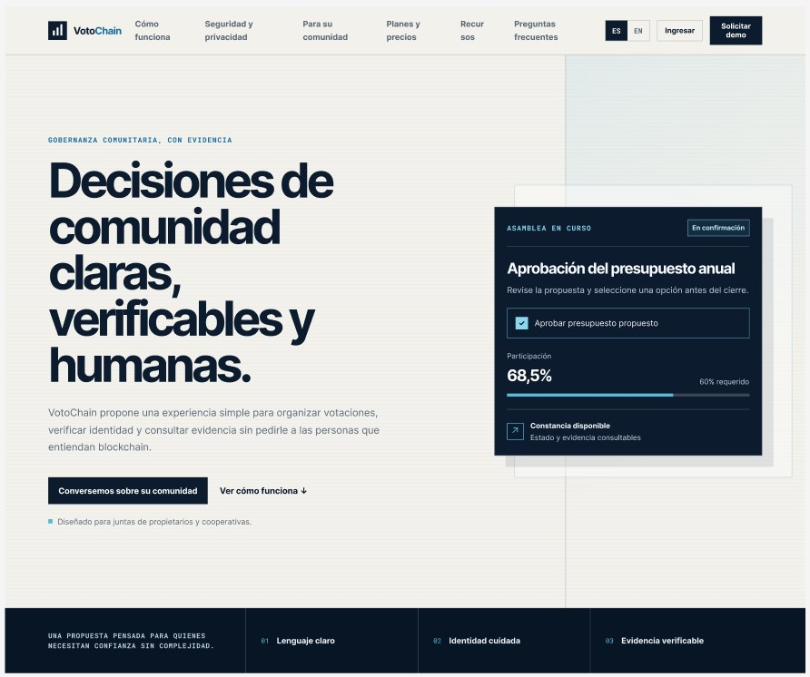

##### **2. Bloque 2: Flujo de Proceso (Cómo Funciona)**
Presentación paso a paso del flujo de decisión comunitaria desde la preparación de la asamblea y verificación de participantes hasta la consulta de evidencia inmutable.

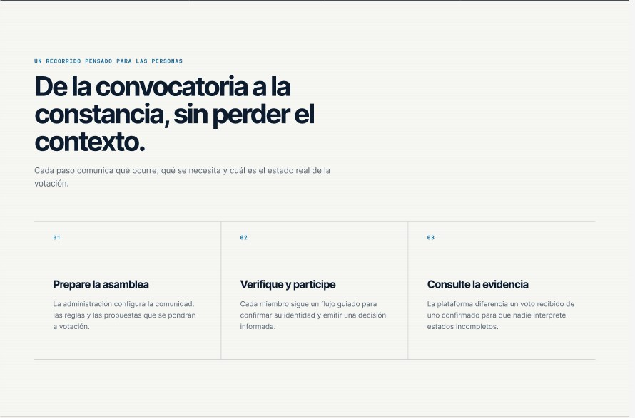

##### **3. Bloque 3: Segmentación de Roles y Principios de Seguridad**
Módulo diferenciado para directivas y votantes, acompañado de los principios de seguridad con consentimiento visible, estados sin ambigüedad y minimización de datos.

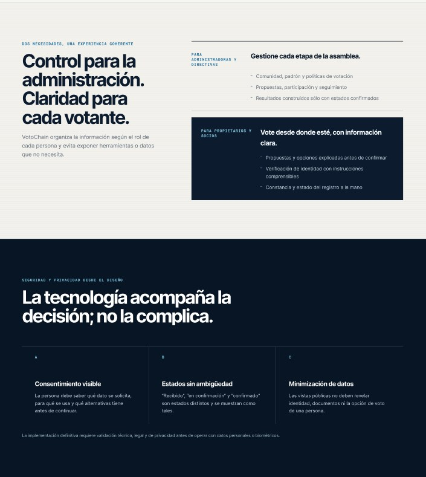

##### **4. Bloque 4: Matriz de Planes y Precios Transparentes**
Estructura comparativa de planes orientados a asambleas piloto, comunidades residenciales anuales y empresas administradoras de múltiples predios.

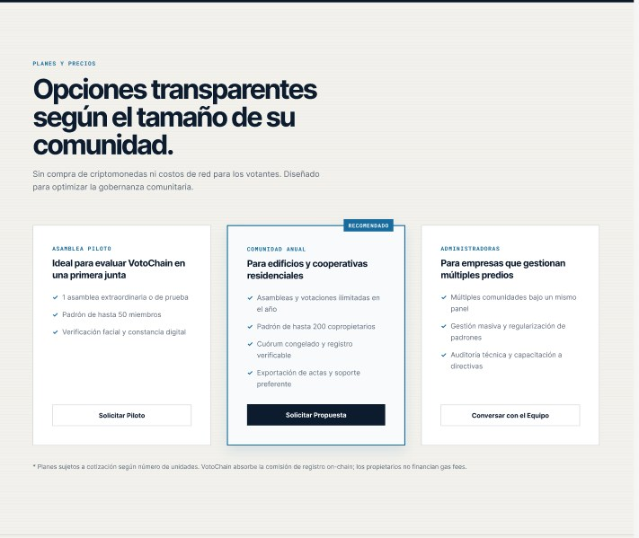

##### **5. Bloque 5: Recursos Multimedia y Preguntas Frecuentes (FAQ)**
Acceso a contenidos audiovisuales explicativos sobre la plataforma y el equipo, junto con el acordeón interactivo para la resolución de dudas clave.


##### **6. Bloque 6: Formulario de Contacto, Demostración y Pie de Página**
Formulario de contacto para solicitud de demostraciones con validaciones de datos y pie de página institucional con accesos legales y de navegación.

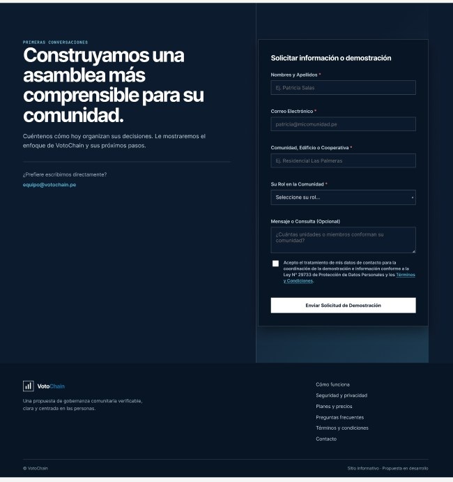

---

#### **Vista Móvil (Mobile Mock-ups)**

A continuación se presentan los mock-ups de alta fidelidad de la Landing Page adaptados a la vista móvil en pantalla vertical (390px / columna única):

##### **1. Encabezado y Hero Section**
Cabecera adaptada con selector de idioma y menú hamburguesa, acompañada del titular principal y botones de acción rápida.

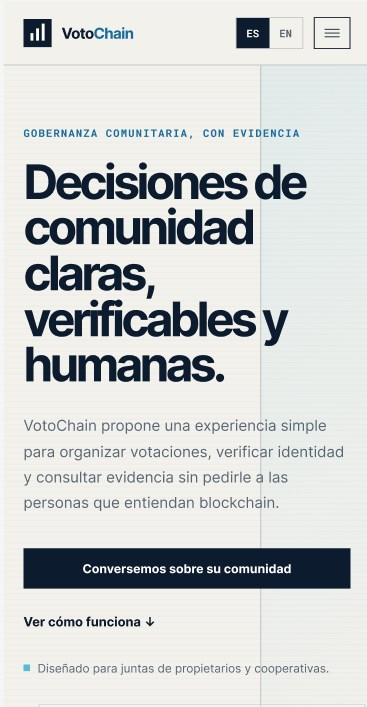

##### **2. Demo de Votación y Barra de Confianza**
Tarjeta interactiva simulada de votación en curso con progreso de participación y franja con los tres pilares de confianza.

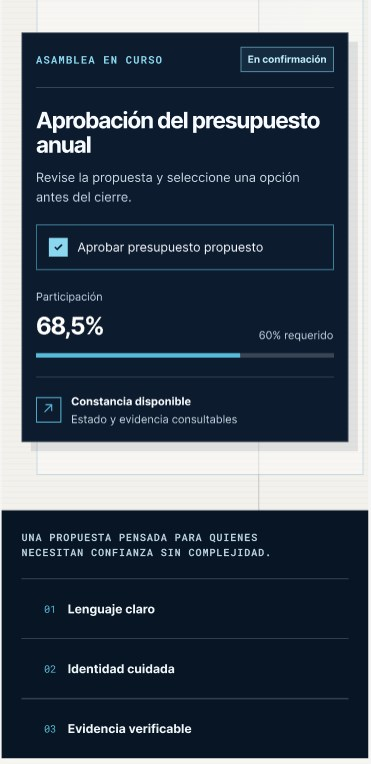

##### **3. Flujo de Proceso (Cómo Funciona)**
Secuencia de tres pasos adaptada a columna única que guía desde la preparación de la asamblea hasta la consulta de evidencias.


##### **4. Experiencia Segmentada por Roles**
Presentación diferenciada de funciones clave para directivas/administradoras y propietarios/socios en tarjetas verticales.

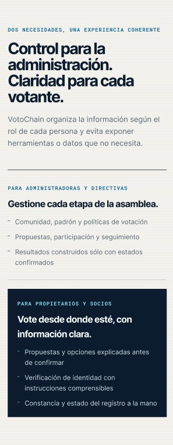

##### **5. Módulo de Seguridad por Diseño**
Garantías técnicas sobre consentimiento informado, estados claros sin ambigüedad y minimización estricta de datos personales.

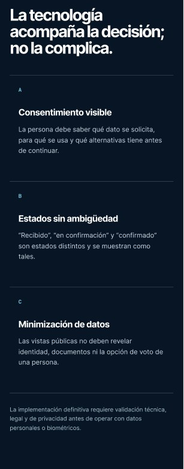

##### **6. Planes y Precios Transparentes**
Tarjetas de planes para asambleas piloto y suscripciones anuales con botones directos para cotización y solicitud.

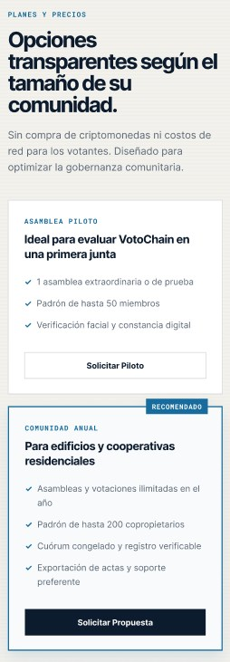

##### **7. Recursos Audiovisuales y Multimedia**
Módulo de videos introductorios sobre el funcionamiento de la plataforma y el equipo multidisciplinario detrás de VotoChain.


##### **8. Preguntas Frecuentes (FAQ)**
Acordeón interactivo optimizado para pantallas táctiles que resuelve inquietudes sobre adopción, privacidad y tecnología.

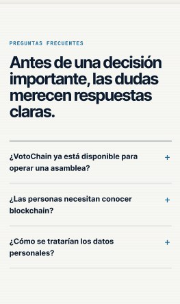

##### **9. Formulario de Contacto y Solicitud de Demo**
Formulario de captación con campos de validación, consentimiento según la Ley N° 29733 y pie de página institucional.

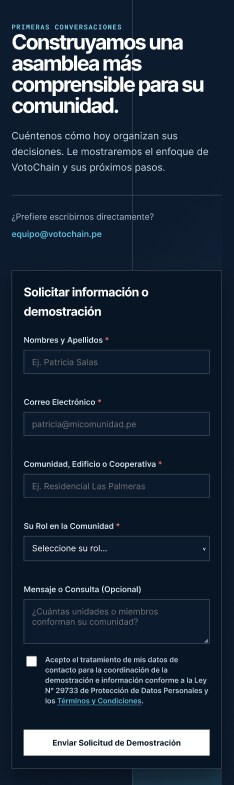

## **6.4. Applications UX/UI Design.**

### **6.4.1. Applications Wireframes.**

### **6.4.2. Applications Wireflow Diagrams.**

Los wireflow diagrams combinan las pantallas de la aplicación con las transiciones de navegación, mostrando qué acción del usuario desencadena cada cambio de estado o de vista. Se documentan 20 flujos agrupados en cinco dominios funcionales: identidad y acceso, verificación biométrica, gestión comunitaria, votación y cumplimiento.

---

#### **WF-01 · Registro, incorporación e identidad**

Cubre el flujo completo de creación de cuenta de un nuevo usuario: ingreso de datos personales, verificación de correo electrónico mediante   y activación de la cuenta. El usuario parte de la pantalla de bienvenida y concluye en el dashboard principal tras confirmar su identidad inicial.

<a href="./assets/application_wireflows/wireflows_1.png">
  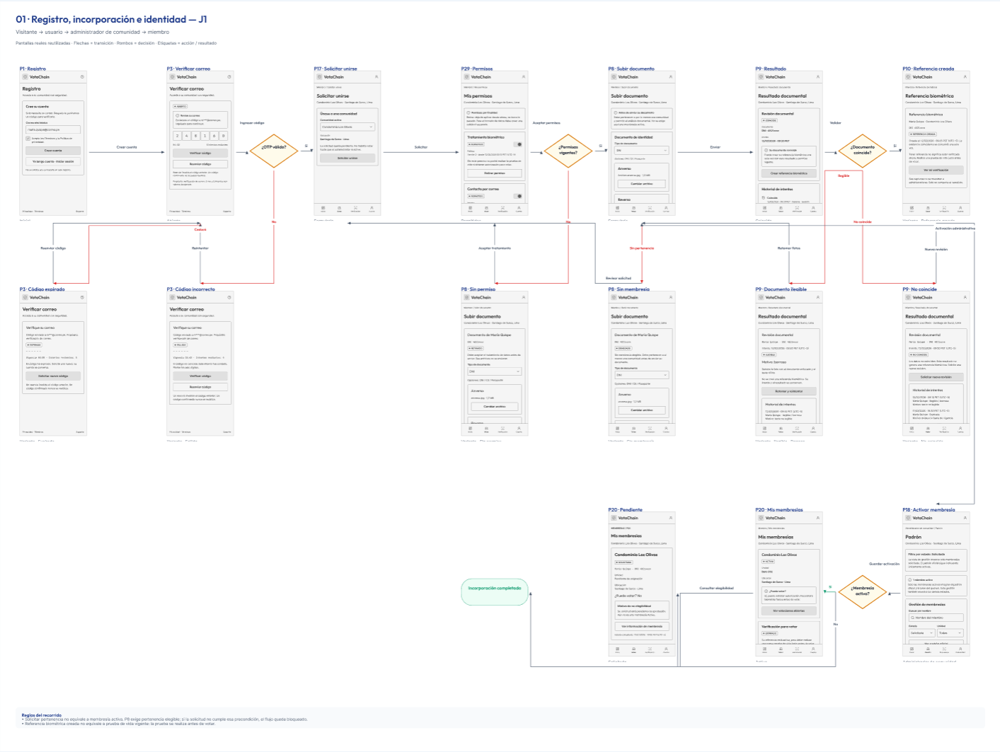
</a>

---

#### **WF-02 · Inicio de sesión,   y recuperación**

Documenta las rutas de autenticación: inicio de sesión con credenciales, validación del segundo factor mediante   y el flujo alternativo de recuperación de contraseña. Incluye los estados de error por credenciales incorrectas y por   vencido.

<a href="./assets/application_wireflows/wireflows_2.png">
  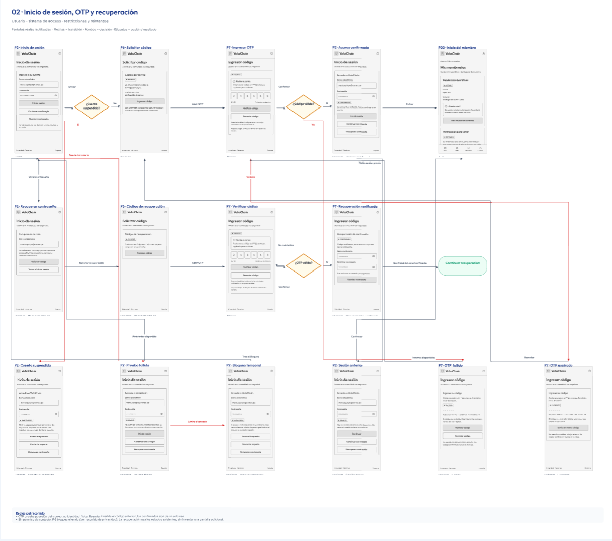
</a>

---

#### **WF-03 · Cuenta y seguridad**

Muestra las pantallas de configuración personal: edición de datos de perfil, cambio de contraseña, gestión de dispositivos de confianza y cierre de sesión. Cada acción sensible requiere confirmación mediante   antes de aplicarse.

<a href="./assets/application_wireflows/wireflows_3.png">
  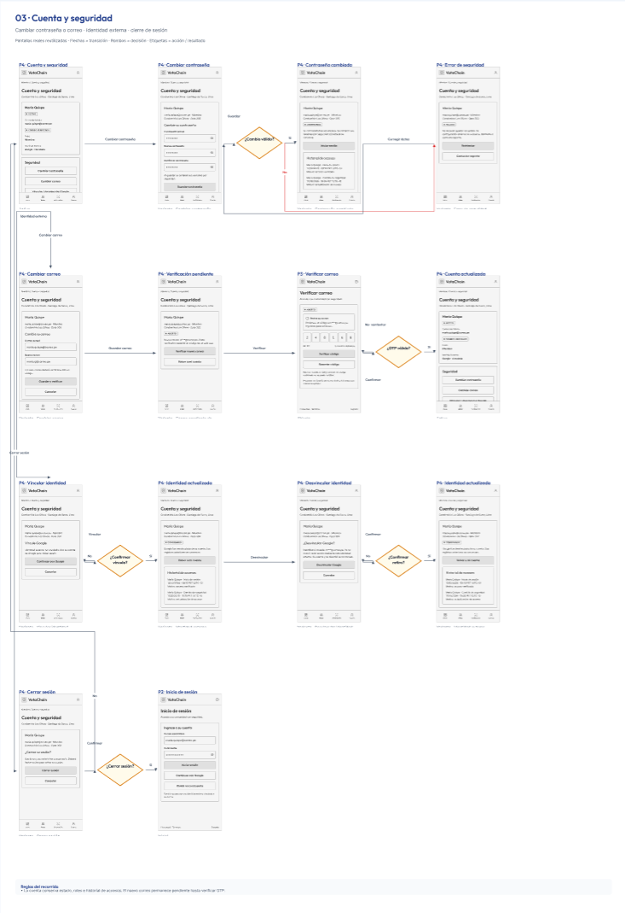
</a>

---

#### **WF-04 · Administración de usuarios y roles**

Cubre el flujo del administrador para invitar nuevos usuarios a la plataforma, asignar roles (administrador de comunidad, miembro votante) y revocar accesos. Incluye la pantalla de confirmación antes de aplicar cambios de rol.

<a href="./assets/application_wireflows/wireflows_4.png">
  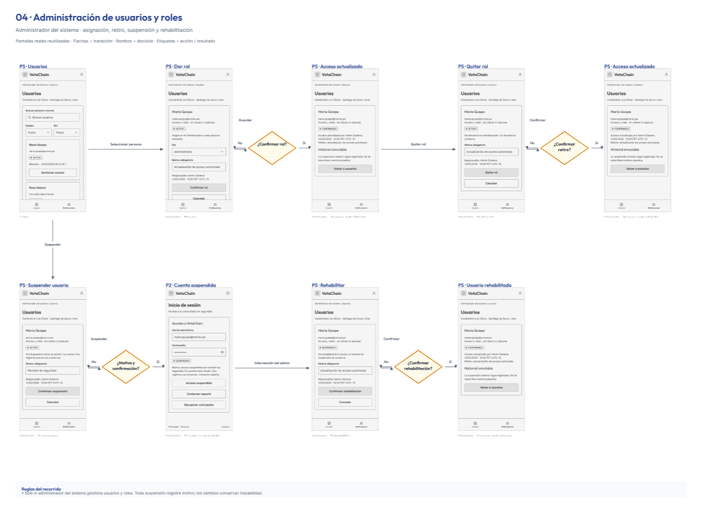
</a>

---

#### **WF-05 · Revisión documental y enrolamiento biométrico**

Documenta el flujo de verificación de identidad previo al voto: captura del DNI con OCR, extracción de datos del documento, prueba de vida facial (liveness) y comparación biométrica. El usuario avanza paso a paso y recibe retroalimentación inmediata en cada etapa. Corresponde al journey J1.

<a href="./assets/application_wireflows/wireflows_5.png">
  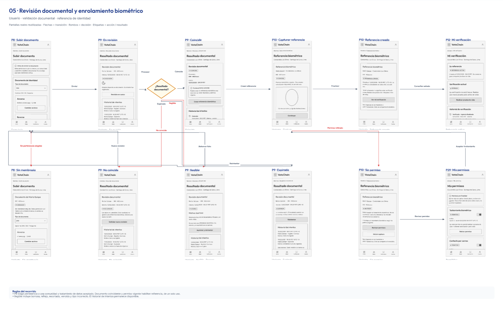
</a>

---

#### **WF-06 · Consulta de verificación y prueba de vida**

Muestra el flujo de re-verificación biométrica cuando la ventana de frescura ha vencido. El usuario recibe una notificación de sesión biométrica expirada y debe completar nuevamente la prueba de vida antes de continuar con la emisión del voto.

<a href="./assets/application_wireflows/wireflows_6.png">
  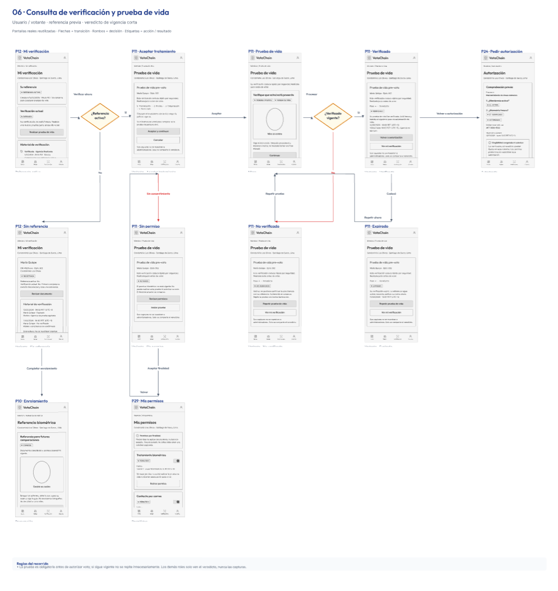
</a>

---

#### **WF-07 · Crear comunidad y abrir votación**

Cubre el flujo del administrador para crear una nueva comunidad en la plataforma: ingreso de datos del edificio o cooperativa, configuración de la política de cuórum, carga del padrón inicial y apertura de la primera convocatoria de asamblea. Corresponde al journey J2.

<a href="./assets/application_wireflows/wireflows_7.png">
  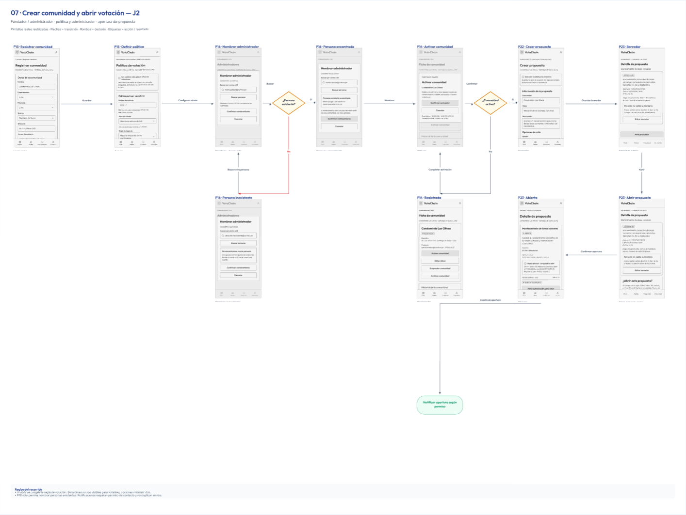
</a>

---

#### **WF-08 · Ciclo de vida de comunidad**

Documenta las transiciones de estado de una comunidad: de activa a suspendida, de suspendida a reactivada y el archivado definitivo. Cada transición muestra la pantalla de confirmación y el impacto sobre los miembros y asambleas asociadas.

<a href="./assets/application_wireflows/wireflows_8.png">
  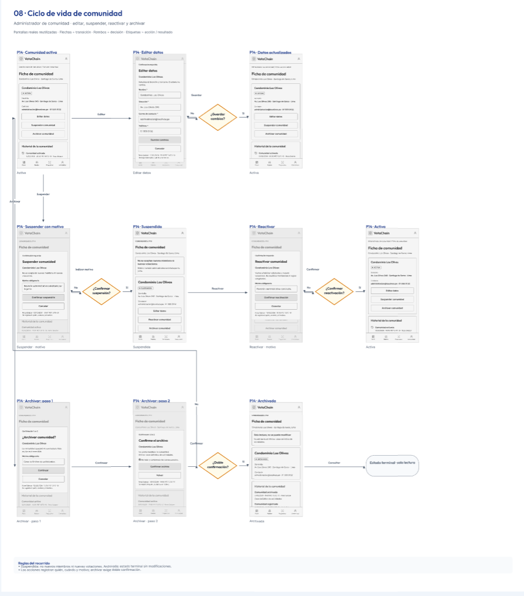
</a>

---

#### **WF-09 · Política de votación y administradores**

Muestra el flujo de configuración de la política de votación de una comunidad: definición del tipo de cuórum requerido, reglas de elegibilidad por estado de membresía y asignación de co-administradores con sus permisos específicos.

<a href="./assets/application_wireflows/wireflows_9.png">
  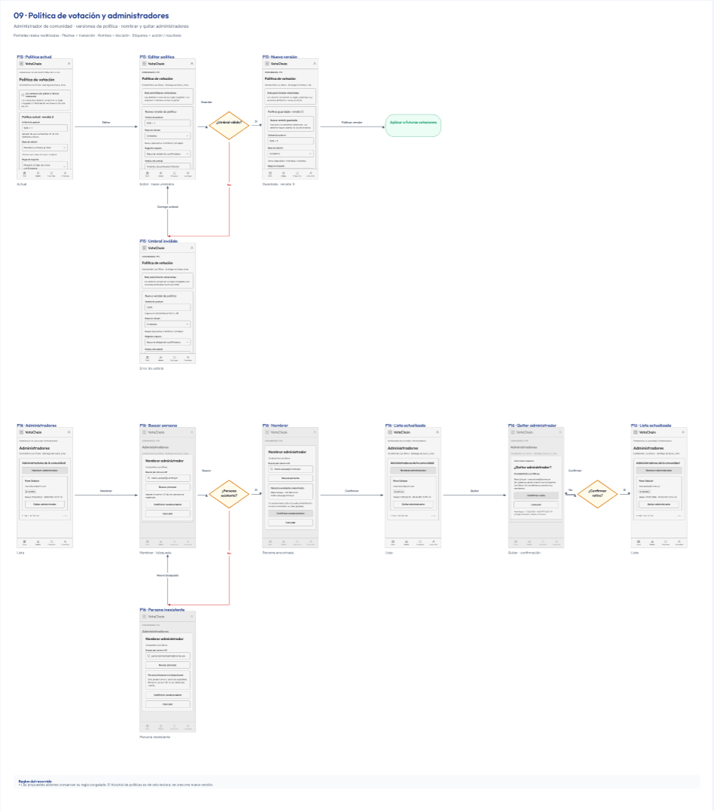
</a>

---

#### **WF-10 · Padrón: aprobación, unidad y rol**

Cubre la gestión del padrón electoral: aprobación de solicitudes de membresía pendientes, asignación de unidad inmobiliaria a cada miembro y definición del rol de voto (propietario, copropietario, representante). Incluye el flujo de rechazo con motivo.

<a href="./assets/application_wireflows/wireflows_10.png">
  
</a>

---

#### **WF-11 · Membresía: mora, suspensión y terminación**

Documenta las transiciones de estado de una membresía individual: marcado como moroso, suspensión temporal del derecho a voto y terminación definitiva de la relación. Cada acción muestra el impacto sobre la elegibilidad del miembro en asambleas activas.

<a href="./assets/application_wireflows/wireflows_11.png">
  
</a>

---

#### **WF-12 · Navegación del miembro y consulta de propuestas**

Muestra el flujo de navegación del propietario votante: acceso al listado de sus comunidades, consulta de asambleas activas, lectura de propuestas en curso y revisión del historial de votaciones anteriores con sus constancias.

<a href="./assets/application_wireflows/wireflows_12.png">
  
</a>

---

#### **WF-13 · Emisión y confirmación de voto**

Documenta el flujo principal de votación: lectura de la propuesta, verificación biométrica de presencia, selección de alternativa, confirmación del voto y recepción de la constancia digital con código único. Corresponde al journey J3.

<a href="./assets/application_wireflows/wireflows_13.png">
  
</a>

---

#### **WF-14 · Excepciones al autorizar y emitir voto**

Cubre los caminos alternativos durante la autorización y emisión: membresía morosa o suspendida, verificación biométrica fallida, propuesta ya cerrada y voto duplicado detectado. Cada excepción muestra el mensaje de error correspondiente y la acción disponible para el usuario. Corresponde al journey J4.

<a href="./assets/application_wireflows/wireflows_14.png">
  
</a>

---

#### **WF-15 · Firma y envío: fallos, reintentos y constancia**

Documenta los estados intermedios del proceso de registro on-chain: voto recibido y en cola, fallo en el envío al ledger, reintento automático y confirmación final. El usuario visualiza el estado de su constancia en tiempo real hasta obtener la confirmación on-chain. Corresponde al journey J4.

<a href="./assets/application_wireflows/wireflows_15.png">
  
</a>

---

#### **WF-16 · Cierre, escrutinio, participación y cuórum**

Muestra el flujo del administrador para cerrar una votación: verificación del cuórum alcanzado contra el snapshot congelado, inicio del escrutinio, visualización de resultados parciales y generación del acta oficial con los votos confirmados on-chain.

<a href="./assets/application_wireflows/wireflows_16.png">
  
</a>

---

#### **WF-17 · Historial y reintentos de notificaciones**

Cubre el centro de notificaciones del usuario: listado de notificaciones recibidas (convocatorias, recordatorios de voto, confirmaciones de constancia), marcado como leídas y reintento manual de notificaciones fallidas por parte del administrador.

<a href="./assets/application_wireflows/wireflows_17.png">
  
</a>

---

#### **WF-18 · Privacidad: consentimiento por finalidad**

Documenta el flujo de gestión de consentimientos: presentación del aviso de privacidad al registrarse, aceptación o rechazo por finalidad (verificación de identidad, comunicaciones, auditoría) y actualización posterior desde el perfil. Ninguna finalidad opcional bloquea el acceso a la plataforma.

<a href="./assets/application_wireflows/wireflows_18.png">
  
</a>

---

#### **WF-19 · Solicitud y seguimiento de borrado**

Muestra el flujo de ejercicio del derecho de supresión: solicitud de borrado de datos personales, confirmación del alcance (datos de perfil, biométricos, constancias), seguimiento del estado de la solicitud y notificación de resolución. Corresponde al journey J5.

<a href="./assets/application_wireflows/wireflows_19.png">
  
</a>

---

#### **WF-20 · Cumplimiento, retención y auditoría**

Cubre el panel de cumplimiento del administrador de plataforma: visualización de políticas de retención de datos por categoría, exportación de registros de auditoría, consulta del verificador público de constancias y gestión de solicitudes de acceso a datos pendientes.

<a href="./assets/application_wireflows/wireflows_20.png">
  
</a>


### **6.4.3. Applications Mock-ups.**

Las siguientes vistas corresponden a los principales flujos de la aplicación, agrupados según la funcionalidad representada por el nombre de cada mock-up.

#### **Vistas principales por rol**

##### **Registro de comunidad para el fundador**

La vista presenta el formulario de registro de una nueva comunidad, con campos para el nombre, la ubicación y el contacto responsable. Asimismo, explicita los pasos posteriores del proceso —definir la política de votación, nombrar a una persona administradora existente y activar la comunidad—, evidenciando el flujo de incorporación inicial de una organización a VotoChain.

<p align="center">
  
</p>

##### **Panel de la administradora de comunidad**

El mock-up muestra el panel operativo de una comunidad, donde la administradora consulta el estado del padrón, el número de miembros activos y la distribución de propuestas por estado. También se visualiza una propuesta abierta con el avance de participación, el cuórum alcanzado y la regla congelada aplicable, reforzando la función de VotoChain como soporte para una gestión de asambleas trazable y verificable.

<p align="center">
  
</p>

##### **Gestión de usuarios y accesos del administrador del sistema**

La interfaz corresponde al rol de administración global y permite buscar usuarios, revisar su estado, consultar el rol asignado y ejecutar acciones como gestionar permisos o suspender cuentas. La sección de notificaciones complementa el control operativo, manteniendo la separación entre la administración de accesos globales y la información privada de cada comunidad.

<p align="center">
  
</p>

##### **Panel de inicio del miembro votante**

La vista resume la experiencia del propietario o miembro de la comunidad: muestra su membresía activa, el acceso a las votaciones, el estado de su verificación de identidad, una propuesta abierta que requiere autorización y el último recibo de votación. Esta composición concentra los elementos necesarios para que el usuario participe en una asamblea manteniendo la relación entre elegibilidad, verificación biométrica y evidencia del voto.

<p align="center">
  
</p>

#### **Acceso, registro y seguridad**

##### **Registro**

<p align="center">
  
</p>

<p align="center">
  
</p>

##### **Inicio de sesión**

<p align="center">
  
</p>

<p align="center">
  
</p>

##### **Solicitar código**

<p align="center">
  
</p>

<p align="center">
  
</p>

##### **Ingresar código**

<p align="center">
  
</p>

<p align="center">
  
</p>

##### **Verificación de correo**

<p align="center">
  
</p>

<p align="center">
  
</p>

##### **Cuenta y seguridad**

<p align="center">
  
</p>

<p align="center">
  
</p>

<p align="center">
  
</p>

<p align="center">
  
</p>

#### **Verificación de identidad**

##### **Resultado documental**

<p align="center">
  
</p>

<p align="center">
  
</p>

<p align="center">
  
</p>

##### **Subir documento**

<p align="center">
  
</p>

<p align="center">
  
</p>

##### **Prueba de vida**

<p align="center">
  
</p>

<p align="center">
  
</p>

<p align="center">
  
</p>

##### **Referencia biométrica**

<p align="center">
  
</p>

<p align="center">
  
</p>

##### **Mi verificación**

<p align="center">
  
</p>

<p align="center">
  
</p>

#### **Comunidades y administración**

##### **Registrar comunidad**

<p align="center">
  
</p>

<p align="center">
  
</p>

<p align="center">
  
</p>

##### **Ficha de comunidad**

<p align="center">
  
</p>

<p align="center">
  
</p>

<p align="center">
  
</p>

<p align="center">
  
</p>

<p align="center">
  
</p>

<p align="center">
  
</p>

<p align="center">
  
</p>

<p align="center">
  
</p>

<p align="center">
  
</p>

<p align="center">
  
</p>

##### **Administradores**

<p align="center">
  
</p>

<p align="center">
  
</p>

<p align="center">
  
</p>

<p align="center">
  
</p>

<p align="center">
  
</p>

<p align="center">
  
</p>

<p align="center">
  
</p>

<p align="center">
  
</p>

##### **Usuarios**

<p align="center">
  
</p>

<p align="center">
  
</p>

<p align="center">
  
</p>

##### **Padrón**

<p align="center">
  
</p>

<p align="center">
  
</p>

<p align="center">
  
</p>

<p align="center">
  
</p>

<p align="center">
  
</p>

<p align="center">
  
</p>

<p align="center">
  
</p>

<p align="center">
  
</p>

<p align="center">
  
</p>

<p align="center">
  
</p>

##### **Membresías**

<p align="center">
  
</p>

<p align="center">
  
</p>

<p align="center">
  
</p>

<p align="center">
  
</p>

<p align="center">
  
</p>

<p align="center">
  
</p>

<p align="center">
  
</p>

<p align="center">
  
</p>

##### **Detalle de miembro**

<p align="center">
  
</p>

<p align="center">
  
</p>

<p align="center">
  
</p>

<p align="center">
  
</p>

<p align="center">
  
</p>

<p align="center">
  
</p>

<p align="center">
  
</p>

<p align="center">
  
</p>

<p align="center">
  
</p>

<p align="center">
  
</p>

<p align="center">
  
</p>

<p align="center">
  
</p>

<p align="center">
  
</p>

<p align="center">
  
</p>

##### **Mis permisos**

<p align="center">
  
</p>

<p align="center">
  
</p>

<p align="center">
  
</p>

<p align="center">
  
</p>

<p align="center">
  
</p>

<p align="center">
  
</p>

<p align="center">
  
</p>

<p align="center">
  
</p>

<p align="center">
  
</p>

<p align="center">
  
</p>

<p align="center">
  
</p>

<p align="center">
  
</p>

#### **Solicitudes y participación**

##### **Solicitar unirse**

<p align="center">
  
</p>

<p align="center">
  
</p>

<p align="center">
  
</p>

#### **Propuestas y votaciones**

##### **Propuestas**

<p align="center">
  
</p>

<p align="center">
  
</p>

<p align="center">
  
</p>

<p align="center">
  
</p>

##### **Crear propuesta**

<p align="center">
  
</p>

<p align="center">
  
</p>

##### **Detalle de propuesta**

<p align="center">
  
</p>

<p align="center">
  
</p>

##### **Política de votación**

<p align="center">
  
</p>

##### **Política de votación**

<p align="center">
  
</p>

<p align="center">
  
</p>

<p align="center">
  
</p>

##### **Emitir voto**

<p align="center">
  
</p>

<p align="center">
  
</p>

<p align="center">
  
</p>

##### **Cierre y escrutinio**

<p align="center">
  
</p>

<p align="center">
  
</p>

<p align="center">
  
</p>

<p align="center">
  
</p>

#### **Notificaciones y comprobantes**

##### **Notificaciones**

<p align="center">
  
</p>

<p align="center">
  
</p>

<p align="center">
  
</p>

<p align="center">
  
</p>

<p align="center">
  
</p>

##### **Historial de notificaciones**

<p align="center">
  
</p>

<p align="center">
  
</p>

<p align="center">
  
</p>

<p align="center">
  
</p>

<p align="center">
  
</p>

<p align="center">
  
</p>

<p align="center">
  
</p>

<p align="center">
  
</p>

<p align="center">
  
</p>

<p align="center">
  
</p>

<p align="center">
  
</p>

<p align="center">
  
</p>

<p align="center">
  
</p>

##### **Mi recibo**

<p align="center">
  
</p>

<p align="center">
  
</p>

<p align="center">
  
</p>

#### **Privacidad y gestión de datos**

##### **Borrado de datos**

<p align="center">
  
</p>

<p align="center">
  
</p>

<p align="center">
  
</p>

<p align="center">
  
</p>

<p align="center">
  
</p>

<p align="center">
  
</p>

<p align="center">
  
</p>

<p align="center">
  
</p>

<p align="center">
  
</p>

<p align="center">
  
</p>

##### **Autorización**

<p align="center">
  
</p>

<p align="center">
  
</p>

<p align="center">
  
</p>


### **6.4.4. Applications User Flow Diagrams.**

##### **1. Registro, incorporación e identidad**

**User Goal: Registrarse e incorporarse a una comunidad**
El usuario necesita crear una cuenta, verificar su correo electrónico y solicitar su incorporación a una comunidad. Durante este recorrido, otorga los permisos necesarios, presenta su documento y completa el enrolamiento biométrico. El objetivo es acompañarlo hasta contar con una identidad verificada y una membresía activa, una vez aprobada su incorporación.

<a href="./assets/applications_user_flow_diagrams/01 · Registro, incorporación e identidad — J1.png">
  
</a>

##### **2. Inicio de sesión,   y recuperación**

**User Goal: Acceder a su cuenta y recuperar el acceso**
El usuario necesita ingresar a su cuenta mediante un proceso sencillo y seguro. Si requiere verificar su correo o recuperar el acceso, puede solicitar un código temporal y seguir las indicaciones correspondientes. El objetivo es permitirle continuar incluso ante credenciales incorrectas o códigos vencidos, mostrando claramente cómo resolver cada situación.

<a href="./assets/applications_user_flow_diagrams/02 · Inicio de sesión,   y recuperación.png">
  
</a>

##### **3. Cuenta y seguridad**

**User Goal: Administrar su cuenta y proteger el acceso**
El usuario necesita mantener actualizadas sus credenciales y controlar las opciones de acceso a su cuenta. Puede cambiar su contraseña, actualizar su correo mediante verificación y gestionar la vinculación de una identidad externa. El objetivo es facilitar estos cambios de forma segura y permitirle cerrar su sesión cuando lo necesite.

<a href="./assets/applications_user_flow_diagrams/03 · Cuenta y seguridad.png">
  
</a>

##### **4. Administración de usuarios y roles**

**User Goal: Administrar los permisos y el estado de los usuarios**
El administrador del sistema necesita controlar qué funciones puede realizar cada usuario y gestionar su acceso a la plataforma. Puede asignar o revocar roles, suspender una cuenta indicando el motivo y rehabilitarla cuando corresponda. El objetivo es mantener una administración clara de permisos y comunicar al usuario cualquier restricción que afecte su acceso.

<a href="./assets/applications_user_flow_diagrams/04 · Administración de usuarios y roles.png">
  
</a>

##### **5. Revisión documental y enrolamiento biométrico**

**User Goal: Verificar su identidad y registrar su referencia biométrica**
El usuario necesita acreditar su identidad mediante un documento válido y completar el registro de su referencia biométrica. Si el documento resulta ilegible, está vencido o presenta inconsistencias, recibe indicaciones para corregirlo. El objetivo es completar la verificación con los consentimientos y requisitos necesarios, dejando preparada su referencia para posteriores comprobaciones.

<a href="./assets/applications_user_flow_diagrams/05 · Revisión documental y enrolamiento biométrico.png">
  
</a>

##### **6. Consulta de verificación y prueba de vida**

**User Goal: Consultar su verificación y completar una prueba de vida**
El usuario necesita conocer el estado de su referencia biométrica y realizar una prueba de vida cuando el proceso de votación lo requiera. Si falta la referencia, el consentimiento o una verificación vigente, la plataforma lo orienta hacia el paso correspondiente. El objetivo es permitirle acreditar su presencia antes de continuar con la autorización del voto.

<a href="./assets/applications_user_flow_diagrams/06 · Consulta de verificación y prueba de vida.png">
  
</a>

##### **7. Crear comunidad y abrir votación**

**User Goal: Preparar una comunidad y abrir una votación**
El administrador necesita registrar una comunidad, definir su política de votación y designar a sus administradores. Después de la activación de la comunidad, prepara una propuesta con sus opciones y la abre a los miembros habilitados. El objetivo es iniciar la votación con reglas claras, que se mantienen fijadas durante su desarrollo.

<a href="./assets/applications_user_flow_diagrams/07 · Crear comunidad y abrir votación — J2.png">
  
</a>

##### **8. Ciclo de vida de comunidad**

**User Goal: Gestionar el estado de una comunidad**
El administrador necesita actualizar los datos de una comunidad y controlar su estado operativo. Puede suspenderla indicando el motivo, reactivarla cuando corresponda o archivarla mediante una doble confirmación. El objetivo es gestionar cada transición de forma consciente y conservar la consulta de la información cuando la comunidad queda archivada.

<a href="./assets/applications_user_flow_diagrams/08 · Ciclo de vida de comunidad.png">
  
</a>

##### **9. Política de votación y administradores**

**User Goal: Configurar las reglas y los responsables de la comunidad**
El administrador necesita ajustar la política de votación y gestionar quiénes administran la comunidad. Puede revisar las versiones de las reglas, corregir parámetros inválidos y designar o retirar administradores existentes. El objetivo es mantener una configuración trazable, aplicando los cambios de política a futuras votaciones y preservando las reglas de las que ya están abiertas.

<a href="./assets/applications_user_flow_diagrams/09 · Política de votación y administradores.png">
  
</a>

##### **10. Padrón: aprobación, unidad y rol**

**User Goal: Aprobar miembros y organizar el padrón de la comunidad**
El administrador necesita revisar las solicitudes de incorporación y asignar a cada miembro su unidad y rol dentro de la comunidad. Tras aprobar la solicitud, activa la membresía para que el usuario pueda acceder a las funciones que le corresponden. El objetivo es mantener un padrón actualizado, distinguiendo las solicitudes pendientes de las membresías activas consideradas para el quórum.

<a href="./assets/applications_user_flow_diagrams/10 · Padrón_ aprobación, unidad y rol.png">
  
</a>

##### **11. Membresía: mora, suspensión y terminación**

**User Goal: Gestionar las restricciones y la continuidad de una membresía**
El administrador necesita registrar situaciones que afectan la participación de un miembro, como la mora o la suspensión. Puede indicar sus motivos, levantar las restricciones cuando se resuelven y terminar una membresía mediante una doble confirmación. El objetivo es reflejar correctamente el estado del miembro y permitirle comprender cómo ese estado afecta su participación en las votaciones.

<a href="./assets/applications_user_flow_diagrams/11 · Membresía_ mora, suspensión y terminación.png">
  
</a>

##### **12. Navegación del miembro y consulta de propuestas**

**User Goal: Explorar su comunidad y consultar las propuestas disponibles**
El miembro necesita identificar sus comunidades, conocer el estado de su membresía y consultar las propuestas visibles para él. Desde este recorrido, puede revisar una votación abierta, acceder a los resultados de una cerrada y gestionar su verificación, privacidad o cuenta. El objetivo es facilitar el acceso a las acciones disponibles según su situación y el estado de cada propuesta.

<a href="./assets/applications_user_flow_diagrams/12 · Navegación del miembro y consulta de propuestas.png">
  
</a>

##### **13. Emisión y confirmación de voto**

**User Goal: Emitir su voto y comprobar su confirmación**
El miembro necesita participar en una votación abierta después de cumplir los requisitos de membresía y verificación. Obtiene una autorización, selecciona su opción y confirma la firma antes de seguir el estado del envío. El objetivo es completar el recorrido con claridad y distinguir el voto firmado o enviado del voto confirmado, que es el que se contabiliza.

<a href="./assets/applications_user_flow_diagrams/13 · Emisión y confirmación de voto — J3.png">
  
</a>

##### **14. Excepciones al autorizar y emitir voto**

**User Goal: Comprender y resolver los impedimentos para votar**
El miembro necesita saber por qué no puede continuar cuando su membresía está restringida, la votación ha cerrado o su autorización está vencida o ya fue utilizada. La plataforma identifica la causa y muestra el siguiente paso cuando existe una posibilidad de continuar. El objetivo es evitar intentos duplicados y orientar al usuario sin generar dudas sobre la validez de su voto.

<a href="./assets/applications_user_flow_diagrams/14 · Excepciones al autorizar y emitir voto — J4.png">
  
</a>

##### **15. Firma y envío: fallos, reintentos y constancia**

**User Goal: Seguir el envío de su voto y consultar su constancia**
El miembro necesita comprender qué ocurre después de firmar su voto y conocer si el envío está pendiente, confirmado o ha fallado. Ante un fallo, puede seguir los reintentos permitidos y recibir orientación cuando el proceso no logra completarse. El objetivo es ofrecer un seguimiento transparente y permitir la consulta de la constancia y la evidencia del voto confirmado.

<a href="./assets/applications_user_flow_diagrams/15 · Firma y envío_ fallos, reintentos y constancia — J4.png">
  
</a>

##### **16. Cierre, escrutinio, participación y quórum**

**User Goal: Cerrar una votación y consultar sus resultados**
El administrador necesita cerrar una votación y obtener el escrutinio de los votos confirmados, mientras los miembros necesitan consultar el resultado y su evidencia. El recorrido contempla la confirmación del cierre manual, el procesamiento de los resultados y la evaluación del quórum según las reglas fijadas. El objetivo es presentar claramente la participación, el resultado y si se alcanzó el quórum requerido.

<a href="./assets/applications_user_flow_diagrams/16 · Cierre, escrutinio, participación y quórum.png">
  
</a>

##### **17. Historial y reintentos de notificaciones**

**User Goal: Consultar las notificaciones y resolver los envíos fallidos**
El administrador necesita revisar el historial de notificaciones, filtrar los registros y conocer el resultado de cada envío. Puede identificar entregas, fallos, duplicados o bloqueos por falta de permiso, y reintentar los envíos fallidos que correspondan. El objetivo es mantener una comunicación trazable, respetando el consentimiento de contacto y evitando repetir notificaciones ya entregadas.

<a href="./assets/applications_user_flow_diagrams/17 · Historial y reintentos de notificaciones.png">
  
</a>

##### **18. Privacidad: consentimiento por finalidad**

**User Goal: Controlar los permisos de uso de sus datos**
El usuario necesita decidir para qué finalidades autoriza el tratamiento de sus datos y modificar sus consentimientos cuando lo considere necesario. Puede gestionar por separado los permisos de contacto, documentación y biometría, conociendo cómo afectan a las funciones que requieren esos datos. El objetivo es ofrecer un control claro sobre los usos futuros, diferenciando el retiro de consentimiento de una solicitud de borrado.

<a href="./assets/applications_user_flow_diagrams/18 · Privacidad_ consentimiento por finalidad.png">
  
</a>

##### **19. Solicitud y seguimiento de borrado**

**User Goal: Solicitar el borrado de sus datos y seguir su avance**
El usuario necesita presentar una solicitud de borrado mediante un proceso claro, con confirmaciones que eviten acciones accidentales. Después de enviarla, puede consultar su estado desde la solicitud inicial hasta su finalización, sin generar solicitudes abiertas duplicadas. El objetivo es ofrecer seguimiento y explicar el alcance del borrado, incluida la conservación de los registros de auditoría inmutables.

<a href="./assets/applications_user_flow_diagrams/19 · Solicitud y seguimiento de borrado — J5.png">
  
</a>

##### **20. Cumplimiento, retención y auditoría**

**User Goal: Gestionar las solicitudes de privacidad y las reglas de retención**
El administrador de cumplimiento necesita revisar las solicitudes de borrado y coordinar su atención con los responsables de los datos. También requiere administrar las políticas de retención por categoría y duración, conservando sus versiones y el historial de cambios. El objetivo es supervisar el cumplimiento de cada solicitud y mantener la trazabilidad de las decisiones mediante la auditoría.

<a href="./assets/applications_user_flow_diagrams/20 · Cumplimiento, retención y auditoría.png">
  
</a>

### **6.5. Applications Prototyping.**

# **Capítulo VII: Product Implementation, Validation & Deployment**

## **7.1. Software Configuration Management.**

### **7.1.1. Software Development Environment Configuration.**

### **7.1.2. Source Code Management.**

### **7.1.3. Source Code Style Guide & Conventions.**

### **7.1.4. Software Deployment Configuration.**

## **7.2. Solution Implementation.**

Alcance TF: sprints e implementación en roadmap del backend; esta sección se completa con planning/backlog/evidencias por sprint o se retira si excede el alcance.

### **7.2.X. Sprint n**

#### **7.2.X.1. Sprint Planning n.**

#### **7.2.X.2. Sprint Backlog n.**

#### **7.2.X.3. Development Evidence for Sprint Review.**

#### **7.2.X.4. Testing Suite Evidence for Sprint Review.**

#### **7.2.X.5. Execution Evidence for Sprint Review.**

#### **7.2.X.6. Services Documentation Evidence for Sprint Review.**

#### **7.2.X.7. Software Deployment Evidence for Sprint Review.**

#### **7.2.X.8. Team Collaboration Insights during Sprint.**

## **7.3. Validation Interviews.**

### **7.3.1. Diseño de Entrevistas.**

### **7.3.2. Registro de Entrevistas.**

### **7.3.3. Evaluaciones según heurísticas.**

## **7.4. Video About-the-Product.**

# **Conclusiones**

1.- Diseño táctico consolidado (DDD): Se detallaron los 11 Bounded Contexts mediante diagramas de clases, contratos REST y modelos de datos, delimitando las responsabilidades del núcleo de votación y los servicios de soporte.

2.- Coherencia arquitectónica y trazabilidad: Se alinearon los requisitos funcionales con los componentes del sistema, manteniendo la separación de responsabilidades y las decisiones de seguridad, privacidad y verificabilidad definidas en la arquitectura estratégica.

3.- Experiencia de usuario estructurada (UX/UI): Se desarrollaron wireframes y mockups para las interfaces web y móviles, aplicando guías de estilo y una arquitectura de información orientada a facilitar la interacción de administradores y votantes.

4.- Flujos funcionales y avance de implementación: Los Wireflow Diagrams y User Flow Diagrams permitieron representar los recorridos e interacciones del sistema. Asimismo, se implementó la Landing Page responsiva, estableciendo una base para el desarrollo posterior de la aplicación.

# **Anexos**

## Anexo A – Videos de Exposiciones
| Entrega | Título | URL | Duración | Integrantes |
|---|---|---|---|---|
| TB1 | Sustentación TB1 – VotoChain | Pendiente TF | Pendiente TF | Aliaga, Bueno, Paredes, Ríos, Rodríguez |
| TF | Sustentación TF – VotoChain (presentación a cámara + demo en herramienta/YouTube) | Pendiente TF | Pendiente TF | Equipo completo |

Nomenclatura exigida: `TF_1ASI0728_202620_TF`, `TF_1ASI0728_202620_KEYNOTE`, `TF_1ASI0728_202620_PERFORMANCE`, `TF_1ASI0728_202620_VIDEO`.

## Anexo B – Trazabilidad ENT → Need → US
| ENT | Need / Hallazgo | Persona | US derivada |
|---|---|---|---|
| ENT-01/ENT-04/ENT-05 | Convocatoria como administrador, reporte SUNARP, cuórum Excel, cartas poder dudosas | Patricia Salas | US-08, US-09, US-10, US-11, US-12, US-13, US-14, US-15, US-22, US-23, US-27, US-28 |
| ENT-02/ENT-03/ENT-06 | Desconfianza mano alzada, privacidad biométrica, accesibilidad mayores | Miguel Herrera | US-16, US-17, US-19, US-20, US-21, US-24, US-25, US-26 |
| ENT-01..06 (acceso) | Identidad técnica y canal verificado para ambos segmentos | Patricia + Miguel | US-04, US-05, US-06, US-07 |
| Transversal técnica | Firma individual, entrega on-chain, notificaciones idempotentes, contratos REST | Developer | TS-01 (US-25), TS-02 (US-25/27), TS-03 (US-26), TS-04 (todas) |
| Visitante | Descubrimiento y contacto | Visitante | US-01, US-02, US-03 |

# **Referencias**

| Referencia | Uso en el informe |
|---|---|
| Brown, S. (2022). *The C4 model for visualising software architecture*. https://c4model.com/ | Base conceptual para la continuidad posterior con diagramas C4. |
| Clements, P., Kazman, R., & Klein, M. (2010). *Evaluating software architectures: Methods and case studies*. Addison-Wesley. | Base conceptual para relacionar decisiones arquitectónicas con atributos de calidad. |
| ElectionBuddy. (s. f.). *Election audit*. https://electionbuddy.com/features/election-audit/ | Análisis competitivo. |
| Evans, E. (2003). *Domain-driven design: Tackling complexity in the heart of software*. Addison-Wesley. | Base conceptual para ubiquitous language y bounded contexts. |
| Gothelf, J., & Seiden, J. (2021). *Lean UX: Designing great products with agile teams* (3rd ed.). O'Reilly Media. | Base conceptual para entrevistas, hipótesis y Needfinding. |
| POLYAS. (s. f.-a). *Secure online voting*. https://www.polyas.com/security | Análisis competitivo. |
| POLYAS. (s. f.-b). *Secure authentication*. https://www.polyas.com/security/secure-authentication | Análisis competitivo. |
| Simply Voting. (s. f.). *Security and reliability*. https://www.simplyvoting.com/security-reliability/ | Análisis competitivo. |
| Estudio Estrada. (2022). *Situación de juntas de propietarios en Lima*. | Respaldo 95% sin inscripción — 1.2.1. |
| Alternativa SAC. (2020). *Convivencia y conflictos vecinales*. | Respaldo 70% conflictos — 1.2.1/1.3. |
| Bienes Raíces. (2019). *Morosidad en comunidades*. | Respaldo 40% morosidad — 1.2.1. |
| Polygon Labs. (s. f.). *Polygon PoS docs*. https://docs.polygon.technology/ | Ledger público y relayer — Cap IV–V. |
| Ethereum. (s. f.). *EIP-712: Typed structured data*. https://eips.ethereum.org/EIPS/eip-712 | Firma verificable con `ecrecover()` — Cap IV–V. |
| NestJS. (s. f.). *Documentation*. https://docs.nestjs.com/ | Monolito modular — Cap IV–V. |
| Google Cloud. (s. f.). *Document AI*. https://cloud.google.com/document-ai | OCR DNI — Cap IV–V. |
| Amazon Web Services. (s. f.). *Rekognition*. https://aws.amazon.com/rekognition/ | Liveness/comparación — Cap IV–V. |


